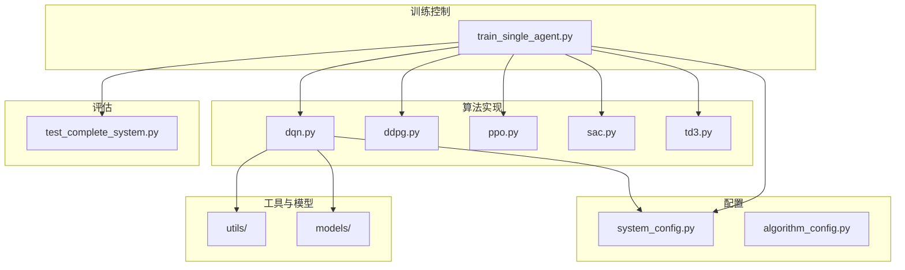
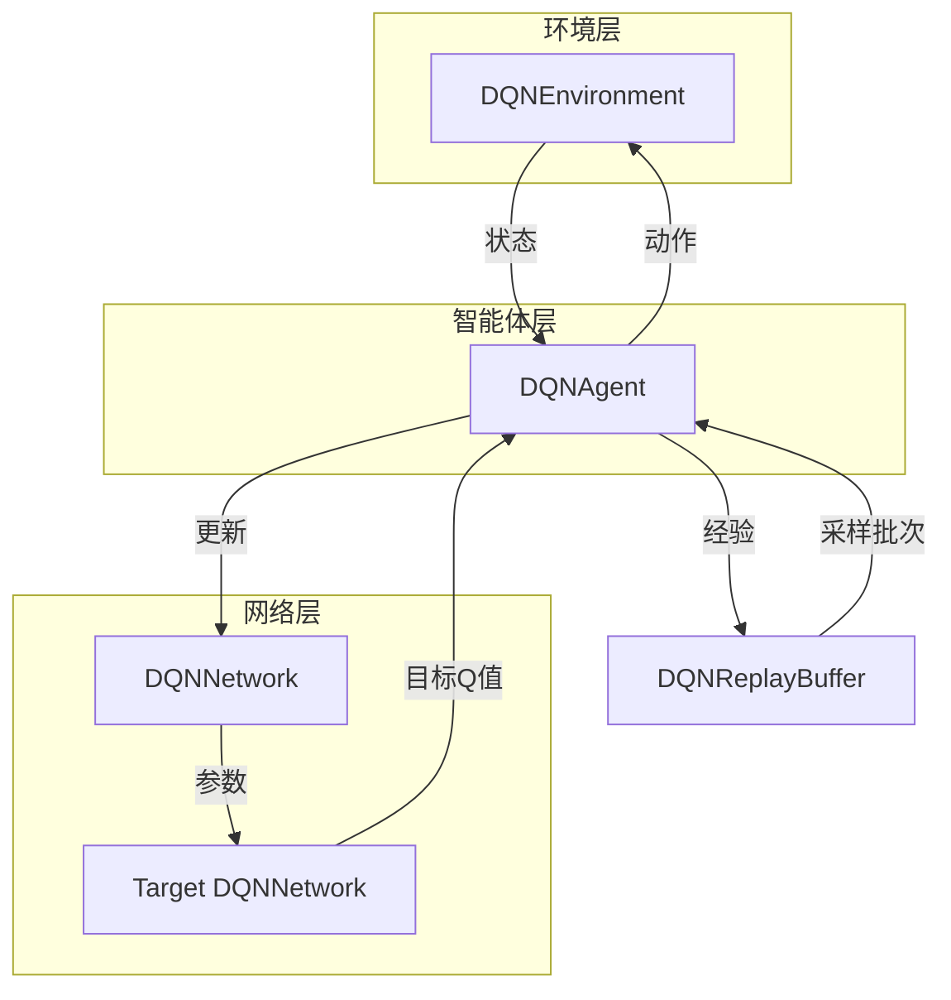
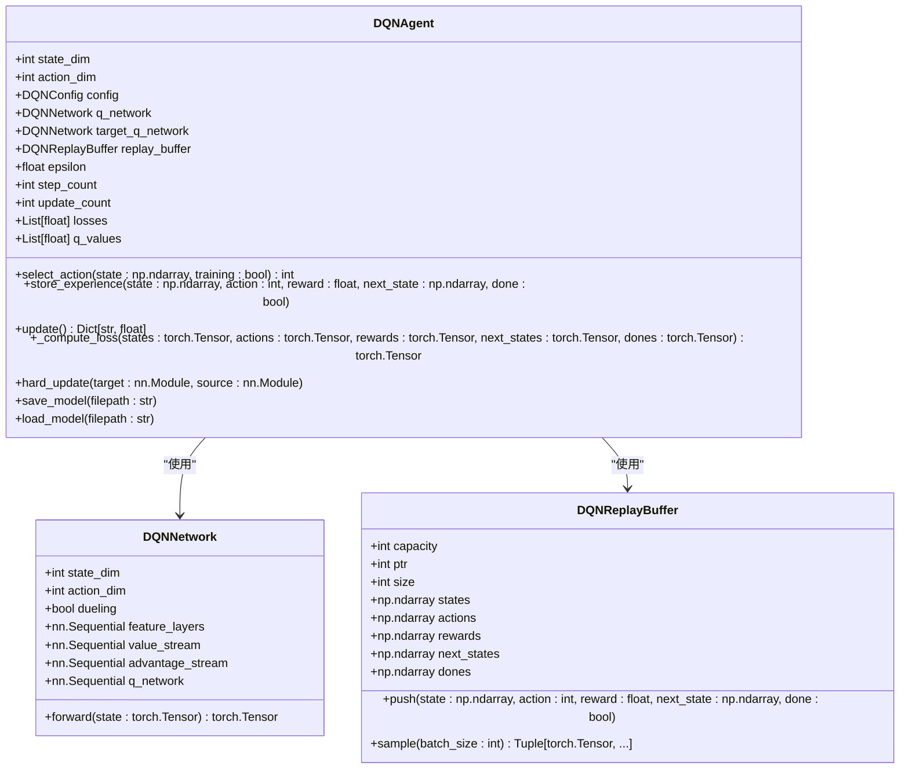
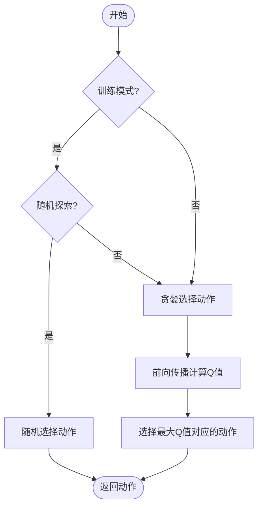
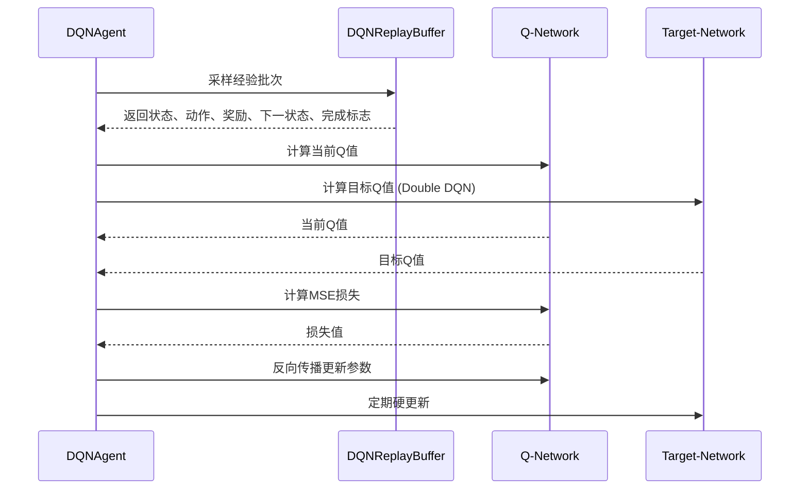
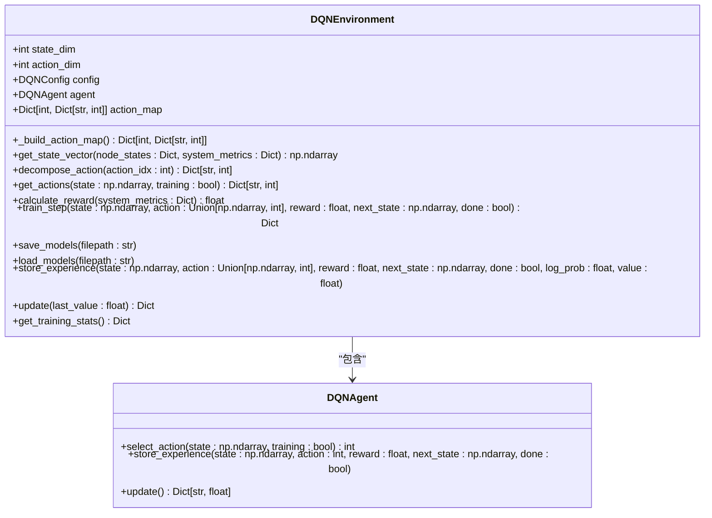
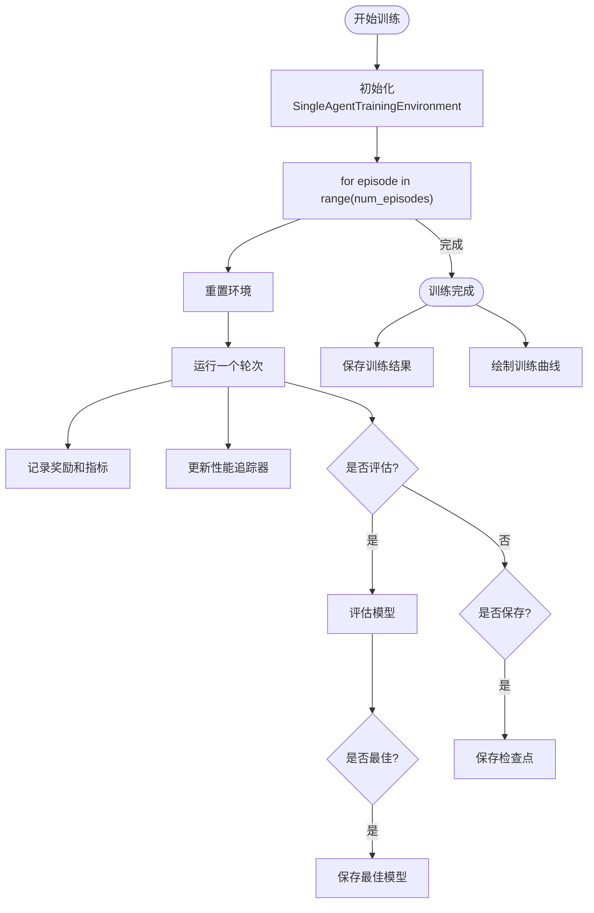
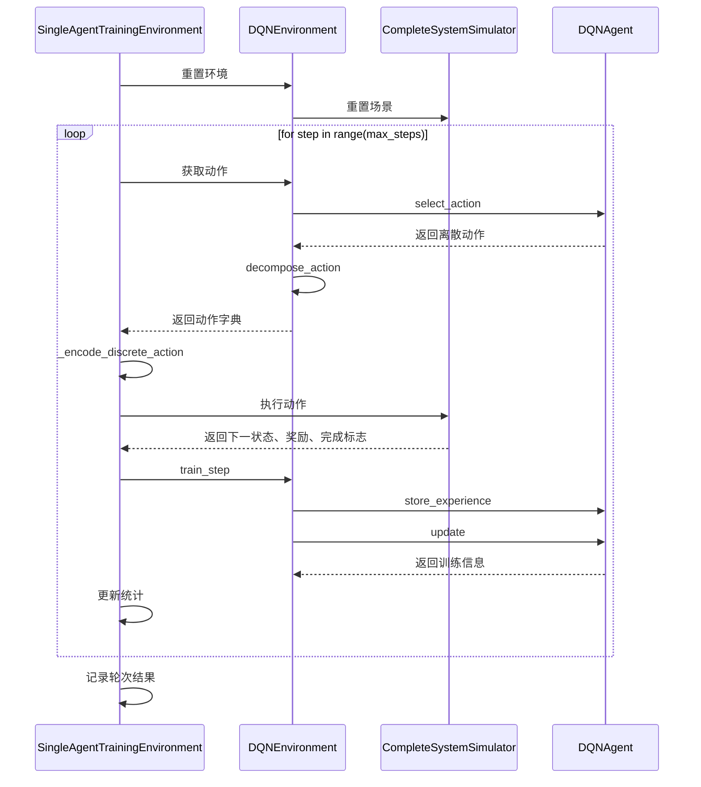
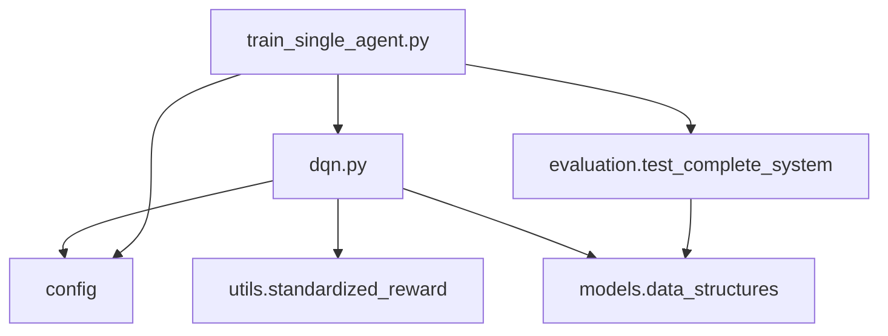

# DQN算法

<cite>
**本文档引用的文件**
- [dqn.py](file://single_agent/dqn.py)
- [train_single_agent.py](file://train_single_agent.py)
- [system_config.py](file://config/system_config.py)
- [standardized_reward.py](file://utils/standardized_reward.py)
- [data_structures.py](file://models/data_structures.py)
- [test_complete_system.py](file://evaluation/test_complete_system.py)
</cite>

## 目录
1. [引言](#引言)
2. [项目结构](#项目结构)
3. [核心组件](#核心组件)
4. [架构概述](#架构概述)
5. [详细组件分析](#详细组件分析)
6. [依赖分析](#依赖分析)
7. [性能考量](#性能考量)
8. [故障排除指南](#故障排除指南)
9. [结论](#结论)

## 引言
本文档全面阐述DQN（Deep Q-Network）算法在`single_agent/dqn.py`中的实现原理与系统集成。说明其如何将Q-learning与深度神经网络结合，处理离散动作空间下的任务卸载决策问题。重点解析经验回放、目标网络冻结、ε-greedy探索策略等核心机制。结合`train_single_agent.py`展示训练流程配置，讨论其在车辆节点任务分类决策中的适用场景。提供网络架构设计建议、学习率与探索率衰减策略，并分析其在高维状态空间中可能面临的维度灾难问题。给出典型训练曲线解读与性能瓶颈诊断方法。

## 项目结构
本项目采用模块化设计，将不同功能的组件分离到独立的目录中。DQN算法的实现位于`single_agent`目录下，与其他单智能体算法（如DDPG、PPO等）并列。训练脚本`train_single_agent.py`负责协调不同算法的训练流程。配置文件位于`config`目录，定义了系统和算法的参数。`evaluation`目录包含系统仿真器，用于评估算法性能。

**图示来源**
- [dqn.py](file://single_agent/dqn.py)
- [train_single_agent.py](file://train_single_agent.py)
- [system_config.py](file://config/system_config.py)

**本节来源**
- [dqn.py](file://single_agent/dqn.py)
- [train_single_agent.py](file://train_single_agent.py)
- [system_config.py](file://config/system_config.py)

## 核心组件
DQN算法的核心组件包括`DQNAgent`、`DQNNetwork`、`DQNReplayBuffer`和`DQNEnvironment`。`DQNAgent`是智能体的主类，负责动作选择、经验存储和网络更新。`DQNNetwork`是深度Q网络，采用Dueling DQN架构，将Q值分解为状态价值和优势函数。`DQNReplayBuffer`实现经验回放机制，存储和采样经验元组。`DQNEnvironment`封装了与外部环境的交互逻辑，包括状态向量构建、动作解码和奖励计算。

**本节来源**
- [dqn.py](file://single_agent/dqn.py#L177-L481)

## 架构概述
DQN算法的架构分为三层：环境层、智能体层和网络层。环境层由`DQNEnvironment`类实现，负责与仿真系统交互，构建状态向量，并将智能体的动作映射到具体的任务卸载决策。智能体层由`DQNAgent`类实现，管理经验回放缓冲区，执行ε-greedy策略，并协调网络更新。网络层由`DQNNetwork`类实现，采用双流网络结构，分别计算状态价值和优势函数，最终合成Q值。

**图示来源**
- [dqn.py](file://single_agent/dqn.py#L177-L481)

**本节来源**
- [dqn.py](file://single_agent/dqn.py#L177-L481)

## 详细组件分析

### DQNAgent分析
`DQNAgent`是DQN算法的核心控制器，负责协调网络更新、经验存储和探索策略。

#### 类图

**图示来源**
- [dqn.py](file://single_agent/dqn.py#L177-L216)
- [dqn.py](file://single_agent/dqn.py#L58-L131)
- [dqn.py](file://single_agent/dqn.py#L134-L174)

#### 动作选择流程

**图示来源**
- [dqn.py](file://single_agent/dqn.py#L218-L230)

#### 网络更新流程

**图示来源**
- [dqn.py](file://single_agent/dqn.py#L237-L287)
- [dqn.py](file://single_agent/dqn.py#L289-L311)

**本节来源**
- [dqn.py](file://single_agent/dqn.py#L177-L338)

### DQNEnvironment分析
`DQNEnvironment`类负责将复杂的VEC系统状态转换为DQN智能体可以理解的格式，并将智能体的离散动作转换为具体的任务卸载决策。

#### 动作映射机制
DQN算法处理的是离散动作空间。在本系统中，每个节点（车辆、RSU、UAV）有5个可能的动作选择，因此总共有5^3=125个离散动作组合。`DQNEnvironment`通过`_build_action_map`方法构建一个从动作索引到具体动作字典的映射表。

**图示来源**
- [dqn.py](file://single_agent/dqn.py#L341-L481)

#### 状态向量构建
`get_state_vector`方法将系统指标和节点状态整合成一个60维的状态向量。前5维是归一化的系统指标（平均任务延迟、总能耗、数据丢失率、缓存命中率、迁移成功率），后55维是各节点的状态信息。

**本节来源**
- [dqn.py](file://single_agent/dqn.py#L341-L481)

### 训练流程分析
`train_single_agent.py`脚本负责整个DQN算法的训练流程，包括环境初始化、轮次执行、模型评估和结果保存。

#### 训练主循环

**图示来源**
- [train_single_agent.py](file://train_single_agent.py#L545-L645)

#### 轮次执行流程

**图示来源**
- [train_single_agent.py](file://train_single_agent.py#L317-L402)
- [dqn.py](file://single_agent/dqn.py#L415-L435)

**本节来源**
- [train_single_agent.py](file://train_single_agent.py#L545-L645)
- [train_single_agent.py](file://train_single_agent.py#L317-L402)
- [dqn.py](file://single_agent/dqn.py#L415-L435)

## 依赖分析
DQN算法的实现依赖于多个模块。`dqn.py`直接依赖`config`模块获取系统配置，依赖`utils.standardized_reward`计算奖励，依赖`models.data_structures`定义数据结构。`train_single_agent.py`依赖`evaluation.test_complete_system`进行系统仿真，并依赖`single_agent`模块中的各种环境类。

**图示来源**
- [dqn.py](file://single_agent/dqn.py)
- [train_single_agent.py](file://train_single_agent.py)
- [standardized_reward.py](file://utils/standardized_reward.py)
- [test_complete_system.py](file://evaluation/test_complete_system.py)

**本节来源**
- [dqn.py](file://single_agent/dqn.py)
- [train_single_agent.py](file://train_single_agent.py)
- [standardized_reward.py](file://utils/standardized_reward.py)
- [test_complete_system.py](file://evaluation/test_complete_system.py)

## 性能考量
DQN算法在处理高维状态空间时可能面临维度灾难问题。本实现通过以下策略缓解：
1. **状态空间降维**：将复杂的节点状态（位置、速度、任务队列等）归一化并拼接成固定维度的向量。
2. **经验回放**：通过`DQNReplayBuffer`存储和重用历史经验，提高样本效率。
3. **目标网络**：使用`target_q_network`稳定训练过程，减少Q值估计的波动。
4. **探索策略**：采用ε-greedy策略，初始探索率`epsilon=1.0`，以`epsilon_decay=0.995`的速率衰减至`min_epsilon=0.05`。

学习率`lr=1e-4`和批次大小`batch_size=32`是经过调优的参数。`Dueling DQN`和`Double DQN`变种的使用进一步提升了算法性能。

## 故障排除指南
### 训练曲线解读
- **奖励曲线**：应呈现上升趋势，表明智能体学习到更好的策略。若奖励停滞或下降，可能是探索率过低或学习率过高。
- **损失曲线**：初期可能波动较大，后期应趋于稳定。若损失持续增大，可能是学习率过高或梯度爆炸。
- **Q值曲线**：应与奖励曲线正相关。若Q值远高于实际奖励，可能存在过估计问题。

### 常见性能瓶颈
1. **维度灾难**：状态空间过大导致学习困难。解决方案：特征工程，降维。
2. **样本效率低**：经验回放缓冲区利用率低。解决方案：增加`buffer_size`，调整`update_freq`。
3. **训练不稳定**：Q值波动大。解决方案：检查`target_update_freq`，确保目标网络更新频率合理。
4. **探索不足**：智能体陷入局部最优。解决方案：调整`epsilon_decay`，增加探索时间。

**本节来源**
- [dqn.py](file://single_agent/dqn.py#L32-L55)
- [dqn.py](file://single_agent/dqn.py#L237-L287)
- [train_single_agent.py](file://train_single_agent.py#L765-L855)

## 结论
DQN算法通过将Q-learning与深度神经网络结合，成功解决了VEC系统中离散动作空间下的任务卸载决策问题。其核心机制——经验回放、目标网络冻结和ε-greedy探索策略——有效提升了学习效率和稳定性。通过`train_single_agent.py`脚本，可以方便地配置和执行训练流程。尽管在高维状态空间中可能面临挑战，但通过合理的网络架构设计和超参数调优，DQN在车辆节点任务分类决策中表现出良好的适用性。未来可探索更先进的DQN变种（如Rainbow DQN）以进一步提升性能。