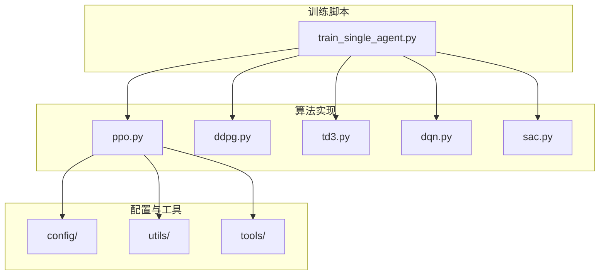
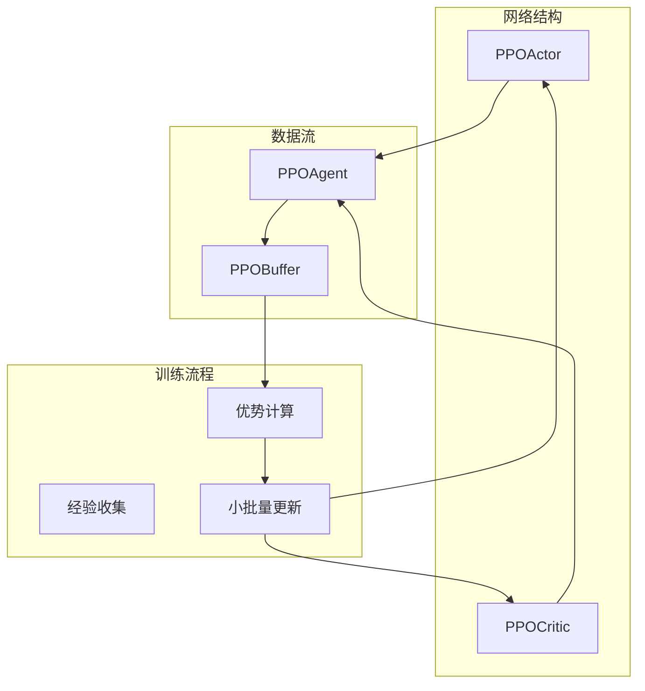
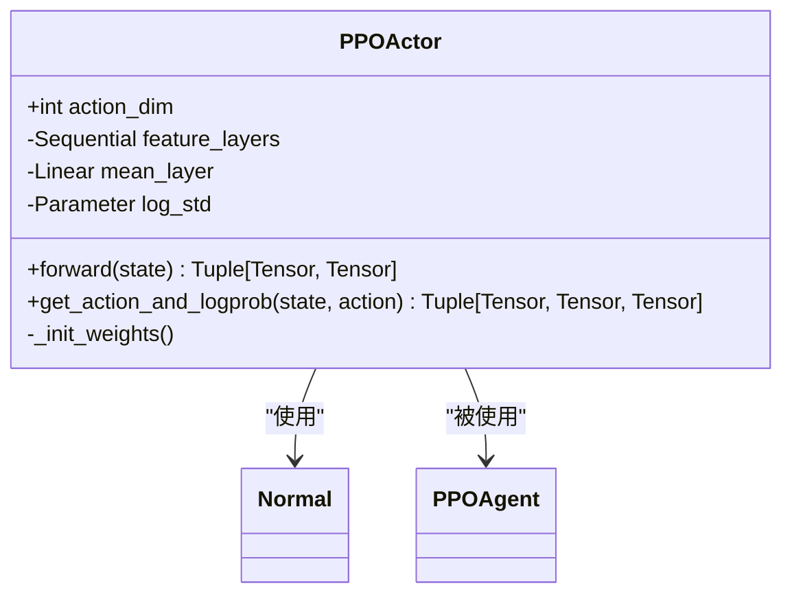
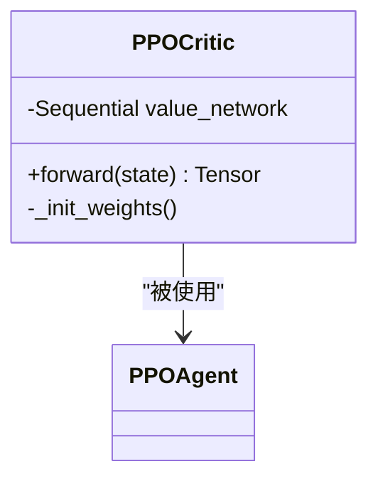
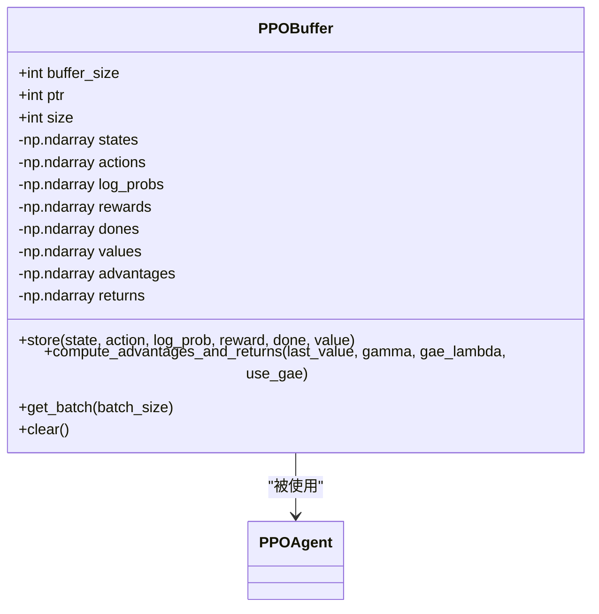
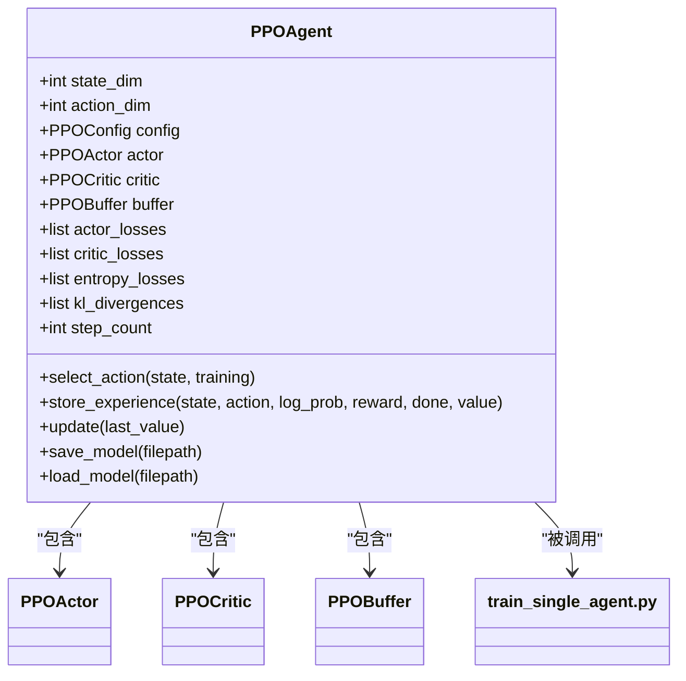
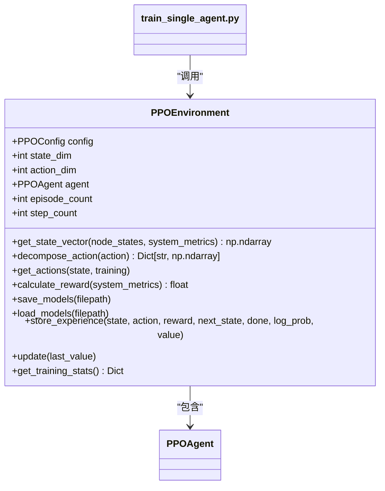
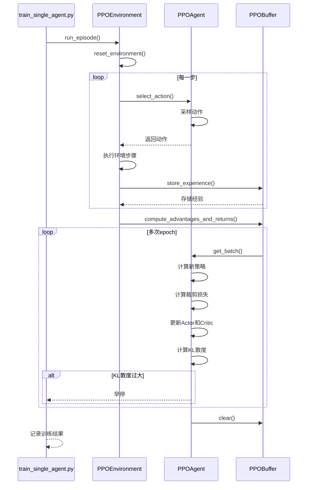
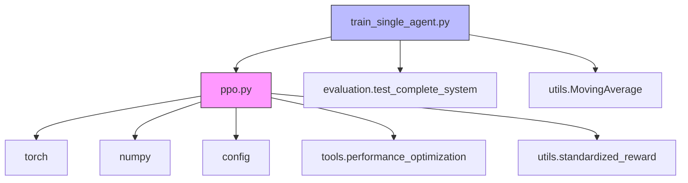

# PPO算法

<cite>
**本文档引用文件**   
- [ppo.py](file://single_agent/ppo.py)
- [train_single_agent.py](file://train_single_agent.py)
</cite>

## 目录
1. [简介](#简介)
2. [项目结构](#项目结构)
3. [核心组件](#核心组件)
4. [架构概述](#架构概述)
5. [详细组件分析](#详细组件分析)
6. [依赖分析](#依赖分析)
7. [性能考量](#性能考量)
8. [故障排除指南](#故障排除指南)
9. [结论](#结论)

## 简介
本文档深入分析了PPO（Proximal Policy Optimization）算法在`single_agent/ppo.py`中的实现细节。重点解释其裁剪代理目标函数如何在保证策略更新稳定性的同时提升样本效率。文档描述了多步采样、优势估计（GAE）和小批量更新等关键技术，并结合`train_single_agent.py`说明训练配置方式，分析其在车辆移动性建模中的策略适应能力。同时提供超参数调优指南，并讨论其相对于传统策略梯度方法的优势，列举训练过程中可能出现的策略崩溃问题及其解决方案。

## 项目结构
PPO算法实现位于`single_agent`目录下，作为单智能体强化学习算法的一部分。该实现专门适配于MATD3-MIG系统的VEC环境，支持连续动作空间的策略梯度方法。训练流程由`train_single_agent.py`统一管理，支持DDPG、TD3、DQN、PPO、SAC等多种算法的训练和比较。

**图示来源**
- [ppo.py](file://single_agent/ppo.py)
- [train_single_agent.py](file://train_single_agent.py)

**节来源**
- [ppo.py](file://single_agent/ppo.py)
- [train_single_agent.py](file://train_single_agent.py)

## 核心组件
PPO算法的核心组件包括PPOActor、PPOCritic、PPOBuffer和PPOAgent四个主要类。PPOActor负责策略网络的实现，采用正态分布输出连续动作；PPOCritic实现价值网络，用于状态价值估计；PPOBuffer作为经验回放缓冲区，存储多步采样数据；PPOAgent则整合所有组件，实现完整的PPO算法逻辑。

**节来源**
- [ppo.py](file://single_agent/ppo.py#L58-L144)

## 架构概述
PPO算法采用Actor-Critic架构，通过分离策略网络和价值网络实现高效的策略优化。算法在每个训练轮次中收集多步经验，使用GAE计算优势函数，然后进行多次小批量更新。这种架构设计既保证了样本效率，又通过裁剪机制确保了策略更新的稳定性。

**图示来源**
- [ppo.py](file://single_agent/ppo.py#L58-L144)

**节来源**
- [ppo.py](file://single_agent/ppo.py#L58-L144)

## 详细组件分析

### PPOActor分析
PPOActor类实现了随机策略网络，采用两层隐藏层的全连接网络结构。网络输出动作分布的均值和标准差，通过正态分布采样得到具体动作。权重初始化采用正交初始化，增益值为√2，有助于保持梯度流动的稳定性。

**图示来源**
- [ppo.py](file://single_agent/ppo.py#L58-L113)

**节来源**
- [ppo.py](file://single_agent/ppo.py#L58-L113)

### PPOCritic分析
PPOCritic类实现了价值网络，采用与Actor类似的网络结构但输出单一状态价值。网络包含三层全连接层，最后一层输出维度为1。价值网络的训练目标是最小化预测价值与实际回报之间的均方误差。

**图示来源**
- [ppo.py](file://single_agent/ppo.py#L116-L144)

**节来源**
- [ppo.py](file://single_agent/ppo.py#L116-L144)

### PPOBuffer分析
PPOBuffer类实现了经验回放缓冲区，存储状态、动作、对数概率、奖励、终止标志、价值估计、优势函数和回报等数据。缓冲区支持批量采样和优势函数计算，是PPO算法实现多步采样的关键组件。

**图示来源**
- [ppo.py](file://single_agent/ppo.py#L147-L232)

**节来源**
- [ppo.py](file://single_agent/ppo.py#L147-L232)

### PPOAgent分析
PPOAgent类整合了Actor、Critic和Buffer组件，实现了完整的PPO算法逻辑。包括动作选择、经验存储、策略更新等核心功能。更新过程采用小批量训练，支持多次epoch迭代，并通过KL散度监控实现早停机制。

**图示来源**
- [ppo.py](file://single_agent/ppo.py#L235-L407)

**节来源**
- [ppo.py](file://single_agent/ppo.py#L235-L407)

### PPOEnvironment分析
PPOEnvironment类封装了PPO算法的训练环境接口，提供了与`train_single_agent.py`兼容的统一API。该类负责状态向量构建、动作分解、奖励计算等功能，实现了算法与环境的解耦。

**图示来源**
- [ppo.py](file://single_agent/ppo.py#L410-L518)

**节来源**
- [ppo.py](file://single_agent/ppo.py#L410-L518)

### 训练流程分析
PPO算法的训练流程由`train_single_agent.py`中的`_run_ppo_episode`方法管理。该流程包括环境重置、动作选择、经验存储、优势计算和策略更新等步骤，形成了完整的训练闭环。

**图示来源**
- [train_single_agent.py](file://train_single_agent.py#L404-L480)
- [ppo.py](file://single_agent/ppo.py#L180-L214)

**节来源**
- [train_single_agent.py](file://train_single_agent.py#L404-L480)

## 依赖分析
PPO算法实现依赖于多个外部模块和配置文件。主要依赖包括PyTorch深度学习框架、NumPy数值计算库、配置系统和工具模块。算法通过配置文件实现超参数管理，通过工具模块实现性能优化。

**图示来源**
- [ppo.py](file://single_agent/ppo.py)
- [train_single_agent.py](file://train_single_agent.py)

**节来源**
- [ppo.py](file://single_agent/ppo.py)
- [train_single_agent.py](file://train_single_agent.py)

## 性能考量
PPO算法在实现中考虑了多项性能优化措施。包括使用优化的批次大小、GPU加速计算、正交权重初始化等。算法通过小批量更新和多次epoch训练提高样本效率，同时通过梯度裁剪防止梯度爆炸。

**节来源**
- [ppo.py](file://single_agent/ppo.py#L235-L407)

## 故障排除指南
PPO训练过程中可能出现策略崩溃问题，主要表现为KL散度急剧增大或奖励值剧烈波动。解决方案包括调整裁剪范围、降低学习率、增加批量大小等。监控KL散度和损失函数变化是诊断问题的关键。

**节来源**
- [ppo.py](file://single_agent/ppo.py#L287-L387)

## 结论
PPO算法在`single_agent/ppo.py`中的实现充分考虑了稳定性与效率的平衡。通过裁剪代理目标函数，算法有效限制了策略更新的步长，避免了传统策略梯度方法中常见的训练不稳定问题。结合GAE优势估计和小批量更新，算法在保证样本效率的同时实现了稳定的策略优化。在车辆移动性建模场景中，该实现展现了良好的策略适应能力，为VEC系统的智能决策提供了可靠的技术支持。