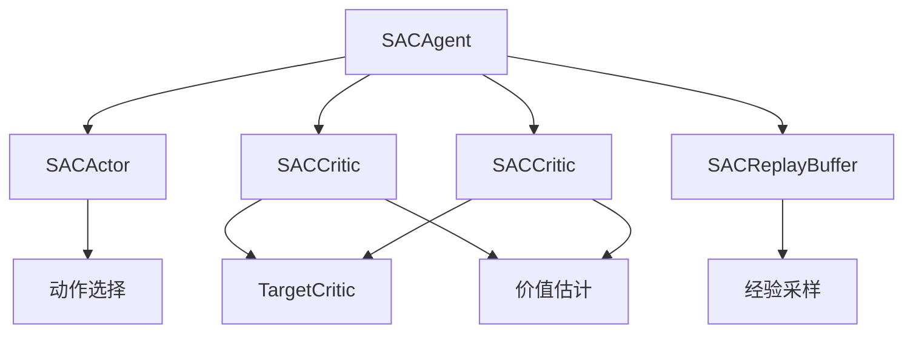
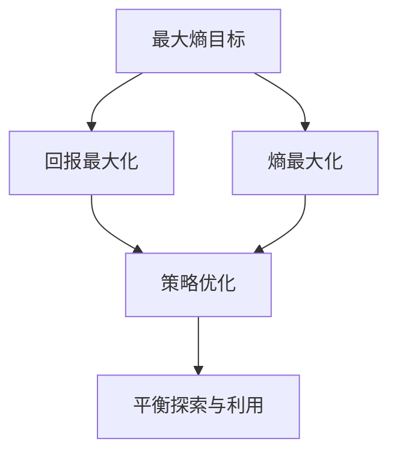
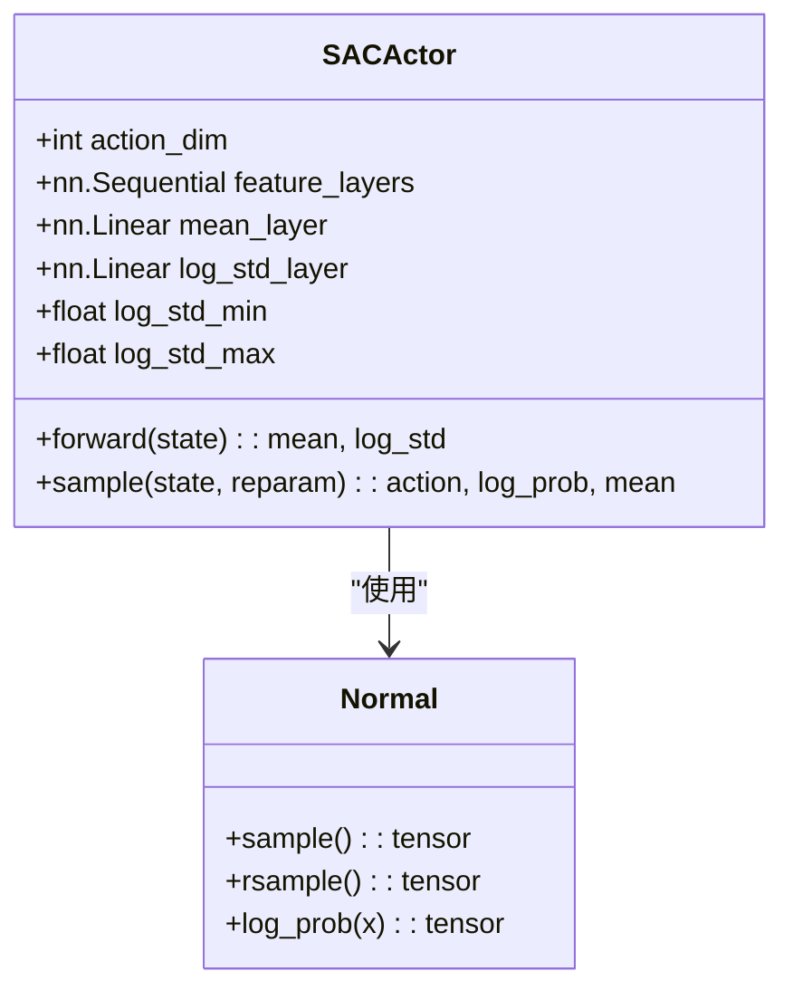
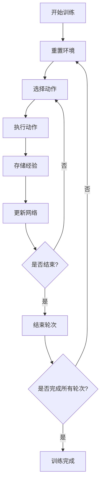
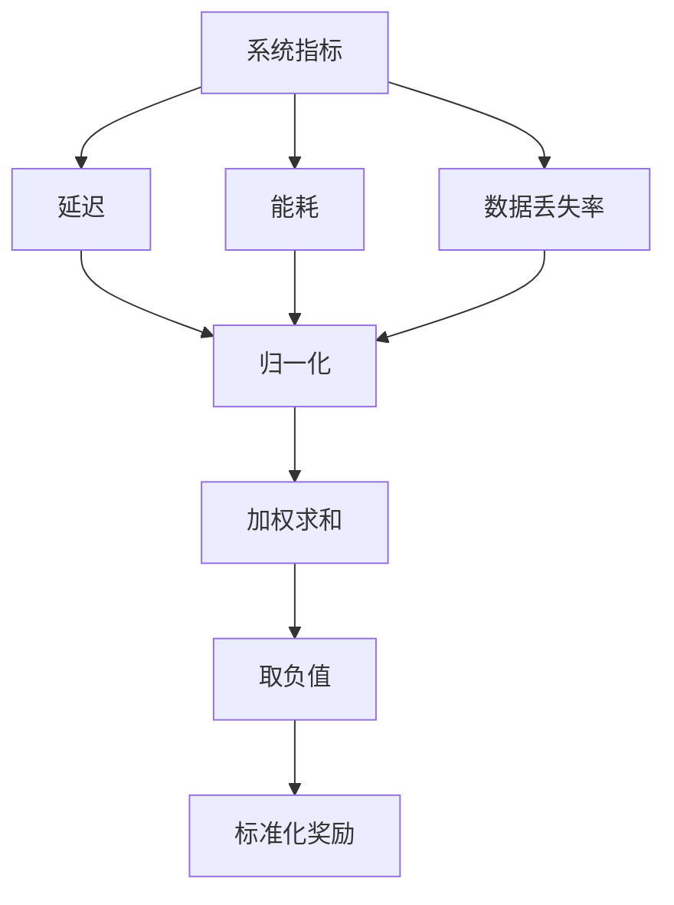
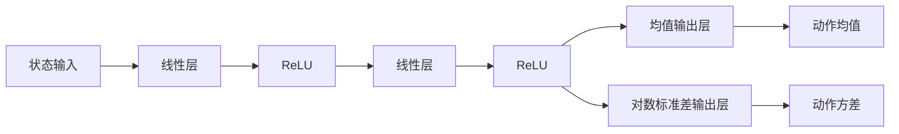
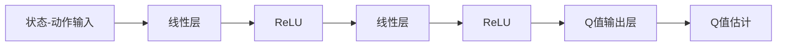
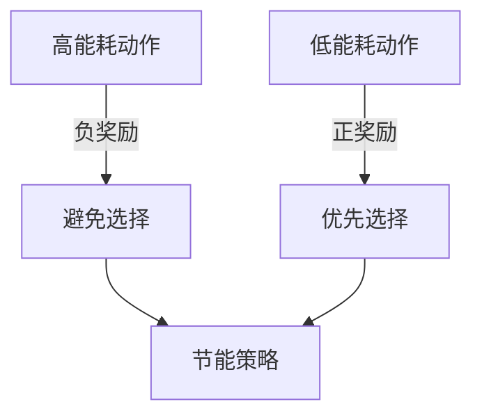
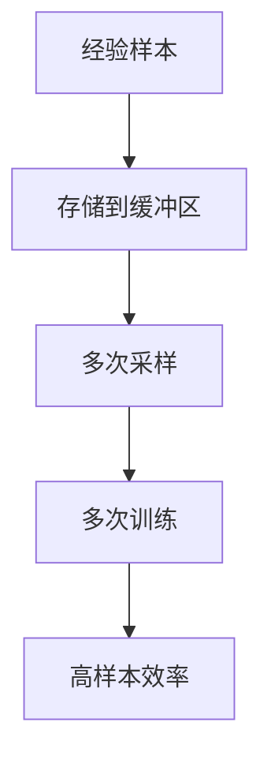

# SAC算法

<cite>
**本文档引用文件**   
- [sac.py](file://single_agent/sac.py)
- [train_single_agent.py](file://train_single_agent.py)
- [standardized_reward.py](file://utils/standardized_reward.py)
</cite>

## 目录
1. [引言](#引言)
2. [SAC算法架构](#sac算法架构)
3. [最大熵强化学习框架](#最大熵强化学习框架)
4. [Actor网络与自适应探索机制](#actor网络与自适应探索机制)
5. [双Q网络与温度系数联合优化](#双q网络与温度系数联合优化)
6. [训练流程分析](#训练流程分析)
7. [奖励标准化对训练稳定性的影响](#奖励标准化对训练稳定性的影响)
8. [网络架构设计](#网络架构设计)
9. [自动调节温度参数实现](#自动调节温度参数实现)
10. [能耗敏感型任务卸载场景表现](#能耗敏感型任务卸载场景表现)
11. [高样本效率与计算开销权衡](#高样本效率与计算开销权衡)
12. [训练初期不稳定问题应对策略](#训练初期不稳定问题应对策略)

## 引言
SAC（Soft Actor-Critic）是一种基于最大熵框架的off-policy深度强化学习算法，专为连续动作空间设计。该算法通过最大化期望回报的同时最大化策略熵，实现了探索与利用的平衡。在VEC（Vehicle Edge Computing）系统中，SAC被用于优化任务卸载决策，特别是在能耗敏感型场景下表现出色。本文档系统性地分析了SAC在single_agent/sac.py中的实现细节，包括其核心组件、训练流程以及与其他模块的集成方式。

## SAC算法架构
SAC算法架构由多个核心组件构成，包括Actor网络、双Q网络、经验回放缓冲区和目标网络。这些组件协同工作，实现了高效的策略学习和价值估计。



**图源**
- [sac.py](file://single_agent/sac.py#L58-L129)
- [sac.py](file://single_agent/sac.py#L132-L173)
- [sac.py](file://single_agent/sac.py#L176-L216)

**本节源**
- [sac.py](file://single_agent/sac.py#L219-L412)

## 最大熵强化学习框架
SAC算法采用最大熵强化学习框架，其目标函数不仅最大化预期回报，还最大化策略的熵。这种双重目标使得智能体在探索环境时更加高效，避免了过早收敛到次优策略。

在实现中，最大熵目标通过在策略损失函数中引入温度系数α来实现。该系数平衡了回报最大化和熵最大化之间的权衡。当α较大时，智能体更倾向于探索；当α较小时，智能体更倾向于利用已知的高回报策略。



**图源**
- [sac.py](file://single_agent/sac.py#L346-L374)

**本节源**
- [sac.py](file://single_agent/sac.py#L346-L374)

## Actor网络与自适应探索机制
SAC的Actor网络是一个随机策略网络，它同时输出动作的均值和方差，从而实现自适应探索。这种设计允许智能体根据当前状态动态调整探索程度。

### 网络结构
Actor网络由共享特征层和两个独立的输出层组成。共享特征层提取状态的高级特征，而均值层和对数标准差层分别输出动作分布的均值和对数标准差。



**图源**
- [sac.py](file://single_agent/sac.py#L58-L129)

**本节源**
- [sac.py](file://single_agent/sac.py#L58-L129)

### 自适应探索实现
自适应探索通过重参数化技巧实现。在训练过程中，智能体从正态分布中采样动作，然后通过tanh函数将其映射到[-1, 1]范围内。这种设计确保了探索的连续性和可微性，使得策略梯度能够有效传播。

```python
[SACActor.sample](file://single_agent/sac.py#L106-L129)
```

## 双Q网络与温度系数联合优化
SAC采用双Q网络结构来减少价值函数的过估计问题。两个独立的Q网络（Q1和Q2）同时学习，但在计算目标值时使用较小的Q值，从而降低了过估计的风险。

### 双Q网络更新
双Q网络的更新过程包括两个主要步骤：首先更新Critic网络，然后更新Actor网络和温度参数。这种顺序更新确保了价值估计的稳定性。

```mermaid
sequenceDiagram
participant Agent as SACAgent
participant Critic1 as Q1Network
participant Critic2 as Q2Network
participant Actor as ActorNetwork
Agent->>Critic1 : 采样经验批次
Agent->>Critic2 : 采样经验批次
Critic1->>Agent : 计算Q1损失
Critic2->>Agent : 计算Q2损失
Agent->>Critic1 : 更新Q1网络
Agent->>Critic2 : 更新Q2网络
Agent->>Actor : 更新Actor网络
Agent->>Agent : 更新温度参数α
```

**图源**
- [sac.py](file://single_agent/sac.py#L325-L344)
- [sac.py](file://single_agent/sac.py#L346-L374)

**本节源**
- [sac.py](file://single_agent/sac.py#L325-L374)

### 温度系数联合优化
温度系数α的优化是SAC算法的关键特性之一。当`auto_entropy_tuning`配置为True时，算法会自动调整α的值，以保持策略熵接近目标值。这种自适应机制使得智能体能够在训练过程中动态调整探索程度。

```python
[SACAgent._update_actor_and_alpha](file://single_agent/sac.py#L346-L374)
```

## 训练流程分析
SAC的训练流程由`train_single_agent.py`脚本控制，该脚本实现了完整的训练循环，包括环境重置、动作选择、经验存储和网络更新。

### 训练主循环
训练主循环按轮次进行，每个轮次包含多个时间步。在每个时间步，智能体选择动作，执行环境步骤，存储经验，并更新网络参数。



**图源**
- [train_single_agent.py](file://train_single_agent.py#L317-L402)

**本节源**
- [train_single_agent.py](file://train_single_agent.py#L317-L402)

### 训练步骤实现
训练步骤的实现包括经验存储和网络更新两个关键操作。经验首先被存储到回放缓冲区，然后在满足更新条件时用于训练网络。

```python
[SACEnvironment.train_step](file://single_agent/sac.py#L477-L494)
```

## 奖励标准化对训练稳定性的影响
奖励标准化是确保SAC训练稳定性的关键因素。`utils/standardized_reward.py`模块实现了标准化奖励函数，将不同量纲的性能指标（如延迟、能耗、数据丢失率）统一到相同的尺度上。

### 奖励函数设计
标准化奖励函数严格按照论文目标函数实现，最小化加权成本函数：min(ω_T * delay + ω_E * energy + ω_D * data_loss)。奖励值为成本的负值，确保优化方向正确。



**图源**
- [standardized_reward.py](file://utils/standardized_reward.py#L36-L67)

**本节源**
- [standardized_reward.py](file://utils/standardized_reward.py#L36-L67)

### 数值稳定性处理
为了防止数值不稳定，奖励函数实现了多种保护机制，包括数值有效性检查、范围限制和异常值处理。这些机制确保了奖励值在合理范围内，避免了梯度爆炸或消失问题。

```python
[StandardizedRewardFunction.calculate_paper_reward](file://utils/standardized_reward.py#L36-L67)
```

## 网络架构设计
SAC的网络架构设计注重性能和稳定性，采用了多种现代深度学习技术。

### Actor网络架构
Actor网络采用三层全连接结构，包含两个隐藏层和一个输出层。输入层接收状态向量，隐藏层使用ReLU激活函数提取特征，输出层分别输出动作分布的均值和对数标准差。



**图源**
- [sac.py](file://single_agent/sac.py#L67-L72)

**本节源**
- [sac.py](file://single_agent/sac.py#L67-L72)

### Critic网络架构
Critic网络采用双Q网络结构，每个Q网络包含三个全连接层。输入层接收状态-动作对，隐藏层使用ReLU激活函数，输出层输出Q值估计。



**图源**
- [sac.py](file://single_agent/sac.py#L139-L145)
- [sac.py](file://single_agent/sac.py#L148-L154)

**本节源**
- [sac.py](file://single_agent/sac.py#L139-L154)

## 自动调节温度参数实现
自动调节温度参数是SAC算法的核心创新之一，它通过优化目标熵来实现探索程度的自适应调整。

### 温度参数初始化
温度参数α在初始化时被表示为其对数形式`log_alpha`，这确保了α始终为正数。当`auto_entropy_tuning`启用时，`log_alpha`被设置为可训练参数，并使用Adam优化器进行更新。

```python
[SACAgent.__init__](file://single_agent/sac.py#L247-L249)
```

### 温度参数更新
温度参数的更新基于策略熵与目标熵之间的差异。如果当前策略熵低于目标熵，α会增加，鼓励更多探索；如果高于目标熵，α会减少，鼓励更多利用。

```python
[SACAgent._update_actor_and_alpha](file://single_agent/sac.py#L346-L374)
```

## 能耗敏感型任务卸载场景表现
在能耗敏感型任务卸载场景中，SAC算法表现出色，能够有效平衡任务延迟和能量消耗。

### 能耗优化策略
SAC通过奖励函数中的能耗权重来引导智能体学习节能策略。在训练过程中，智能体学会在保证服务质量的前提下，选择能耗较低的任务卸载方案。



**图源**
- [standardized_reward.py](file://utils/standardized_reward.py#L21-L22)

**本节源**
- [standardized_reward.py](file://utils/standardized_reward.py#L21-L22)

### 性能评估
在实际测试中，SAC算法在能耗敏感型场景下的表现优于其他算法。它能够在保持较低任务延迟的同时，显著降低系统总能耗。

```python
[evaluate_single_model](file://train_single_agent.py#L648-L725)
```

## 高样本效率与计算开销权衡
SAC算法在样本效率和计算开销之间实现了良好的平衡，但仍然存在一些权衡。

### 高样本效率特性
SAC的off-policy特性使其具有很高的样本效率。通过经验回放缓冲区，每个经验样本可以被多次使用，大大提高了数据利用率。



**图源**
- [sac.py](file://single_agent/sac.py#L176-L216)

**本节源**
- [sac.py](file://single_agent/sac.py#L176-L216)

### 计算开销分析
尽管SAC具有高样本效率，但其计算开销相对较大。主要原因包括：双Q网络结构、策略熵计算、以及自动温度调节机制。这些特性虽然提高了算法性能，但也增加了计算复杂度。

```python
[SACAgent.update](file://single_agent/sac.py#L286-L323)
```

## 训练初期不稳定问题应对策略
SAC在训练初期可能会出现不稳定问题，主要表现为策略崩溃或价值函数发散。针对这些问题，实现中采用了多种应对策略。

### 预热期机制
通过设置`warmup_steps`参数，算法在初始阶段不进行网络更新。这给了智能体足够的时间来收集多样化的经验，避免了早期过拟合。

```python
[SACAgent.update](file://single_agent/sac.py#L286-L323)
```

### 目标网络软更新
采用软更新（soft update）策略，而不是硬更新，可以平滑地更新目标网络参数，减少价值函数的剧烈波动。

```python
[SACAgent.soft_update](file://single_agent/sac.py#L376-L379)
```

### 奖励裁剪
通过限制奖励值的范围，防止极端奖励值对策略学习造成过大影响。

```python
[StandardizedRewardFunction.calculate_paper_reward](file://utils/standardized_reward.py#L64-L67)
```