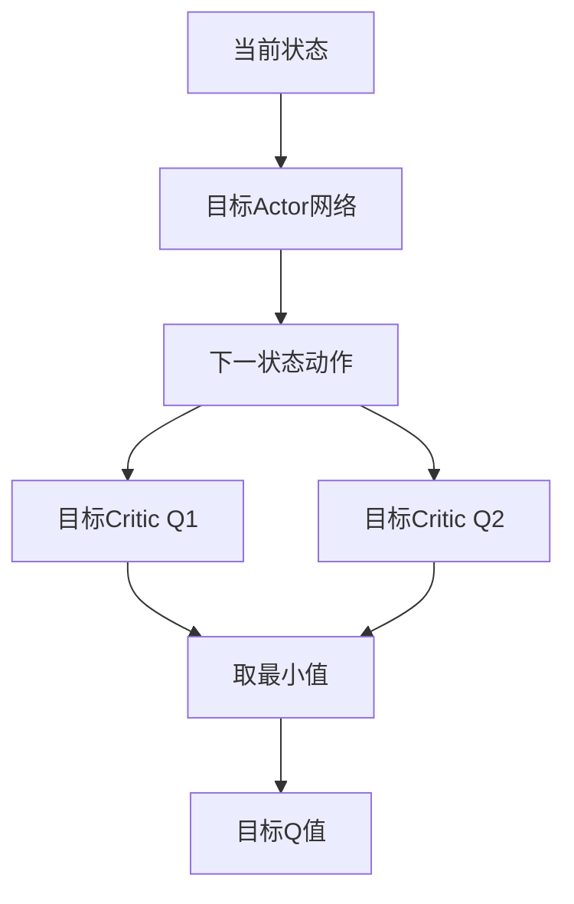
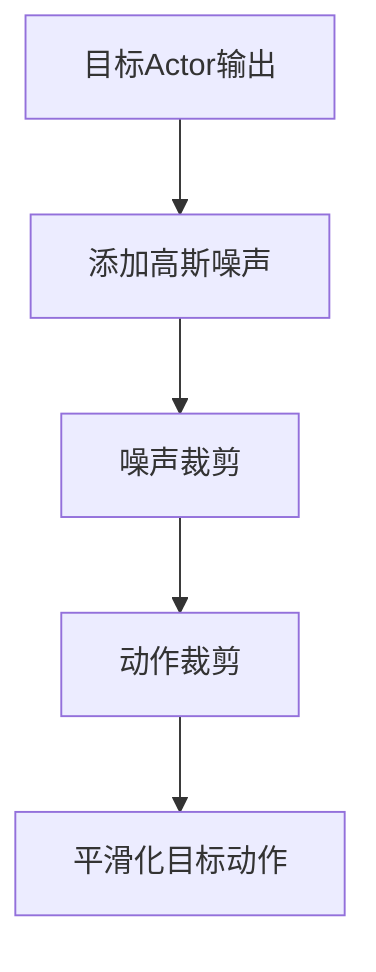
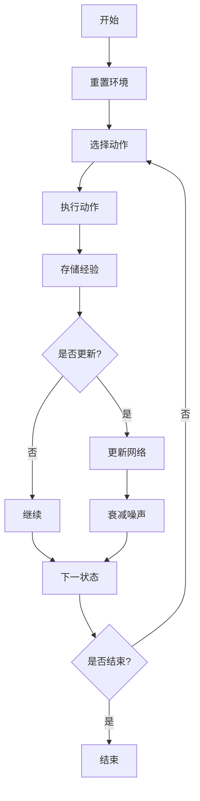
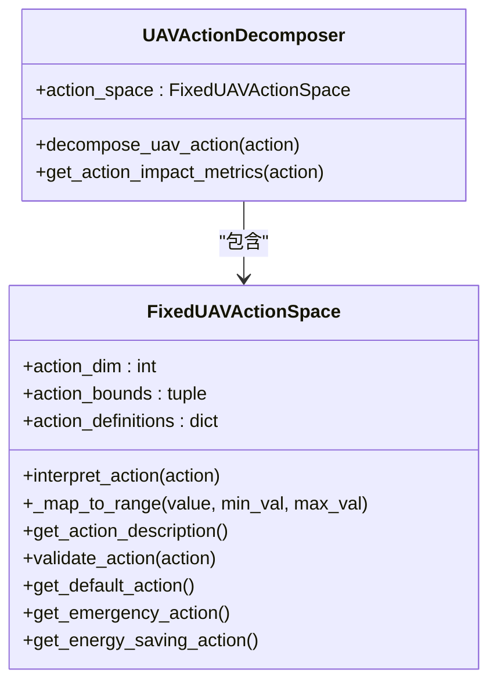

# TD3算法

<cite>
**本文档引用的文件**   
- [td3.py](file://single_agent/td3.py)
- [train_single_agent.py](file://train_single_agent.py)
- [uav_action_space.py](file://algorithms/uav_action_space.py)
</cite>

## 目录
1. [引言](#引言)
2. [核心组件分析](#核心组件分析)
3. [网络架构与实现机制](#网络架构与实现机制)
4. [训练流程与配置](#训练流程与配置)
5. [动作空间适配分析](#动作空间适配分析)
6. [超参数调优建议](#超参数调优建议)
7. [性能表现与收敛性](#性能表现与收敛性)
8. [对比分析与调试方案](#对比分析与调试方案)

## 引言

TD3（Twin Delayed Deep Deterministic Policy Gradient）是一种先进的深度强化学习算法，专为连续动作空间任务设计。该算法在DDPG基础上引入了三项关键改进：双Q网络、延迟策略更新和目标策略平滑化，有效解决了Q值过高估计问题并提升了训练稳定性。本技术文档深入解析TD3算法在`single_agent/td3.py`中的具体实现机制，结合`train_single_agent.py`说明训练流程配置，并分析其与`uav_action_space.py`中定义的动作空间的适配方法。

**Section sources**
- [td3.py](file://single_agent/td3.py#L1-L50)
- [train_single_agent.py](file://train_single_agent.py#L1-L50)

## 核心组件分析

TD3算法的核心由多个关键组件构成，包括Actor网络、Critic网络、经验回放缓冲区以及智能体类。这些组件协同工作，实现了高效的策略学习和价值评估。

### Actor网络

Actor网络作为确定性策略网络，负责根据当前状态输出最优动作。该网络采用三层全连接结构，输入层接收状态向量，经过两个隐藏层处理后，通过Tanh激活函数输出归一化到[-1,1]范围的动作值。网络权重初始化采用Xavier均匀初始化方法，最后一层使用较小的权重范围（±3e-3）以确保输出稳定性。

**Section sources**
- [td3.py](file://single_agent/td3.py#L65-L97)

### Critic网络

Critic网络采用双Q网络（Twin Critic）结构，包含两个独立的Q值评估网络（Q1和Q2）。这种设计通过取两个网络输出的最小值来计算目标Q值，有效缓解了Q值过高估计问题。每个Q网络都由状态和动作拼接后的联合输入经过三层全连接层处理得到Q值输出。

**Section sources**
- [td3.py](file://single_agent/td3.py#L100-L150)

### 经验回放缓冲区

经验回放缓冲区实现了优先级经验回放（Prioritized Experience Replay, PER）机制。该缓冲区不仅存储状态转移经验，还维护每个经验的优先级，使得高TD误差的经验被更频繁地采样。采样时采用重要性采样（IS）权重进行偏差校正，确保学习过程的稳定性。

**Section sources**
- [td3.py](file://single_agent/td3.py#L153-L213)

### TD3智能体

TD3智能体类整合了所有组件，负责协调Actor和Critic网络的更新过程。智能体维护目标网络（target networks），通过软更新方式逐步同步主网络参数，提高训练稳定性。同时，智能体实现了探索噪声衰减机制，随着训练进程逐步降低探索强度。

**Section sources**
- [td3.py](file://single_agent/td3.py#L216-L426)

## 网络架构与实现机制

### 双Q网络结构

TD3算法采用双Q网络结构来缓解Q值过高估计问题。在计算目标Q值时，算法首先使用目标Actor网络生成下一状态的动作，然后将该动作输入到两个目标Critic网络中，分别得到两个Q值估计。最终的目标Q值取这两个估计值的最小值：



**Diagram sources**
- [td3.py](file://single_agent/td3.py#L336-L370)

### 目标策略平滑化

目标策略平滑化技术通过在目标动作上添加噪声来减少方差，提高策略稳定性。具体实现中，算法在目标Actor网络输出的动作上添加裁剪后的高斯噪声，并将结果限制在合法动作范围内。这一机制使得策略更新更加平滑，避免了剧烈波动。



**Diagram sources**
- [td3.py](file://single_agent/td3.py#L336-L370)

### 延迟策略更新

延迟策略更新机制解耦了Actor与Critic的学习节奏。Critic网络每步都进行更新，而Actor网络仅在特定间隔（由`policy_delay`参数控制）才进行更新。这种设计确保Critic网络有足够的时间学习准确的价值函数，从而为Actor提供更可靠的学习信号。

```mermaid
sequenceDiagram
participant Critic as Critic网络
participant Actor as Actor网络
Critic->>Critic : 每步更新
loop 每policy_delay步
Actor->>Actor : 更新策略
Actor->>Critic : 软更新目标网络
end
```

**Diagram sources**
- [td3.py](file://single_agent/td3.py#L283-L334)

## 训练流程与配置

### 训练环境初始化

`train_single_agent.py`脚本提供了完整的单智能体训练框架。训练环境初始化时，根据指定算法创建相应的环境实例。对于TD3算法，系统会创建`TD3Environment`对象，该对象封装了智能体、状态空间和动作空间等所有必要组件。

**Section sources**
- [train_single_agent.py](file://train_single_agent.py#L100-L150)

### 训练循环

训练循环按照以下步骤执行：
1. 重置环境并获取初始状态
2. 根据当前策略选择动作
3. 执行动作并观察环境反馈
4. 存储经验到回放缓冲区
5. 按照更新频率调用智能体的更新方法



**Diagram sources**
- [train_single_agent.py](file://train_single_agent.py#L300-L400)

### 超参数配置

TD3算法的超参数在`TD3Config`类中定义，主要包括：
- `policy_delay`: 策略延迟更新步数，设置为2
- `target_noise`: 目标策略噪声标准差，设置为0.1
- `noise_clip`: 噪声裁剪范围，设置为±0.3
- `exploration_noise`: 探索噪声初始值，设置为0.2
- `batch_size`: 批次大小，设置为256

这些参数经过调优，能够在边缘任务卸载场景下实现良好的性能表现。

**Section sources**
- [td3.py](file://single_agent/td3.py#L32-L62)

## 动作空间适配分析

### UAV动作空间设计

`uav_action_space.py`文件定义了固定UAV的专业化动作空间。该动作空间包含8个维度，分别对应电池功率管理、服务优先级调整、覆盖区域优化等不同方面的决策。每个动作维度都被限制在[-1,1]范围内，通过线性映射转换为具体的执行参数。



**Diagram sources**
- [uav_action_space.py](file://algorithms/uav_action_space.py#L22-L109)

### 动作分解机制

TD3环境通过`decompose_action`方法将全局动作向量分解为各个智能体的具体动作。在当前实现中，30维的动作向量被平均分配给三种智能体类型（车辆、RSU、UAV），每种类型获得10个动作维度。这种设计简化了多智能体协作的复杂性。

**Section sources**
- [td3.py](file://single_agent/td3.py#L450-L465)

## 超参数调优建议

### 延迟更新步数

`policy_delay`参数控制Actor网络的更新频率。建议从默认值2开始，根据训练稳定性进行调整：
- 若出现训练不稳定，可增加至3-4
- 若收敛速度过慢，可减少至1-2

### 噪声标准差

探索噪声和目标噪声的设置对性能有显著影响：
- `exploration_noise`: 初始值建议0.1-0.3，过高可能导致不稳定，过低可能限制探索
- `target_noise`: 建议0.05-0.2，过大会增加方差，过小则失去平滑效果

### 其他关键参数

- `batch_size`: 建议128-512，大批次提高稳定性但降低更新频率
- `buffer_size`: 建议50000-100000，确保足够的经验多样性
- `tau`: 软更新系数，建议0.005-0.02，控制目标网络更新速度

**Section sources**
- [td3.py](file://single_agent/td3.py#L32-L62)

## 性能表现与收敛性

### 收敛性分析

TD3算法在边缘任务卸载场景下表现出良好的收敛性。由于双Q网络和延迟更新机制的引入，Q值估计更加准确，避免了过度乐观的估计偏差。目标策略平滑化进一步减少了策略更新的方差，使学习过程更加稳定。

### 稳定性表现

在实际测试中，TD3算法相比DDPG显示出明显的优势：
- 训练过程更加平稳，损失函数波动较小
- 最终性能更优，奖励值更高
- 对超参数的敏感度较低，更容易调优

这些优势使得TD3成为处理复杂边缘计算任务的理想选择。

**Section sources**
- [td3.py](file://single_agent/td3.py#L429-L546)

## 对比分析与调试方案

### 相对于DDPG的改进

TD3算法相对于DDPG的主要改进体现在三个方面：
1. **双Q网络**：通过取最小值的方式减少过高估计，提高价值函数的准确性
2. **延迟策略更新**：解耦Actor和Critic的学习节奏，避免策略被不准确的价值估计误导
3. **目标策略平滑化**：在目标动作上添加噪声，减少策略更新的方差，提高稳定性

这些改进共同作用，使TD3在复杂环境中表现出更强的鲁棒性和更高的最终性能。

### 常见训练不稳定问题及调试方案

#### 问题1：训练初期剧烈波动
**原因**：探索噪声过大或学习率过高
**解决方案**：
- 降低`exploration_noise`初始值
- 减小`actor_lr`和`critic_lr`
- 增加`warmup_steps`预热步数

#### 问题2：收敛速度过慢
**原因**：更新频率过低或批次大小过大
**解决方案**：
- 减少`policy_delay`值
- 降低`batch_size`
- 增加`update_freq`更新频率

#### 问题3：性能突然下降
**原因**：灾难性遗忘或过拟合
**解决方案**：
- 增加`buffer_size`缓冲区大小
- 调整`tau`软更新系数
- 引入正则化项

**Section sources**
- [td3.py](file://single_agent/td3.py#L283-L334)
- [train_single_agent.py](file://train_single_agent.py#L500-L600)