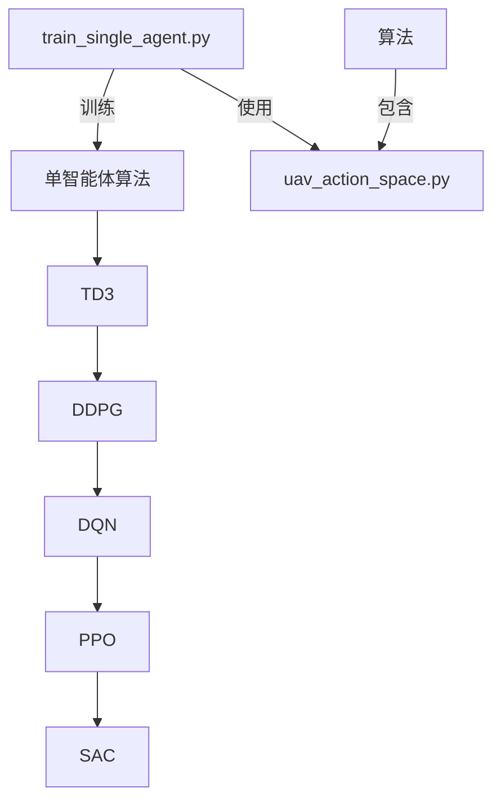
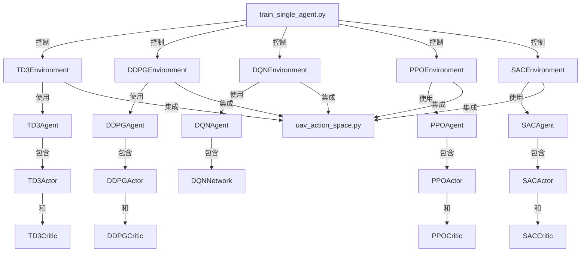
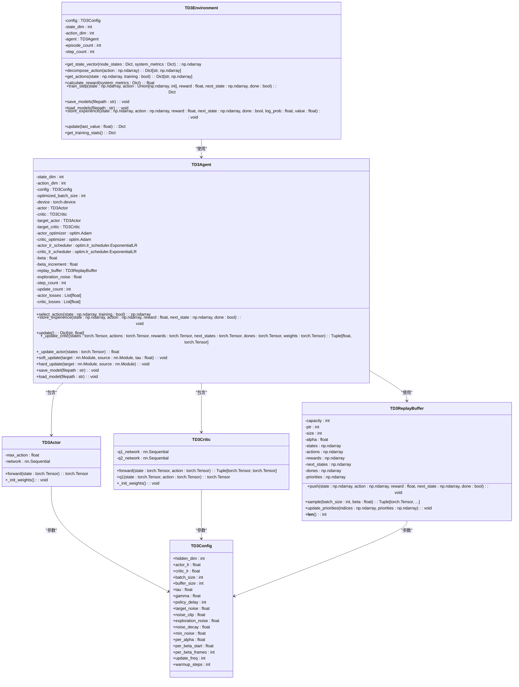
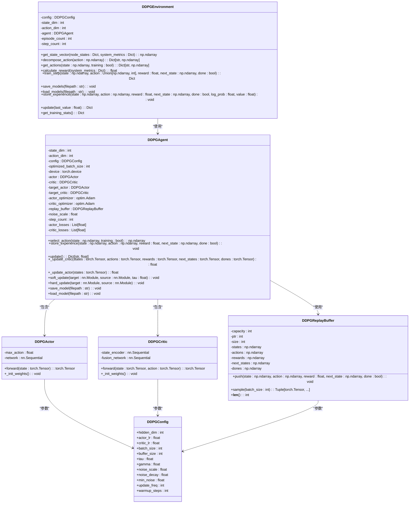
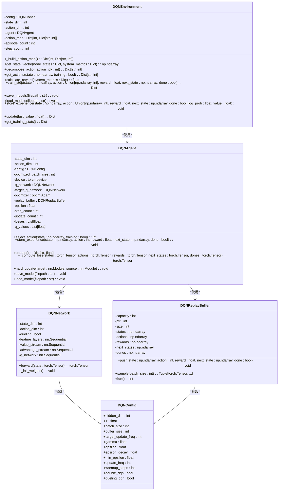

# 单智能体算法

<cite>
**本文档引用的文件**   
- [td3.py](file://single_agent/td3.py)
- [ddpg.py](file://single_agent/ddpg.py)
- [dqn.py](file://single_agent/dqn.py)
- [ppo.py](file://single_agent/ppo.py)
- [sac.py](file://single_agent/sac.py)
- [uav_action_space.py](file://algorithms/uav_action_space.py)
- [train_single_agent.py](file://train_single_agent.py)
</cite>

## 目录
1. [引言](#引言)
2. [项目结构](#项目结构)
3. [核心组件](#核心组件)
4. [架构概述](#架构概述)
5. [详细组件分析](#详细组件分析)
6. [依赖分析](#依赖分析)
7. [性能考虑](#性能考虑)
8. [故障排除指南](#故障排除指南)
9. [结论](#结论)

## 引言
本文档全面文档化单智能体深度强化学习算法的实现及其在系统基准测试中的角色。重点解析TD3算法在`single_agent/td3.py`中的实现，包括双Q网络、目标策略平滑和延迟更新机制。同时对比分析DDPG的确定性策略梯度、DQN的Q-learning框架、PPO的裁剪目标函数以及SAC的熵最大化原理。说明这些算法如何作为多智能体系统的性能基线，并通过`train_single_agent.py`脚本进行独立训练和评估。提供各算法的网络架构图、动作空间适配方法（特别是与`uav_action_space.py`的集成）、超参数调优指南以及在边缘计算场景下的性能表现对比。

## 项目结构
项目结构展示了单智能体强化学习算法的实现，包括TD3、DDPG、DQN、PPO和SAC等算法。这些算法通过`train_single_agent.py`脚本进行训练和评估。`algorithms`目录包含多智能体算法和UAV专用动作空间定义。`config`、`utils`和`tools`等目录提供配置、工具和辅助功能。



**图源**
- [td3.py](file://single_agent/td3.py)
- [ddpg.py](file://single_agent/ddpg.py)
- [dqn.py](file://single_agent/dqn.py)
- [ppo.py](file://single_agent/ppo.py)
- [sac.py](file://single_agent/sac.py)
- [uav_action_space.py](file://algorithms/uav_action_space.py)
- [train_single_agent.py](file://train_single_agent.py)

**节源**
- [td3.py](file://single_agent/td3.py)
- [ddpg.py](file://single_agent/ddpg.py)
- [dqn.py](file://single_agent/dqn.py)
- [ppo.py](file://single_agent/ppo.py)
- [sac.py](file://single_agent/sac.py)
- [uav_action_space.py](file://algorithms/uav_action_space.py)
- [train_single_agent.py](file://train_single_agent.py)

## 核心组件
单智能体算法的核心组件包括TD3、DDPG、DQN、PPO和SAC。这些算法都实现了Actor-Critic架构，但各有特点。TD3通过双Q网络和延迟更新提高稳定性；DDPG是基础的确定性策略梯度方法；DQN处理离散动作空间；PPO使用裁剪目标函数；SAC采用最大熵框架。所有算法都通过`train_single_agent.py`脚本进行训练，并与`uav_action_space.py`集成以适配UAV特定动作。

**节源**
- [td3.py](file://single_agent/td3.py)
- [ddpg.py](file://single_agent/ddpg.py)
- [dqn.py](file://single_agent/dqn.py)
- [ppo.py](file://single_agent/ppo.py)
- [sac.py](file://single_agent/sac.py)
- [train_single_agent.py](file://train_single_agent.py)

## 架构概述
系统架构包括单智能体算法、训练脚本和UAV专用动作空间。`train_single_agent.py`作为主入口，协调各个单智能体算法的训练过程。每个算法实现都包含环境、智能体、网络和缓冲区等组件。`uav_action_space.py`提供UAV专用的动作空间定义，被所有算法共享使用。



**图源**
- [td3.py](file://single_agent/td3.py)
- [ddpg.py](file://single_agent/ddpg.py)
- [dqn.py](file://single_agent/dqn.py)
- [ppo.py](file://single_agent/ppo.py)
- [sac.py](file://single_agent/sac.py)
- [train_single_agent.py](file://train_single_agent.py)
- [uav_action_space.py](file://algorithms/uav_action_space.py)

## 详细组件分析

### TD3算法分析
TD3算法通过双Q网络减少过估计，延迟策略更新提高稳定性，目标策略平滑化减少方差。其核心组件包括TD3Actor、TD3Critic、TD3ReplayBuffer和TD3Agent。

#### TD3网络架构


**图源**
- [td3.py](file://single_agent/td3.py)

**节源**
- [td3.py](file://single_agent/td3.py)

### DDPG算法分析
DDPG算法是Actor-Critic架构的基础实现，使用经验回放和目标网络稳定训练过程。

#### DDPG网络架构


**图源**
- [ddpg.py](file://single_agent/ddpg.py)

**节源**
- [ddpg.py](file://single_agent/ddpg.py)

### DQN算法分析
DQN算法处理离散动作空间，使用经验回放和目标网络稳定训练过程。

#### DQN网络架构


**图源**
- [dqn.py](file://single_agent/dqn.py)

**节源**
- [dqn.py](file://single_agent/dqn.py)

### PPO算法分析
PPO算法使用策略梯度方法处理连续动作空间，通过裁剪代理目标防止过大策略更新。

#### PPO网络架构
```mermaid
classDiagram
    class PPOConfig {
        +hidden_dim: int
        +actor_lr: float
        +critic_lr: float
        +clip_ratio: float
        +entropy_coef: float
        +value_coef: float
        +max_grad_norm: float
        +batch_size: int
        +buffer_size: int
        +ppo_epochs: int
        +gamma: float
        +gae_lambda: float
        +normalize_advantages: bool
        +use_gae: bool
        +target_kl: float
    }
    
    class PPOActor {
        -action_dim: int
        -feature_layers: nn.Sequential
        -mean_layer: nn.Linear
        -log_std: nn.Parameter
        +forward(state: torch.Tensor): Tuple[torch.Tensor, torch.Tensor]
        +get_action_and_logprob(state: torch.Tensor, action: Optional[torch.Tensor]): Tuple[torch.Tensor, torch.Tensor, torch.Tensor]
        +_init_weights(): void
    }
    
    class PPOCritic {
        -value_network: nn.Sequential
        +forward(state: torch.Tensor): torch.Tensor
        +_init_weights(): void
    }
    
    class PPOBuffer {
        -buffer_size: int
        -ptr: int
        -size: int
        -states: np.ndarray
        -actions: np.ndarray
        -log_probs: np.ndarray
        -rewards: np.ndarray
        -dones: np.ndarray
        -values: np.ndarray
        -advantages: np.ndarray
        -returns: np.ndarray
        +store(state: np.ndarray, action: np.ndarray, log_prob: float, reward: float, done: bool, value: float): void
        +compute_advantages_and_returns(last_value: float, gamma: float, gae_lambda: float, use_gae: bool): void
        +get_batch(batch_size: int): Tuple[torch.Tensor, ...]
        +clear(): void
    }
    
    class PPOAgent {
        -