# MADDPG框架详解

<cite>
**本文档引用文件**   
- [maddpg.py](file://algorithms/maddpg.py)
- [base_node.py](file://models/base_node.py)
- [reward_calculator.py](file://utils/reward_calculator.py)
</cite>

## 目录
1. [引言](#引言)
2. [MADDPG架构概述](#maddpg架构概述)
3. [核心组件分析](#核心组件分析)
4. [集中式训练-分布式执行机制](#集中式训练-分布式执行机制)
5. [状态与动作空间设计](#状态与动作空间设计)
6. [训练过程与策略梯度计算](#训练过程与策略梯度计算)
7. [探索噪声与奖励分配](#探索噪声与奖励分配)
8. [训练技巧与实践建议](#训练技巧与实践建议)
9. [MADDPG与MATD3对比分析](#maddpg与matd3对比分析)
10. [结论](#结论)

## 引言
MADDPG（Multi-Agent Deep Deterministic Policy Gradient）算法在车辆-RSU-UAV协同系统中实现了集中式训练-分布式执行（CTDE）的多智能体强化学习框架。该算法通过为每个智能体维护独立的Actor-Critic网络，同时允许Critic网络访问全局状态信息，有效解决了多智能体环境中的非平稳性问题。本文档深入解析MADDPG在algorithms/maddpg.py中的实现细节，重点阐述其在车联网环境下的应用优势与局限性。

## MADDPG架构概述

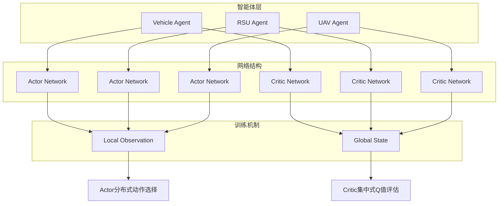

**图示来源**
- [maddpg.py](file://algorithms/maddpg.py#L465-L510)
- [maddpg.py](file://algorithms/maddpg.py#L200-L233)

**本节来源**
- [maddpg.py](file://algorithms/maddpg.py#L1-L645)

## 核心组件分析

### MADDPG智能体结构
MADDPG智能体由Actor网络和Critic网络组成，每个智能体拥有独立的网络实例。Actor网络负责根据局部观测选择动作，而Critic网络则利用全局状态信息进行Q值评估。

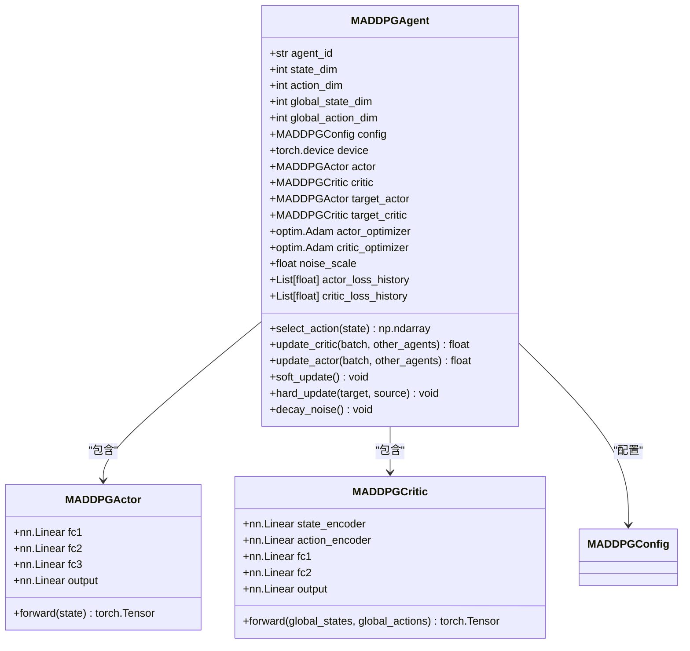

**图示来源**
- [maddpg.py](file://algorithms/maddpg.py#L55-L88)
- [maddpg.py](file://algorithms/maddpg.py#L91-L138)
- [maddpg.py](file://algorithms/maddpg.py#L200-L233)

**本节来源**
- [maddpg.py](file://algorithms/maddpg.py#L55-L138)
- [maddpg.py](file://algorithms/maddpg.py#L200-L233)

### 经验回放缓冲区
MADDPG使用专门设计的经验回放缓冲区来存储多智能体的交互经验，支持按批次采样用于训练。

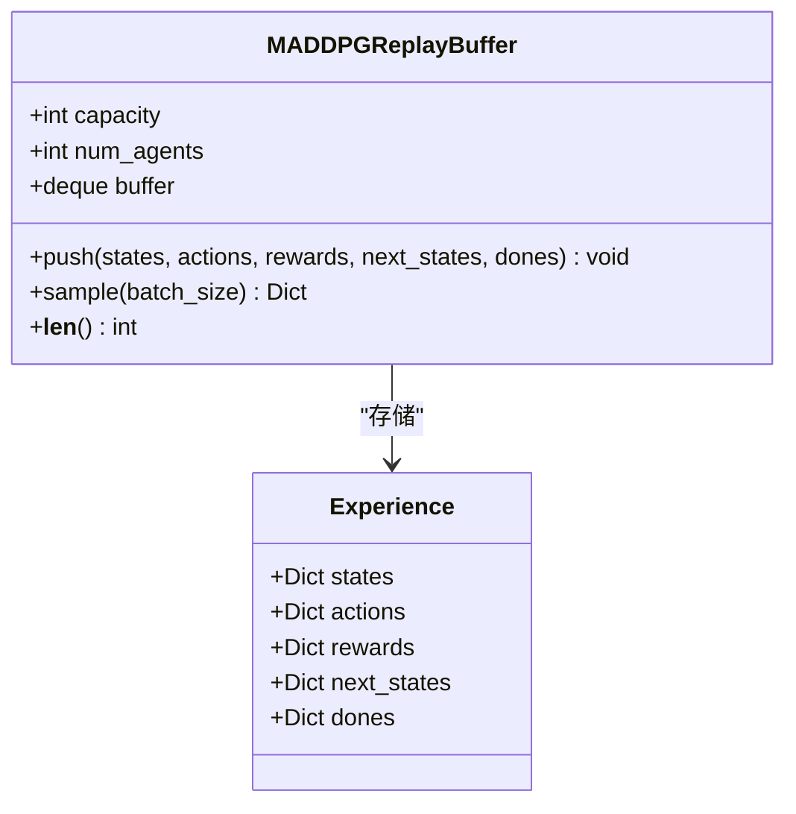

**图示来源**
- [maddpg.py](file://algorithms/maddpg.py#L141-L194)

**本节来源**
- [maddpg.py](file://algorithms/maddpg.py#L141-L194)

## 集中式训练-分布式执行机制

### 批次数据处理流程
MADDPG通过特定的数据处理函数将分散的智能体经验整合为全局状态和动作，支持Critic网络的集中式评估。

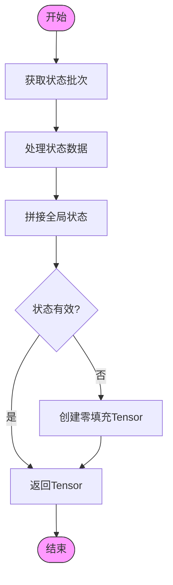

**图示来源**
- [maddpg.py](file://algorithms/maddpg.py#L330-L349)
- [maddpg.py](file://algorithms/maddpg.py#L351-L370)

**本节来源**
- [maddpg.py](file://algorithms/maddpg.py#L330-L370)

### 批次数据处理函数
MADDPG实现了多个辅助函数来处理批次数据，包括获取全局状态、全局动作和目标动作。

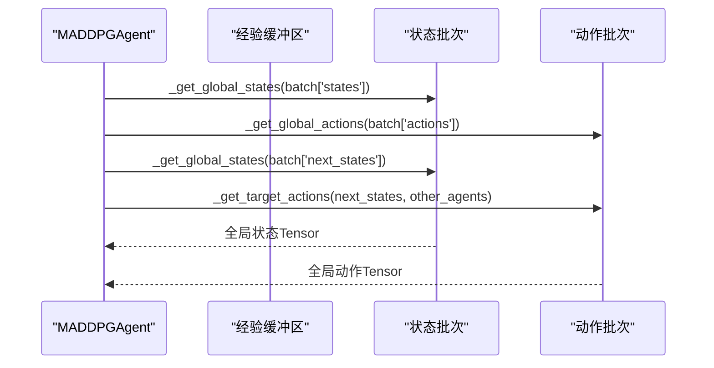

**图示来源**
- [maddpg.py](file://algorithms/maddpg.py#L330-L349)
- [maddpg.py](file://algorithms/maddpg.py#L351-L370)
- [maddpg.py](file://algorithms/maddpg.py#L372-L404)

**本节来源**
- [maddpg.py](file://algorithms/maddpg.py#L330-L404)

## 状态与动作空间设计

### 基础节点状态向量
车辆、RSU和UAV节点的状态空间设计遵循统一的特征提取原则，确保智能体能够获取必要的环境信息。

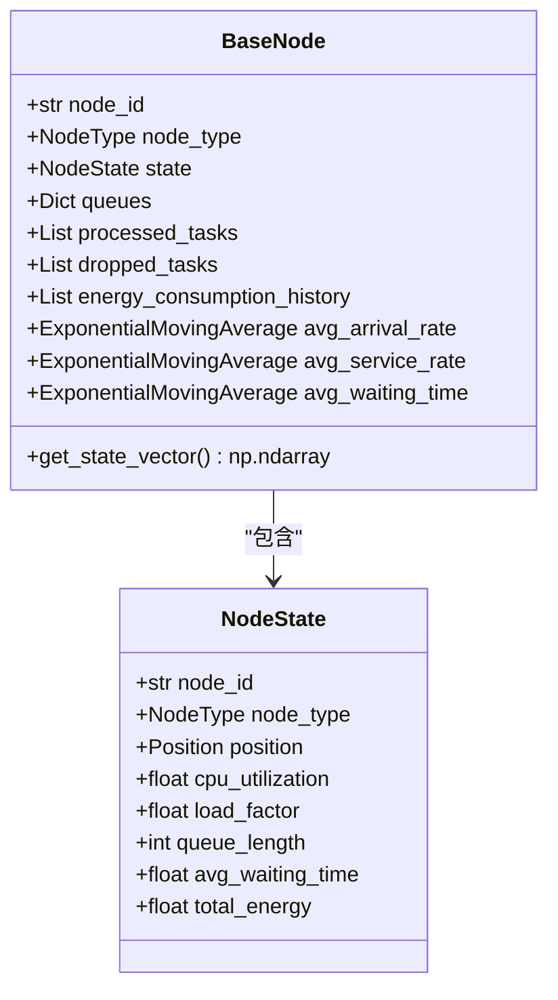

**图示来源**
- [base_node.py](file://models/base_node.py#L18-L312)

**本节来源**
- [base_node.py](file://models/base_node.py#L18-L312)

### 状态特征构成
节点状态向量由多个关键性能指标组成，经过归一化处理后作为强化学习的输入。

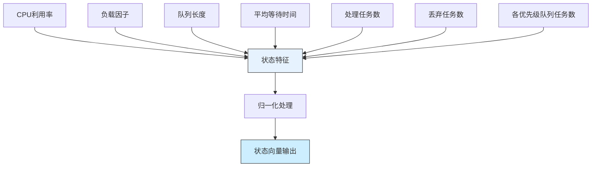

**图示来源**
- [base_node.py](file://models/base_node.py#L294-L312)

**本节来源**
- [base_node.py](file://models/base_node.py#L294-L312)

## 训练过程与策略梯度计算

### 训练步骤流程
MADDPG的训练过程在一个统一的train_step方法中完成，包括经验存储、采样和网络更新。

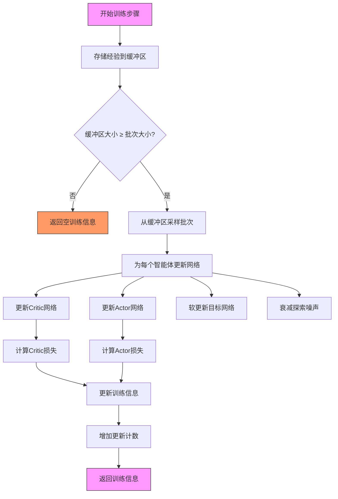

**图示来源**
- [maddpg.py](file://algorithms/maddpg.py#L548-L588)

**本节来源**
- [maddpg.py](file://algorithms/maddpg.py#L548-L588)

### Critic网络更新
Critic网络的更新过程涉及目标Q值的计算和均方误差损失的优化。

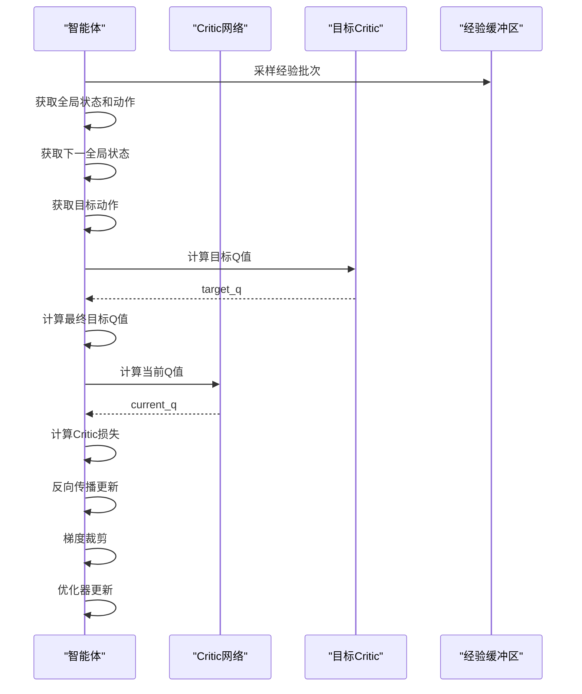

**图示来源**
- [maddpg.py](file://algorithms/maddpg.py#L258-L288)

**本节来源**
- [maddpg.py](file://algorithms/maddpg.py#L258-L288)

### Actor网络更新
Actor网络的更新基于策略梯度方法，通过最大化Q值来优化策略。

```mermaid
sequenceDiagram
participant Agent as "智能体"
participant Actor as "Actor网络"
participant Critic as "Critic网络"
participant Buffer as "经验缓冲区"
Agent->>Buffer : 获取状态批次
Agent->>Actor : 计算新动作
Actor-->>Agent : actions
Agent->>Agent : 构建全局动作
Agent->>Agent : 获取全局状态
Agent->>Critic : 评估Q值
Critic-->>Agent : Q值
Agent->>Agent : 计算Actor损失
Agent->>Agent : 反向传播更新
Agent->>Agent : 梯度裁剪
Agent->>Agent : 优化器更新
```

**图示来源**
- [maddpg.py](file://algorithms/maddpg.py#L290-L313)

**本节来源**
- [maddpg.py](file://algorithms/maddpg.py#L290-L313)

## 探索噪声与奖励分配

### 统一奖励计算器
系统采用统一的奖励计算模块，确保所有算法使用一致的奖励逻辑。

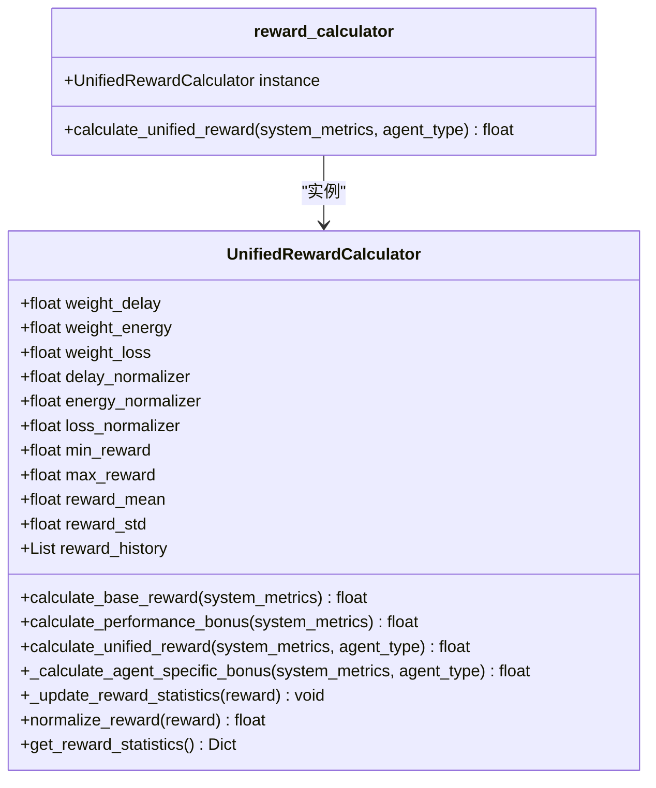

**图示来源**
- [reward_calculator.py](file://utils/reward_calculator.py#L1-L244)

**本节来源**
- [reward_calculator.py](file://utils/reward_calculator.py#L1-L244)

### 奖励计算流程
奖励计算遵循分层结构，从基础成本到性能奖励再到智能体特定奖励。

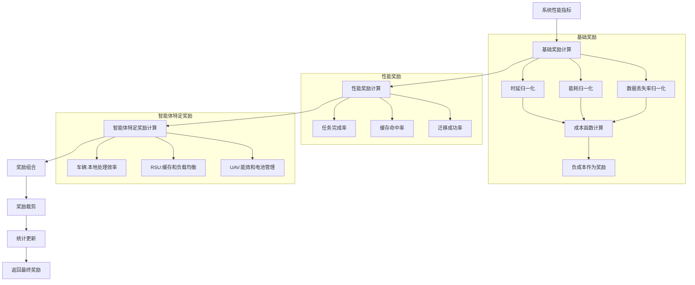

**图示来源**
- [reward_calculator.py](file://utils/reward_calculator.py#L103-L133)

**本节来源**
- [reward_calculator.py](file://utils/reward_calculator.py#L103-L133)

## 训练技巧与实践建议

### 噪声衰减策略
MADDPG采用指数衰减的探索噪声策略，平衡探索与利用。

```mermaid
flowchart TD
A[初始噪声尺度] --> B{训练中?}
B --> |是| C[生成高斯噪声]
C --> D[添加到动作]
D --> E[裁剪动作到[-1,1]]
E --> F[执行动作]
F --> G[衰减噪声]
G --> H[noise_scale = max(min_noise, noise_scale * noise_decay)]
H --> B
B --> |否| I[直接执行确定性动作]
I --> J[结束]
style A fill:#f9f,stroke:#333
style J fill:#f9f,stroke:#333
```

**图示来源**
- [maddpg.py](file://algorithms/maddpg.py#L432-L435)

**本节来源**
- [maddpg.py](file://algorithms/maddpg.py#L432-L435)

### 模型保存与加载
MADDPG提供了完整的模型持久化功能，支持训练中断后的恢复。

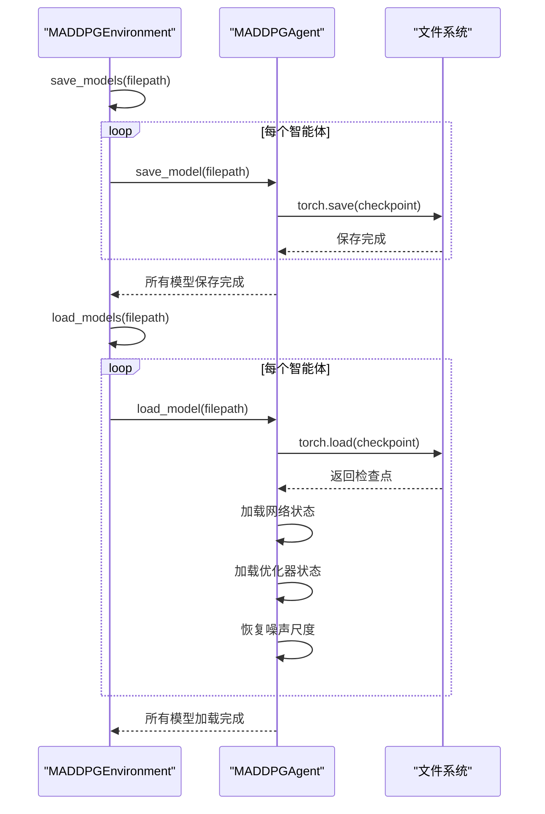

**图示来源**
- [maddpg.py](file://algorithms/maddpg.py#L437-L459)
- [maddpg.py](file://algorithms/maddpg.py#L590-L605)

**本节来源**
- [maddpg.py](file://algorithms/maddpg.py#L437-L459)
- [maddpg.py](file://algorithms/maddpg.py#L590-L605)

## MADDPG与MATD3对比分析
MADDPG与MATD3在稳定性与样本效率方面存在显著差异。MADDPG作为基础的多智能体DDPG算法，实现相对简单但可能面临训练不稳定的问题。MATD3通过引入双Critic网络和延迟策略更新等机制，提高了训练的稳定性和样本效率。在高动态车联网环境中，MATD3通常表现出更好的性能，但计算开销也相应增加。选择哪种算法需要根据具体应用场景的稳定性要求和计算资源约束进行权衡。

**本节来源**
- [maddpg.py](file://algorithms/maddpg.py#L1-L645)

## 结论
MADDPG算法通过集中式训练-分布式执行的架构，有效解决了车辆-RSU-UAV协同系统中的多智能体决策问题。其核心优势在于Critic网络能够利用全局状态信息进行更准确的价值评估，而Actor网络仅依赖局部观测进行动作选择，保证了执行的分布式特性。通过合理的状态空间设计、探索噪声策略和奖励分配机制，MADDPG能够在高动态车联网环境中实现有效的协同决策。然而，与MATD3等改进算法相比，MADDPG在训练稳定性和样本效率方面仍有提升空间，未来可考虑引入更先进的算法变体以进一步优化性能。