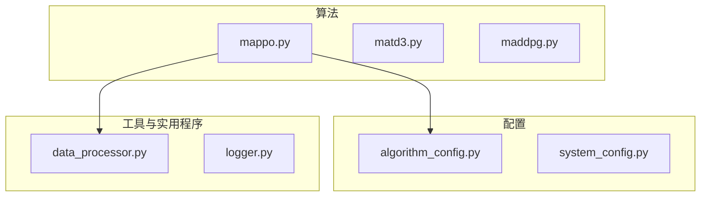
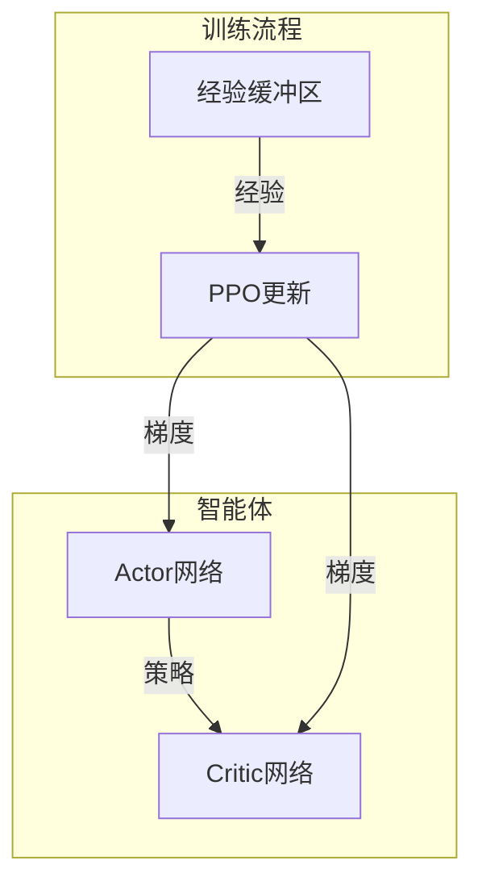
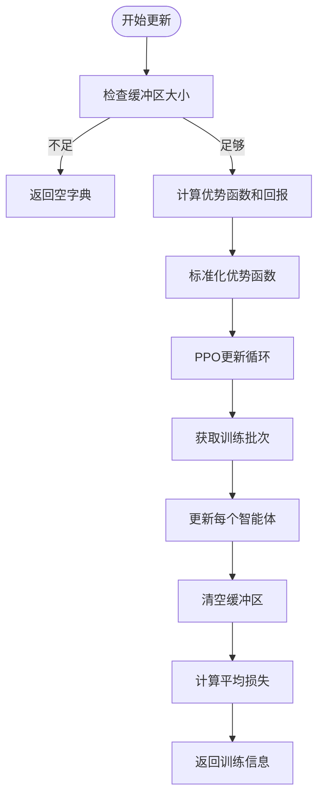
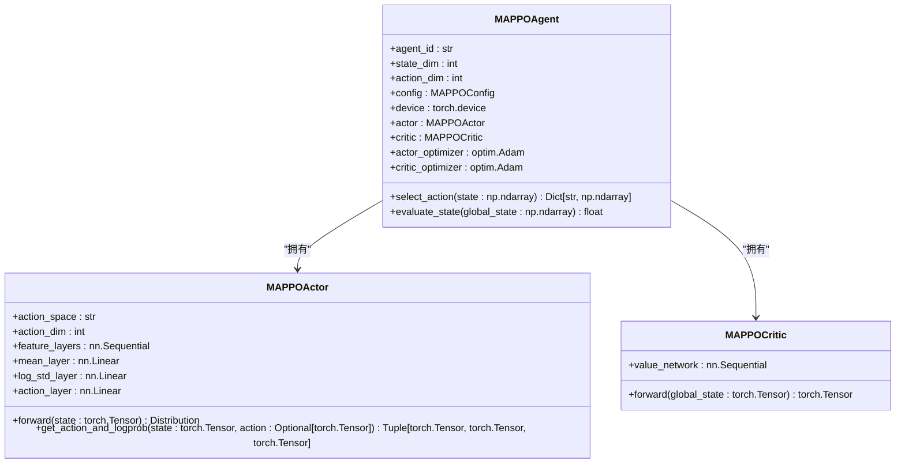
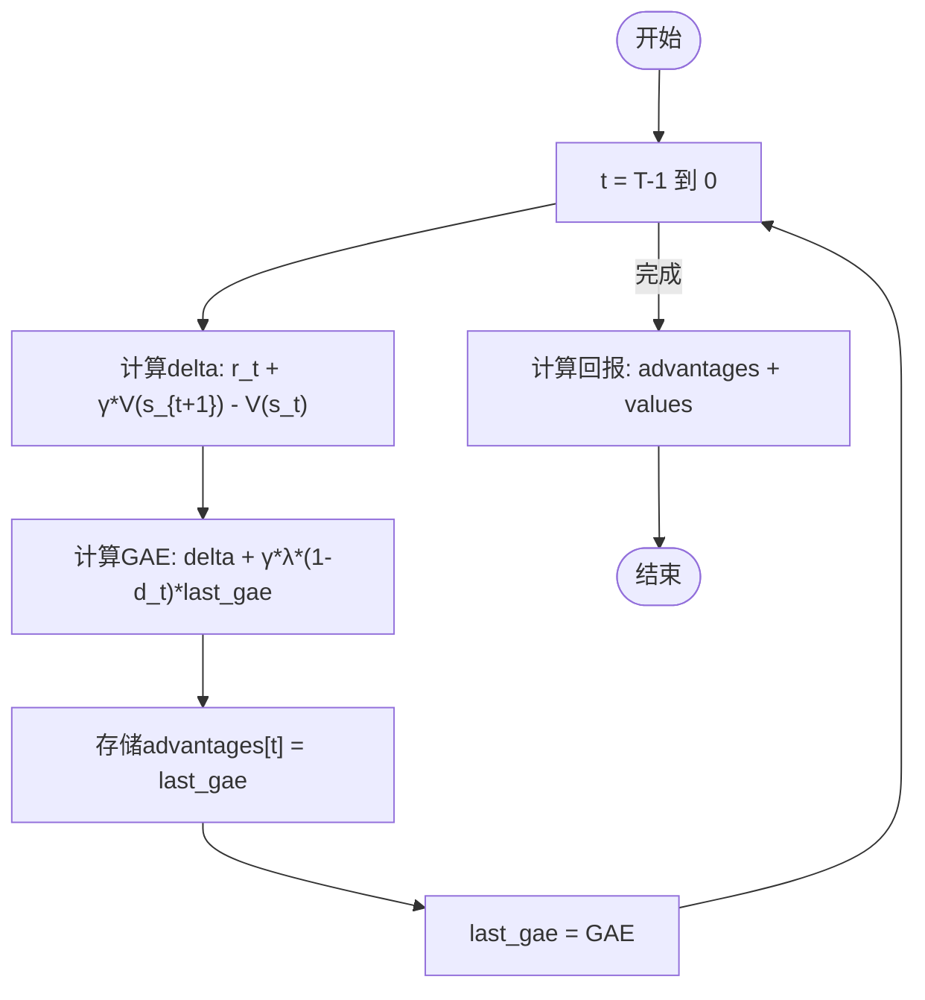
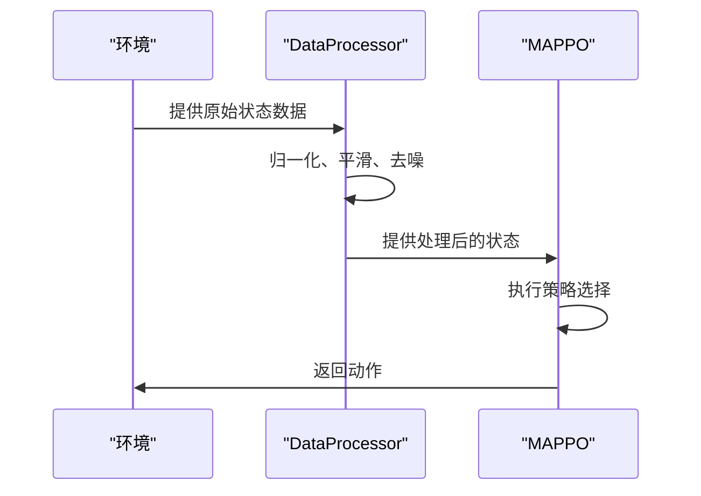
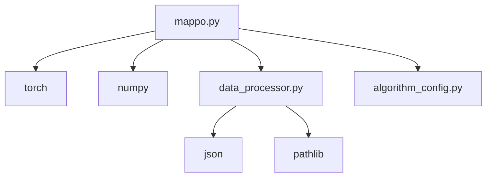

# MAPPO变体实现

<cite>
**本文档引用的文件**   
- [mappo.py](file://algorithms/mappo.py)
- [algorithm_config.py](file://config/algorithm_config.py)
- [data_processor.py](file://utils/data_processor.py)
</cite>

## 目录
1. [引言](#引言)
2. [项目结构](#项目结构)
3. [核心组件](#核心组件)
4. [架构概述](#架构概述)
5. [详细组件分析](#详细组件分析)
6. [依赖分析](#依赖分析)
7. [性能考虑](#性能考虑)
8. [故障排除指南](#故障排除指南)
9. [结论](#结论)

## 引言
本文档详细描述了MAPPO（Multi-Agent Proximal Policy Optimization）算法在`algorithms/mappo.py`中的实现方式，重点说明其作为近端策略优化在多智能体环境下的扩展机制。文档涵盖了策略更新稳定性、优势函数估计、超参数配置、状态预处理协同、与其它多智能体算法的对比以及在任务卸载场景下的训练实践。

## 项目结构
本项目采用模块化设计，将算法、配置、模型、工具和实用程序分离。核心的MAPPO实现位于`algorithms`目录下，其配置由`config`模块管理，而数据预处理功能则由`utils`模块提供。

**图源**
- [mappo.py](file://algorithms/mappo.py#L1-L50)
- [algorithm_config.py](file://config/algorithm_config.py#L1-L10)
- [data_processor.py](file://utils/data_processor.py#L1-L10)

**节源**
- [mappo.py](file://algorithms/mappo.py#L1-L100)
- [config/algorithm_config.py](file://config/algorithm_config.py#L1-L20)
- [utils/data_processor.py](file://utils/data_processor.py#L1-L20)

## 核心组件
MAPPO的核心组件包括`MAPPOEnvironment`、`MAPPOAgent`、`MAPPOActor`、`MAPPOCritic`和`MAPPOBuffer`。这些组件共同实现了集中式训练、分布式执行的多智能体强化学习框架。`MAPPOActor`和`MAPPOCritic`分别负责策略和价值估计，而`MAPPOBuffer`则用于存储和处理经验回放数据。

**节源**
- [mappo.py](file://algorithms/mappo.py#L100-L587)

## 架构概述
MAPPO的架构遵循Actor-Critic框架，其中每个智能体拥有独立的Actor网络，而Critic网络则是集中式的，能够访问全局状态信息。这种设计允许在训练时利用全局信息来稳定学习过程，同时在执行时保持分布式决策的灵活性。

**图源**
- [mappo.py](file://algorithms/mappo.py#L1-L587)

## 详细组件分析

### MAPPO更新机制分析
MAPPO的更新机制是其核心，通过`update`方法在每个episode结束后执行。该方法首先计算优势函数和回报，然后进行多轮PPO更新，每轮从缓冲区中采样一个批次的数据来更新所有智能体的网络。

#### 更新流程

**图源**
- [mappo.py](file://algorithms/mappo.py#L451-L498)

#### 策略更新

**图源**
- [mappo.py](file://algorithms/mappo.py#L100-L587)

**节源**
- [mappo.py](file://algorithms/mappo.py#L451-L543)

### 优势函数估计分析
MAPPO使用广义优势估计（GAE）来计算优势函数，这有助于减少方差并提高学习稳定性。`compute_advantages_and_returns`方法实现了GAE的计算逻辑。

#### GAE计算流程

**图源**
- [mappo.py](file://algorithms/mappo.py#L222-L254)

**节源**
- [mappo.py](file://algorithms/mappo.py#L222-L254)

### 超参数配置分析
MAPPO的超参数配置通过`MAPPOConfig`数据类定义，并与`config/algorithm_config.py`中的配置系统协同工作。关键超参数包括clip范围、epoch数和批量大小。

#### 超参数表
| 超参数 | 默认值 | 描述 |
| :--- | :--- | :--- |
| `clip_ratio` | 0.2 | PPO策略更新的clip范围 |
| `ppo_epochs` | 4 | 每个episode的PPO更新轮数 |
| `batch_size` | 256 | 每轮更新的样本批次大小 |
| `gamma` | 0.99 | 折扣因子 |
| `gae_lambda` | 0.95 | GAE的λ参数 |
| `normalize_advantages` | True | 是否标准化优势函数 |

**节源**
- [mappo.py](file://algorithms/mappo.py#L50-L85)
- [algorithm_config.py](file://config/algorithm_config.py#L1-L73)

### 状态预处理协同分析
MAPPO与`data_processor.py`中的状态预处理模块协同工作。`DataProcessor`类提供了数据归一化、平滑、去噪等方法，确保输入到MAPPO网络的状态数据是高质量的。

#### 协同流程

**图源**
- [data_processor.py](file://utils/data_processor.py#L11-L188)
- [mappo.py](file://algorithms/mappo.py#L300-L350)

**节源**
- [data_processor.py](file://utils/data_processor.py#L1-L188)
- [mappo.py](file://algorithms/mappo.py#L300-L350)

### 与MATD3/MADDPG的对比分析
MAPPO与基于Actor-Critic架构的MATD3和MADDPG在策略更新方式上存在根本差异。MAPPO使用基于策略梯度的PPO方法，而MATD3和MADDPG使用基于Q-learning的TD3和DDPG方法。

#### 对比表
| 特性 | MAPPO | MATD3 | MADDPG |
| :--- | :--- | :--- | :--- |
| **策略更新** | PPO (基于策略梯度) | TD3 (基于Q-learning) | DDPG (基于Q-learning) |
| **优势函数** | GAE | TD误差 | TD误差 |
| **探索机制** | 隐式 (通过策略分布) | 显式 (目标策略噪声) | 显式 (动作噪声) |
| **更新频率** | 多轮 (PPO epochs) | 在线 (每步) | 在线 (每步) |
| **稳定性** | 高 (通过clip机制) | 中 (通过延迟更新) | 低 (易受噪声影响) |

**节源**
- [mappo.py](file://algorithms/mappo.py#L1-L587)
- [matd3.py](file://algorithms/matd3.py#L1-L550)
- [maddpg.py](file://algorithms/maddpg.py#L1-L646)

## 依赖分析
MAPPO的实现依赖于多个外部模块和内部组件。主要依赖包括PyTorch用于神经网络和张量计算，NumPy用于数值计算，以及项目内部的`data_processor`和`algorithm_config`模块。

**图源**
- [mappo.py](file://algorithms/mappo.py#L1-L50)
- [data_processor.py](file://utils/data_processor.py#L1-L10)

**节源**
- [mappo.py](file://algorithms/mappo.py#L1-L587)
- [data_processor.py](file://utils/data_processor.py#L1-L188)
- [algorithm_config.py](file://config/algorithm_config.py#L1-L73)

## 性能考虑
MAPPO的性能考虑包括使用GPU加速计算、优化的批次大小以及梯度裁剪。`tools.performance_optimization`模块提供了优化的批次大小，以提高GPU利用率。

**节源**
- [mappo.py](file://algorithms/mappo.py#L1-L50)
- [mappo.py](file://algorithms/mappo.py#L500-L543)

## 故障排除指南
在使用MAPPO时可能遇到的常见问题包括训练不稳定、收敛缓慢和过拟合。建议的解决方案包括调整`clip_ratio`、增加`ppo_epochs`或使用更大的`batch_size`。

**节源**
- [mappo.py](file://algorithms/mappo.py#L451-L498)
- [mappo.py](file://algorithms/mappo.py#L500-L543)

## 结论
MAPPO在多智能体环境中表现出色，其基于clip机制的策略更新和GAE优势函数估计提供了稳定的训练过程。通过与`data_processor`模块的协同工作，MAPPO能够处理复杂的任务卸载场景。与MATD3和MADDPG相比，MAPPO在策略更新的稳定性和样本效率方面具有优势。