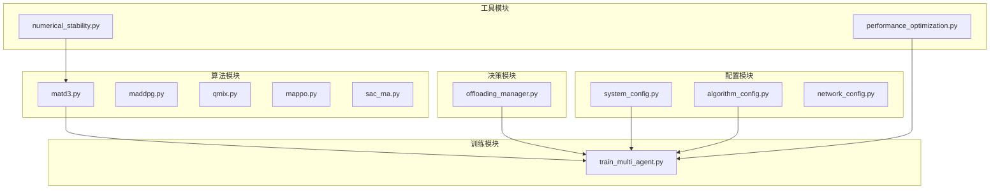
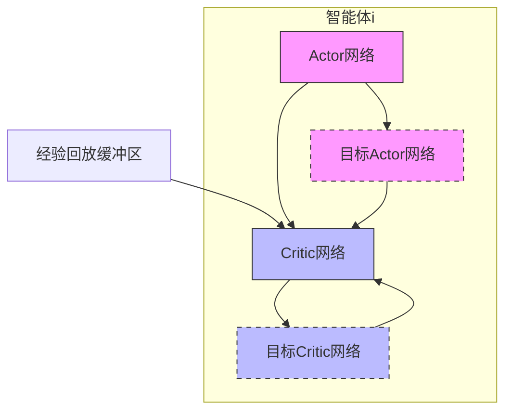
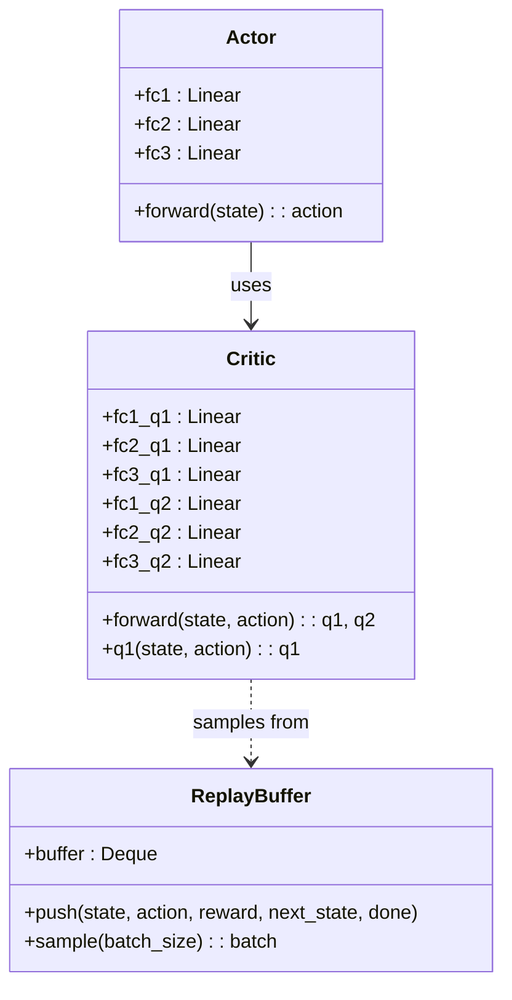
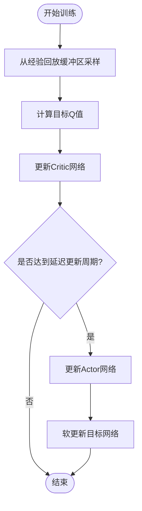
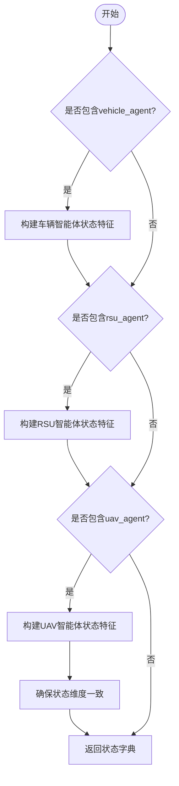
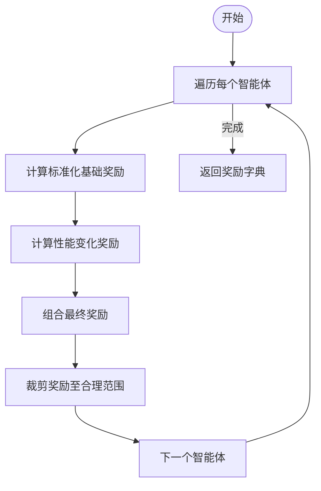
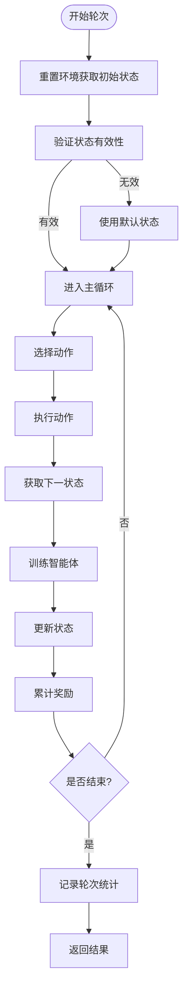
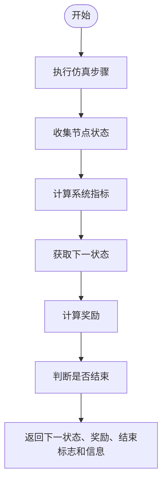

# MATD3算法实现

<cite>
**本文档引用的文件**  
- [matd3.py](file://algorithms/matd3.py)
- [train_multi_agent.py](file://train_multi_agent.py)
- [numerical_stability.py](file://utils/numerical_stability.py)
- [offloading_manager.py](file://decision/offloading_manager.py)
- [system_config.py](file://config/system_config.py)
- [algorithm_config.py](file://config/algorithm_config.py)
</cite>

## 目录
1. [引言](#引言)
2. [项目结构](#项目结构)
3. [核心组件](#核心组件)
4. [架构概述](#架构概述)
5. [详细组件分析](#详细组件分析)
6. [依赖分析](#依赖分析)
7. [性能考量](#性能考量)
8. [故障排除指南](#故障排除指南)
9. [结论](#结论)

## 引言
本文档深入分析MATD3（Multi-Agent Twin Delayed Deep Deterministic Policy Gradient）算法在车联网任务卸载场景中的具体实现。文档详细解释了其双延迟机制如何缓解Q值过高估计问题，分析了目标策略网络的软更新策略与延迟更新机制对训练稳定性的影响。同时描述了分布式执行架构中每个智能体独立决策的过程，并结合训练流程说明批量训练、经验回放和目标网络同步的实现方式。此外，文档还提供了网络结构设计图示、损失函数公式推导、超参数配置建议，并引用了数值稳定性技术以提升训练过程的鲁棒性。

## 项目结构
本项目采用模块化设计，主要包含算法实现、决策逻辑、配置管理、训练流程和工具组件等部分。核心算法位于`algorithms/`目录下，其中`matd3.py`实现了MATD3多智能体强化学习算法。决策逻辑由`decision/offloading_manager.py`负责，处理任务分类与卸载决策。配置信息分散在`config/`目录下的多个文件中，包括系统参数、任务生成规则和通信模型等。训练流程由`train_multi_agent.py`控制，支持多种算法的比较实验。工具类函数则分布在`utils/`和`tools/`目录中，提供性能优化、日志记录和数值稳定性保障等功能。



**图源**  
- [matd3.py](file://algorithms/matd3.py)
- [train_multi_agent.py](file://train_multi_agent.py)
- [offloading_manager.py](file://decision/offloading_manager.py)
- [system_config.py](file://config/system_config.py)
- [algorithm_config.py](file://config/algorithm_config.py)
- [numerical_stability.py](file://utils/numerical_stability.py)

**本节来源**  
- [algorithms/matd3.py](file://algorithms/matd3.py)
- [train_multi_agent.py](file://train_multi_agent.py)
- [offloading_manager.py](file://decision/offloading_manager.py)
- [config/system_config.py](file://config/system_config.py)
- [config/algorithm_config.py](file://config/algorithm_config.py)
- [utils/numerical_stability.py](file://utils/numerical_stability.py)

## 核心组件
MATD3算法的核心组件包括Actor网络、Critic网络、经验回放缓冲区和多智能体环境管理器。Actor网络负责生成确定性策略，输出动作向量；Critic网络采用双Q网络结构评估状态-动作值，有效缓解Q值过高估计问题；经验回放缓冲区存储智能体与环境交互的历史数据，用于打破样本间的相关性；多智能体环境管理器协调多个智能体的状态观测、动作执行和奖励计算，实现分布式决策。

**本节来源**  
- [algorithms/matd3.py](file://algorithms/matd3.py#L1-L549)

## 架构概述
MATD3算法采用中心化训练与分布式执行的架构。在训练阶段，每个智能体拥有独立的Actor和Critic网络，通过共享的经验回放缓冲区进行学习。Critic网络使用双延迟机制，即延迟更新Actor网络并采用两个独立的Q网络取最小值作为目标Q值，从而减少过估计偏差。目标网络通过软更新策略逐步逼近主网络，增强了训练的稳定性。在执行阶段，各智能体根据本地观测状态独立选择动作，无需依赖其他智能体的信息。



**图源**  
- [algorithms/matd3.py](file://algorithms/matd3.py#L16-L115)

## 详细组件分析

### MATD3Agent分析
`MATD3Agent`类是MATD3算法的核心实现，封装了Actor和Critic网络的定义、训练逻辑和经验回放机制。该类通过`select_action`方法选择动作，引入高斯噪声以增强探索能力；通过`train`方法执行训练步骤，包括Critic网络更新和延迟的Actor网络更新；通过`_soft_update`方法实现目标网络的软更新，确保训练过程平稳收敛。

#### 网络结构图


**图源**  
- [algorithms/matd3.py](file://algorithms/matd3.py#L16-L115)

#### 训练流程图


**图源**  
- [algorithms/matd3.py](file://algorithms/matd3.py#L163-L223)

**本节来源**  
- [algorithms/matd3.py](file://algorithms/matd3.py#L116-L223)

### MATD3Environment分析
`MATD3Environment`类管理多个智能体的协同训练过程。它负责构建每个智能体的状态向量、计算奖励信号以及协调所有智能体的训练步骤。状态向量融合了系统级指标（如平均时延、能耗）和节点级特征（如车辆负载、RSU可用性），使智能体能够感知全局环境变化。奖励函数采用标准化设计，结合基础奖励和性能变化奖励，激励智能体持续优化系统性能。

#### 状态向量构建流程


**图源**  
- [algorithms/matd3.py](file://algorithms/matd3.py#L289-L408)

#### 奖励计算流程


**图源**  
- [algorithms/matd3.py](file://algorithms/matd3.py#L410-L434)

**本节来源**  
- [algorithms/matd3.py](file://algorithms/matd3.py#L224-L434)

### 训练流程分析
`train_multi_agent.py`脚本实现了MATD3算法的完整训练流程。该脚本初始化多智能体训练环境，运行多个训练轮次，在每个轮次中执行环境重置、动作选择、环境交互、经验存储和网络更新等步骤。训练过程中定期评估模型性能，并保存最佳模型参数。通过配置文件灵活调整超参数，支持不同算法的对比实验。

#### 训练轮次执行流程


**图源**  
- [train_multi_agent.py](file://train_multi_agent.py#L475-L623)

#### 环境交互流程


**图源**  
- [train_multi_agent.py](file://train_multi_agent.py#L237-L300)

**本节来源**  
- [train_multi_agent.py](file://train_multi_agent.py#L1-L799)

### 数值稳定性分析
`utils/numerical_stability.py`模块提供了一系列数值稳定性保障函数，用于防止训练过程中出现除零、溢出、NaN或无穷值等问题。这些函数包括安全除法、安全平方根、安全对数、安全指数运算等，确保所有数学运算都在合理范围内进行。此外，还提供了数值健康检查和自动修复机制，进一步增强了系统的鲁棒性。

#### 数值稳定性函数
```mermaid
classDiagram
    class NumericalStabilityMonitor {
        +warning_count : int
        +error_count : int
        +check_and_fix(value, name, validator_func) : float
        +get_statistics() : dict
    }
    
    class SafeOperations {
        +safe_divide(numerator, denominator, default) : float
        +safe_sqrt(value) : float
        +