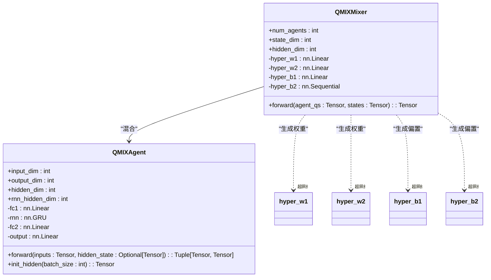
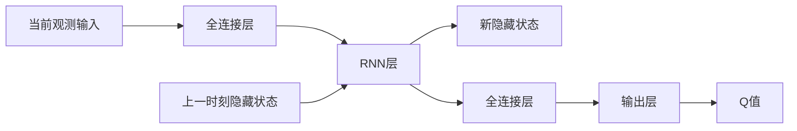
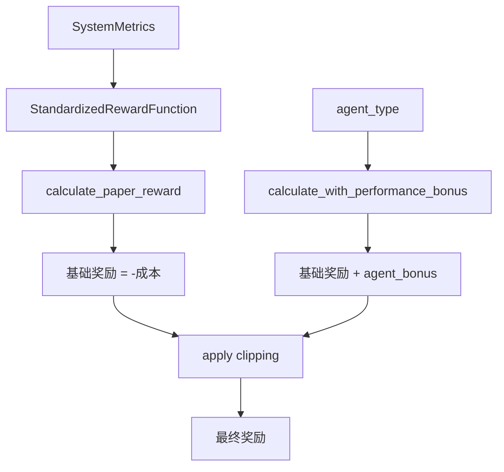
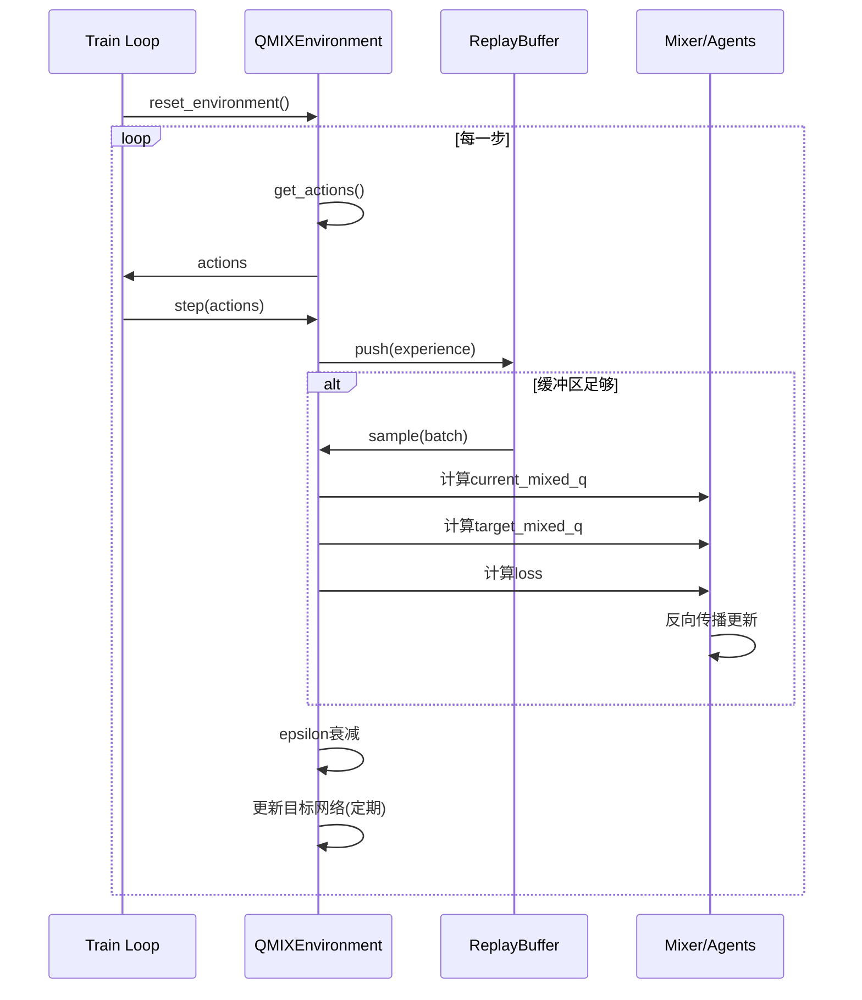

# QMIX网络结构

<cite>
**本文档引用的文件**   
- [qmix.py](file://algorithms/qmix.py)
- [data_structures.py](file://models/data_structures.py)
- [standardized_reward.py](file://utils/standardized_reward.py)
- [train_multi_agent.py](file://train_multi_agent.py)
</cite>

## 目录
1. [引言](#引言)
2. [核心组件分析](#核心组件分析)
3. [单调混合网络与超网络机制](#单调混合网络与超网络机制)
4. [部分可观测环境适应性设计](#部分可观测环境适应性设计)
5. [标准化奖励函数集成](#标准化奖励函数集成)
6. [训练流程与优化策略](#训练流程与优化策略)
7. [可扩展性分析与优化方向](#可扩展性分析与优化方向)
8. [结论](#结论)

## 引言
QMIX（Monotonic Value Function Factorisation）是一种用于深度多智能体强化学习的值函数分解算法，其核心思想是通过一个单调混合网络将个体智能体的Q值整合为全局Q值，同时保证动作单调性约束，从而确保联合策略的最优性。本系统中的QMIX实现专为车联网（VEC）环境设计，支持车辆（vehicle）、路侧单元（RSU）和无人机（UAV）三类智能体的协同决策。算法采用集中式训练、分布式执行（CTDE）范式，通过超网络（hypernetwork）动态生成混合权重，增强了对全局状态的协调能力。本文档将深入剖析`algorithms/qmix.py`中的实现原理，并结合`models/data_structures.py`、`utils/standardized_reward.py`和`train_multi_agent.py`等模块，全面阐述其架构、训练流程及在大规模车联网中的应用潜力。

## 核心组件分析

QMIX算法的实现由多个核心组件构成，包括个体智能体网络（QMIXAgent）、混合网络（QMIXMixer）、经验回放缓冲区（QMIXReplayBuffer）和主环境控制器（QMIXEnvironment）。个体智能体网络采用RNN结构处理部分可观测信息，每个智能体根据自身观测状态输出动作的Q值。混合网络作为QMIX的核心，接收所有个体Q值和全局状态，通过超网络生成的权重进行非线性混合，输出全局Q值。经验回放缓冲区存储包含全局状态的多智能体经验，支持优先经验回放。主环境控制器负责协调所有组件，管理训练流程，包括ε-贪婪探索、目标网络更新和模型持久化。

**Section sources**
- [qmix.py](file://algorithms/qmix.py#L54-L139)
- [qmix.py](file://algorithms/qmix.py#L142-L194)
- [qmix.py](file://algorithms/qmix.py#L197-L257)
- [qmix.py](file://algorithms/qmix.py#L260-L598)

## 单调混合网络与超网络机制

### 单调混合网络（Monotonic Mixing Network）
QMIX的混合网络（QMIXMixer）是实现值函数分解的关键。其核心原理是将个体Q值的线性组合通过一个单调非递减的函数映射到全局Q值，即 \( Q_{tot} = f(\mathbf{Q}, \mathbf{s}) \)，其中 \( \frac{\partial f}{\partial Q_i} \geq 0 \)。这一单调性约束确保了最大化全局Q值的联合动作也必然最大化每个个体的Q值，从而保证了最优策略的一致性。

在代码实现中，该网络通过一个两层的神经网络结构实现：
1.  **第一层**: 输入个体Q值向量 \( \mathbf{Q} \)（形状为 `[batch_size, num_agents]`）和全局状态 \( \mathbf{s} \)（形状为 `[batch_size, state_dim]`）。超网络 `hyper_w1` 和 `hyper_b1` 分别生成第一层的权重矩阵 \( \mathbf{W}_1 \) 和偏置向量 \( \mathbf{b}_1 \)。
2.  **单调性保证**: 通过 `torch.abs()` 对 `hyper_w1` 的输出取绝对值，强制权重 \( \mathbf{W}_1 \) 为正，这是保证单调性的关键步骤。
3.  **第一层计算**: 计算隐藏层输出 \( \mathbf{h} = \text{ELU}(\mathbf{Q} \mathbf{W}_1 + \mathbf{b}_1) \)。
4.  **第二层**: 超网络 `hyper_w2` 和 `hyper_b2` 生成第二层的权重向量 \( \mathbf{w}_2 \) 和偏置标量 \( b_2 \)。同样，`hyper_w2` 的输出也取绝对值得到正权重。
5.  **第二层计算**: 全局Q值为 \( Q_{tot} = \mathbf{h} \cdot \mathbf{w}_2 + b_2 \)。

**Diagram sources**
- [qmix.py](file://algorithms/qmix.py#L142-L194)

### 超网络（Hypernetwork）机制
超网络是QMIX实现动态权重生成的核心创新。它本身是一个小型神经网络，其输入是全局状态 \( \mathbf{s} \)，输出是混合网络中各层的权重和偏置参数。这种设计使得混合网络的参数不再是固定的，而是根据当前的全局环境状态动态调整。

-   **权重生成**: `hyper_w1(state)` 输出一个长度为 `num_agents * hidden_dim` 的向量，该向量被重塑为 `[batch_size, num_agents, hidden_dim]` 的权重矩阵 \( \mathbf{W}_1 \)。`hyper_w2(state)` 输出一个长度为 `hidden_dim` 的向量，作为第二层的权重 \( \mathbf{w}_2 \)。
-   **偏置生成**: `hyper_b1(state)` 直接输出第一层的偏置 \( \mathbf{b}_1 \)。`hyper_b2(state)` 是一个包含ReLU激活的序列网络，输出最终的偏置 \( b_2 \)，这增加了偏置生成的非线性能力。

这种机制极大地增强了QMIX的全局协调能力。例如，当全局状态显示网络负载很高时，超网络可以生成权重，使得混合网络更倾向于选择能降低系统能耗的动作；当任务延迟很高时，则更倾向于选择能减少延迟的动作。这使得QMIX能够根据环境变化灵活地调整智能体间的协作策略。

**Section sources**
- [qmix.py](file://algorithms/qmix.py#L142-L194)
- [qmix.py](file://algorithms/qmix.py#L164-L194)

## 部分可观测环境适应性设计

在车联网等复杂环境中，单个智能体（如车辆）无法观测到全局完整信息，这构成了部分可观测马尔可夫决策过程（POMDP）。QMIX通过结合RNN和全局状态信息来解决这一挑战。

### 个体智能体的RNN结构
每个 `QMIXAgent` 都包含一个GRU（门控循环单元）层，用于处理时间序列信息。RNN能够维护一个隐藏状态（`hidden_state`），该状态编码了过去观测的历史信息。在每一步，智能体将当前的观测输入与上一时刻的隐藏状态结合，通过RNN更新得到新的隐藏状态和Q值。这使得智能体能够基于历史信息进行决策，弥补了单步观测的不足。

**Diagram sources**
- [qmix.py](file://algorithms/qmix.py#L54-L139)

### 联合状态表示
`models/data_structures.py` 中定义了 `NodeState` 和 `SystemMetrics` 等数据结构，它们共同构成了智能体的观测和全局状态。

-   **个体观测状态**: 每个智能体的观测状态由 `get_state_vector` 方法构建。它包含两部分：
    1.  **基础系统状态**: 来自 `SystemMetrics` 的全局指标，如平均任务延迟、总能耗、数据丢失率、缓存命中率和迁移成功率。这些信息通过归一化后作为所有智能体共享的观测。
    2.  **智能体特定状态**: 如车辆的位置、速度、任务队列长度；RSU的缓存利用率、队列长度；UAV的三维位置、缓存利用率等。这些信息反映了智能体自身的局部状况。

-   **全局状态**: 在训练时，`get_global_state` 方法将所有智能体的状态向量按顺序拼接，形成一个高维的全局状态向量。这个全局状态被输入到混合网络的超网络中，以生成动态的混合权重。

这种设计使得每个智能体虽然只能观测到自己的状态和部分全局信息，但QMIX的集中式训练过程利用全局状态来指导混合网络，从而学习到一个协调的策略，有效适应了部分可观测环境。

**Section sources**
- [qmix.py](file://algorithms/qmix.py#L384-L411)
- [data_structures.py](file://models/data_structures.py#L156-L201)
- [data_structures.py](file://models/data_structures.py#L248-L321)

## 标准化奖励函数集成

为了确保多智能体间奖励的一致性，系统实现了标准化的奖励函数。`utils/standardized_reward.py` 中的 `StandardizedRewardFunction` 严格遵循论文中的目标函数。

### 奖励函数设计
奖励函数的计算公式为：`reward = -cost`，其中成本函数 `cost` 定义为：
`cost = ω_T * normalized_delay + ω_E * normalized_energy + ω_D * normalized_loss`

-   **归一化**: 为了消除不同指标量纲的影响，系统对各项指标进行归一化处理。例如，平均延迟除以 `delay_normalizer=1.0`，总能耗除以 `energy_normalizer=1000.0`。
-   **权重配置**: 权重 `ω_T`, `ω_E`, `ω_D` 从配置文件 `config` 中读取，确保所有算法使用相同的优化目标。
-   **数值稳定性**: 奖励值被限制在 `[-10.0, 5.0]` 的范围内，防止梯度爆炸。

### 多智能体奖励分配
在 `train_multi_agent.py` 的 `MultiAgentTrainingEnvironment` 类中，`_calculate_rewards` 方法为每个智能体计算奖励。虽然全局奖励是统一的（基于 `SystemMetrics`），但该函数支持为不同类型的智能体（`vehicle_agent`, `rsu_agent`, `uav_agent`）添加轻量级的性能激励（如本地处理效率、负载均衡、电池电量），以鼓励特定行为，同时不干扰主要的优化目标。

**Diagram sources**
- [standardized_reward.py](file://utils/standardized_reward.py#L11-L98)
- [train_multi_agent.py](file://train_multi_agent.py#L459-L473)

**Section sources**
- [standardized_reward.py](file://utils/standardized_reward.py#L36-L67)
- [train_multi_agent.py](file://train_multi_agent.py#L302-L457)

## 训练流程与优化策略

QMIX的训练流程在 `train_multi_agent.py` 的 `MultiAgentTrainingEnvironment` 类中实现，其特有的流程如下：

### 训练流程
1.  **环境重置**: `reset_environment` 方法重置仿真器，并为QMIX算法调用 `reset_hidden_states` 以清空RNN的隐藏状态。
2.  **动作选择**: `get_actions` 方法中，每个智能体根据当前观测和隐藏状态计算Q值，并采用ε-贪婪策略选择动作。
3.  **执行与经验存储**: `step` 方法执行动作，仿真器推进一步，计算新的系统状态和奖励。`train_step` 方法将经验（包括全局状态）存入 `QMIXReplayBuffer`。
4.  **网络更新**: 当缓冲区经验足够时，`_update_networks` 方法执行以下操作：
    -   **采样**: 从缓冲区随机采样一个批次的经验。
    -   **计算当前Q值**: 使用主网络计算当前状态下的个体Q值，并通过混合网络得到 `current_mixed_q`。
    -   **计算目标Q值**: 使用目标网络计算下一状态下的个体最大Q值，并通过目标混合网络得到 `target_mixed_q`。
    -   **计算目标**: `targets = team_rewards + (1 - dones) * gamma * target_mixed_q`。
    -   **计算损失**: 使用均方误差（MSE）损失函数计算 `current_mixed_q` 与 `targets` 之间的损失。
    -   **反向传播**: 通过梯度裁剪（`grad_clip=10.0`）更新主网络和混合网络的参数。
5.  **目标网络更新**: 每隔 `target_update_freq=200` 步，通过硬更新（hard update）将主网络的参数复制到目标网络。

### 优化策略
-   **优先经验回放**: 虽然代码中使用了标准的 `deque` 缓冲区，但其结构支持未来集成优先经验回放（Prioritized Experience Replay），通过为高TD误差的经验赋予更高采样概率来加速学习。
-   **超参数调优**: 关键超参数包括学习率（`lr=5e-4`）、折扣因子（`gamma=0.99`）、探索率衰减（`epsilon_decay=0.9995`）和混合网络隐藏维度（`mixer_hidden_dim=32`）。建议通过网格搜索或贝叶斯优化进行调优。

**Diagram sources**
- [train_multi_agent.py](file://train_multi_agent.py#L475-L623)
- [qmix.py](file://algorithms/qmix.py#L413-L532)

**Section sources**
- [qmix.py](file://algorithms/qmix.py#L445-L523)
- [train_multi_agent.py](file://train_multi_agent.py#L475-L623)

## 可扩展性分析与优化方向

### 可扩展性限制
尽管QMIX在小规模多智能体系统中表现优异，但在大规模车联网节点协作中面临可扩展性挑战：
1.  **通信开销**: QMIX需要全局状态进行训练，随着节点数量（`num_agents`）增加，全局状态维度呈线性增长，导致通信和计算开销巨大。
2.  **混合网络复杂度**: 混合网络的参数量与智能体数量相关，当智能体数量庞大时，超网络的计算变得非常昂贵。
3.  **经验回放效率**: 经验回放缓冲区存储的是包含所有智能体信息的联合经验，存储和采样效率随智能体数量增加而降低。

### 潜在优化方向
1.  **分层QMIX (Hierarchical QMIX)**: 将大量节点划分为多个子群，每个子群内使用QMIX，再将子群的Q值作为上层QMIX的输入，形成分层结构，降低复杂度。
2.  **基于注意力的混合 (Attention-based Mixing)**: 用注意力机制替代超网络，让智能体根据相关性动态地关注其他智能体的Q值，实现更灵活和可扩展的混合。
3.  **去中心化训练**: 探索完全去中心化的训练方法，减少对中央服务器的依赖和全局状态的传输。
4.  **图神经网络 (GNN)**: 将智能体视为图上的节点，利用GNN聚合邻居信息，使智能体能够基于局部图结构进行决策，天然适应大规模网络。

## 结论
本文档深入剖析了QMIX算法在车联网系统中的实现。其核心在于通过单调混合网络和超网络机制，将个体Q值整合为全局Q值，同时满足动作单调性约束，确保了策略的最优性。算法通过RNN处理部分可观测信息，并结合`SystemMetrics`等数据结构构建联合状态表示，有效适应了复杂的动态环境。通过与标准化奖励函数的集成，保证了多智能体间优化目标的一致性。其特有的训练流程，包括集中式经验存储和目标网络更新，为多智能体协作提供了稳定的学习框架。尽管在大规模应用中存在可扩展性限制，但通过分层结构、注意力机制等优化方向，QMIX仍具有巨大的潜力，为车联网中的节点协作提供了强大的解决方案。