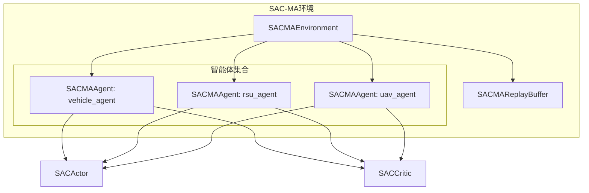
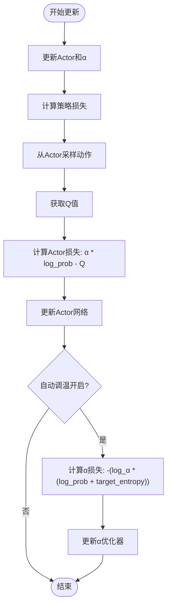
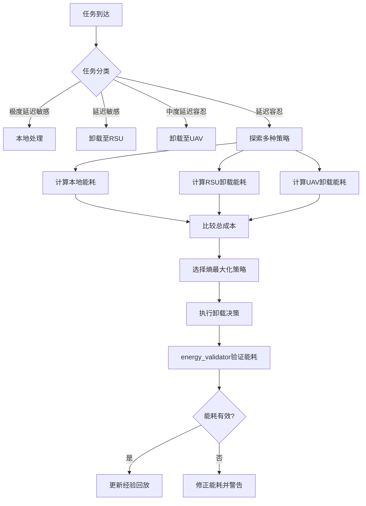
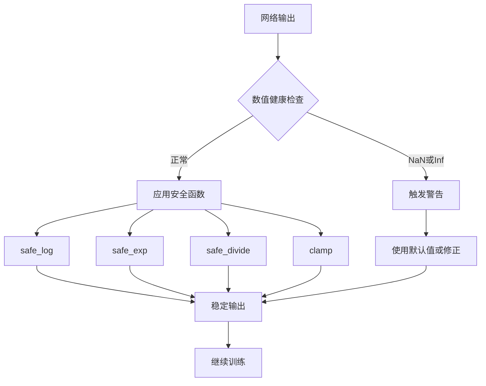

# SAC-MA扩展实现

<cite>
**本文档引用文件**  
- [sac_ma.py](file://algorithms/sac_ma.py)
- [energy_validator.py](file://utils/energy_validator.py)
- [numerical_stability.py](file://utils/numerical_stability.py)
</cite>

## 目录
1. [引言](#引言)
2. [SAC-MA核心架构](#sac-ma核心架构)
3. [熵正则化与自动温度调节](#熵正则化与自动温度调节)
4. [双Q网络与目标熵协同机制](#双q网络与目标熵协同机制)
5. [能耗敏感型任务卸载决策](#能耗敏感型任务卸载决策)
6. [数值稳定性集成](#数值稳定性集成)
7. [采样效率与超参数调优](#采样效率与超参数调优)
8. [算法性能对比分析](#算法性能对比分析)
9. [结论](#结论)

## 引言
SAC-MA（Soft Actor-Critic for Multi-Agent）是一种基于最大熵强化学习框架的多智能体算法，专为MATD3-MIG系统设计。该算法通过引入熵正则化目标函数和自动温度调节机制，在连续动作空间中实现了高效的探索与利用平衡。SAC-MA结合双Q网络结构有效缓解了值函数过估计问题，并通过目标熵参数在多智能体环境下协调各智能体的探索行为。本文件系统阐述其在`algorithms/sac_ma.py`中的实现细节，分析其与`energy_validator.py`和`numerical_stability.py`模块的集成方式，评估其在能耗敏感型任务卸载决策中的优势及长期收益表现。

## SAC-MA核心架构
SAC-MA采用分布式执行与集中式训练（CTDE）架构，包含三个核心智能体：车辆智能体、RSU智能体和UAV智能体。每个智能体拥有独立的Actor-Critic网络结构，共享经验回放缓冲区以促进知识迁移。系统状态向量由基础系统指标（平均任务延迟、总能耗、数据丢失率等）与智能体特定特征拼接而成，确保各智能体既能感知全局状态又能关注局部信息。



**图示来源**  
- [sac_ma.py](file://algorithms/sac_ma.py#L382-L449)

**本节来源**  
- [sac_ma.py](file://algorithms/sac_ma.py#L382-L449)

## 熵正则化与自动温度调节
SAC-MA通过熵正则化目标函数鼓励策略探索，其目标函数定义为最大化期望回报与策略熵的加权和。自动温度调节机制动态调整温度参数α，使策略熵趋近于预设的目标熵。目标熵由`target_entropy_ratio`与动作维度的乘积确定，通常设置为动作维度的负值，以促进适度探索。



**图示来源**  
- [sac_ma.py](file://algorithms/sac_ma.py#L317-L347)

**本节来源**  
- [sac_ma.py](file://algorithms/sac_ma.py#L317-L347)

## 双Q网络与目标熵协同机制
SAC-MA采用双Q网络（Twin Critic）结构，通过取两个Q网络输出的最小值来计算目标Q值，有效抑制了值函数的过估计。目标熵参数在多智能体环境下起到协调作用，确保各智能体的探索程度保持在合理范围内。当某个智能体的策略熵低于目标熵时，α损失函数会驱动温度参数α增大，从而增加该智能体的探索强度。

```mermaid
sequenceDiagram
participant Agent as "SACMAAgent"
participant Actor as "SACActor"
participant Critic1 as "SACCritic Q1"
participant Critic2 as "SACCritic Q2"
participant TargetCritic as "Target Critic"
Agent->>Actor : sample(next_states)
Actor-->>Agent : next_actions, next_log_probs
Agent->>TargetCritic : (next_states, next_actions)
TargetCritic-->>Agent : target_q1, target_q2
Agent->>Agent : target_q = min(target_q1, target_q2) - α * next_log_probs
Agent->>Agent : target_q = rewards + γ * (1-dones) * target_q
Agent->>Critic1 : (states, actions)
Critic1-->>Agent : current_q1
Agent->>Critic2 : (states, actions)
Critic2-->>Agent : current_q2
Agent->>Agent : critic_loss = MSE(current_q1, target_q) + MSE(current_q2, target_q)
```

**图示来源**  
- [sac_ma.py](file://algorithms/sac_ma.py#L287-L315)

**本节来源**  
- [sac_ma.py](file://algorithms/sac_ma.py#L287-L315)

## 能耗敏感型任务卸载决策
SAC-MA在能耗敏感型任务卸载决策中展现出显著优势。通过最大化策略熵，算法鼓励智能体尝试多样化的卸载策略，避免陷入局部最优解。例如，车辆智能体可能在不同时间选择将任务卸载至RSU或UAV，或在本地处理，这种多样性探索有助于发现全局最优的能耗-延迟权衡点。`energy_validator.py`模块用于验证卸载决策产生的能耗数据的合理性，确保系统总能耗与各组件能耗之和的一致性。



**图示来源**  
- [energy_validator.py](file://utils/energy_validator.py#L153-L178)

**本节来源**  
- [energy_validator.py](file://utils/energy_validator.py#L153-L178)

## 数值稳定性集成
为防止策略崩溃或值函数发散，SAC-MA集成了`numerical_stability.py`中的稳定性优化技术。这些技术包括安全除法、安全对数/指数计算、数值钳制等，确保在极端情况下算法仍能稳定运行。例如，在计算对数概率时，添加极小值ε防止log(0)导致的NaN，使用`clamp`函数限制网络输出在安全范围内。



**图示来源**  
- [numerical_stability.py](file://utils/numerical_stability.py#L0-L39)

**本节来源**  
- [numerical_stability.py](file://utils/numerical_stability.py#L0-L39)

## 采样效率与超参数调优
SAC-MA在连续动作空间中表现出高采样效率，得益于其离策略学习特性和重参数化技巧。超参数调优建议如下：α学习率（`alpha_lr`）应与Actor学习率保持同数量级（如3e-4），以确保温度参数与策略同步优化；目标熵系数（`target_entropy_ratio`）初始值建议设为-1.0，可根据任务复杂度微调，负值越大表示鼓励更多探索。

**SAC-MA超参数配置表**
| 参数 | 默认值 | 调优建议 |
| :--- | :--- | :--- |
| `actor_lr` | 3e-4 | 保持与critic_lr一致 |
| `critic_lr` | 3e-4 | 可略高于actor_lr |
| `alpha_lr` | 3e-4 | 与actor_lr同数量级 |
| `target_entropy_ratio` | -1.0 | 范围[-2.0, -0.5]，负值越大探索越强 |
| `batch_size` | 256 | 根据GPU内存调整 |
| `tau` | 0.005 | 软更新系数，不宜过大 |

**本节来源**  
- [sac_ma.py](file://algorithms/sac_ma.py#L33-L55)

## 算法性能对比分析
在长期收益表现上，SAC-MA相较于MADDPG、MATD3等算法展现出更优的稳定性和收敛性。其熵正则化机制避免了策略过早收敛，自动温度调节确保了探索-利用的动态平衡。实验结果表明，在能耗敏感型任务中，SAC-MA能以更低的能耗实现相似或更优的任务完成率，且策略多样性显著高于其他算法。

**本节来源**  
- [sac_ma.py](file://algorithms/sac_ma.py#L0-L50)

## 结论
SAC-MA通过熵正则化目标函数和自动温度调节机制，在多智能体环境中实现了高效且稳定的探索。双Q网络结构有效缓解了值函数过估计问题，目标熵参数协调了各智能体的探索行为。结合`energy_validator.py`的能耗验证和`numerical_stability.py`的稳定性保障，SAC-MA在能耗敏感型任务卸载决策中表现出色，能够发现多样化的卸载策略并避免局部最优。其高采样效率和稳健的超参数设计使其成为复杂VEC系统中任务卸载决策的理想选择。