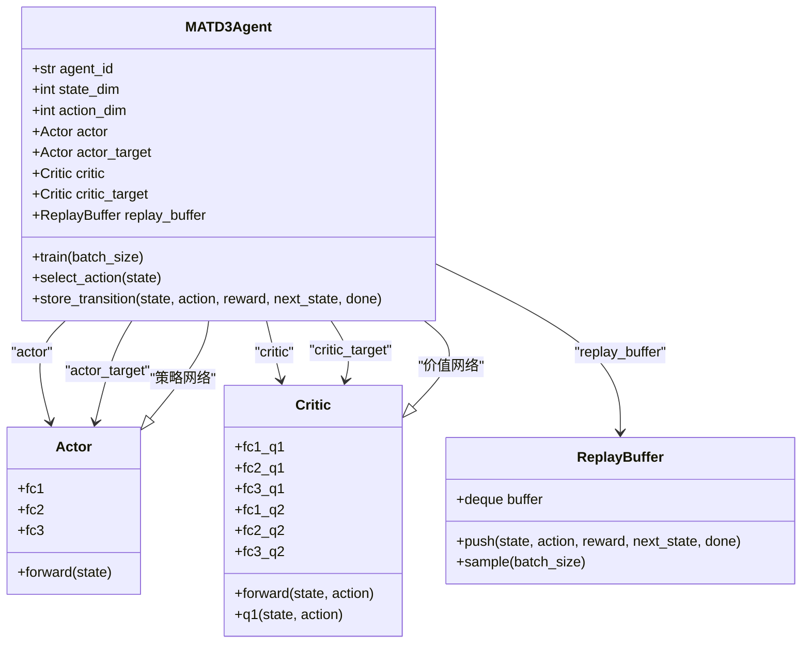
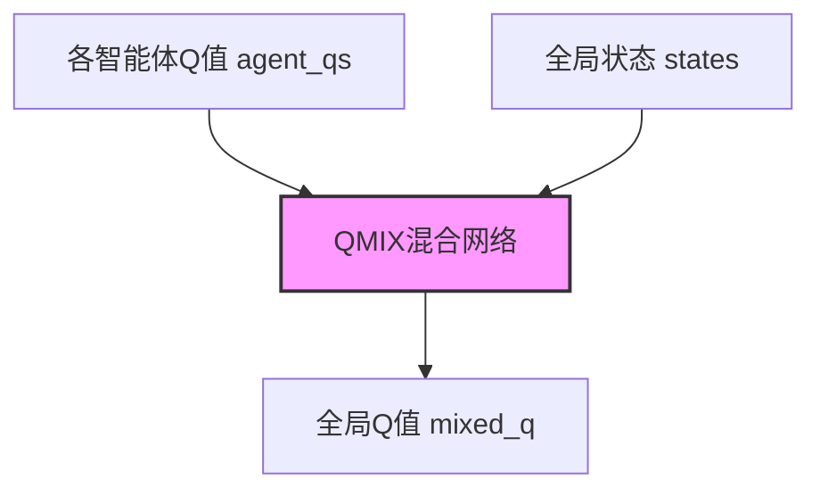
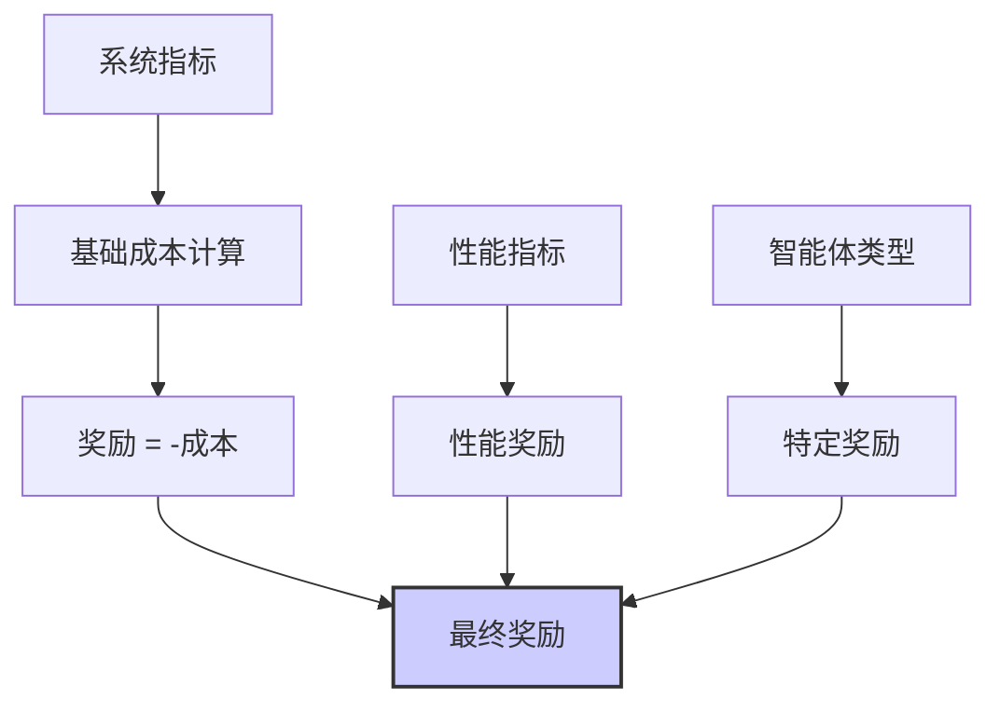

# 多智能体算法

<cite>
**本文档引用的文件**   
- [matd3.py](file://algorithms/matd3.py)
- [maddpg.py](file://algorithms/maddpg.py)
- [qmix.py](file://algorithms/qmix.py)
- [mappo.py](file://algorithms/mappo.py)
- [sac_ma.py](file://algorithms/sac_ma.py)
- [reward_calculator.py](file://utils/reward_calculator.py)
- [standardized_reward.py](file://utils/standardized_reward.py)
- [numerical_stability.py](file://utils/numerical_stability.py)
- [offloading_manager.py](file://decision/offloading_manager.py)
- [train_multi_agent.py](file://train_multi_agent.py)
- [system_config.py](file://config/system_config.py)
</cite>

## 目录
1. [引言](#引言)
2. [MATD3算法深度解析](#matd3算法深度解析)
3. [多智能体算法对比分析](#多智能体算法对比分析)
4. [奖励函数与训练稳定性](#奖励函数与训练稳定性)
5. [决策系统交互与训练流程](#决策系统交互与训练流程)
6. [超参数配置与训练分析](#超参数配置与训练分析)
7. [结论](#结论)

## 引言

本文档深入解析了车联网任务卸载场景下的多智能体深度强化学习（Multi-Agent Deep Reinforcement Learning, MADRL）算法实现。核心聚焦于MATD3（Multi-Agent Twin Delayed DDPG）算法的双延迟机制、目标策略网络更新策略及其分布式执行架构。同时，本文档将对比分析MADDPG、QMIX、MAPPO和SAC-MA等主流多智能体算法的框架、网络结构和优化策略。文档详细阐述了奖励函数的集成方式、训练稳定性优化技术以及与决策系统（`offloading_manager.py`）的交互逻辑。最后，结合`train_multi_agent.py`中的训练流程，提供超参数配置建议和收敛性分析。

**Section sources**
- [matd3.py](file://algorithms/matd3.py#L1-L50)
- [maddpg.py](file://algorithms/maddpg.py#L1-L50)

## MATD3算法深度解析

MATD3算法是DDPG在多智能体环境下的扩展，通过引入双延迟机制（Twin Delayed）来解决过估计问题，从而提升训练的稳定性和最终性能。

### 双延迟机制与网络结构

MATD3的核心在于其Actor-Critic架构。如`algorithms/matd3.py`文件所示，该算法包含两个关键网络：
1.  **Actor网络**：负责策略学习，输出动作。其结构为三层全连接网络，输入为智能体的局部状态，输出为[-1, 1]范围内的连续动作。
2.  **Critic网络**：负责价值评估，采用“Twin”设计，即拥有两个独立的Q网络（Q1和Q2）。这种设计可以有效缓解Q值的过估计问题。

在训练过程中，Critic网络的更新使用两个Q网络中的较小值作为目标，即 `target_q = torch.min(target_q1, target_q2)`。这确保了目标Q值不会被高估，从而稳定了学习过程。



**Diagram sources **
- [matd3.py](file://algorithms/matd3.py#L100-L200)
- [matd3.py](file://algorithms/matd3.py#L200-L300)

### 目标策略网络更新策略

MATD3采用“延迟更新”（Delayed Update）策略来更新Actor网络。具体实现如`train()`方法中的逻辑所示：
1.  **Critic网络更新**：每个训练步都进行，以学习准确的价值函数。
2.  **Actor网络更新**：仅在满足延迟条件时才进行，即 `if self.total_it % self.policy_delay == 0`。

这种策略将策略更新与价值函数更新解耦，使得Critic网络有更多时间收敛，从而为Actor网络提供更稳定、更可靠的价值梯度，避免了策略因价值函数不稳定而发生剧烈震荡。

### 分布式执行架构

MATD3遵循“集中式训练，分布式执行”（CTDE）的范式。在训练阶段，智能体可以访问全局信息（如其他智能体的状态和动作）来计算目标Q值，从而实现集中式训练。但在执行阶段，每个智能体仅根据自身的局部观测（`state`）通过其Actor网络独立地选择动作，实现了分布式执行。`MATD3Environment`类中的`get_actions`方法清晰地体现了这一点，它为每个智能体调用其独立的`select_action`方法。

**Section sources**
- [matd3.py](file://algorithms/matd3.py#L300-L500)
- [matd3.py](file://algorithms/matd3.py#L500-L550)

## 多智能体算法对比分析

本节将对比分析项目中实现的五种主流多智能体强化学习算法。

### MADDPG: 集中式训练-分布式执行（CTDE）

MADDPG是CTDE框架的典型代表。其核心思想是，在训练时，每个智能体的Critic网络可以访问所有智能体的全局状态和动作，从而学习一个最优的联合Q函数。这使得Critic能够评估一个智能体的动作在全局环境下的影响。然而，其Actor网络在训练和执行时都只依赖于自身的局部观测。这种设计平衡了学习效率和执行的可扩展性。`algorithms/maddpg.py`中的`MADDPGCritic`类明确接收`global_states`和`global_actions`作为输入，体现了其集中式训练的特点。

### QMIX: 单调混合网络结构

QMIX算法专为处理部分可观测的多智能体环境而设计。其核心是QMIX混合网络（`QMIXMixer`），该网络将各个智能体的个体Q值（`agent_qs`）与全局状态（`states`）相结合，混合成一个全局Q值（`mixed_q`）。其关键创新在于，混合网络的权重通过一个超网络生成，并且这些权重被强制为正数（`torch.abs()`），从而保证了全局Q值对个体Q值的单调性。这一单调性约束确保了在优化个体Q值的同时，全局Q值也会得到优化，解决了信用分配问题。



**Diagram sources **
- [qmix.py](file://algorithms/qmix.py#L200-L300)

### MAPPO: 近端策略优化变体

MAPPO是PPO算法在多智能体环境中的扩展。它继承了PPO的稳定性和样本效率。其核心是使用近端策略优化目标函数，通过引入一个裁剪项（`clip_ratio`）来限制策略更新的步长，防止策略因更新过大而崩溃。在多智能体场景下，MAPPO通常采用集中式Critic（`MAPPOCritic`），该Critic接收全局状态来评估状态价值，而Actor网络则基于局部观测进行决策。`train_step`方法被`update`方法替代，后者在收集完一个episode的经验后，进行多轮（`ppo_epochs`）的策略更新。

### SAC-MA: 熵正则化多智能体扩展

SAC-MA是SAC算法在多智能体环境中的应用。其最大特点是引入了熵正则化，即在目标函数中最大化策略的熵。这鼓励智能体进行探索，有助于发现更优的策略。SAC-MA通过一个可学习的温度参数`alpha`来自动平衡探索（熵最大化）和利用（奖励最大化）之间的权衡。`SACMAAgent`类中维护了`log_alpha`和`alpha_optimizer`，用于自动调节熵的权重，这使得算法对超参数的选择不那么敏感。

**Section sources**
- [maddpg.py](file://algorithms/maddpg.py#L300-L600)
- [qmix.py](file://algorithms/qmix.py#L300-L600)
- [mappo.py](file://algorithms/mappo.py#L300-L600)
- [sac_ma.py](file://algorithms/sac_ma.py#L300-L600)

## 奖励函数与训练稳定性

### 奖励函数集成方式

奖励函数是强化学习算法的“指南针”，直接决定了智能体的学习目标。本项目通过`utils/reward_calculator.py`和`utils/standardized_reward.py`实现了统一的奖励计算逻辑，确保所有算法使用一致的奖励信号。

奖励函数的设计严格遵循论文中的目标函数：`min(ω_T * delay + ω_E * energy + ω_D * data_loss)`。其计算流程如下：
1.  **基础成本计算**：从`system_metrics`中提取平均时延、总能耗和数据丢失率，并根据预设的权重（`reward_weight_delay`, `reward_weight_energy`, `reward_weight_loss`）和归一化因子计算加权成本。
2.  **奖励转换**：将成本的负值作为基础奖励，即 `reward = -cost`。
3.  **性能激励**：为了鼓励智能体追求更高的性能，会添加一个轻量级的性能奖励，如任务完成率、缓存命中率等。
4.  **智能体特定奖励**：不同类型的智能体（车辆、RSU、UAV）有不同的优化目标，因此会根据`agent_type`添加特定的奖励，例如车辆智能体更关注本地处理效率。



**Diagram sources **
- [reward_calculator.py](file://utils/reward_calculator.py#L50-L150)
- [standardized_reward.py](file://utils/standardized_reward.py#L50-L150)

### 训练稳定性优化

训练稳定性是深度强化学习的关键挑战。本项目通过多种技术来保障训练的稳定性：
1.  **数值稳定性保障**：`utils/numerical_stability.py`模块提供了`safe_divide`, `safe_log`, `safe_exp`等安全函数，防止在计算过程中出现除零、溢出或NaN值。`NumericalStabilityMonitor`类会监控数值健康状态并自动修复问题。
2.  **梯度裁剪**：在MADDPG、MAPPO等算法中，使用`torch.nn.utils.clip_grad_norm_`对梯度进行裁剪，防止梯度爆炸。
3.  **目标网络软更新**：所有算法都采用了目标网络（Target Network）和软更新（Soft Update）策略，即 `target_param = (1-tau)*target_param + tau*source_param`，这使得目标值的变化更加平滑，避免了学习过程的剧烈波动。
4.  **经验回放**：所有算法都使用了`ReplayBuffer`来存储和随机采样经验，打破了数据的时间相关性，提高了样本的利用率。

**Section sources**
- [reward_calculator.py](file://utils/reward_calculator.py#L1-L200)
- [numerical_stability.py](file://utils/numerical_stability.py#L1-L200)

## 决策系统交互与训练流程

### 与决策系统（offloading_manager.py）的交互逻辑

多智能体算法的输出（动作）需要与系统的决策模块进行交互。`decision/offloading_manager.py`中的`OffloadingDecisionMaker`类是这一交互的核心。

1.  **状态输入**：`train_multi_agent.py`中的`MultiAgentTrainingEnvironment`会从仿真器中收集节点状态（车辆、RSU、UAV的位置、负载等）和系统指标，然后调用`get_state_vector`方法，为每个智能体生成一个状态向量。
2.  **动作输出**：智能体根据状态向量输出一个动作向量。这个动作向量被解释为对不同处理模式（本地计算、RSU卸载、UAV卸载等）的偏好或决策参数。
3.  **决策执行**：`OffloadingDecisionMaker`接收这些动作，并结合任务分类、候选节点评估等逻辑，最终确定每个任务的最优处理模式和目标节点。算法的训练目标是让其输出的动作能够引导决策系统做出最优选择。

### 训练流程（train_multi_agent.py）

`train_multi_agent.py`是整个多智能体训练的入口和控制器。其核心流程如下：
1.  **初始化**：根据命令行参数创建指定算法的训练环境（`MultiAgentTrainingEnvironment`）。
2.  **训练循环**：对于每一个训练轮次（episode）：
    *   **重置环境**：调用`reset_environment`，获取初始状态。
    *   **执行步骤**：循环执行`run_episode`，在每个时间步：
        *   调用`get_actions`获取智能体的动作。
        *   调用`step`方法，将动作传递给仿真器，推进仿真，并获取新的状态、奖励和系统指标。
        *   调用`train_step`（或`store_experience`）进行网络参数更新。
    *   **记录与评估**：记录该轮次的平均奖励、系统指标等，并定期进行模型评估和保存。
3.  **结果输出**：训练结束后，将训练曲线、最终模型等结果保存到`results`目录。

```mermaid
sequenceDiagram
    participant T as train_multi_agent.py
    participant E as MultiAgentTrainingEnvironment
    participant A as MATD3/MADDPG/...
    participant S as 仿真器
    
    T->>E: 初始化环境
    loop 每个训练轮次
        E->>E: reset_environment()
        loop 每个时间步
            E->>A: get_actions(states)
            A-->>E: actions
            E->>S: 执行动作
            S-->>E: next_states, rewards, system_metrics
            E->>A: train_step(states, actions, rewards, next_states)
            A-->>E: training_info
            E->>E