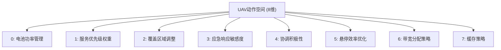

# 核心算法实现

<cite>
**本文档引用的文件**   
- [matd3.py](file://algorithms/matd3.py)
- [maddpg.py](file://algorithms/maddpg.py)
- [qmix.py](file://algorithms/qmix.py)
- [mappo.py](file://algorithms/mappo.py)
- [sac_ma.py](file://algorithms/sac_ma.py)
- [ddpg.py](file://single_agent/ddpg.py)
- [dqn.py](file://single_agent/dqn.py)
- [ppo.py](file://single_agent/ppo.py)
- [sac.py](file://single_agent/sac.py)
- [td3.py](file://single_agent/td3.py)
- [uav_action_space.py](file://algorithms/uav_action_space.py)
- [train_multi_agent.py](file://train_multi_agent.py)
- [train_single_agent.py](file://train_single_agent.py)
- [algorithm_config.py](file://config/algorithm_config.py)
</cite>

## 目录
1. [多智能体深度强化学习算法](#多智能体深度强化学习算法)
2. [单智能体深度强化学习算法](#单智能体深度强化学习算法)
3. [动作空间设计](#动作空间设计)
4. [训练脚本与调用方式](#训练脚本与调用方式)
5. [超参数配置说明](#超参数配置说明)

## 多智能体深度强化学习算法

本节深入解析项目中实现的多智能体深度强化学习算法，重点分析MATD3、MADDPG、QMIX、MAPPO和SAC-MA的网络结构、训练流程和适用场景。

### MATD3算法实现

MATD3（Multi-Agent Twin Delayed DDPG）是项目中的核心多智能体算法，其实现在`algorithms/matd3.py`中。该算法结合了TD3的稳定性与多智能体协作的优势，采用分布式执行架构。

**双延迟机制**：MATD3通过`policy_delay`参数实现延迟更新。在`train`方法中，只有当`total_it % policy_delay == 0`时才更新Actor网络，而Critic网络每步都更新。这种机制有效防止了Actor网络的过度更新，提高了训练稳定性。

**目标策略平滑**：在计算目标Q值时，算法为目标动作添加噪声以实现平滑化。具体实现如下：
```python
noise = (torch.randn_like(action) * self.policy_noise).clamp(-self.noise_clip, self.noise_clip)
next_action = (self.actor_target(next_state) + noise).clamp(-1, 1)
```
这通过`policy_noise`和`noise_clip`参数控制，增强了策略的鲁棒性。

**网络结构**：MATD3采用标准的Actor-Critic架构。Actor网络为三层全连接网络，输出范围为[-1, 1]的tanh激活；Critic网络采用Twin结构，包含两个独立的Q网络，取最小值作为目标Q值，有效缓解了Q值过高估计问题。

**分布式执行架构**：`MATD3Environment`管理多个智能体（车辆、RSU、UAV），每个智能体拥有独立的Actor-Critic网络。智能体通过`get_actions`方法获取动作，通过`train_step`方法进行训练，实现了集中式训练、分布式执行的范式。

**Section sources**
- [matd3.py](file://algorithms/matd3.py#L1-L549)

### MADDPG算法实现

MADDPG（Multi-Agent Deep Deterministic Policy Gradient）在`algorithms/maddpg.py`中实现。该算法采用集中式训练、分布式执行（CTDE）架构，其核心特点是Critic网络可以访问全局状态信息。

**网络结构**：MADDPG的Actor网络为标准的确定性策略网络，而Critic网络设计为可访问全局信息的集中式网络。`MADDPGCritic`类接收全局状态和全局动作作为输入，能够评估整个团队的联合动作价值。

**训练流程**：训练过程中，每个智能体的Critic网络使用全局信息计算Q值，而Actor网络仅基于局部观测更新策略。这种设计使得智能体能够学习到更优的协作策略。

**适用场景**：MADDPG适用于需要智能体间紧密协作的场景，如车辆编队、无人机协同搜索等。其集中式Critic网络能够有效处理智能体间的非平稳性问题。

**Section sources**
- [maddpg.py](file://algorithms/maddpg.py#L1-L645)

### QMIX算法实现

QMIX（Monotonic Value Function Factorisation）在`algorithms/qmix.py`中实现。该算法基于值函数分解，通过单调性约束确保全局最优性。

**网络结构**：QMIX包含两个核心组件：个体Q网络和混合网络（Mixer）。个体Q网络为RNN结构，处理部分可观测环境；混合网络通过超网络生成权重，将个体Q值单调地混合为全局Q值。

**单调性约束**：在`QMIXMixer`类中，通过`torch.abs`确保权重为正，从而保证混合后的Q值对个体Q值的单调性：
```python
w1 = torch.abs(self.hyper_w1(states))  # 确保权重为正
```

**适用场景**：QMIX特别适用于部分可观测的多智能体环境，如隐蔽通信、分布式传感等。其值函数分解机制能够有效处理信用分配问题。

**Section sources**
- [qmix.py](file://algorithms/qmix.py#L1-L598)

### MAPPO算法实现

MAPPO（Multi-Agent Proximal Policy Optimization）在`algorithms/mappo.py`中实现。该算法将PPO的稳定策略更新机制扩展到多智能体领域。

**网络结构**：MAPPO采用随机策略网络，输出动作的均值和标准差。Critic网络为集中式，接收全局状态输入，评估状态价值。

**训练流程**：MAPPO使用PPO的裁剪代理目标函数，防止策略更新过大。其经验缓冲区存储完整的episode数据，在episode结束后进行多轮PPO更新。

**适用场景**：MAPPO适用于需要稳定策略更新的连续控制任务，如机器人控制、自动驾驶等。其高样本效率和稳定性使其成为多智能体领域的热门选择。

**Section sources**
- [mappo.py](file://algorithms/mappo.py#L1-L587)

### SAC-MA算法实现

SAC-MA（Multi-Agent Soft Actor-Critic）在`algorithms/sac_ma.py`中实现。该算法基于最大熵强化学习框架，鼓励智能体探索。

**网络结构**：SAC-MA包含随机策略网络（Actor）和双Q网络（Critic）。Actor网络输出动作的高斯分布参数，Critic网络采用Twin结构减少过估计。

**自动温度调节**：算法通过`log_alpha`参数自动调节熵温度，平衡探索与利用：
```python
alpha_loss = -(self.log_alpha * (log_probs + self.target_entropy).detach()).mean()
```

**适用场景**：SAC-MA适用于高维连续动作空间和需要高样本效率的任务，如复杂机器人控制、金融交易等。

**Section sources**
- [sac_ma.py](file://algorithms/sac_ma.py#L1-L553)

## 单智能体深度强化学习算法

本节分析`single_agent`目录下的单智能体算法实现差异及其在基准测试中的作用。

### DDPG算法实现

DDPG（Deep Deterministic Policy Gradient）在`single_agent/ddpg.py`中实现。该算法是连续控制领域的基础方法。

**实现差异**：与多智能体版本相比，单智能体DDPG的环境状态维度更高（60维），整合了所有节点的状态。其`DDPGEnvironment`类负责将全局动作分解为各节点动作。

**基准测试作用**：作为基准算法，DDPG用于评估多智能体算法的性能提升。其相对简单的架构便于调试和理解系统行为。

**Section sources**
- [ddpg.py](file://single_agent/ddpg.py#L1-L458)

### DQN算法实现

DQN（Deep Q-Network）在`single_agent/dqn.py`中实现。该算法处理离散动作空间。

**实现差异**：DQN采用Dueling DQN架构，将Q值分解为状态价值和优势函数。其动作空间被离散化为125种组合（5^3），通过`_build_action_map`方法映射。

**基准测试作用**：DQN作为离散动作空间的代表，用于对比连续动作空间算法的性能差异。

**Section sources**
- [dqn.py](file://single_agent/dqn.py#L1-L481)

### PPO算法实现

PPO（Proximal Policy Optimization）在`single_agent/ppo.py`中实现。该算法采用策略梯度方法。

**实现差异**：PPO使用GAE（Generalized Advantage Estimation）计算优势函数，并通过裁剪机制防止策略更新过大。其`PPOBuffer`类存储完整的episode数据。

**基准测试作用**：PPO作为现代策略梯度算法的代表，提供了高稳定性和样本效率的基准。

**Section sources**
- [ppo.py](file://single_agent/ppo.py#L1-L518)

### SAC算法实现

SAC（Soft Actor-Critic）在`single_agent/sac.py`中实现。该算法与SAC-MA共享核心机制。

**实现差异**：单智能体SAC的环境状态和动作维度与DDPG相同，便于直接比较。其`SACEnvironment`类实现了与多智能体版本一致的奖励计算。

**基准测试作用**：SAC作为最大熵RL的代表，提供了探索效率的基准。

**Section sources**
- [sac.py](file://single_agent/sac.py#L1-L530)

### TD3算法实现

TD3（Twin Delayed DDPG）在`single_agent/td3.py`中实现。该算法是DDPG的改进版本。

**实现差异**：TD3实现了优先经验回放（PER），通过`TD3ReplayBuffer`类根据TD误差调整样本优先级。其`update`方法返回重要性权重用于损失计算。

**基准测试作用**：TD3作为DDPG的直接改进，用于验证双延迟机制和目标策略平滑的有效性。

**Section sources**
- [td3.py](file://single_agent/td3.py#L1-L546)

## 动作空间设计

动作空间设计在`algorithms/uav_action_space.py`中实现，专门适配无人机的移动特性。

### UAV动作空间

`FixedUAVActionSpace`类定义了8维连续动作空间，每个维度对应特定的无人机控制参数：



**动作映射**：`_map_to_range`方法将[-1,1]范围的动作映射到具体参数范围，如功率级别30%-100%。

**动作分解**：`UAVActionDecomposer`类将动作向量分解为具体执行参数，如电池管理、服务策略等。

**Section sources**
- [uav_action_space.py](file://algorithms/uav_action_space.py#L1-L206)

## 训练脚本与调用方式

训练脚本`train_multi_agent.py`和`train_single_agent.py`提供了算法的调用接口。

### 多智能体训练脚本

`train_multi_agent.py`支持多种算法的训练和比较：

```python
# 训练MATD3
python train_multi_agent.py --algorithm MATD3 --episodes 200

# 比较所有算法
python train_multi_agent.py --compare --episodes 200
```

**调用流程**：
1. 创建`MultiAgentTrainingEnvironment`
2. 调用`train_algorithm`进行训练
3. 定期评估和保存模型

**Section sources**
- [train_multi_agent.py](file://train_multi_agent.py#L1-L799)

### 单智能体训练脚本

`train_single_agent.py`提供单智能体算法的训练接口：

```python
# 训练TD3
python train_single_agent.py --algorithm TD3 --episodes 200
```

**调用流程**与多智能体类似，但环境状态为全局状态。

**Section sources**
- [train_single_agent.py](file://train_single_agent.py#L1-L799)

## 超参数配置说明

超参数配置在`config/algorithm_config.py`中定义，为各算法提供默认配置。

### 配置结构

```python
class AlgorithmConfig:
    def __init__(self):
        self.matd3_config = {
            'actor_lr': 0.0003,
            'critic_lr': 0.0003,
            'gamma': 0.99,
            'tau': 0.005,
            'policy_delay': 2,
            'noise_std': 0.1,
            'batch_size': 128
        }
        # ... 其他算法配置
```

### 配置使用

通过`get_algorithm_config`方法获取指定算法的配置：

```python
config = AlgorithmConfig()
matd3_cfg = config.get_algorithm_config('MATD3')
```

**Section sources**
- [algorithm_config.py](file://config/algorithm_config.py#L1-L73)