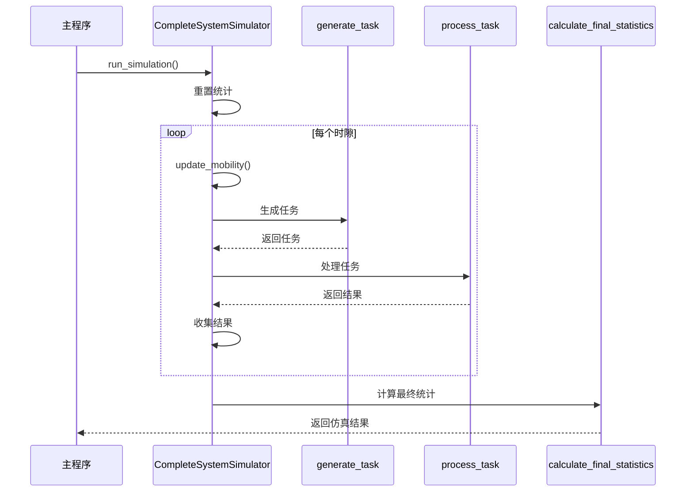
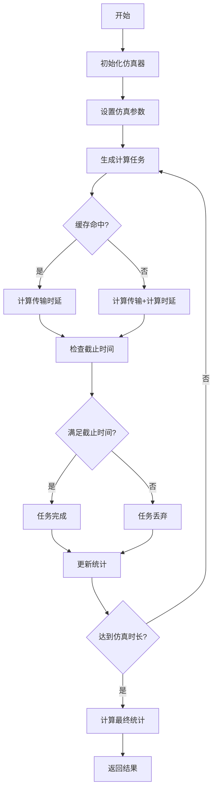
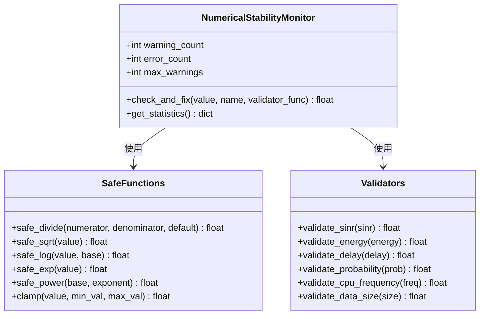

# 测试与验证

<cite>
**本文档引用的文件**  
- [test_complete_system.py](file://evaluation/test_complete_system.py)
- [numerical_stability.py](file://utils/numerical_stability.py)
- [enhance_numerical_stability.py](file://enhance_numerical_stability.py)
</cite>

## 目录
1. [测试策略概述](#测试策略概述)
2. [系统级测试实现](#系统级测试实现)
3. [测试用例设计原则](#测试用例设计原则)
4. [测试执行指南](#测试执行指南)
5. [结果分析方法](#结果分析方法)
6. [回归测试机制](#回归测试机制)
7. [数值稳定性测试](#数值稳定性测试)

## 测试策略概述

本项目采用分层测试策略，包括单元测试、集成测试和系统级测试三个层次。测试框架以`test_complete_system.py`为核心，通过完整的系统仿真来验证车联网边缘缓存系统的功能正确性和稳定性。测试策略重点关注任务卸载决策、缓存管理、能耗计算和时延性能等关键指标。

系统测试采用基于仿真的方法，通过`CompleteSystemSimulator`类模拟真实的车联网环境，包括12辆车辆、6个RSU和2个UAV的复杂网络拓扑。测试过程中，系统会生成计算任务并验证其处理结果，确保新功能添加或算法修改不会破坏现有功能。

**Section sources**
- [test_complete_system.py](file://evaluation/test_complete_system.py#L13-L511)

## 系统级测试实现

`test_complete_system.py`中的`CompleteSystemSimulator`类实现了完整的系统仿真器，用于验证整个系统的功能正确性和稳定性。该仿真器通过以下方式验证系统：



**Diagram sources**
- [test_complete_system.py](file://evaluation/test_complete_system.py#L380-L421)
- [test_complete_system.py](file://evaluation/test_complete_system.py#L226-L317)

**Section sources**
- [test_complete_system.py](file://evaluation/test_complete_system.py#L13-L511)

## 测试用例设计原则

测试用例的设计遵循以下原则：

1. **完整性**：覆盖所有可能的系统状态和边界条件
2. **可重复性**：确保每次运行测试都能得到一致的结果
3. **独立性**：每个测试用例都是独立的，不依赖于其他测试的结果
4. **可维护性**：测试用例易于理解和修改

测试用例的覆盖范围包括：
- 正常任务处理流程
- 缓存命中和未命中的情况
- 不同网络条件下的传输时延
- 计算资源竞争情况
- 能耗计算的准确性
- 移动性对系统性能的影响



**Diagram sources**
- [test_complete_system.py](file://evaluation/test_complete_system.py#L226-L317)
- [test_complete_system.py](file://evaluation/test_complete_system.py#L350-L378)

**Section sources**
- [test_complete_system.py](file://evaluation/test_complete_system.py#L13-L511)

## 测试执行指南

要执行系统测试，请按照以下步骤操作：

1. 导入必要的模块：
```python
from evaluation.test_complete_system import CompleteSystemSimulator
```

2. 创建仿真器实例：
```python
simulator = CompleteSystemSimulator()
```

3. 运行仿真：
```python
results = simulator.run_simulation(num_time_slots=1000)
```

4. 查看结果：
```python
print(results['statistics'])
```

测试执行的关键参数包括：
- `num_time_slots`：仿真时隙数量
- `task_arrival_rate`：任务到达率
- `simulation_time`：仿真总时间
- `cache_capacity`：缓存容量

测试过程中，系统会实时显示进度信息，包括仿真进度百分比和最终的统计结果。

**Section sources**
- [test_complete_system.py](file://evaluation/test_complete_system.py#L380-L421)

## 结果分析方法

测试结果的分析主要基于以下关键性能指标：

| 指标 | 描述 | 计算方法 |
|------|------|----------|
| 任务完成率 | 成功完成的任务占总任务的比例 | completed_tasks / total_tasks |
| 平均时延 | 成功完成任务的平均处理时延 | total_delay / completed_tasks |
| 缓存命中率 | 缓存命中的请求占总请求的比例 | cache_hits / (cache_hits + cache_misses) |
| 总能耗 | 系统消耗的总能量 | 所有任务能耗之和 |
| 任务丢弃率 | 因超时而被丢弃的任务比例 | dropped_tasks / total_tasks |

结果分析的步骤包括：
1. 检查任务完成率是否达到预期目标
2. 分析平均时延是否在可接受范围内
3. 评估缓存命中率是否满足性能要求
4. 验证能耗计算的合理性
5. 检查是否存在异常值或边界情况

通过这些指标的综合分析，可以全面评估系统的性能和稳定性。

**Section sources**
- [test_complete_system.py](file://evaluation/test_complete_system.py#L423-L476)

## 回归测试机制

为了确保新功能添加或算法修改不会破坏现有功能，项目采用了以下回归测试机制：

1. **自动化测试脚本**：`test_simulator()`函数提供了完整的自动化测试流程，每次代码变更后都可以快速运行。

2. **基准测试**：通过比较不同版本的测试结果，确保系统性能没有退化。

3. **参数化测试**：使用不同的配置参数运行测试，验证系统在各种条件下的稳定性。

4. **边界条件测试**：特别关注极端情况下的系统行为，如高负载、低信号强度等。

当添加新功能或修改算法时，应：
1. 运行完整的系统测试
2. 比较修改前后的性能指标
3. 验证关键指标是否在预期范围内
4. 检查是否存在新的边界问题

这种回归测试机制确保了系统的持续稳定性和可靠性。

**Section sources**
- [test_complete_system.py](file://evaluation/test_complete_system.py#L513-L533)

## 数值稳定性测试

项目特别关注数值计算的稳定性，通过`utils/numerical_stability.py`模块提供了一系列数值保护机制：



**Diagram sources**
- [numerical_stability.py](file://utils/numerical_stability.py#L0-L293)

**Section sources**
- [numerical_stability.py](file://utils/numerical_stability.py#L0-L293)
- [enhance_numerical_stability.py](file://enhance_numerical_stability.py#L0-L542)

这些数值稳定性机制确保了系统在各种边界条件下都能正常运行，避免了除零、溢出、NaN值等问题。通过`check_numerical_health()`函数，系统能够检测并修复不健康的数值，保证计算结果的可靠性。