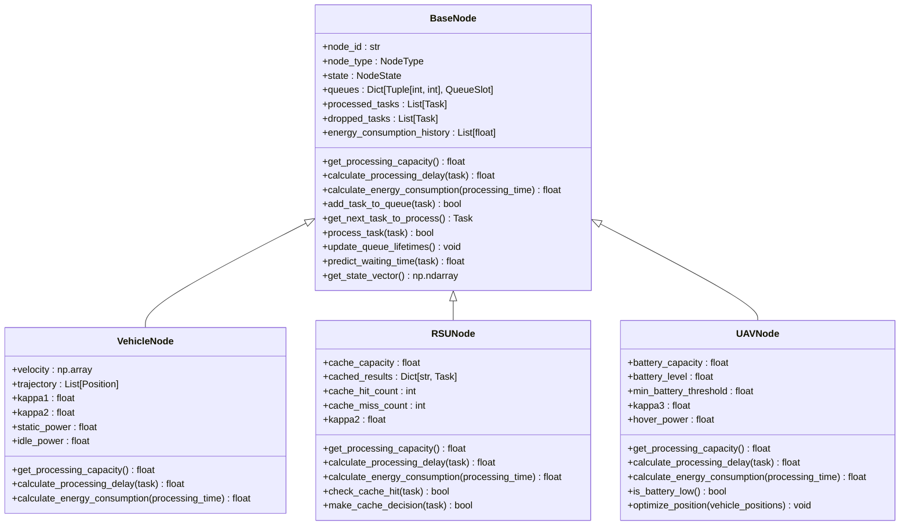
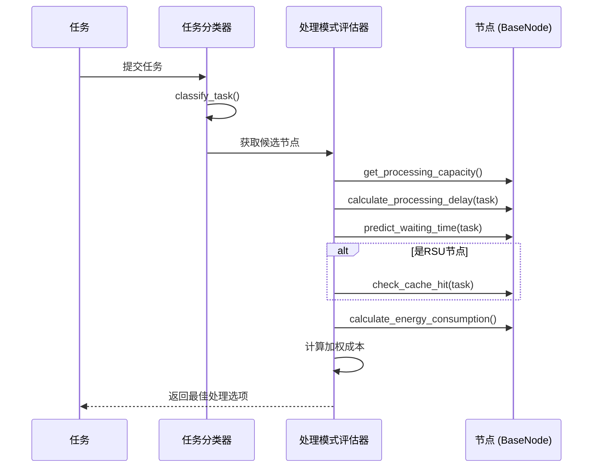

# 基础节点模型

<cite>
**本文档引用的文件**
- [base_node.py](file://models/base_node.py)
- [vehicle_node.py](file://models/vehicle_node.py)
- [rsu_node.py](file://models/rsu_node.py)
- [uav_node.py](file://models/uav_node.py)
- [offloading_manager.py](file://decision/offloading_manager.py)
</cite>

## 目录
1. [简介](#简介)
2. [核心属性与状态管理](#核心属性与状态管理)
3. [核心方法与功能](#核心方法与功能)
4. [继承结构与子类实现](#继承结构与子类实现)
5. [在任务卸载决策中的角色](#在任务卸载决策中的角色)
6. [总结](#总结)

## 简介

`BaseNode` 是一个抽象基类，定义了车联网（VEC）系统中所有计算节点（包括车辆、RSU和UAV）的通用接口和属性。它作为系统中所有节点的父类，实现了接口统一和代码复用，是整个系统架构的核心组成部分。

该类通过抽象方法强制子类实现特定功能（如计算能力、处理时延和能耗计算），同时封装了所有节点共有的属性和通用方法。这使得上层应用（如任务卸载决策器）可以以统一的方式与不同类型的节点进行交互，而无需关心其具体实现细节。

**Section sources**
- [base_node.py](file://models/base_node.py#L18-L312)

## 核心属性与状态管理

`BaseNode` 类封装了所有节点共有的核心属性，这些属性主要分为三类：基础信息、队列系统和性能统计。

### 基础信息
每个节点都拥有一个唯一的 `node_id` 和一个 `node_type`（车辆、RSU或UAV），以及一个包含位置、CPU频率、能耗等详细信息的 `state` 对象。

### 队列系统
节点使用一个名为 `queues` 的字典来管理多优先级生命周期队列。这是一个二维结构，键为 `(lifetime, priority)` 元组，值为 `QueueSlot` 对象。这种设计允许系统根据任务的剩余生命周期和优先级进行精细化调度。

### 性能统计
为了支持决策和监控，节点维护了多个性能统计信息：
- `processed_tasks`: 已成功处理的任务列表。
- `dropped_tasks`: 因超时或队列满而被丢弃的任务列表。
- `energy_consumption_history`: 能耗历史记录，用于计算平均能耗。
- 三个移动平均计算器（`avg_arrival_rate`, `avg_service_rate`, `avg_waiting_time`），用于动态更新节点的负载和性能指标。

**Section sources**
- [base_node.py](file://models/base_node.py#L24-L43)
- [base_node.py](file://models/base_node.py#L29-L35)

## 核心方法与功能

`BaseNode` 类提供了丰富的通用方法，涵盖了任务处理、队列管理、状态更新和预测等核心功能。

### 抽象方法
以下方法是抽象的，必须由子类实现，以提供特定于节点类型的计算逻辑：
- `get_processing_capacity()`: 获取节点的处理能力（单位：bits/时隙）。
- `calculate_processing_delay(task)`: 计算处理特定任务所需的时延。
- `calculate_energy_consumption(processing_time)`: 计算执行特定处理时间所消耗的能量。

### 任务处理与队列管理
- `add_task_to_queue(task)`: 将任务添加到相应的队列槽位。该方法会检查队列容量，并根据任务的生命周期和优先级确定槽位。
- `get_next_task_to_process()`: 按照非抢占式优先级调度策略（高优先级优先，同优先级FIFO）获取下一个待处理任务。
- `process_task(task)`: 处理一个任务。该方法会计算处理时延，检查是否超时，计算能耗，更新任务状态，并将其从队列中移除。
- `update_queue_lifetimes()`: 在每个时隙开始时调用，将队列中所有任务的生命周期减一，并将生命周期用尽的任务标记为丢弃。

### 状态与预测
- `predict_waiting_time(task)`: 使用M/M/1非抢占式优先级队列模型预测任务的等待时间。这是任务卸载决策的关键输入。
- `get_state_vector()`: 获取节点的状态向量，该向量被归一化后用于强化学习算法，作为智能体的观测输入。

**Section sources**
- [base_node.py](file://models/base_node.py#L63-L75)
- [base_node.py](file://models/base_node.py#L77-L170)
- [base_node.py](file://models/base_node.py#L179-L213)
- [base_node.py](file://models/base_node.py#L294-L312)

## 继承结构与子类实现

`BaseNode` 通过继承机制，为不同类型的节点提供了统一的接口，同时允许子类通过重写方法或扩展属性来适配其独特的行为。

**Diagram sources**
- [base_node.py](file://models/base_node.py#L18-L312)
- [vehicle_node.py](file://models/vehicle_node.py#L15-L300)
- [rsu_node.py](file://models/rsu_node.py#L16-L423)
- [uav_node.py](file://models/uav_node.py#L14-L360)

### 子类行为适配
- **VehicleNode**: 重写了 `get_processing_capacity`, `calculate_processing_delay`, 和 `calculate_energy_consumption` 方法，以实现基于车辆CPU频率和动态功率模型的计算。它还扩展了 `velocity` 和 `trajectory` 等属性来支持车辆移动性。
- **RSUNode**: 重写了能耗计算方法以适应RSU的功率模型，并扩展了 `cached_results`, `cache_hit_count` 等属性来支持缓存功能。它还实现了 `check_cache_hit` 和 `make_cache_decision` 等特有方法。
- **UAVNode**: 重写了处理能力计算方法，使其与电池电量挂钩（电量低时性能下降）。它扩展了 `battery_level`, `hover_power` 等属性来管理无人机的能耗，并实现了 `is_battery_low` 和 `optimize_position` 等特有方法。

**Section sources**
- [vehicle_node.py](file://models/vehicle_node.py#L15-L300)
- [rsu_node.py](file://models/rsu_node.py#L16-L423)
- [uav_node.py](file://models/uav_node.py#L14-L360)

## 在任务卸载决策中的角色

`BaseNode` 及其子类在任务卸载决策流程中扮演着至关重要的角色。`OffloadingDecisionMaker` 类利用 `BaseNode` 提供的统一接口来评估不同处理模式的性能。

### 决策流程
1.  **任务分类**: `TaskClassifier` 根据任务的延迟容忍度将其分类。
2.  **候选节点选择**: 根据任务类型，确定候选的处理节点（如本地车辆、附近的RSU或UAV）。
3.  **模式评估**: `ProcessingModeEvaluator` 会为每个候选节点评估不同的处理模式（本地计算、RSU卸载、UAV卸载等）。
4.  **关键信息获取**: 在评估过程中，决策器会调用 `BaseNode` 的方法来获取关键信息：
    - 调用 `predict_waiting_time(task)` 来预测任务在目标节点的等待时间。
    - 调用 `get_processing_capacity()` 和 `calculate_processing_delay(task)` 来计算处理时延。
    - 调用 `calculate_energy_consumption()` 来估算能耗。
    - 对于RSU节点，还会调用 `check_cache_hit(task)` 来判断是否可以利用缓存命中来大幅降低时延和能耗。
5.  **最佳选项选择**: 决策器综合时延、能耗和成功率等指标，选择加权成本最小的处理选项。

通过这种方式，`BaseNode` 提供了一个稳定、统一的接口，使得复杂的卸载决策算法能够高效、可靠地运行。

**Diagram sources**
- [offloading_manager.py](file://decision/offloading_manager.py#L55-L625)
- [base_node.py](file://models/base_node.py#L18-L312)

**Section sources**
- [offloading_manager.py](file://decision/offloading_manager.py#L55-L625)

## 总结

`BaseNode` 抽象基类是整个VEC系统架构的基石。它通过定义清晰的接口和封装通用功能，实现了代码的高度复用和系统的模块化。其继承结构使得车辆、RSU和UAV等异构节点能够以统一的方式被管理和调度。同时，它提供的状态查询和预测方法，为上层的智能决策算法（如任务卸载）提供了坚实的数据基础，是连接底层节点实现与上层系统逻辑的关键桥梁。