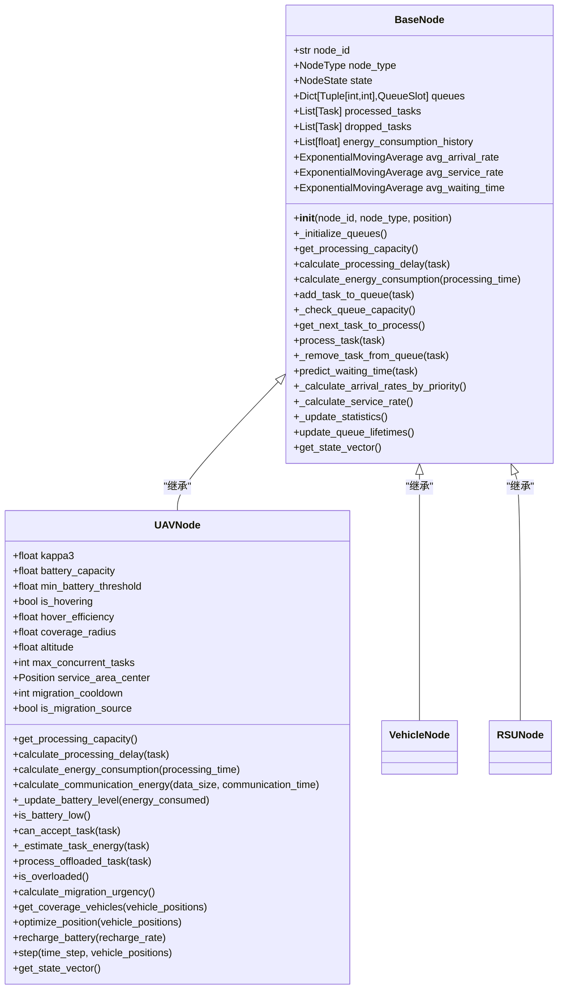
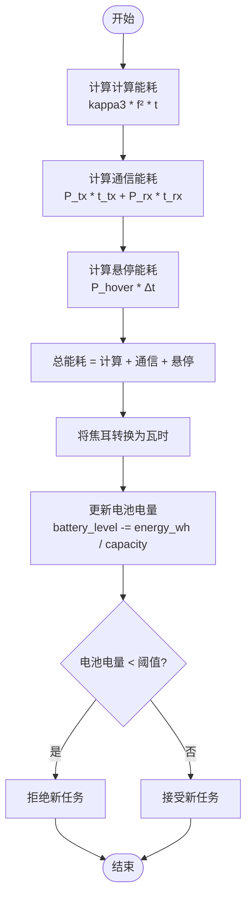
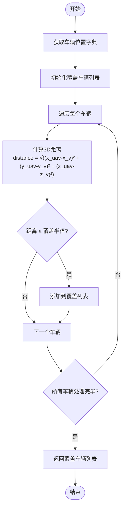
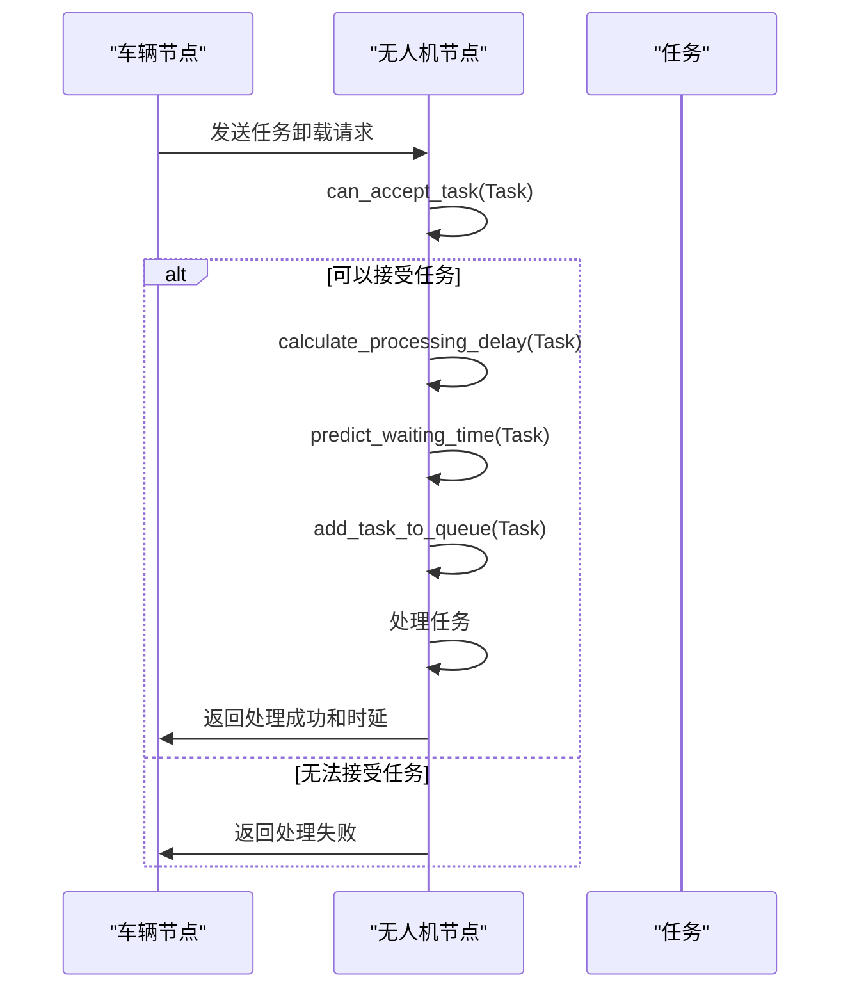
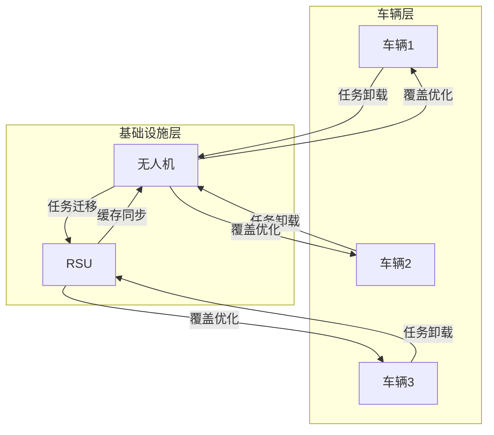
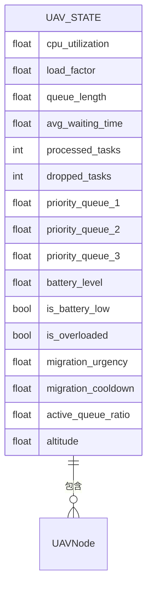

# 无人机节点模型

<cite>
**Referenced Files in This Document**   
- [uav_node.py](file://models/uav_node.py)
- [base_node.py](file://models/base_node.py)
- [vehicle_node.py](file://models/vehicle_node.py)
- [rsu_node.py](file://models/rsu_node.py)
</cite>

## 目录
1. [引言](#引言)
2. [无人机节点核心特性](#无人机节点核心特性)
3. [继承与扩展机制](#继承与扩展机制)
4. [能量消耗模型](#能量消耗模型)
5. [动态覆盖范围计算](#动态覆盖范围计算)
6. [任务处理与调度](#任务处理与调度)
7. [协同工作机制](#协同工作机制)
8. [状态向量与强化学习](#状态向量与强化学习)
9. [应用场景分析](#应用场景分析)
10. [结论](#结论)

## 引言

无人机节点（UAVNode）作为移动边缘计算系统中的关键组成部分，实现了空中边缘计算、能耗管理和移动性支持。该节点模型基于论文第2.2节和第5.5节的理论框架，通过继承基础节点类（BaseNode）并扩展飞行控制、能量消耗模型和动态覆盖范围计算等特性，构建了一个完整的空中计算平台。UAVNode在热点区域增强覆盖、临时任务卸载支持和动态缓存部署中发挥着重要作用，为车联网环境下的计算任务卸载提供了灵活的解决方案。

**Section sources**
- [uav_node.py](file://models/uav_node.py#L1-L360)

## 无人机节点核心特性

UAVNode类作为无人机节点的核心实现，具备多项关键特性，使其在移动边缘计算环境中具有独特优势。首先，UAVNode拥有更大的通信覆盖半径（800.0米），相比RSU节点的500.0米覆盖半径，能够覆盖更广泛的区域。其次，UAVNode支持3D位置管理，其高度由`altitude`属性控制，初始值由配置文件中的`uav_height`参数决定。

UAVNode的飞行参数经过优化，采用固定悬停模式（`is_hovering = True`），悬停效率为0.8。这种设计简化了飞行控制，同时确保了稳定的通信连接。在服务质量方面，UAVNode设置了最大并发任务数（`max_concurrent_tasks = 10`），以保证服务质量。此外，UAVNode还实现了迁移冷却机制（`migration_cooldown`），防止频繁迁移导致的系统不稳定。

**Section sources**
- [uav_node.py](file://models/uav_node.py#L1-L360)

## 继承与扩展机制

UAVNode通过继承BaseNode类实现了代码复用和功能扩展。BaseNode作为抽象基础节点类，定义了所有计算节点的通用接口和属性，包括节点ID、节点类型、位置状态、多优先级生命周期队列等。UAVNode在继承这些基础功能的同时，扩展了无人机特有的属性和方法。

在初始化过程中，UAVNode调用`super().__init__()`方法继承BaseNode的构造函数，然后设置无人机特有的计算资源配置，包括CPU频率、发射功率和可用带宽。同时，UAVNode还定义了能耗模型参数（`kappa3`）、悬停功率（`hover_power`）和电池管理参数。这种继承机制确保了UAVNode既能复用基础节点的通用功能，又能实现无人机特有的功能扩展。

**Diagram sources**
- [uav_node.py](file://models/uav_node.py#L1-L360)
- [base_node.py](file://models/base_node.py#L1-L312)

**Section sources**
- [uav_node.py](file://models/uav_node.py#L1-L360)
- [base_node.py](file://models/base_node.py#L1-L312)

## 能量消耗模型

UAVNode实现了复杂的能量消耗模型，综合考虑了计算能耗、通信能耗和悬停能耗。计算能耗基于论文式(28)实现，采用`kappa3 * (cpu_frequency ** 2) * processing_time`的公式计算。通信能耗包括发射和接收能耗，发射功率由`tx_power`参数控制，接收功率固定为0.1W。悬停能耗是UAV特有的能耗项，由`hover_power`参数和时间步长共同决定。

电池管理是UAVNode的重要功能，通过`_update_battery_level`方法实现。该方法将焦耳单位的能耗转换为瓦时，然后根据电池容量计算电量消耗。初始电池电量为满电状态（`battery_level = 1.0`），电池容量为50000.0Wh。当电池电量低于阈值（`min_battery_threshold`）时，UAV将拒绝新任务以确保安全返航。

**Diagram sources**
- [uav_node.py](file://models/uav_node.py#L1-L360)

**Section sources**
- [uav_node.py](file://models/uav_node.py#L1-L360)

## 动态覆盖范围计算

UAVNode通过`get_coverage_vehicles`和`optimize_position`方法实现了动态覆盖范围计算。`get_coverage_vehicles`方法遍历所有车辆位置，计算3D距离（考虑UAV高度），并返回覆盖范围内的车辆列表。这种方法充分利用了UAV的空中优势，能够实现更广的覆盖范围。

`optimize_position`方法实现了UAV位置优化，通过移动到覆盖车辆的重心位置来最大化覆盖效果。该方法首先获取覆盖范围内的车辆列表，然后计算这些车辆的平均位置，最后将UAV移动到该位置。这种简化实现虽然没有考虑复杂的飞行路径规划，但能够有效提高覆盖效率。

**Diagram sources**
- [uav_node.py](file://models/uav_node.py#L1-L360)

**Section sources**
- [uav_node.py](file://models/uav_node.py#L1-L360)

## 任务处理与调度

UAVNode的任务处理机制通过`process_offloaded_task`和`can_accept_task`方法实现。`can_accept_task`方法在接收新任务前进行多项检查，包括电池电量、当前负载和并发任务数。只有当所有条件都满足时，UAV才会接受新任务。此外，该方法还估算任务的总能耗，确保电池电量足以完成任务。

`process_offloaded_task`方法处理卸载任务，返回任务处理的成功状态和总处理时延。该方法首先检查是否能接受任务，然后计算处理时延和等待时延，最后将任务添加到处理队列。处理时延的计算考虑了电池电量对性能的影响，当电池电量较低时，有效CPU频率会相应降低。

**Diagram sources**
- [uav_node.py](file://models/uav_node.py#L1-L360)

**Section sources**
- [uav_node.py](file://models/uav_node.py#L1-L360)

## 协同工作机制

UAVNode与车辆节点（VehicleNode）和RSU节点（RSUNode）形成了协同工作机制。在任务卸载过程中，车辆节点生成任务并决定是否本地处理或卸载。如果选择卸载，任务将被发送到UAV或RSU节点进行处理。UAVNode通过`get_coverage_vehicles`方法获取覆盖范围内的车辆，实现与车辆节点的协同。

与RSU节点的协同主要体现在任务迁移和缓存部署方面。当UAV节点过载或电池电量不足时，可以通过任务迁移将部分任务转移到RSU节点处理。同时，UAV节点可以作为动态缓存节点，在热点区域临时部署缓存内容，与RSU节点形成互补的缓存网络。

**Diagram sources**
- [uav_node.py](file://models/uav_node.py#L1-L360)
- [vehicle_node.py](file://models/vehicle_node.py#L1-L300)
- [rsu_node.py](file://models/rsu_node.py#L1-L423)

**Section sources**
- [uav_node.py](file://models/uav_node.py#L1-L360)
- [vehicle_node.py](file://models/vehicle_node.py#L1-L300)
- [rsu_node.py](file://models/rsu_node.py#L1-L423)

## 状态向量与强化学习

UAVNode通过`get_state_vector`方法为强化学习提供状态向量。该方法在继承BaseNode状态向量的基础上，添加了UAV特有的状态信息，包括电池电量、是否低电量、是否过载、迁移紧急度、迁移冷却时间、活跃队列比例和高度。这些状态信息为强化学习算法提供了全面的决策依据。

迁移紧急度的计算综合考虑了电池电量、负载状况和队列长度等因素。当电池电量接近阈值、负载过高或队列过长时，迁移紧急度会相应增加。这种设计使得强化学习算法能够根据UAV的实时状态做出最优的迁移决策。

**Diagram sources**
- [uav_node.py](file://models/uav_node.py#L1-L360)

**Section sources**
- [uav_node.py](file://models/uav_node.py#L1-L360)

## 应用场景分析

UAVNode在多种应用场景中发挥着关键作用。在热点区域增强覆盖方面，UAV可以快速部署到高密度车辆区域，提供额外的计算和通信资源。在临时任务卸载支持方面，UAV可以作为移动边缘计算节点，为突发的计算需求提供即时支持。在动态缓存部署方面，UAV可以根据交通流量和任务需求，灵活调整缓存内容的位置和分布。

UAV的灵活部署能力使其特别适合应对突发事件和临时需求。例如，在交通事故现场，UAV可以快速到达现场，为救援车辆提供计算支持和通信中继。在大型活动期间，UAV可以部署在活动区域上空，为参与车辆提供增强的网络服务。

**Section sources**
- [uav_node.py](file://models/uav_node.py#L1-L360)

## 结论

UAVNode作为移动边缘计算系统中的关键组件，通过继承BaseNode并扩展飞行控制、能量消耗模型和动态覆盖范围计算等特性，构建了一个完整的空中计算平台。该节点在热点区域增强覆盖、临时任务卸载支持和动态缓存部署中发挥着重要作用，为车联网环境下的计算任务卸载提供了灵活的解决方案。UAVNode与车辆节点和RSU节点的协同工作机制，形成了一个高效、灵活的移动边缘计算网络，为未来智能交通系统的发展提供了有力支持。