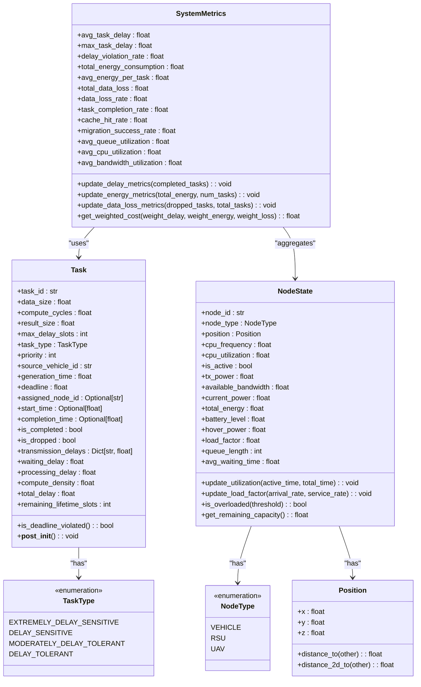
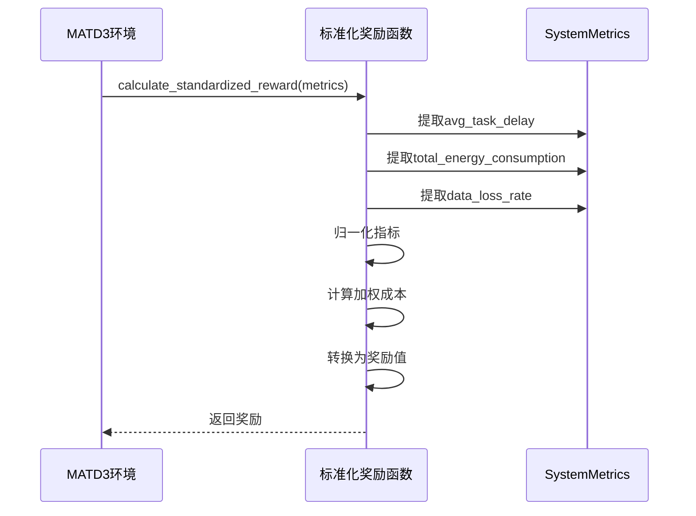
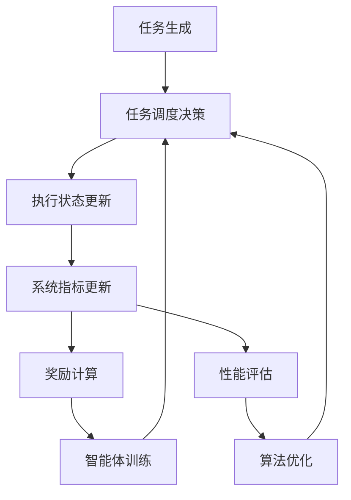

# 核心数据结构

<cite>
**本文档引用的文件**   
- [data_structures.py](file://models/data_structures.py)
- [matd3.py](file://algorithms/matd3.py)
- [standardized_reward.py](file://utils/standardized_reward.py)
- [system_config.py](file://config/system_config.py)
- [performance_evaluator.py](file://evaluation/performance_evaluator.py)
- [metrics.py](file://utils/metrics.py)
</cite>

## 目录
1. [引言](#引言)
2. [任务结构详解](#任务结构详解)
3. [节点状态结构详解](#节点状态结构详解)
4. [系统指标结构详解](#系统指标结构详解)
5. [数据结构关系图](#数据结构关系图)
6. [在MATD3中的应用](#在matd3中的应用)

## 引言
本文档旨在全面阐述VEC系统中的核心数据结构，包括`Task`、`NodeState`和`SystemMetrics`三个关键类。这些数据结构构成了系统任务调度、状态表示和性能评估的基础，是实现高效计算卸载和资源管理的核心组件。文档将详细说明每个类的字段定义、用途及其在强化学习框架中的作用。

## 任务结构详解

`Task`类定义了计算任务的核心属性，对应论文第2.1节的任务模型。该类封装了任务的输入输出、计算需求、时延约束和调度信息，是任务调度决策的基本单位。

### 基本属性
`Task`类包含以下基本属性，这些属性直接对应论文中的数学符号：
- **data_size**: 任务输入数据大小 (D_j)，单位为比特
- **compute_cycles**: 任务处理所需计算量 (C_j)，单位为CPU周期
- **result_size**: 任务输出结果大小 (S_j)，单位为比特
- **max_delay_slots**: 任务最大可容忍延迟 (T_max,j)，单位为时隙数

### 任务分类与优先级
任务根据其时延敏感度进行分类，使用`TaskType`枚举类型：
- **EXTREMELY_DELAY_SENSITIVE**: 极度延迟敏感型 (T_max,j ≤ τ₁)
- **DELAY_SENSITIVE**: 延迟敏感型 (τ₁ < T_max,j ≤ τ₂)
- **MODERATELY_DELAY_TOLERANT**: 中度延迟容忍型 (τ₂ < T_max,j ≤ τ₃)
- **DELAY_TOLERANT**: 延迟容忍型 (T_max,j > τ₃)

优先级字段`priority`用于多优先级队列管理，数值越小表示优先级越高。

### 生成与调度信息
该部分包含任务的生命周期信息：
- **source_vehicle_id**: 生成任务的源车辆ID
- **generation_time**: 任务生成时间戳
- **deadline**: 任务截止时间，由生成时间和最大延迟计算得出

### 执行状态
执行状态字段跟踪任务的处理进度：
- **assigned_node_id**: 分配的执行节点ID
- **start_time**: 开始执行时间
- **completion_time**: 完成时间
- **is_completed**: 任务是否已完成
- **is_dropped**: 任务是否被丢弃

### 时延记录
为性能分析提供详细的时延分解：
- **transmission_delays**: 传输时延记录，按链路存储
- **waiting_delay**: 等待时延
- **processing_delay**: 处理时延

### 计算密度与总时延
`Task`类提供了两个重要的计算属性：
- **compute_density**: 计算密度 (c = C_j / D_j)，表示每比特数据所需的计算周期数
- **total_delay**: 总端到端时延，从生成到完成的时间差

**Section sources**
- [data_structures.py](file://models/data_structures.py#L28-L96)

## 节点状态结构详解

`NodeState`类封装了系统中各类节点（车辆、RSU、UAV）的实时状态信息，为强化学习提供状态输入。该类的设计考虑了不同节点类型的共性和特性。

### 基本信息
每个节点状态包含以下基本信息：
- **node_id**: 节点唯一标识符
- **node_type**: 节点类型（车辆、RSU、UAV）
- **position**: 三维位置信息，包含x、y、z坐标

### 计算资源
计算资源相关字段：
- **cpu_frequency**: 节点的计算能力 (f_n)，单位为周期/秒
- **cpu_utilization**: CPU利用率，范围0-1
- **is_active**: 节点是否处于激活状态

### 通信资源
通信能力相关字段：
- **tx_power**: 发射功率 (P_tx)，单位为瓦特
- **available_bandwidth**: 可用带宽，单位为赫兹

### 能耗信息
能耗相关字段：
- **current_power**: 当前功耗，单位为瓦特
- **total_energy**: 累计能耗，单位为焦耳

### UAV特有属性
针对无人机的特殊属性：
- **battery_level**: 电池电量，范围0-1
- **hover_power**: 悬停功耗，单位为瓦特

### 负载统计
负载相关指标：
- **load_factor**: 负载因子 (ρ = λ/μ)，表示到达率与服务率的比值
- **queue_length**: 队列长度
- **avg_waiting_time**: 平均等待时间

### 状态更新方法
`NodeState`类提供了多个状态更新方法：
- **update_utilization**: 根据活跃时间和总时间更新CPU利用率
- **update_load_factor**: 根据到达率和服务率更新负载因子
- **is_overloaded**: 检查节点是否过载（负载因子超过阈值）
- **get_remaining_capacity**: 获取剩余处理能力

**Section sources**
- [data_structures.py](file://models/data_structures.py#L156-L201)

## 系统指标结构详解

`SystemMetrics`类聚合了系统级别的性能指标，用于评估系统整体性能和计算奖励值。这些指标是强化学习奖励函数的基础。

### 时延指标
时延相关性能指标：
- **avg_task_delay**: 平均任务时延
- **max_task_delay**: 最大任务时延
- **delay_violation_rate**: 时延违约率，违反截止时间的任务比例

### 能耗指标
能耗相关指标：
- **total_energy_consumption**: 系统总能耗
- **avg_energy_per_task**: 每任务平均能耗

### 数据丢失指标
数据丢失相关指标：
- **total_data_loss**: 总数据丢失量，单位为比特
- **data_loss_rate**: 数据丢失率，丢弃任务的比例

### 系统效率指标
系统效率相关指标：
- **task_completion_rate**: 任务完成率
- **cache_hit_rate**: 缓存命中率
- **migration_success_rate**: 迁移成功率
- **avg_queue_utilization**: 平均队列利用率

### 资源利用率
资源利用相关指标：
- **avg_cpu_utilization**: 平均CPU利用率
- **avg_bandwidth_utilization**: 平均带宽利用率

### 指标更新方法
`SystemMetrics`类提供了多个指标更新方法：
- **update_delay_metrics**: 根据已完成任务列表更新时延相关指标
- **update_energy_metrics**: 根据总能耗和任务数量更新能耗指标
- **update_data_loss_metrics**: 根据丢弃任务列表更新数据丢失指标

### 加权成本计算
`get_weighted_cost`方法计算加权总成本，对应论文式(24)的目标函数：
```python
def get_weighted_cost(self, weight_delay: float = 0.4, 
                     weight_energy: float = 0.3,
                     weight_loss: float = 0.3) -> float:
    normalized_delay = self.avg_task_delay / 1.0
    normalized_energy = self.total_energy_consumption / 1000.0
    normalized_loss = self.data_loss_rate
    
    return (weight_delay * normalized_delay + 
            weight_energy * normalized_energy + 
            weight_loss * normalized_loss)
```

**Section sources**
- [data_structures.py](file://models/data_structures.py#L248-L321)

## 数据结构关系图



**Diagram sources **
- [data_structures.py](file://models/data_structures.py#L28-L321)

## 在MATD3中的应用

`Task`、`NodeState`和`SystemMetrics`这三个核心数据结构在MATD3算法中扮演着关键角色，构成了状态-动作-奖励机制的基础。

### 状态向量构建
在`MATD3Environment.get_state_vector`方法中，`NodeState`和`SystemMetrics`被用来构建智能体的状态向量。该方法将节点状态和系统指标组合成一个20维的状态向量，作为强化学习的状态输入。

车辆智能体的状态向量包含：
- 归一化的平均任务时延和总能耗
- 数据丢失率和任务完成率
- 车辆、RSU和UAV的平均负载和可用性
- 带宽利用率和系统负载比

RSU和UAV智能体也有各自定制的状态向量，重点关注其特定的资源利用情况。

### 奖励函数计算
`SystemMetrics`是奖励函数计算的核心。在`MATD3Environment.calculate_rewards`方法中，系统指标被传递给标准化奖励函数进行计算。



**Diagram sources **
- [matd3.py](file://algorithms/matd3.py#L252-L549)
- [standardized_reward.py](file://utils/standardized_reward.py#L11-L98)

### 任务调度决策
`Task`类的属性直接影响调度决策。智能体根据任务的`data_size`、`compute_cycles`和`max_delay_slots`等属性，决定是否本地处理、卸载到RSU或UAV，以及是否进行迁移。

任务的`task_type`决定了其调度优先级，极度延迟敏感型任务会被优先处理，而延迟容忍型任务可能会被缓存或延迟处理。

### 性能评估与优化
`SystemMetrics`不仅用于奖励计算，还用于系统的性能评估。`PerformanceEvaluator`类使用这些指标来比较不同算法的性能，生成详细的评估报告。



**Diagram sources **
- [performance_evaluator.py](file://evaluation/performance_evaluator.py#L12-L253)
- [metrics.py](file://utils/metrics.py#L9-L64)

**Section sources**
- [matd3.py](file://algorithms/matd3.py#L252-L549)
- [standardized_reward.py](file://utils/standardized_reward.py#L11-L98)
- [performance_evaluator.py](file://evaluation/performance_evaluator.py#L12-L253)
- [metrics.py](file://utils/metrics.py#L9-L64)