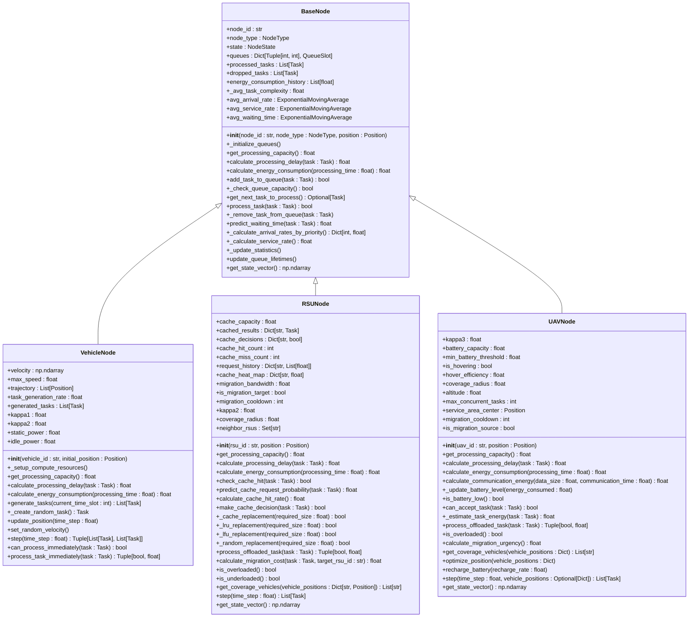

# 系统实体模型

<cite>
**Referenced Files in This Document**  
- [base_node.py](file://models/base_node.py)
- [vehicle_node.py](file://models/vehicle_node.py)
- [rsu_node.py](file://models/rsu_node.py)
- [uav_node.py](file://models/uav_node.py)
- [data_structures.py](file://models/data_structures.py)
- [enhanced_vehicle_mobility.py](file://models/enhanced_vehicle_mobility.py)
- [offloading_manager.py](file://decision/offloading_manager.py)
</cite>

## 目录
1. [引言](#引言)
2. [核心节点模型](#核心节点模型)
3. [基础节点接口](#基础节点接口)
4. [具体节点实现](#具体节点实现)
5. [数据结构定义](#数据结构定义)
6. [车辆移动性建模](#车辆移动性建模)
7. [卸载决策流程](#卸载决策流程)
8. [类图](#类图)

## 引言
本文档详细描述了车联网（VEC）系统中各类节点实体的建模实现。系统包含三种主要节点类型：车辆节点（Vehicle）、路侧单元（RSU）和无人机（UAV）。这些节点通过继承自`BaseNode`抽象基类，实现了统一的接口和功能。文档将深入分析`base_node.py`如何定义通用接口，以及各具体节点类如何继承并扩展这些功能。同时，将详细描述`data_structures.py`中定义的任务模型、状态向量和系统指标的数据结构，解释`enhanced_vehicle_mobility.py`如何模拟真实交通流中的车辆移动模式，并结合`offloading_manager.py`说明这些模型如何参与决策过程。

## 核心节点模型
系统中的所有计算节点都继承自`BaseNode`抽象基类，该类定义了所有节点的通用接口和属性。`BaseNode`通过抽象方法`get_processing_capacity`、`calculate_processing_delay`和`calculate_energy_consumption`强制子类实现其特定的计算能力、处理时延和能耗模型。具体节点类`VehicleNode`、`RsuNode`和`UavNode`分别实现了这些方法，以反映车辆、RSU和UAV在计算、通信和能耗方面的不同特性。这种继承关系确保了系统的一致性和可扩展性。

**Section sources**
- [base_node.py](file://models/base_node.py#L18-L312)
- [vehicle_node.py](file://models/vehicle_node.py#L15-L300)
- [rsu_node.py](file://models/rsu_node.py#L25-L423)
- [uav_node.py](file://models/uav_node.py#L25-L360)

## 基础节点接口
`BaseNode`类定义了所有节点的通用接口和属性。它包含节点ID、节点类型、位置、队列、性能统计和能耗历史等基本属性。`BaseNode`还定义了多优先级生命周期队列结构，用于管理不同优先级和剩余生命周期的任务。节点通过`add_task_to_queue`方法将任务添加到相应的队列槽位，并通过`get_next_task_to_process`方法按照非抢占式优先级调度策略获取下一个待处理任务。`BaseNode`还提供了`predict_waiting_time`方法，使用M/M/1非抢占式优先级队列模型预测任务等待时间。

**Section sources**
- [base_node.py](file://models/base_node.py#L18-L312)

## 具体节点实现

### 车辆节点
`VehicleNode`类继承自`BaseNode`，实现了车辆节点的特定功能。它包含了车辆特有的属性，如速度向量、最大速度和轨迹。`VehicleNode`通过`_setup_compute_resources`方法设置车辆的计算资源，从配置范围中随机选择CPU频率。`get_processing_capacity`方法计算车辆本地处理能力，`calculate_processing_delay`方法计算本地处理时延，`calculate_energy_consumption`方法计算处理能耗，考虑了动态功率模型和活动/空闲时间的能耗。`VehicleNode`还实现了任务生成、位置更新和随机速度设置等功能。

**Section sources**
- [vehicle_node.py](file://models/vehicle_node.py#L15-L300)

### 路侧单元节点
`RsuNode`类继承自`BaseNode`，实现了RSU节点的特定功能。它包含了RSU特有的属性，如缓存容量、缓存结果、缓存决策、缓存命中/未命中计数、请求历史和内容热度。`RsuNode`通过`get_processing_capacity`方法计算RSU处理能力，`calculate_processing_delay`方法计算RSU处理时延，`calculate_energy_consumption`方法计算RSU处理能耗。`RsuNode`还实现了缓存管理功能，包括`check_cache_hit`方法检查缓存命中，`predict_cache_request_probability`方法预测缓存请求概率，`make_cache_decision`方法制定缓存决策，以及`_cache_replacement`方法实现缓存替换策略（LRU、LFU或随机）。

**Section sources**
- [rsu_node.py](file://models/rsu_node.py#L25-L423)

### 无人机节点
`UavNode`类继承自`BaseNode`，实现了UAV节点的特定功能。它包含了UAV特有的属性，如电池电量、电池容量、最小电池阈值、悬停功率、覆盖半径、高度、最大并发任务数和服务区域中心。`UavNode`通过`get_processing_capacity`方法计算UAV处理能力，考虑了电池电量对性能的影响。`calculate_processing_delay`方法计算UAV处理时延，`calculate_energy_consumption`方法计算UAV总能耗，包括计算能耗、通信能耗和悬停能耗。`UavNode`还实现了电池管理、任务接受检查、位置优化和充电等功能。

**Section sources**
- [uav_node.py](file://models/uav_node.py#L25-L360)

## 数据结构定义

### 任务模型
`Task`类定义了计算任务的数据结构，对应论文第2.1节任务模型。它包含了任务ID、输入数据大小、计算量、输出结果大小、最大可容忍延迟、任务类型、优先级、源车辆ID、生成时间、截止时间、分配的执行节点、开始/完成时间、完成/丢弃状态、传输时延、等待时延和处理时延等属性。`Task`类还提供了`compute_density`、`total_delay`和`remaining_lifetime_slots`等属性，用于计算任务的计算密度、总端到端时延和剩余生命周期。

**Section sources**
- [data_structures.py](file://models/data_structures.py#L28-L96)

### 状态向量
`NodeState`类定义了节点状态信息的数据结构。它包含了节点ID、节点类型、位置、CPU频率、CPU利用率、激活状态、发射功率、可用带宽、当前功耗、累计能耗、电池电量、悬停功耗、负载因子、队列长度和平均等待时间等属性。`NodeState`类还提供了`update_utilization`、`update_load_factor`、`is_overloaded`和`get_remaining_capacity`等方法，用于更新CPU利用率、负载因子，检查节点是否过载，以及获取剩余处理能力。

**Section sources**
- [data_structures.py](file://models/data_structures.py#L156-L201)

### 系统指标
`SystemMetrics`类定义了系统性能指标的数据结构。它包含了平均/最大任务时延、时延违约率、总能耗、每任务平均能耗、总数据丢失量、数据丢失率、任务完成率、缓存命中率、迁移成功率、平均队列利用率、平均CPU利用率和平均带宽利用率等属性。`SystemMetrics`类还提供了`update_delay_metrics`、`update_energy_metrics`、`update_data_loss_metrics`和`get_weighted_cost`等方法，用于更新时延、能耗和数据丢失相关指标，以及计算加权总成本。

**Section sources**
- [data_structures.py](file://models/data_structures.py#L248-L321)

## 车辆移动性建模
`enhanced_vehicle_mobility.py`模块实现了增强车辆移动性模型，专门针对固定UAV和RSU环境优化的车辆移动策略。`VehicleMobilityModel`类包含了车辆ID、当前位置、速度、加速度、最大速度、最大加速度、最小速度、轨迹历史、预测轨迹、移动策略、策略权重、固定节点信息（RSU和UAV位置）、覆盖半径、目标位置和航路点等属性。`VehicleMobilityModel`通过`update_fixed_nodes_info`方法更新固定节点位置信息，`calculate_connectivity_score`方法计算给定位置的连接性评分，`predict_trajectory`方法预测未来轨迹，`step`方法执行一步移动更新，以及`get_mobility_metrics`方法获取移动性相关指标。

**Section sources**
- [enhanced_vehicle_mobility.py](file://models/enhanced_vehicle_mobility.py#L0-L398)

## 卸载决策流程
`offloading_manager.py`模块实现了任务分类与卸载决策框架，对应论文第3节和第4节。`OffloadingDecisionMaker`类整合了`TaskClassifier`和`ProcessingModeEvaluator`，实现了完整的决策流程。`TaskClassifier`根据延迟容忍度对任务进行四级分类，并确定候选节点集合。`ProcessingModeEvaluator`在候选集内评估不同处理模式的性能，包括本地计算、RSU卸载（缓存命中/未命中）、RSU间迁移和UAV卸载。`OffloadingDecisionMaker`通过`make_offloading_decision`方法制定卸载决策，选择加权成本最小的处理选项。

**Section sources**
- [offloading_manager.py](file://decision/offloading_manager.py#L0-L625)

## 类图

**Diagram sources**
- [base_node.py](file://models/base_node.py#L18-L312)
- [vehicle_node.py](file://models/vehicle_node.py#L15-L300)
- [rsu_node.py](file://models/rsu_node.py#L25-L423)
- [uav_node.py](file://models/uav_node.py#L25-L360)