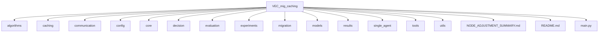
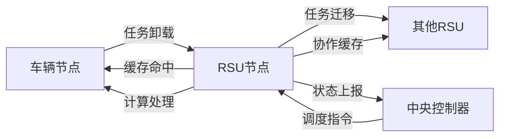
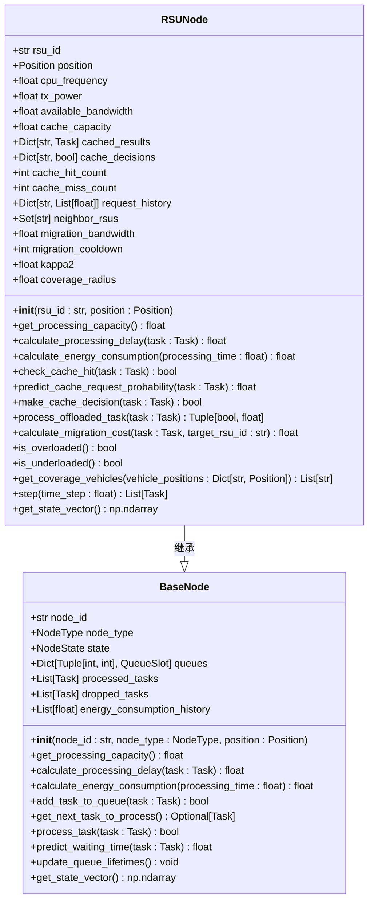
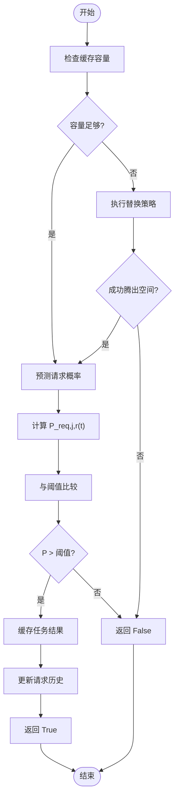
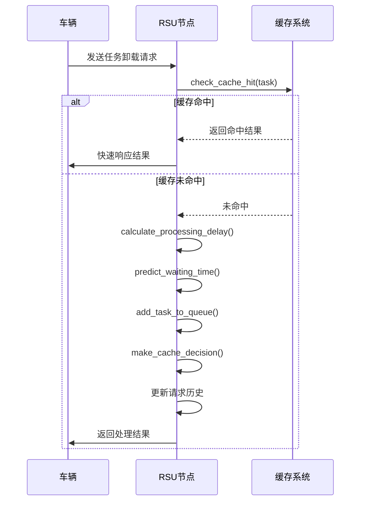
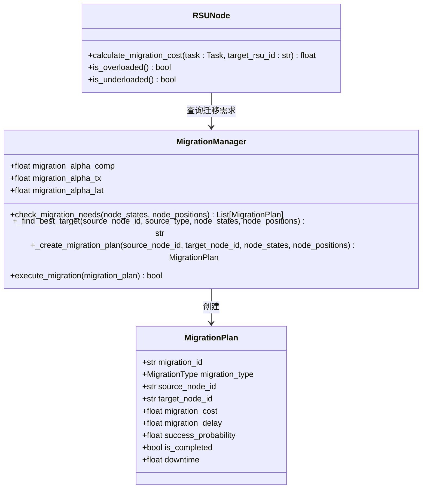
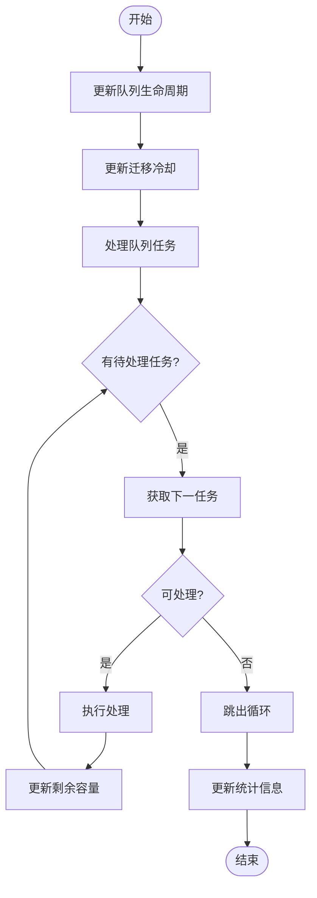
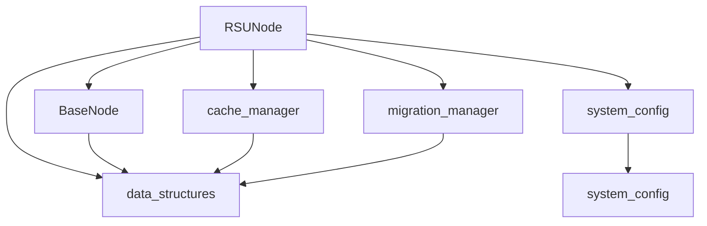

# 路侧单元节点模型

<cite>
**本文档引用的文件**  
- [rsu_node.py](file://models/rsu_node.py)
- [base_node.py](file://models/base_node.py)
- [cache_manager.py](file://caching/cache_manager.py)
- [migration_manager.py](file://migration/migration_manager.py)
- [data_structures.py](file://models/data_structures.py)
- [system_config.py](file://config/system_config.py)
</cite>

## 目录
1. [引言](#引言)
2. [项目结构](#项目结构)
3. [核心组件](#核心组件)
4. [架构概述](#架构概述)
5. [详细组件分析](#详细组件分析)
6. [依赖分析](#依赖分析)
7. [性能考量](#性能考量)
8. [故障排除指南](#故障排除指南)
9. [结论](#结论)

## 引言
本文档详细解析路侧单元（RSU）节点模型的设计与实现。RSU作为车联网中的固定边缘节点，具备稳定的计算资源、较大的缓存容量和较长的通信覆盖范围。它继承自基础节点类（BaseNode），实现了边缘服务功能，包括接收任务卸载请求、执行计算任务、管理本地缓存内容以及参与多跳通信等。重点阐述其在缓存管理（caching/cache_manager.py）和任务迁移（migration/migration_manager.py）中的关键作用，并结合系统整体架构说明RSU如何作为车联网中的关键支撑节点提升系统性能。

## 项目结构
本项目采用模块化设计，各目录职责明确，便于维护与扩展。主要模块包括算法、缓存、通信、配置、核心功能、决策、评估、迁移、模型、结果、单智能体、工具和工具类等。



**图示来源**  
- [models/rsu_node.py](file://models/rsu_node.py#L1-L50)
- [models/base_node.py](file://models/base_node.py#L1-L50)

**本节来源**  
- [models/rsu_node.py](file://models/rsu_node.py#L1-L50)
- [models/base_node.py](file://models/base_node.py#L1-L50)

## 核心组件
`RSUNode` 类是本系统中路侧单元的核心实现，继承自 `BaseNode` 类，扩展了边缘计算、缓存管理和任务迁移等功能。其设计充分考虑了实际应用场景下的性能需求与资源约束。

**本节来源**  
- [models/rsu_node.py](file://models/rsu_node.py#L16-L423)
- [models/base_node.py](file://models/base_node.py#L18-L312)

## 架构概述
RSU节点在整个系统中扮演着承上启下的角色，连接车辆节点与云端或其他边缘节点。它不仅处理来自车辆的任务卸载请求，还通过协作缓存和任务迁移机制优化整体系统性能。



**图示来源**  
- [models/rsu_node.py](file://models/rsu_node.py#L16-L423)
- [caching/cache_manager.py](file://caching/cache_manager.py#L1-L528)
- [migration/migration_manager.py](file://migration/migration_manager.py#L1-L252)

## 详细组件分析
### RSUNode 类分析
`RSUNode` 类继承自 `BaseNode`，并针对路侧单元的特点进行了功能扩展，主要包括初始化配置、缓存管理、任务处理和状态更新等。

#### 初始化方法
`__init__` 方法完成RSU节点的初始化，设置计算资源、通信参数、缓存容量及迁移相关属性。



**图示来源**  
- [models/rsu_node.py](file://models/rsu_node.py#L27-L58)
- [models/base_node.py](file://models/base_node.py#L23-L43)

#### 缓存管理机制
RSU节点通过 `make_cache_decision` 方法实现智能缓存决策，结合预测概率与容量约束，决定是否缓存任务结果。



**图示来源**  
- [models/rsu_node.py](file://models/rsu_node.py#L155-L183)
- [models/rsu_node.py](file://models/rsu_node.py#L108-L143)
- [caching/cache_manager.py](file://caching/cache_manager.py#L1-L528)

#### 任务处理流程
`process_offloaded_task` 方法处理来自车辆的任务卸载请求，首先检查缓存命中，若未命中则进行计算处理，并根据结果制定缓存决策。



**图示来源**  
- [models/rsu_node.py](file://models/rsu_node.py#L266-L322)
- [models/rsu_node.py](file://models/rsu_node.py#L94-L106)
- [models/base_node.py](file://models/base_node.py#L77-L99)

#### 任务迁移成本计算
`calculate_migration_cost` 方法用于评估将任务迁移到其他RSU的成本，综合考虑计算、传输和延迟因素。



**图示来源**  
- [models/rsu_node.py](file://models/rsu_node.py#L324-L346)
- [migration/migration_manager.py](file://migration/migration_manager.py#L1-L252)

#### 节点状态更新
`step` 方法在每个时间步更新RSU节点状态，包括队列生命周期、迁移冷却时间、任务处理和统计信息更新。



**图示来源**  
- [models/rsu_node.py](file://models/rsu_node.py#L369-L407)
- [models/base_node.py](file://models/base_node.py#L200-L250)

#### 状态向量生成
`get_state_vector` 方法生成用于强化学习的状态向量，包含基础状态和RSU特有状态。

```mermaid
classDiagram
class BaseNode {
+get_state_vector() np.ndarray
}
class RSUNode {
+get_state_vector() np.ndarray
}
class NodeState {
+float cpu_utilization
+float load_factor
+int queue_length
+float avg_waiting_time
}
BaseNode <|-- RSUNode : 继承
RSUNode --> NodeState : 包含
RSUNode --> BaseNode : super().get_state_vector()
note right of RSUNode
添加RSU特有状态 :
- 缓存命中率
- 缓存项数量(归一化)
- 剩余缓存容量比例
- 是否过载
- 是否低负载
- 迁移冷却时间(归一化)
end note
```

**图示来源**  
- [models/rsu_node.py](file://models/rsu_node.py#L409-L423)
- [models/base_node.py](file://models/base_node.py#L294-L312)

**本节来源**  
- [models/rsu_node.py](file://models/rsu_node.py#L16-L423)
- [caching/cache_manager.py](file://caching/cache_manager.py#L1-L528)
- [migration/migration_manager.py](file://migration/migration_manager.py#L1-L252)

## 依赖分析
RSU节点依赖多个模块协同工作，形成完整的边缘计算服务体系。



**图示来源**  
- [models/rsu_node.py](file://models/rsu_node.py#L16-L423)
- [caching/cache_manager.py](file://caching/cache_manager.py#L1-L528)
- [migration/migration_manager.py](file://migration/migration_manager.py#L1-L252)
- [config/system_config.py](file://config/system_config.py#L1-L319)

**本节来源**  
- [models/rsu_node.py](file://models/rsu_node.py#L16-L423)
- [caching/cache_manager.py](file://caching/cache_manager.py#L1-L528)
- [migration/migration_manager.py](file://migration/migration_manager.py#L1-L252)
- [config/system_config.py](file://config/system_config.py#L1-L319)

## 性能考量
RSU节点在设计时充分考虑了性能优化，包括：
- 使用归一化数值进行状态表示，便于强化学习模型训练
- 采用移动平均算法平滑统计指标波动
- 实现高效的缓存替换策略（LRU/LFU/随机）
- 通过多优先级生命周期队列实现精细化任务调度
- 利用Keep-Before-Break机制降低任务迁移中断时间

## 故障排除指南
常见问题及解决方案：
- **缓存命中率低**：检查 `predict_cache_request_probability` 中的参数配置，调整 `logistic_alpha` 系列参数
- **任务处理延迟高**：检查 `is_overloaded` 状态，考虑触发任务迁移或增加计算资源
- **迁移失败频繁**：检查 `migration_cooldown` 设置，避免过于频繁的迁移尝试
- **队列溢出**：优化 `add_task_to_queue` 的容量检查逻辑，调整队列大小配置

**本节来源**  
- [models/rsu_node.py](file://models/rsu_node.py#L16-L423)
- [caching/cache_manager.py](file://caching/cache_manager.py#L1-L528)
- [migration/migration_manager.py](file://migration/migration_manager.py#L1-L252)

## 结论
路侧单元节点（RSU）作为车联网中的关键基础设施，通过继承基础节点并扩展边缘服务功能，实现了高效的任务处理、智能缓存管理和动态任务迁移。其设计紧密结合系统整体架构，有效提升了车联网系统的性能与可靠性。未来可进一步优化缓存预测算法和迁移决策机制，以适应更复杂的交通场景。