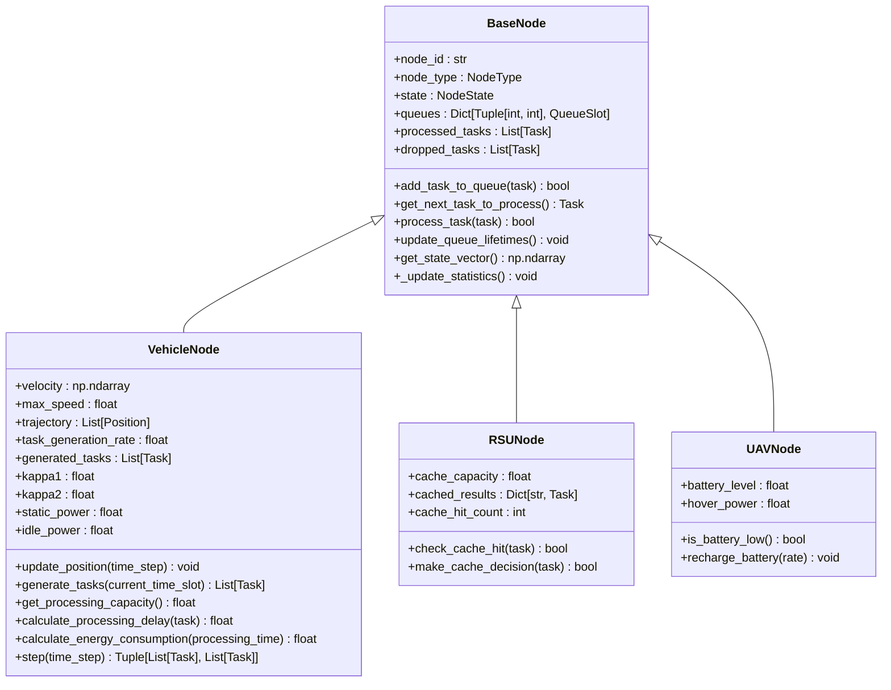
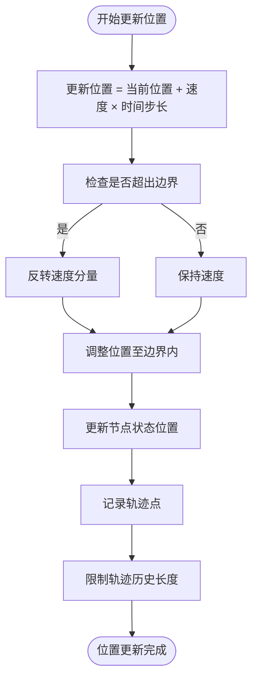
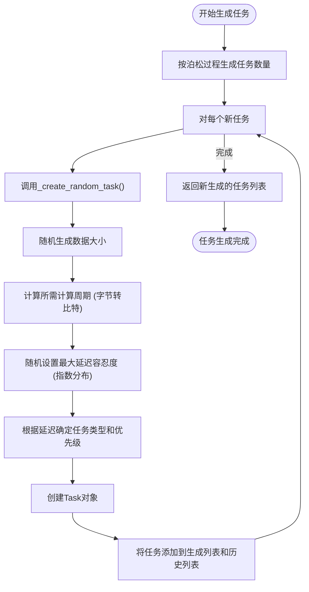
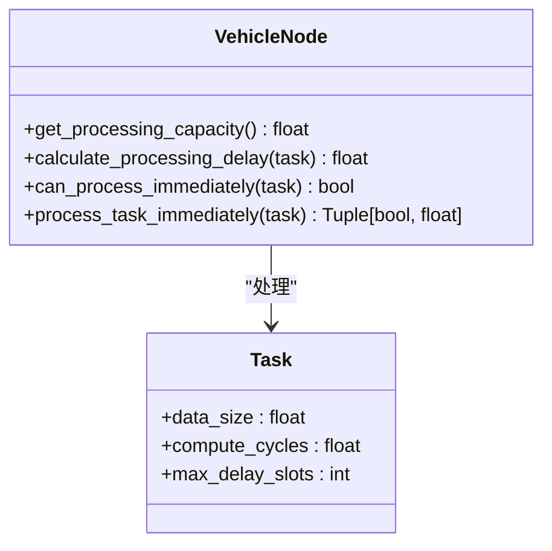
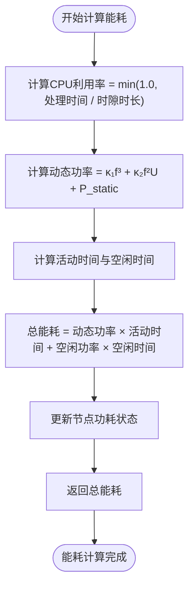
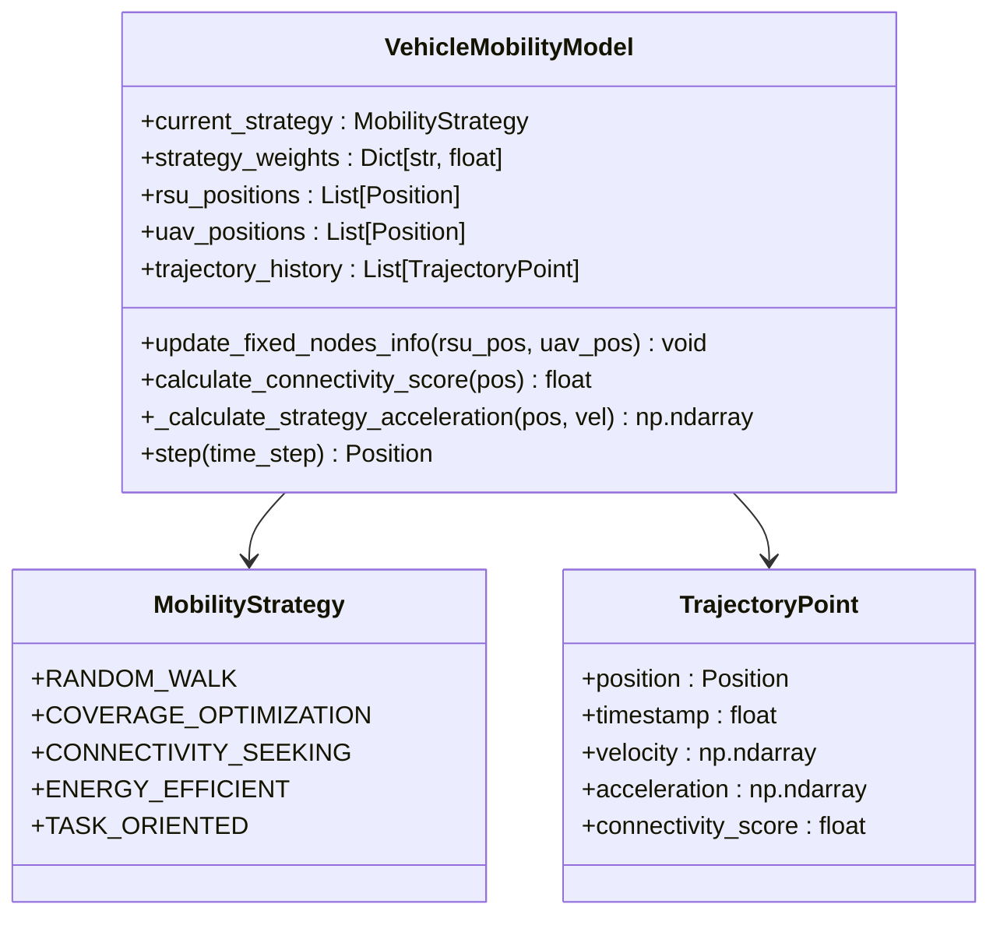
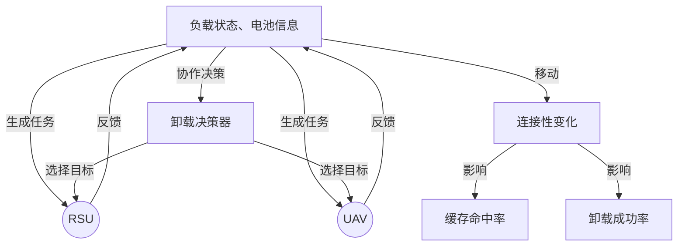

# 车辆节点模型

<cite>
**本文档引用的文件**   
- [vehicle_node.py](file://models/vehicle_node.py)
- [base_node.py](file://models/base_node.py)
- [enhanced_vehicle_mobility.py](file://models/enhanced_vehicle_mobility.py)
</cite>

## 目录
1. [引言](#引言)
2. [核心功能与继承关系](#核心功能与继承关系)
3. [移动性建模](#移动性建模)
4. [任务生成机制](#任务生成机制)
5. [本地处理能力](#本地处理能力)
6. [能耗模型](#能耗模型)
7. [状态更新流程](#状态更新流程)
8. [高级移动性模型](#高级移动性模型)
9. [多智能体协作中的角色](#多智能体协作中的角色)
10. [结论](#结论)

## 引言
车辆节点（VehicleNode）是车联网（Vehicular Edge Computing, VEC）系统中的核心移动实体，负责生成计算任务、进行本地处理，并与路边单元（RSU）和无人机（UAV）等固定节点进行通信协作。该节点类继承自抽象基类BaseNode，扩展了车辆特有的移动性、任务生成和能耗特性。本文档详细阐述VehicleNode的实现细节，结合enhanced_vehicle_mobility.py中的高级移动性模型，说明其在真实交通场景下的行为模拟及其对缓存与卸载决策的影响。

## 核心功能与继承关系

VehicleNode类继承自BaseNode，实现了其定义的抽象方法，并扩展了车辆特有的功能。BaseNode作为所有计算节点（车辆、RSU、UAV）的公共基类，提供了队列管理、任务调度、状态统计等通用功能。



**Diagram sources**
- [base_node.py](file://models/base_node.py#L18-L312)
- [vehicle_node.py](file://models/vehicle_node.py#L15-L300)
- [rsu_node.py](file://models/rsu_node.py#L16-L423)
- [uav_node.py](file://models/uav_node.py#L14-L360)

**Section sources**
- [vehicle_node.py](file://models/vehicle_node.py#L15-L300)
- [base_node.py](file://models/base_node.py#L18-L312)

## 移动性建模

VehicleNode通过`velocity`向量和`max_speed`属性来模拟车辆的动态位置更新。其移动模型采用简单的匀速直线运动，并在到达模拟区域边界时进行转向。



**Diagram sources**
- [vehicle_node.py](file://models/vehicle_node.py#L154-L184)

**Section sources**
- [vehicle_node.py](file://models/vehicle_node.py#L154-L184)

## 任务生成机制

车辆节点根据泊松过程生成任务，以模拟真实交通中随机出现的计算需求。任务生成速率由配置文件中的`task.arrival_rate`决定。



**Diagram sources**
- [vehicle_node.py](file://models/vehicle_node.py#L102-L119)
- [vehicle_node.py](file://models/vehicle_node.py#L121-L152)

**Section sources**
- [vehicle_node.py](file://models/vehicle_node.py#L102-L152)

## 本地处理能力

车辆节点的本地处理能力由其CPU频率、时隙时长和计算密度共同决定。该能力用于判断在当前时隙内可以处理多少数据量。



**Diagram sources**
- [vehicle_node.py](file://models/vehicle_node.py#L59-L68)
- [vehicle_node.py](file://models/vehicle_node.py#L70-L76)
- [vehicle_node.py](file://models/vehicle_node.py#L244-L268)
- [vehicle_node.py](file://models/vehicle_node.py#L270-L300)

**Section sources**
- [vehicle_node.py](file://models/vehicle_node.py#L59-L300)

## 能耗模型

车辆节点采用动态功率模型来计算处理能耗，该模型综合考虑了CPU频率的立方项、平方项以及静态功耗，符合论文中的公式(7)-(9)。



**Diagram sources**
- [vehicle_node.py](file://models/vehicle_node.py#L78-L100)

**Section sources**
- [vehicle_node.py](file://models/vehicle_node.py#L78-L100)

## 状态更新流程

车辆节点的单步更新（`step`方法）是其核心逻辑，协调了位置更新、生命周期管理、任务生成和本地处理等多个操作。

```mermaid
sequenceDiagram
participant Vehicle as VehicleNode
participant Queue as Queue Management
participant TaskGen as Task Generation
participant LocalProc as Local Processing
Vehicle->>Vehicle : update_position(time_step)
Vehicle->>Queue : update_queue_lifetimes()
Vehicle->>TaskGen : generate_tasks(current_slot)
TaskGen-->>Vehicle : new_tasks
Vehicle->>LocalProc : process local queue
loop while capacity > 0
LocalProc->>Vehicle : get_next_task_to_process()
alt 任务存在且可处理
Vehicle->>Vehicle : process_task(next_task)
Vehicle-->>LocalProc : processed_tasks
else 任务不存在或无法处理
break
end
end
Vehicle->>Vehicle : _update_statistics()
Vehicle-->> : (new_tasks, processed_tasks)
```

**Diagram sources**
- [vehicle_node.py](file://models/vehicle_node.py#L196-L242)

**Section sources**
- [vehicle_node.py](file://models/vehicle_node.py#L196-L242)

## 高级移动性模型

`enhanced_vehicle_mobility.py`文件中的`VehicleMobilityModel`类提供了比基础模型更复杂的移动性策略，旨在优化车辆与固定节点（RSU/UAV）的连接性。



该模型通过`update_mobility_strategy`方法接收来自智能体的动作，动态调整移动策略和速度，从而影响其在系统中的连接质量、覆盖范围和能效。这种高级移动性直接影响缓存与卸载决策，因为连接性更好的车辆更有可能成功卸载任务或从RSU获取缓存内容。

**Diagram sources**
- [enhanced_vehicle_mobility.py](file://models/enhanced_vehicle_mobility.py#L33-L398)

**Section sources**
- [enhanced_vehicle_mobility.py](file://models/enhanced_vehicle_mobility.py#L33-L398)

## 多智能体协作中的角色

在多智能体系统中，车辆节点不仅是任务的生产者和消费者，也是整个网络动态性的主要来源。其移动性直接影响RSU和UAV的负载均衡、缓存命中率和任务迁移成本。



车辆节点的状态向量（`get_state_vector`）被设计为强化学习算法的输入，包含了CPU利用率、负载因子、队列长度、等待时间等关键信息，使其能够与中央决策器进行有效协作。

**Section sources**
- [vehicle_node.py](file://models/vehicle_node.py#L15-L300)
- [base_node.py](file://models/base_node.py#L294-L312)
- [enhanced_vehicle_mobility.py](file://models/enhanced_vehicle_mobility.py#L306-L346)

## 结论
VehicleNode类通过继承BaseNode并扩展车辆特有的属性和方法，实现了对车辆在VEC系统中行为的全面建模。其移动性、任务生成、本地处理和能耗模型共同构成了一个逼真的车辆节点仿真。结合`enhanced_vehicle_mobility.py`中的高级移动性策略，该模型能够模拟真实交通场景下的复杂动态，为研究缓存优化、任务卸载和资源调度等关键问题提供了坚实的基础。车辆节点在多智能体协作中扮演着核心角色，其动态行为是驱动整个系统演化的关键因素。