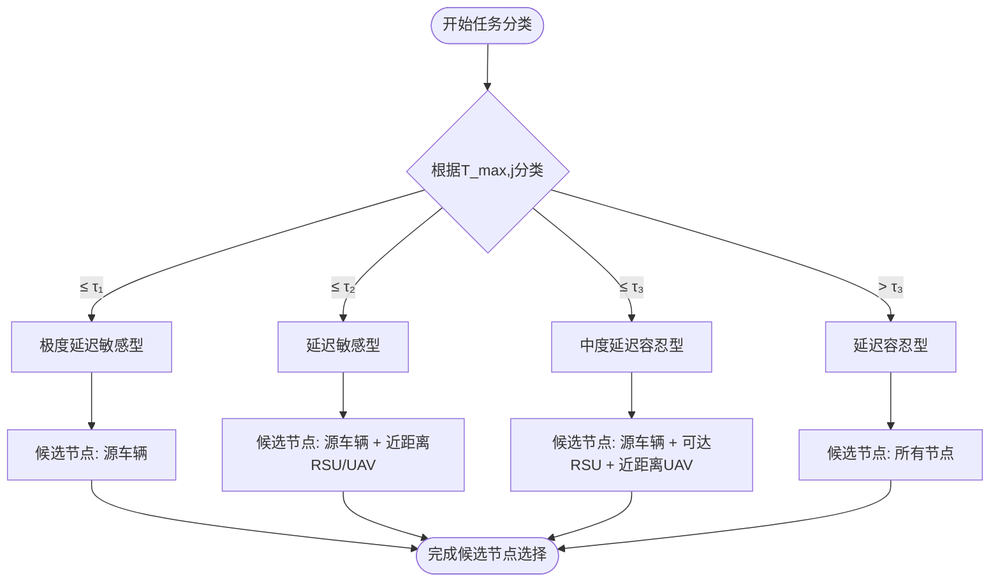
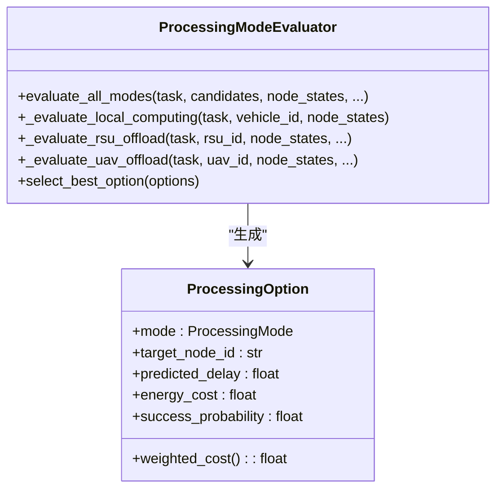
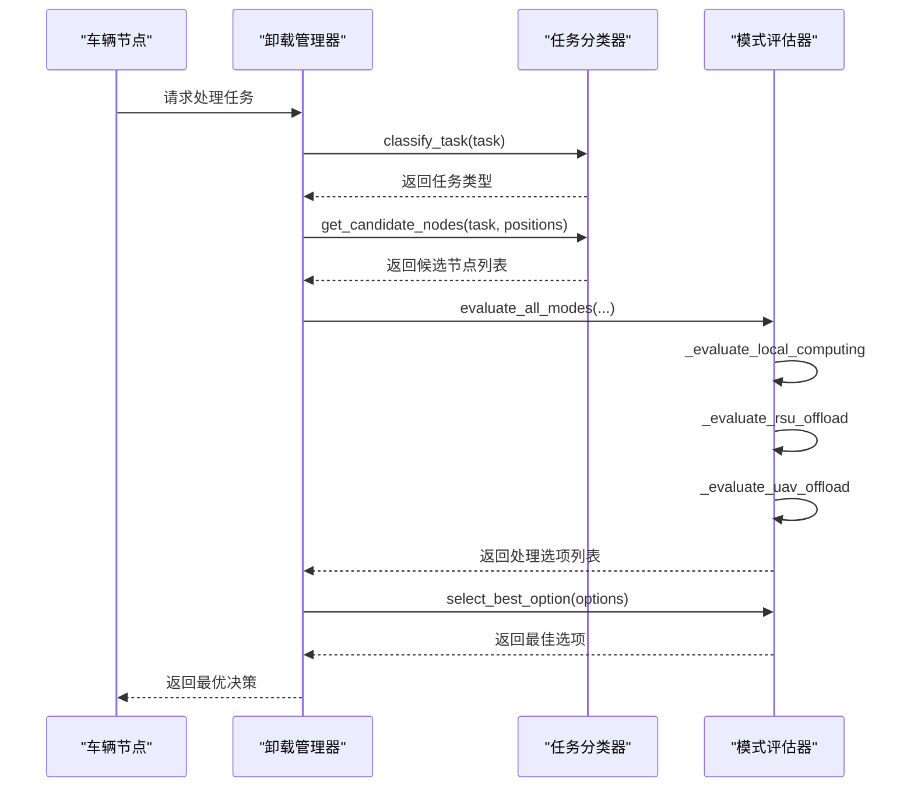

# 任务卸载机制

<cite>
**本文档中引用的文件**  
- [offloading_manager.py](file://decision/offloading_manager.py)
- [matd3.py](file://algorithms/matd3.py)
- [cache_manager.py](file://caching/cache_manager.py)
- [vehicle_node.py](file://models/vehicle_node.py)
- [rsu_node.py](file://models/rsu_node.py)
- [uav_node.py](file://models/uav_node.py)
- [data_structures.py](file://models/data_structures.py)
- [vec_system_config.json](file://vec_system_config.json)
- [system_config.py](file://config/system_config.py)
- [standardized_reward.py](file://utils/standardized_reward.py)
</cite>

## 目录
1. [引言](#引言)
2. [任务分类与候选节点选择](#任务分类与候选节点选择)
3. [处理模式评估与多目标优化](#处理模式评估与多目标优化)
4. [卸载决策制定流程](#卸载决策制定流程)
5. [与MATD3多智能体算法的交互](#与matd3多智能体算法的交互)
6. [高密度车联网场景下的性能优化](#高密度车联网场景下的性能优化)
7. [结论](#结论)

## 引言

在车联网（Vehicular Edge Computing, VEC）系统中，任务卸载机制是实现高效计算资源利用和低延迟服务的关键。本系统通过`offloading_manager.py`模块实现了一套完整的任务卸载决策框架，能够根据车辆节点、RSU（Road Side Unit）和UAV（Unmanned Aerial Vehicle）的实时状态（如计算负载、通信延迟、能量剩余）进行智能卸载决策。该机制结合了任务分类、候选节点选择、多目标优化函数和多智能体强化学习算法（如MATD3），以实现延迟、能耗和可靠性的综合优化。本文档将深入解析该机制的实现细节，包括任务分类、模式评估、决策流程、与多智能体算法的交互以及在高密度场景下的性能优化策略。

## 任务分类与候选节点选择

任务卸载的第一步是根据任务的延迟容忍度对其进行分类，然后基于分类结果确定候选的处理节点集合。

### 任务分类机制

任务分类器（`TaskClassifier`）根据任务的最大可容忍延迟时隙数（`max_delay_slots`）将其分为四类：
- **极度延迟敏感型**：`max_delay_slots ≤ τ₁`（默认2时隙）
- **延迟敏感型**：`τ₁ < max_delay_slots ≤ τ₂`（默认5时隙）
- **中度延迟容忍型**：`τ₂ < max_delay_slots ≤ τ₃`（默认10时隙）
- **延迟容忍型**：`max_delay_slots > τ₃`

此分类逻辑在`TaskClassifier.classify_task`方法中实现，通过与配置文件中的阈值进行比较来确定任务类型。

### 候选节点选择策略

候选节点的选择策略根据任务类型动态调整，以平衡延迟、能耗和网络负载：
- **极度延迟敏感型任务**：仅限本地处理，候选节点集合为`{v_j}`（源车辆自身）。
- **延迟敏感型任务**：候选节点包括源车辆、附近低延迟的RSU（距离≤800米，最多3个）和有能力的UAV（距离≤500米）。
- **中度延迟容忍型任务**：候选节点包括源车辆、可达的RSU（距离≤800米）和近距离有能力的UAV（距离≤600米）。
- **延迟容忍型任务**：所有节点（车辆、RSU、UAV）均为候选节点。

该策略在`TaskClassifier.get_candidate_nodes`方法中实现，通过调用`_get_nearby_rsus`、`_get_reachable_rsus`和`_get_capable_uavs`等辅助方法来获取符合条件的节点。



**图示来源**
- [offloading_manager.py](file://decision/offloading_manager.py#L97-L145)

**本节来源**
- [offloading_manager.py](file://decision/offloading_manager.py#L75-L95)
- [offloading_manager.py](file://decision/offloading_manager.py#L97-L145)
- [system_config.py](file://config/system_config.py#L120-L128)

## 处理模式评估与多目标优化

在确定候选节点后，系统会评估每个节点上可行的处理模式，并通过多目标优化函数选择最佳方案。

### 处理模式

系统支持四种主要的处理模式：
- **本地计算** (`LOCAL_COMPUTING`)：任务在源车辆上处理。
- **RSU卸载** (`RSU_OFFLOAD_CACHE_HIT` / `RSU_OFFLOAD_NO_CACHE`)：任务卸载到RSU，区分缓存命中与未命中。
- **RSU间迁移** (`RSU_MIGRATION`)：任务从过载的RSU迁移到负载较轻的RSU。
- **UAV卸载** (`UAV_OFFLOAD`)：任务卸载到UAV。

### 多目标优化函数

系统采用加权成本函数来评估每个处理选项的优劣。成本越低，选项越优。成本函数综合考虑了延迟、能耗和可靠性三个维度：

```python
def weighted_cost(self) -> float:
    normalized_delay = self.predicted_delay / delay_norm
    normalized_energy = self.energy_cost / energy_norm
    reliability_penalty = 1.0 - self.success_probability
    return (w_delay * normalized_delay + 
            w_energy * normalized_energy + 
            w_reliability * reliability_penalty)
```

其中：
- **归一化因子**：`delay_norm = 0.15`秒，`energy_norm = 250.0`焦耳。
- **权重**：`w_delay = 0.15`, `w_energy = 0.7`, `w_reliability = 0.15`。可以看出，系统更倾向于降低能耗。

### 模式评估细节

- **本地计算**：计算处理时延和等待时延，能耗基于车辆的动态功耗模型（`P^comp_n(f_n, U_n) = κ₁f_n³ + κ₂f_n²U_n + P_static`）。
- **RSU卸载**：计算通信时延（上传和下载）、处理时延和等待时延。缓存命中时，仅需下载结果，时延和能耗极低。
- **UAV卸载**：计算通信时延、处理时延和等待时延。能耗包括通信能耗和悬停能耗，且处理性能受电池电量影响。



**图示来源**
- [offloading_manager.py](file://decision/offloading_manager.py#L35-L52)
- [offloading_manager.py](file://decision/offloading_manager.py#L225-L267)

**本节来源**
- [offloading_manager.py](file://decision/offloading_manager.py#L35-L52)
- [offloading_manager.py](file://decision/offloading_manager.py#L225-L267)
- [offloading_manager.py](file://decision/offloading_manager.py#L269-L462)
- [vehicle_node.py](file://models/vehicle_node.py#L100-L120)
- [rsu_node.py](file://models/rsu_node.py#L100-L120)
- [uav_node.py](file://models/uav_node.py#L100-L120)

## 卸载决策制定流程

完整的卸载决策流程由`OffloadingDecisionMaker`类协调，整合了任务分类、候选节点选择和模式评估。

### 决策流程

1.  **任务分类**：调用`TaskClassifier.classify_task`方法确定任务类型。
2.  **候选节点选择**：调用`TaskClassifier.get_candidate_nodes`方法获取候选节点列表。
3.  **模式评估**：调用`ProcessingModeEvaluator.evaluate_all_modes`方法，为每个候选节点评估所有可行的处理模式，生成`ProcessingOption`列表。
4.  **最佳选项选择**：调用`ProcessingModeEvaluator.select_best_option`方法，从所有可行选项中选择加权成本最小的选项。
5.  **统计更新**：记录本次决策的类型，用于后续分析。

该流程在`OffloadingDecisionMaker.make_offloading_decision`方法中实现。

### 序列图：任务请求处理流程



**图示来源**
- [offloading_manager.py](file://decision/offloading_manager.py#L576-L610)

**本节来源**
- [offloading_manager.py](file://decision/offloading_manager.py#L576-L610)

## 与MATD3多智能体算法的交互

任务卸载决策系统与MATD3（Multi-Agent Twin Delayed DDPG）等多智能体强化学习算法紧密集成，以实现全局最优。

### 交互接口

- **状态向量构建**：`MATD3Environment.get_state_vector`方法为每个智能体（车辆、RSU、UAV）构建状态向量。该向量包含系统级指标（如平均时延、总能耗）和节点级指标（如平均负载、可用性、缓存命中率）。
- **奖励函数**：`standardized_reward.calculate_standardized_reward`函数提供标准化的奖励计算，严格对应论文中的目标函数 `min(ω_T * delay + ω_E * energy + ω_D * data_loss)`。奖励权重在`system_config.py`中配置。
- **动作执行**：MATD3智能体根据当前状态选择动作，这些动作可能影响节点的资源分配或迁移决策，进而影响`offloading_manager`的决策环境。

### 状态与奖励示例

车辆智能体的状态向量可能包含：
- 归一化平均时延、归一化总能耗、数据丢失率、任务完成率。
- 平均车辆负载、平均队列长度、车辆数量比例。
- RSU平均负载、RSU可用性、缓存命中率。
- UAV平均电量、UAV平均负载、UAV可用性。

奖励函数将系统性能指标（时延、能耗、丢失率）按权重加权求和，取负值作为奖励，引导智能体向优化目标收敛。

**本节来源**
- [matd3.py](file://algorithms/matd3.py#L289-L408)
- [standardized_reward.py](file://utils/standardized_reward.py#L20-L80)
- [system_config.py](file://config/system_config.py#L200-L210)

## 高密度车联网场景下的性能优化

在高密度车联网场景下，系统面临计算和通信瓶颈。为此，系统采用了多种优化策略。

### 性能瓶颈

- **决策延迟**：在车辆密集区域，候选节点数量激增，导致评估所有模式的计算开销巨大。
- **通信开销**：频繁的状态同步和决策请求会占用大量带宽。
- **状态同步延迟**：节点状态的实时性难以保证，影响决策准确性。

### 优化策略

- **异步决策批处理**：系统可以将多个任务的决策请求进行批处理，一次性评估，减少函数调用开销。虽然代码中未直接体现，但`MATD3`的`batch_size`优化（`OPTIMIZED_BATCH_SIZES`）体现了批处理思想。
- **状态预测缓存**：系统通过预测模型（如`RSUNode.predict_cache_request_probability`中的逻辑回归）预测缓存请求概率，避免对每个请求都进行实时计算。`CollaborativeCacheManager`的协作缓存机制也减少了重复计算。
- **经验回放与目标网络**：在MATD3算法中，使用经验回放缓冲区（`ReplayBuffer`）和目标网络（`actor_target`, `critic_target`）来稳定训练过程，提高学习效率，间接提升了决策质量。

这些优化策略共同作用，确保了系统在高密度场景下的可扩展性和实时性。

**本节来源**
- [matd3.py](file://algorithms/matd3.py#L20-L30)
- [cache_manager.py](file://caching/cache_manager.py#L464-L471)
- [rsu_node.py](file://models/rsu_node.py#L200-L220)

## 结论

本文档深入解析了`offloading_manager.py`模块实现的任务卸载机制。该机制通过四级任务分类和动态候选节点选择，为不同特性的任务提供了差异化的处理路径。通过构建包含延迟、能耗和可靠性的多目标优化函数，系统能够智能地在本地计算、RSU卸载、UAV卸载和RSU间迁移等模式中做出最优决策。该机制与MATD3等多智能体强化学习算法无缝集成，利用标准化的状态向量和奖励函数实现全局优化。在高密度场景下，通过异步批处理和状态预测缓存等策略，有效缓解了性能瓶颈。整体设计体现了对车联网环境复杂性的深刻理解，为实现高效、低延迟的边缘计算服务提供了坚实的技术基础。