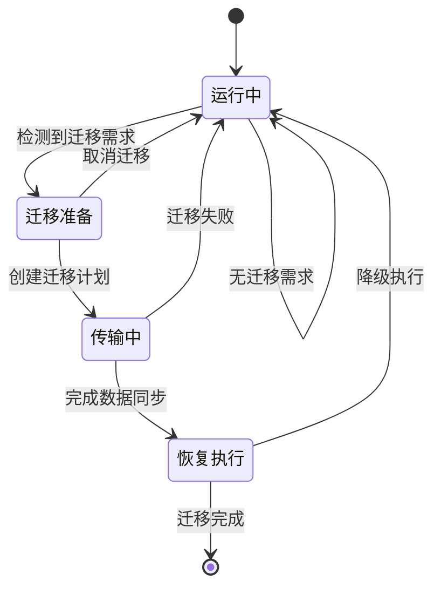

# 任务迁移控制

<cite>
**Referenced Files in This Document**   
- [migration_manager.py](file://migration/migration_manager.py)
- [enhanced_vehicle_mobility.py](file://models/enhanced_vehicle_mobility.py)
- [models.py](file://communication/models.py)
</cite>

## 目录
1. [引言](#引言)
2. [迁移触发条件](#迁移触发条件)
3. [迁移成本评估模型](#迁移成本评估模型)
4. [迁移决策流程](#迁移决策流程)
5. [前瞻性迁移规划](#前瞻性迁移规划)
6. [状态同步与数据传输](#状态同步与数据传输)
7. [故障恢复策略](#故障恢复策略)
8. [任务迁移状态机](#任务迁移状态机)
9. [跨域迁移安全机制](#跨域迁移安全机制)
10. [结论](#结论)

## 引言

本文档详细描述了车辆边缘计算（VEC）系统中任务迁移管理器的工作原理。任务迁移是确保服务质量连续性和系统负载均衡的关键机制。本系统实现了基于Keep-Before-Break的低中断迁移策略，结合车辆移动性预测算法，实现了智能化、前瞻性的任务迁移决策。文档将深入分析迁移触发条件、成本评估模型、决策流程以及与移动性预测的协同工作机制。

**Section sources**
- [migration_manager.py](file://migration/migration_manager.py#L1-L251)
- [enhanced_vehicle_mobility.py](file://models/enhanced_vehicle_mobility.py#L1-L398)

## 迁移触发条件

任务迁移管理器根据多种条件触发迁移决策，确保系统在过载、资源不足或连接性下降时能够及时响应。

### RSU过载触发
当RSU节点的负载因子超过预设阈值时，系统会触发迁移。具体条件为：
- 节点ID以"rsu_"开头
- 当前负载因子 > `rsu_overload_threshold`（从配置文件读取）

该机制通过`check_migration_needs`方法实现，确保高负载的RSU能够将其部分任务迁移到其他可用节点，维持服务质量和响应速度。

### UAV资源不足触发
UAV节点的迁移触发条件更为复杂，考虑了电池电量和计算负载两个维度：
- **电池电量不足**：UAV电池电量低于`uav_min_battery`阈值
- **计算过载**：UAV负载因子超过`uav_overload_threshold`

当任一条件满足时，系统将启动迁移流程，将UAV上的任务迁移到地面RSU或其他UAV，确保任务的连续执行和UAV的能源安全。

### 冷却期管理
为防止频繁迁移导致系统震荡，系统实现了冷却期机制。在节点成功执行迁移后，会记录其最后迁移时间。在`cooldown_period`时间内，该节点不会再次成为迁移源，确保系统稳定。

**Section sources**
- [migration_manager.py](file://migration/migration_manager.py#L66-L96)
- [migration_manager.py](file://migration/migration_manager.py#L43-L64)

## 迁移成本评估模型

迁移决策基于多维度的成本评估模型，综合考虑传输开销、执行中断代价和目标节点负载，实现最优的迁移选择。

### 成本计算公式
迁移总成本采用加权和的形式计算：
```
总成本 = α_comp × 计算成本 + α_tx × 传输成本 + α_lat × 延迟成本
```

其中各参数从配置文件中读取：
- `alpha_comp`：计算成本权重
- `alpha_tx`：传输成本权重  
- `alpha_lat`：延迟成本权重

### 成本维度解析
**传输开销**：基于源节点与目标节点间的距离计算，距离越远，传输成本越高。计算公式为`distance / 1000.0`，单位为千米。

**执行中断代价**：迁移过程中的服务中断时间被量化为成本。系统采用Keep-Before-Break机制，将中断时间控制在总迁移时延的5%。

**目标节点负载**：在`_find_best_target`方法中，系统优先选择负载因子低于阈值80%的节点作为迁移目标，避免将负载迁移到已经接近饱和的节点。

**Section sources**
- [migration_manager.py](file://migration/migration_manager.py#L131-L172)
- [migration_manager.py](file://migration/migration_manager.py#L98-L129)

## 迁移决策流程

任务迁移管理器采用分阶段的决策流程，从需求检测到计划执行，确保迁移过程的可靠性和效率。

### 需求检测阶段
`check_migration_needs`方法遍历所有节点状态，根据预设的触发条件识别需要迁移的节点。该方法首先检查冷却期，避免频繁迁移，然后根据节点类型（RSU或UAV）应用不同的评估标准。

### 目标选择阶段
`_find_best_target`方法负责为源节点寻找最佳迁移目标。对于RSU，候选目标包括其他RSU和电量充足的UAV；对于UAV，主要迁移到负载较低的RSU。在候选列表中，系统选择距离最近的节点作为目标，最小化传输开销。

### 计划创建阶段
`_create_migration_plan`方法创建详细的迁移计划，包括：
- 迁移ID（UUID生成）
- 源节点和目标节点ID
- 迁移成本和时延
- 成功概率（随距离增加而降低）
- 迁移类型（RSU到RSU、RSU到UAV等）

### 执行与反馈阶段
`execute_migration`方法模拟Keep-Before-Break迁移过程，分为准备（70%时间）、同步（25%时间）和静默切换（5%时间）三个阶段。迁移成功后，更新统计信息和冷却时间。

**Section sources**
- [migration_manager.py](file://migration/migration_manager.py#L66-L205)

## 前瞻性迁移规划

通过与`enhanced_vehicle_mobility.py`中的移动性预测算法协同工作，系统实现了前瞻性的迁移规划，能够在车辆驶出RSU覆盖范围前预先准备迁移。

### 移动性预测机制
`VehicleMobilityModel`类实现了多种移动策略，包括：
- **连接性寻求**：向连接质量更好的区域移动
- **覆盖优化**：在RSU覆盖区域边缘移动以最大化服务范围
- **能效优化**：保持稳定速度，减少急加速
- **随机游走**：基础移动模式

### 连接性评分
`calculate_connectivity_score`方法计算车辆在特定位置的连接性评分，综合考虑与RSU和UAV的距离：
- RSU连接性：`1.0 - (distance / rsu_coverage_radius)`，权重0.6
- UAV连接性：`1.0 - (distance / uav_coverage_radius)`，权重0.4

评分越高，表示连接质量越好。

### 轨迹预测
`predict_trajectory`方法基于当前速度、加速度和移动策略，预测未来3秒内的车辆轨迹。预测结果包含每个轨迹点的位置、速度、加速度和连接性评分，为迁移决策提供前瞻性信息。

### 策略协同
迁移管理器可以利用车辆的预测轨迹和连接性评分，在车辆即将驶出覆盖范围时提前触发迁移，实现无缝的服务切换。

**Section sources**
- [enhanced_vehicle_mobility.py](file://models/enhanced_vehicle_mobility.py#L79-L144)
- [enhanced_vehicle_mobility.py](file://models/enhanced_vehicle_mobility.py#L39-L72)

## 状态同步与数据传输

迁移过程中的状态同步和数据传输是确保任务无缝切换的关键环节。

### Keep-Before-Break机制
系统采用Keep-Before-Break迁移策略，其核心特点是：
1. **准备阶段**（70%时间）：在源节点和目标节点同时建立连接，准备迁移环境
2. **同步阶段**（25%时间）：将任务状态和必要数据从源节点同步到目标节点
3. **静默切换阶段**（5%时间）：短暂中断服务，完成最终切换

这种机制将服务中断时间最小化，确保用户体验。

### 数据传输协议
基于`communication/models.py`定义的消息格式，系统实现了结构化的数据传输：
- **传输时延计算**：考虑传播时延、传输时延和处理时延
- **SINR计算**：基于3GPP标准的VEC无线通信信道模型
- **数据速率**：`R = B × log2(1 + SINR) × η_coding`

这些模型确保了数据传输过程的准确性和可靠性。

**Section sources**
- [migration_manager.py](file://migration/migration_manager.py#L174-L205)
- [models.py](file://communication/models.py#L0-L612)

## 故障恢复策略

系统实现了多层次的故障恢复机制，确保迁移过程的鲁棒性。

### 成功概率模型
迁移计划包含成功概率评估，计算公式为：
```
success_prob = max(0.5, 0.9 - distance / 10000.0)
```
距离越远，成功概率越低，最低为50%。

### 随机化执行
`execute_migration`方法使用随机数判断迁移是否成功，模拟真实环境中的不确定性。只有当随机数小于成功概率时，迁移才被视为成功。

### 统计与反馈
系统维护详细的迁移统计信息，包括：
- 总尝试次数
- 成功迁移次数
- 总中断时间
- 平均迁移成本

这些统计数据通过`get_migration_statistics`方法提供，可用于系统性能评估和参数调优。

### 冷却期机制
成功迁移后，源节点进入冷却期，防止短时间内再次迁移，避免系统震荡和资源浪费。

**Section sources**
- [migration_manager.py](file://migration/migration_manager.py#L174-L217)

## 任务迁移状态机



**Diagram sources**
- [migration_manager.py](file://migration/migration_manager.py#L66-L205)

**Section sources**
- [migration_manager.py](file://migration/migration_manager.py#L66-L205)

## 跨域迁移安全机制

虽然当前实现主要关注迁移的性能和效率，但系统架构为跨域迁移的安全认证和资源预留提供了基础。

### 资源预留
在`_create_migration_plan`阶段，系统隐式地进行了资源预留评估，通过检查目标节点的负载因子确保其有足够的计算资源接收新任务。

### 安全认证
虽然代码中未显式实现安全认证流程，但迁移ID（UUID）的使用为后续实现认证机制提供了基础。每个迁移计划都有唯一的标识符，可用于追踪和审计。

### 扩展性设计
系统采用模块化设计，`MigrationPlan`数据结构可以轻松扩展以包含安全令牌、认证信息等字段，支持未来实现更复杂的安全机制。

**Section sources**
- [migration_manager.py](file://migration/migration_manager.py#L25-L35)

## 结论

本文档详细分析了VEC系统中任务迁移管理器的工作原理。系统通过综合考虑RSU过载、UAV资源不足等触发条件，基于多维度成本评估模型做出迁移决策。结合车辆移动性预测算法，实现了前瞻性的迁移规划，能够在连接质量下降前预先准备迁移。采用Keep-Before-Break机制最小化服务中断时间，并通过详细的统计信息支持系统优化。该设计有效平衡了系统负载，提高了服务质量连续性，为车辆边缘计算环境下的任务迁移提供了可靠的解决方案。