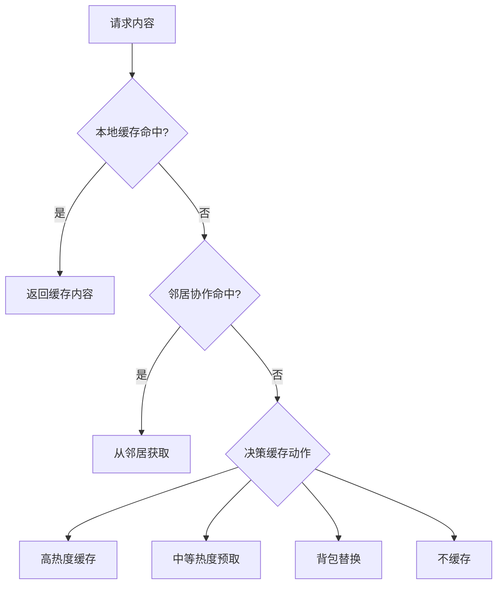
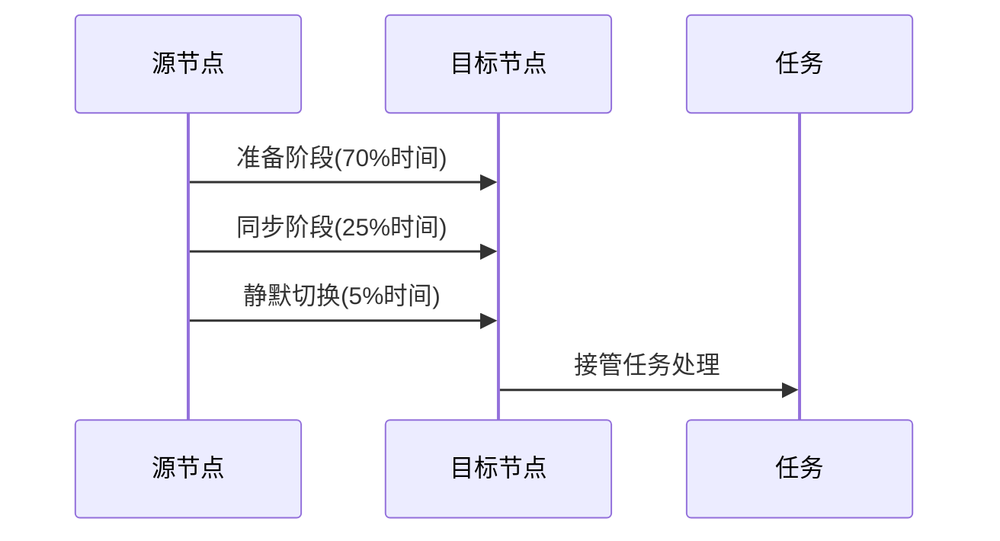
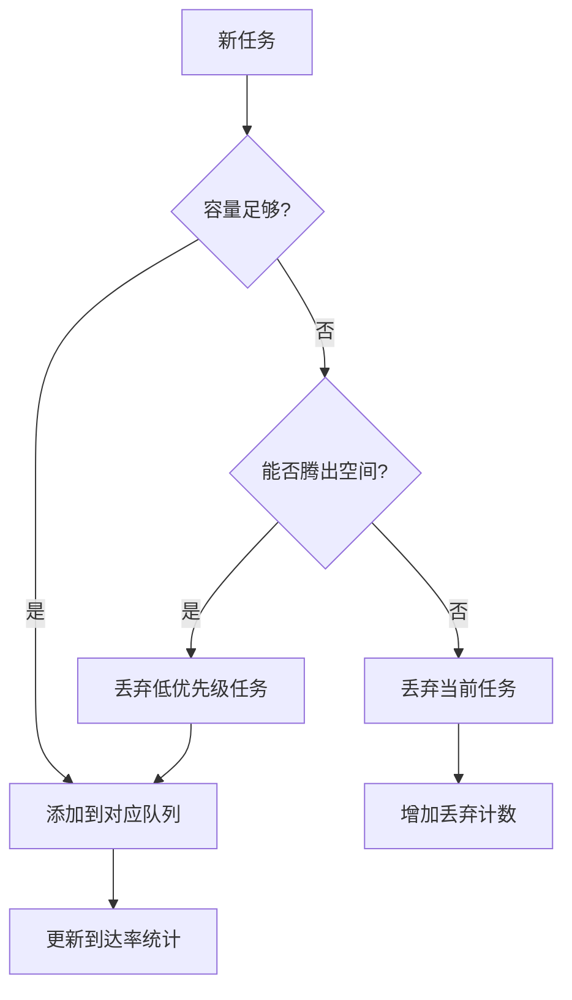
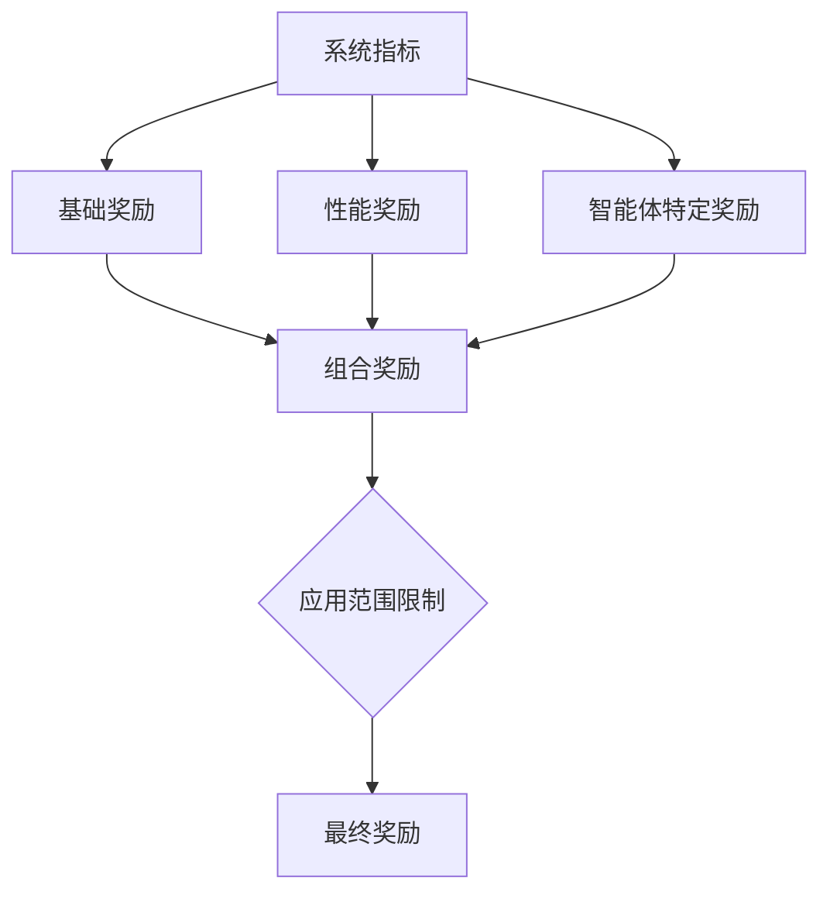
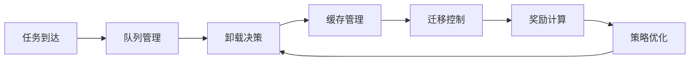

# 决策系统架构

<cite>
**本文档引用文件**   
- [offloading_manager.py](file://decision\offloading_manager.py)
- [cache_manager.py](file://caching\cache_manager.py)
- [migration_manager.py](file://migration\migration_manager.py)
- [queue_manager.py](file://core\queue_manager.py)
- [reward_calculator.py](file://utils\reward_calculator.py)
</cite>

## 目录
1. [任务卸载决策机制](#任务卸载决策机制)
2. [缓存管理与替换策略](#缓存管理与替换策略)
3. [任务迁移控制机制](#任务迁移控制机制)
4. [队列调度与优先级管理](#队列调度与优先级管理)
5. [多目标奖励函数设计](#多目标奖励函数设计)
6. [决策流程与协同机制](#决策流程与协同机制)

## 任务卸载决策机制

任务卸载决策系统基于节点负载、链路质量和能耗状态生成最优卸载策略。系统首先通过`TaskClassifier`对任务进行四级分类：极度延迟敏感、延迟敏感、中度延迟容忍和延迟容忍。分类依据任务最大延迟容忍度与预设阈值的比较结果。

对于不同类别的任务，系统采用差异化的候选节点选择策略：
- 极度延迟敏感任务仅在本地处理
- 延迟敏感任务可选择本地、近距离RSU或UAV
- 中度延迟容忍任务可扩展至可达RSU和近距离UAV
- 延迟容忍任务可选择网络中所有节点

`ProcessingModeEvaluator`评估五种处理模式的性能指标：
1. 本地计算
2. RSU卸载（缓存命中）
3. RSU卸载（缓存未命中）
4. RSU间迁移
5. UAV卸载

每种模式的评估综合考虑预测延迟、能耗成本和成功概率。系统采用加权成本函数进行决策，其中能耗权重为0.7，延迟权重为0.15，可靠性权重为0.15。最终选择加权成本最小的处理选项作为最佳决策。

**Section sources**
- [offloading_manager.py](file://decision\offloading_manager.py#L75-L95)
- [offloading_manager.py](file://decision\offloading_manager.py#L97-L145)
- [offloading_manager.py](file://decision\offloading_manager.py#L225-L267)
- [offloading_manager.py](file://decision\offloading_manager.py#L269-L304)

## 缓存管理与替换策略

缓存管理系统采用基于热度的智能缓存策略，结合历史热度、时间槽热度和Zipf流行度分布。`HeatBasedCacheStrategy`通过衰减因子（0.9）和混合系数（0.7）计算综合热度，公式为：Heat(c) = η × H_hist(c) + (1-η) × H_slot(c,t)。

`CollaborativeCacheManager`实现四种缓存动作：
1. 缓存命中：直接返回内容
2. 邻居协作：从邻近节点获取内容
3. 高热度缓存：直接缓存高热度内容
4. 背包替换：在容量不足时进行优化替换

系统支持多种替换策略：
- LRU（最近最少使用）
- LFU（最不经常使用）
- FIFO（先进先出）
- 混合策略

背包替换算法采用贪心策略，按价值密度排序，优先替换价值密度低的缓存项。缓存优先级综合考虑热度、流行度、大小和最近性等因素。

**Diagram sources **
- [cache_manager.py](file://caching\cache_manager.py#L199-L245)

**Section sources**
- [cache_manager.py](file://caching\cache_manager.py#L69-L86)
- [cache_manager.py](file://caching\cache_manager.py#L88-L101)
- [cache_manager.py](file://caching\cache_manager.py#L269-L298)
- [cache_manager.py](file://caching\cache_manager.py#L335-L375)

## 任务迁移控制机制

任务迁移管理系统实现Keep-Before-Break迁移机制，确保低中断切换。`TaskMigrationManager`监控RSU和UAV的负载状态，当RSU负载超过阈值或UAV电池低于最小值时触发迁移。

迁移决策考虑以下因素：
- 源节点和目标节点的负载状态
- 节点间距离
- 通信带宽
- 电池水平

系统支持四种迁移类型：
- RSU到RSU
- RSU到UAV
- UAV到RSU
- 预先迁移

迁移成本模型综合考虑计算成本、传输成本和延迟成本，权重分别为α_comp、α_tx和α_lat。迁移成功率与距离成反比，距离越远成功率越低。系统采用冷却机制防止频繁迁移，确保网络稳定性。

**Diagram sources **
- [migration_manager.py](file://migration\migration_manager.py#L174-L205)

**Section sources**
- [migration_manager.py](file://migration\migration_manager.py#L66-L96)
- [migration_manager.py](file://migration\migration_manager.py#L98-L129)
- [migration_manager.py](file://migration\migration_manager.py#L131-L172)

## 队列调度与优先级管理

队列管理系统实现多优先级生命周期队列，采用M/M/1非抢占式优先级队列模型。`PriorityQueueManager`维护(L×P)维队列矩阵，其中L为生命周期，P为优先级。

系统提供两种等待时间预测方法：
1. M/M/1模型预测：基于系统负载因子和到达率
2. 瞬时状态预测：基于当前队列积压情况

队列调度遵循非抢占式优先级策略，优先处理高优先级任务。当队列溢出时，系统尝试通过丢弃低优先级任务来腾出空间。队列状态向量包含容量利用率、活跃队列比例、总负载因子等特征，用于强化学习决策。

**Diagram sources **
- [queue_manager.py](file://core\queue_manager.py#L100-L137)

**Section sources**
- [queue_manager.py](file://core\queue_manager.py#L182-L228)
- [queue_manager.py](file://core\queue_manager.py#L230-L264)
- [queue_manager.py](file://core\queue_manager.py#L139-L156)
- [queue_manager.py](file://core\queue_manager.py#L329-L339)

## 多目标奖励函数设计

奖励计算系统实现统一的多目标奖励函数，平衡延迟、能耗和缓存命中率等指标。`UnifiedRewardCalculator`采用加权成本函数，目标是最小化ω_T × delay + ω_E × energy + ω_D × data_loss。

奖励函数包含三个组成部分：
1. 基础奖励：基于延迟、能耗和数据丢失率的负成本
2. 性能奖励：鼓励高任务完成率、缓存命中率和迁移成功率
3. 智能体特定奖励：根据不同类型智能体优化特定指标

权重配置：
- 延迟权重：ω_T
- 能耗权重：ω_E
- 数据丢失权重：ω_D

系统对奖励值进行归一化处理，限制在[-10.0, 5.0]范围内，并维护奖励统计信息用于分析和调试。

**Diagram sources **
- [reward_calculator.py](file://utils\reward_calculator.py#L103-L133)

**Section sources**
- [reward_calculator.py](file://utils\reward_calculator.py#L41-L74)
- [reward_calculator.py](file://utils\reward_calculator.py#L76-L101)
- [reward_calculator.py](file://utils\reward_calculator.py#L135-L176)

## 决策流程与协同机制

各决策模块通过标准化接口协同工作，形成完整的决策闭环。任务卸载、缓存管理和迁移控制三大功能模块共享节点状态和位置信息，确保决策的一致性和协调性。

决策流程如下：
1. 任务到达队列管理系统
2. 队列管理系统更新任务优先级和生命周期
3. 卸载决策系统评估候选处理模式
4. 缓存管理系统提供缓存状态信息
5. 迁移管理系统监控节点负载并触发迁移
6. 奖励计算系统评估决策效果

各模块通过回调机制实现松耦合，确保系统的可扩展性和灵活性。异常情况下，系统采用回滚机制恢复到稳定状态，保证服务连续性。

**Diagram sources **
- [offloading_manager.py](file://decision\offloading_manager.py#L576-L610)
- [queue_manager.py](file://core\queue_manager.py#L276-L314)

**Section sources**
- [offloading_manager.py](file://decision\offloading_manager.py#L562-L625)
- [cache_manager.py](file://caching\cache_manager.py#L144-L527)
- [migration_manager.py](file://migration\migration_manager.py#L38-L251)
- [queue_manager.py](file://core\queue_manager.py#L31-L493)
- [reward_calculator.py](file://utils\reward_calculator.py#L13-L226)