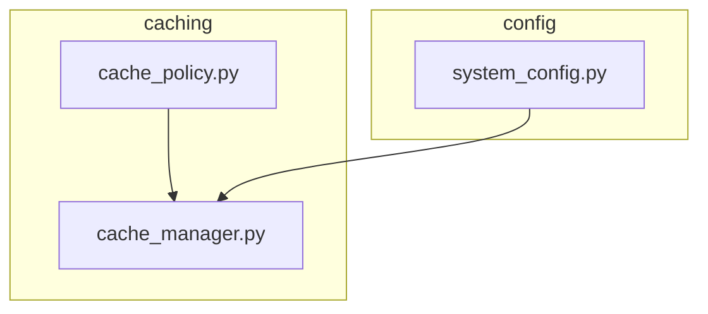
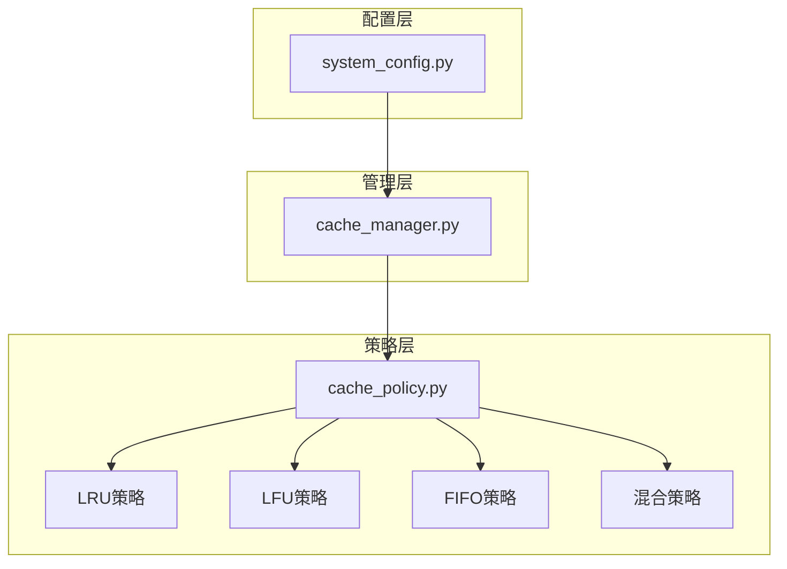
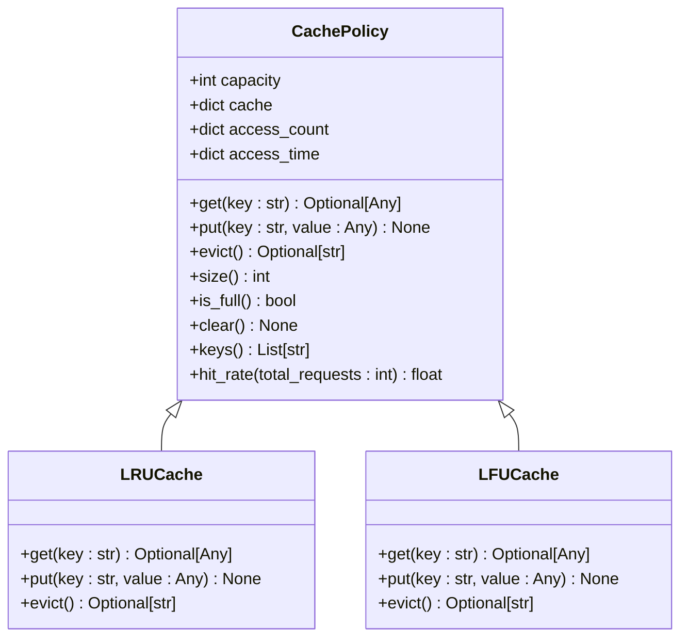
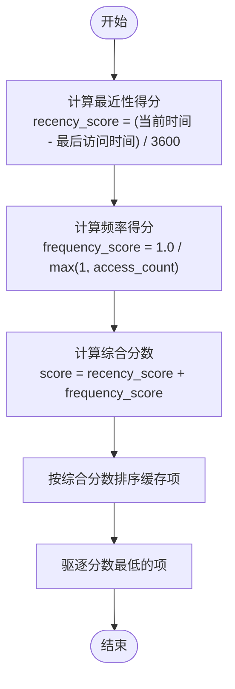
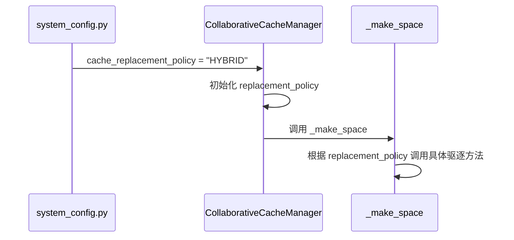
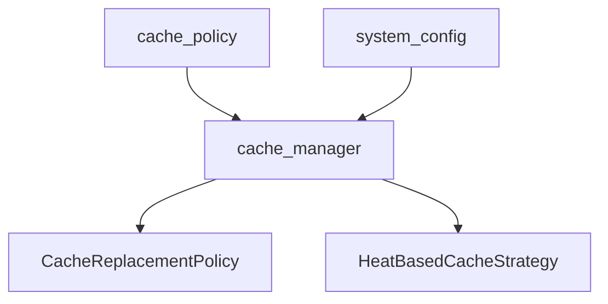

# 缓存替换策略

<cite>
**本文档引用的文件**
- [cache_policy.py](file://caching/cache_policy.py)
- [system_config.py](file://config/system_config.py)
- [cache_manager.py](file://caching/cache_manager.py)
</cite>

## 目录
1. [引言](#引言)
2. [项目结构](#项目结构)
3. [核心组件](#核心组件)
4. [架构概述](#架构概述)
5. [详细组件分析](#详细组件分析)
6. [依赖分析](#依赖分析)
7. [性能考虑](#性能考虑)
8. [故障排除指南](#故障排除指南)
9. [结论](#结论)

## 引言
本文档详细阐述了`cache_policy.py`中定义的缓存替换策略体系，重点分析`CachePolicy`抽象基类的设计及其在具体策略中的实现。说明基于访问频率（LFU）与访问时间（LRU）融合的混合热度感知替换算法，如何通过`access_count`和`access_time`字段量化内容热度，并在缓存满时调用`evict`方法进行智能驱逐。解释策略的可扩展性设计，支持运行时动态切换替换算法（如LRU、LFU、FIFO）。结合`system_config.py`中的配置项，说明如何通过外部参数调整缓存容量与默认策略。提供自定义策略继承`CachePolicy`的实现示例，包括重写`get`、`put`、`evict`方法的具体步骤，并分析策略选择对缓存污染问题的影响及优化建议。

## 项目结构
缓存替换策略的核心逻辑分布在`caching`和`config`模块中。`caching`目录包含缓存策略的抽象定义与具体实现，`config`目录则提供系统级配置支持。

**Diagram sources**
- [cache_policy.py](file://caching/cache_policy.py)
- [cache_manager.py](file://caching/cache_manager.py)
- [system_config.py](file://config/system_config.py)

**Section sources**
- [cache_policy.py](file://caching/cache_policy.py)
- [system_config.py](file://config/system_config.py)

## 核心组件
`CachePolicy`是所有缓存策略的抽象基类，定义了统一的接口和基础数据结构。它通过`capacity`字段控制缓存容量，使用`cache`字典存储键值对，`access_count`记录访问频率，`access_time`记录访问时间戳。`get`、`put`、`evict`为抽象方法，由具体策略实现。`hit_rate`方法基于总请求数和访问计数计算命中率，为性能评估提供量化指标。

**Section sources**
- [cache_policy.py](file://caching/cache_policy.py#L8-L55)

## 架构概述
系统采用分层架构，`CachePolicy`作为策略层的抽象接口，`cache_manager`作为管理层实现具体替换逻辑，`system_config`作为配置层提供外部参数。`cache_manager`根据`system_config`中的`cache_replacement_policy`配置动态选择策略，实现了策略的运行时切换。

**Diagram sources**
- [cache_policy.py](file://caching/cache_policy.py)
- [cache_manager.py](file://caching/cache_manager.py)
- [system_config.py](file://config/system_config.py)

## 详细组件分析
### CachePolicy 抽象基类分析
`CachePolicy`类通过抽象方法定义了缓存策略的通用行为，确保所有具体策略遵循统一接口。其内部维护的`access_count`和`access_time`字段为混合热度算法提供了数据基础。

**Diagram sources**
- [cache_policy.py](file://caching/cache_policy.py#L8-L55)

**Section sources**
- [cache_policy.py](file://caching/cache_policy.py#L8-L55)

### 混合热度感知替换算法
`cache_manager`中的`_hybrid_eviction`方法实现了基于访问频率和访问时间的混合热度算法。它综合`recency_score`（基于`access_time`计算的最近性得分）和`frequency_score`（基于`access_count`计算的频率得分）来决定驱逐优先级，分数越低的内容越容易被替换。

**Diagram sources**
- [cache_manager.py](file://caching/cache_manager.py#L406-L441)

**Section sources**
- [cache_manager.py](file://caching/cache_manager.py#L406-L441)

### 运行时策略切换机制
`CollaborativeCacheManager`在初始化时读取`system_config`中的`cache_replacement_policy`配置，动态设置`replacement_policy`字段。`_make_space`方法根据该字段调用相应的`_lru_eviction`、`_lfu_eviction`或`_hybrid_eviction`方法，实现了策略的运行时切换。

**Diagram sources**
- [system_config.py](file://config/system_config.py#L170-L175)
- [cache_manager.py](file://caching/cache_manager.py#L134-L171)

**Section sources**
- [system_config.py](file://config/system_config.py#L170-L175)
- [cache_manager.py](file://caching/cache_manager.py#L134-L171)

## 依赖分析
`CachePolicy`作为抽象基类，被`caching`模块中的具体策略类继承。`cache_manager`依赖`CachePolicy`的接口，并通过`config`模块的全局`config`实例获取配置。`system_config`中的`CacheConfig`类定义了缓存相关的配置项，为`cache_manager`提供参数支持。

**Diagram sources**
- [cache_policy.py](file://caching/cache_policy.py)
- [cache_manager.py](file://caching/cache_manager.py)
- [system_config.py](file://config/system_config.py)

**Section sources**
- [cache_policy.py](file://caching/cache_policy.py)
- [cache_manager.py](file://caching/cache_manager.py)
- [system_config.py](file://config/system_config.py)

## 性能考虑
混合热度算法通过平衡新旧内容的驱逐优先级，有效缓解了LFU策略对突发流量的不敏感性和LRU策略对历史访问的忽视。`hit_rate`方法提供了命中率的量化评估，有助于策略调优。`cache_manager`中的`_make_space`方法在驱逐时考虑了所需空间大小，避免了不必要的驱逐操作，提升了性能。

## 故障排除指南
当缓存命中率低于预期时，应检查`system_config.py`中的`cache_replacement_policy`配置是否正确。若出现缓存污染，可尝试切换至混合策略或调整`_hybrid_eviction`中的权重参数。`hit_rate`方法的返回值可用于监控缓存健康状态。

**Section sources**
- [cache_policy.py](file://caching/cache_policy.py#L50-L55)
- [system_config.py](file://config/system_config.py#L170-L175)

## 结论
`CachePolicy`抽象基类为缓存替换策略提供了清晰的接口规范，支持LRU、LFU、FIFO及混合策略的灵活实现。通过`access_count`和`access_time`字段量化内容热度，结合`system_config`的外部配置，实现了可扩展、可配置的智能缓存系统。该设计有效应对了缓存污染问题，为系统性能优化提供了坚实基础。