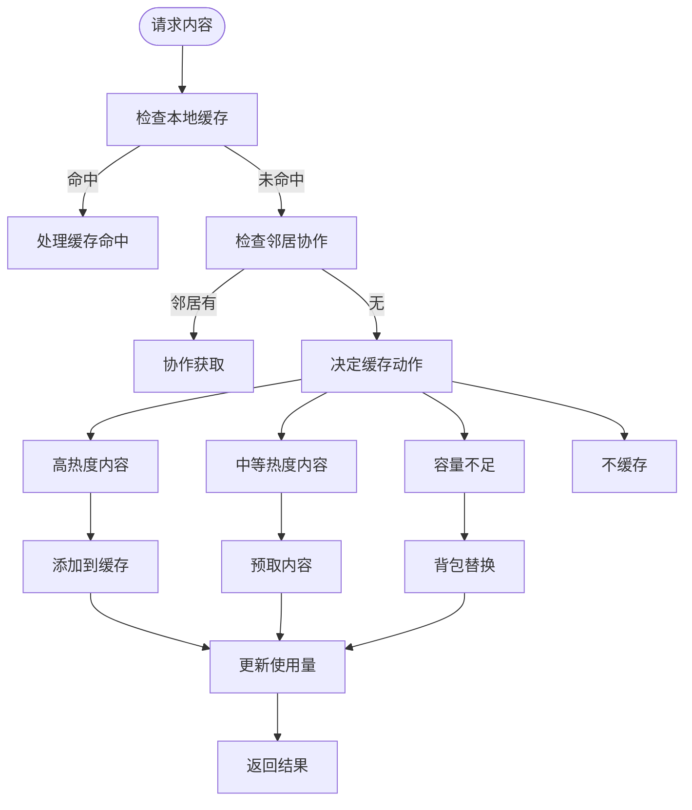
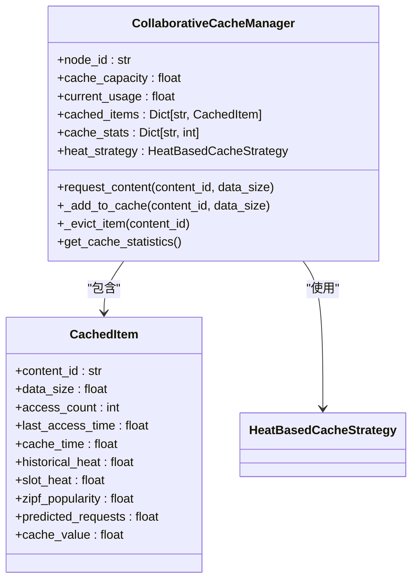
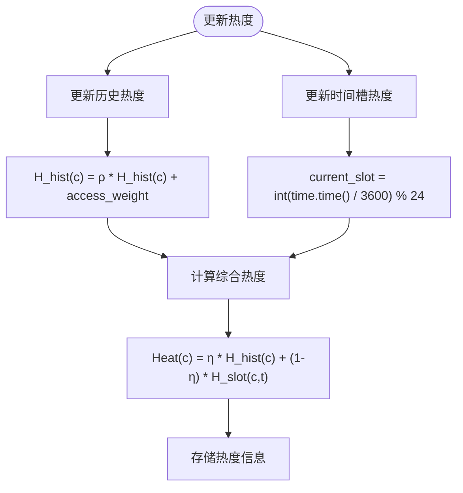
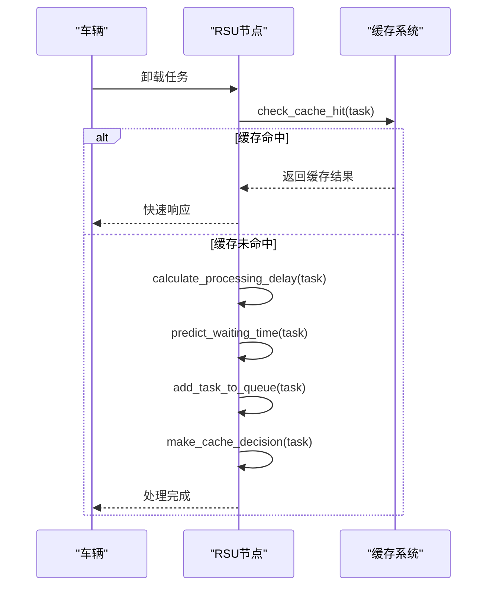
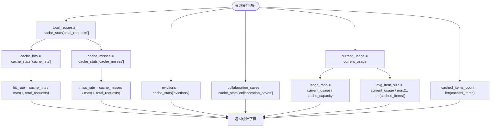

# 缓存核心管理

<cite>
**本文档中引用的文件**  
- [cache_manager.py](file://caching/cache_manager.py)
- [rsu_node.py](file://models/rsu_node.py)
- [data_processor.py](file://utils/data_processor.py)
- [system_config.py](file://config/system_config.py)
- [data_structures.py](file://models/data_structures.py)
</cite>

## 目录
1. [引言](#引言)
2. [缓存空间管理机制](#缓存空间管理机制)
3. [缓存项存储结构与键生成规则](#缓存项存储结构与键生成规则)
4. [TTL管理与过期清理逻辑](#ttl管理与过期清理逻辑)
5. [RSU节点协同调度流程](#rsu节点协同调度流程)
6. [线程安全与缓存状态监控](#线程安全与缓存状态监控)
7. [缓存数据预处理与格式化](#缓存数据预处理与格式化)
8. [核心组件分析](#核心组件分析)

## 引言
本文档深入解析`cache_manager.py`中缓存核心管理机制的实现，重点阐述缓存空间的初始化、动态分配与回收策略。详细说明缓存项的存储结构设计、缓存键的生成规则、TTL（生存时间）管理机制及过期清理逻辑。结合RSU节点模型，描述缓存与计算资源的协同调度流程，包括缓存命中时的任务快速响应路径与未命中时的远程获取回退机制。通过实际代码示例展示put和get操作的线程安全处理、缓存状态监控接口的实现方式，并说明如何通过`data_processor.py`进行缓存数据的预处理与格式化。

## 缓存空间管理机制
缓存空间管理机制通过`CollaborativeCacheManager`类实现，该类负责缓存容量的初始化、动态分配和回收。缓存容量在初始化时从系统配置中读取，RSU节点的缓存容量配置为10 GB（`config.cache.rsu_cache_capacity`）。缓存管理器维护当前使用量`current_usage`和总容量`cache_capacity`，通过`_make_space`方法在需要时腾出空间。

当缓存空间不足时，系统根据配置的替换策略（LRU、LFU、FIFO或混合策略）执行腾空操作。LRU策略基于最后访问时间排序，LFU策略基于访问频率排序，FIFO策略基于缓存时间排序，而混合策略则综合考虑访问频率、最近性和缓存价值。腾空操作通过`_evict_item`方法从缓存中移除项目，并更新统计信息。



**Diagram sources**
- [cache_manager.py](file://caching/cache_manager.py#L170-L527)

**Section sources**
- [cache_manager.py](file://caching/cache_manager.py#L170-L527)
- [system_config.py](file://config/system_config.py#L250-L255)

## 缓存项存储结构与键生成规则
缓存项的存储结构基于`CachedItem`数据类实现，采用字典的键值映射方式存储。每个缓存项包含内容ID、数据大小、访问计数、最后访问时间、缓存时间等基本信息，以及热度相关的属性如历史热度、时间槽热度和Zipf流行度。

缓存键的生成规则在RSU节点的`check_cache_hit`方法中实现，结合任务ID与内容哈希。具体而言，缓存键由任务类型、数据大小和计算周期三部分组成，格式为`f"{task.task_type.value}_{task.data_size}_{task.compute_cycles}"`。这种组合方式确保了不同任务类型的缓存隔离，同时考虑了任务的计算特征。



**Diagram sources**
- [cache_manager.py](file://caching/cache_manager.py#L26-L41)
- [cache_manager.py](file://caching/cache_manager.py#L170-L527)

**Section sources**
- [cache_manager.py](file://caching/cache_manager.py#L26-L41)
- [rsu_node.py](file://models/rsu_node.py#L94-L106)

## TTL管理与过期清理逻辑
TTL（生存时间）管理机制通过访问时间和热度统计实现。系统维护每个缓存项的`last_access_time`和`cache_time`，并基于这些时间戳计算内容的热度。热度计算采用衰减因子和时间槽机制，历史热度通过`decay_factor`（默认0.9）进行指数衰减，时间槽热度按小时级时间槽更新。

过期清理逻辑在`_hybrid_eviction`方法中实现，综合考虑访问频率、最近性和缓存价值。最近性得分通过`(time.time() - item.last_access_time) / 3600`计算，以小时为单位。当执行腾空操作时，系统优先替换综合分数较高的项目，确保高价值内容保留在缓存中。



**Diagram sources**
- [cache_manager.py](file://caching/cache_manager.py#L44-L141)

**Section sources**
- [cache_manager.py](file://caching/cache_manager.py#L44-L141)

## RSU节点协同调度流程
RSU节点的协同调度流程通过`RSUNode`类实现，结合缓存与计算资源进行任务处理。当车辆卸载任务到RSU时，系统首先检查缓存命中，若命中则直接返回结果，响应时延极短（0.001秒）。若未命中，则进入计算处理流程，包括计算处理时延、等待时延和截止时间检查。

缓存与计算资源的协同体现在`make_cache_decision`方法中，该方法基于预测请求概率和容量约束决定是否缓存任务结果。预测概率通过逻辑回归模型计算，考虑历史请求频率、源车辆平均请求率、时间因素和区域特征。若决定缓存，则将任务结果存储在`cached_results`字典中，键由任务类型、数据大小和计算周期生成。



**Diagram sources**
- [rsu_node.py](file://models/rsu_node.py#L266-L322)
- [rsu_node.py](file://models/rsu_node.py#L155-L183)

**Section sources**
- [rsu_node.py](file://models/rsu_node.py#L266-L322)
- [rsu_node.py](file://models/rsu_node.py#L155-L183)

## 线程安全与缓存状态监控
缓存管理器通过字典操作的原子性保证线程安全，`cached_items`字典的读写操作在Python解释器层面是原子的。对于复合操作，如`_handle_cache_hit`中的访问计数更新和LRU顺序维护，系统通过重新插入字典项来确保一致性。

缓存状态监控接口通过`get_cache_statistics`方法实现，提供全面的缓存性能指标。这些指标包括总请求数、缓存命中数、缓存未命中数、驱逐次数、协作节省次数、当前使用量、使用率、缓存项数量和平均项大小。命中率通过`cache_hits / total_requests`计算，使用率通过`current_usage / cache_capacity`计算。



**Diagram sources**
- [cache_manager.py](file://caching/cache_manager.py#L484-L501)

**Section sources**
- [cache_manager.py](file://caching/cache_manager.py#L484-L501)

## 缓存数据预处理与格式化
缓存数据的预处理与格式化通过`DataProcessor`类实现，该类提供多种数据处理功能。归一化方法支持minmax和zscore两种模式，分别将数据缩放到[0,1]区间和标准化为均值0、标准差1的分布。数据平滑通过滑动窗口均值实现，异常值移除采用Z-score方法，缺失值通过线性插值填补。

数据格式化包括分批、打乱、分割和张量转换。`batch_data`方法将数据划分为指定大小的批次，`shuffle_data`方法随机打乱数据顺序，`split_data`方法按比例分割训练集和测试集，`convert_to_tensor`方法将数据转换为PyTorch张量，支持numpy数组、列表和元组等多种输入类型。

```mermaid
classDiagram
class DataProcessor {
+normalization_params : Dict
+normalize_data(data, method)
+denormalize_data(normalized_data, original_min, original_max)
+smooth_data(data, window_size)
+remove_outliers(data, threshold)
+interpolate_missing(data)
+batch_data(data, batch_size)
+shuffle_data(*arrays)
+split_data(data, train_ratio)
+convert_to_tensor(data, device)
+save_processed_data(data, filepath)
+load_processed_data(filepath)
}
DataProcessor --> "minmax" : "支持"
DataProcessor --> "zscore" : "支持"
DataProcessor --> "滑动窗口" : "平滑"
DataProcessor --> "Z-score" : "异常值移除"
DataProcessor --> "线性插值" : "缺失值填补"
DataProcessor --> "PyTorch张量" : "转换"
```

**Diagram sources**
- [data_processor.py](file://utils/data_processor.py#L11-L154)

**Section sources**
- [data_processor.py](file://utils/data_processor.py#L11-L154)

## 核心组件分析
缓存核心管理系统的实现涉及多个关键组件的协同工作。`CollaborativeCacheManager`作为主控制器，协调缓存操作和策略执行。`HeatBasedCacheStrategy`负责热度计算和优先级评估，为缓存决策提供依据。`RSUNode`集成缓存功能，实现边缘计算与缓存的协同调度。

系统通过`request_content`方法统一处理内容请求，该方法实现四类动作：缓存命中、邻居协作、缓存存储和预取。决策逻辑基于内容热度、可用容量和配置阈值，确保高价值内容优先缓存。背包替换算法在容量不足时最大化缓存价值，通过贪心策略选择价值密度最低的项目进行替换。

**Section sources**
- [cache_manager.py](file://caching/cache_manager.py#L170-L527)
- [rsu_node.py](file://models/rsu_node.py#L70-L322)
- [data_processor.py](file://utils/data_processor.py#L11-L154)