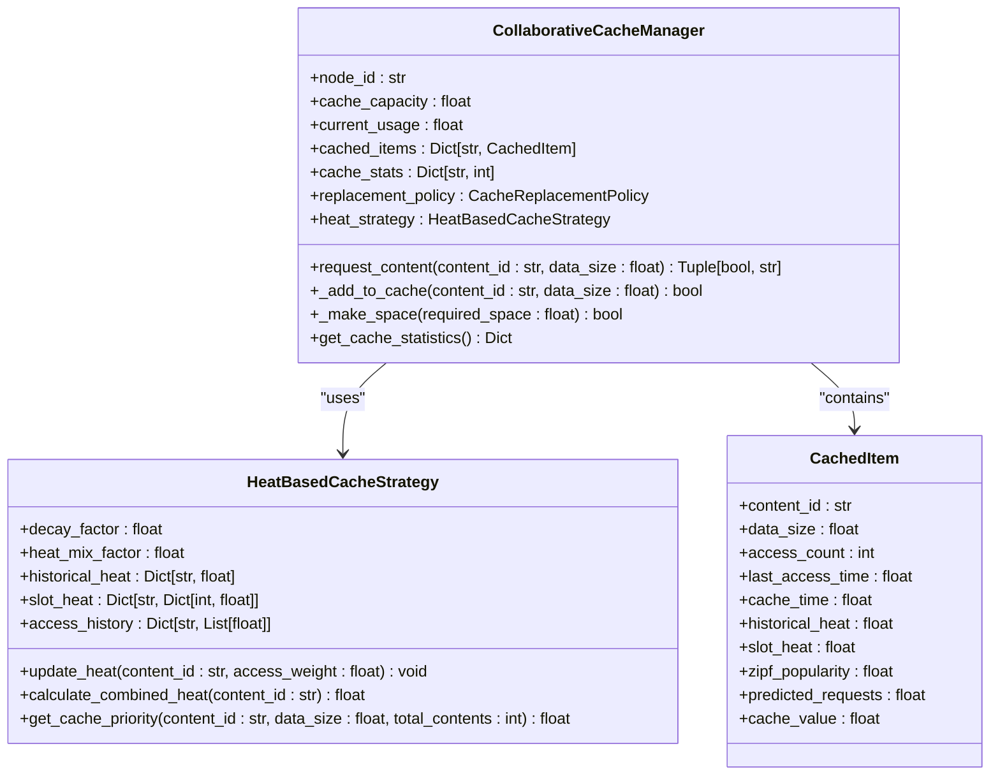
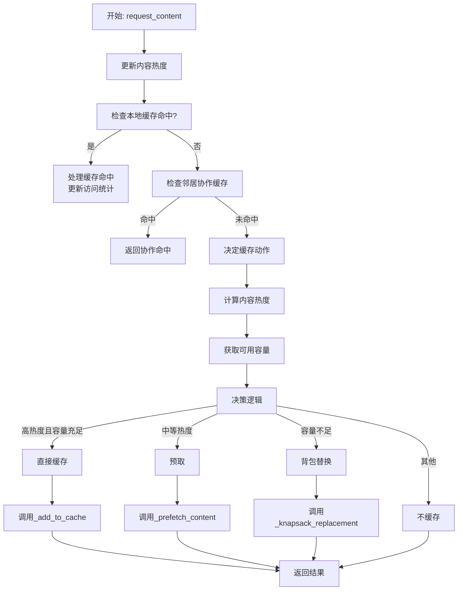
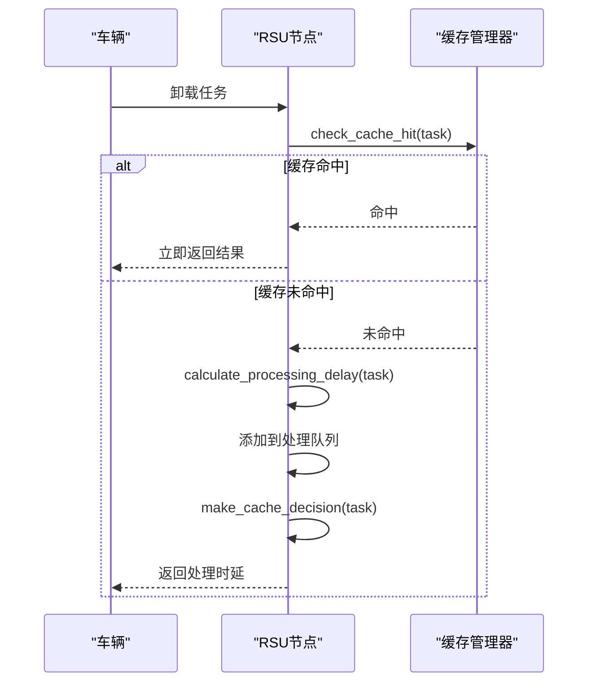
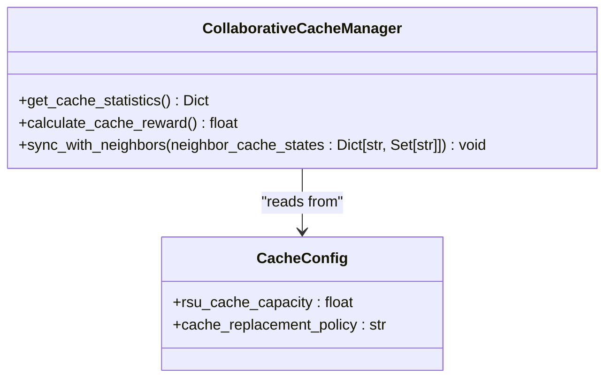

# 缓存管理策略

<cite>
**Referenced Files in This Document**   
- [cache_manager.py](file://caching/cache_manager.py)
- [cache_policy.py](file://caching/cache_policy.py)
- [rsu_node.py](file://models/rsu_node.py)
- [system_config.py](file://config/system_config.py)
</cite>

## 目录
1. [引言](#引言)
2. [缓存管理核心组件](#缓存管理核心组件)
3. [热度感知替换策略](#热度感知替换策略)
4. [内容预取与协作缓存](#内容预取与协作缓存)
5. [缓存键设计与TTL管理](#缓存键设计与ttl管理)
6. [缓存一致性与污染应对](#缓存一致性与污染应对)
7. [RSU节点协同调度](#rsu节点协同调度)
8. [缓存状态监控与动态策略](#缓存状态监控与动态策略)
9. [结论](#结论)

## 引言

本文档全面阐述了车联网（Vehicular Edge Computing, VEC）系统中缓存管理模块的设计与实现。该模块旨在通过智能缓存策略提升系统性能，减少任务处理延迟，并优化资源利用率。核心功能集中在`caching`包下的`cache_manager.py`和`cache_policy.py`文件中，其中实现了基于热度的替换策略、内容预取机制以及协作缓存。缓存管理与RSU（Roadside Unit）节点模型紧密集成，实现了计算与缓存资源的协同调度。

## 缓存管理核心组件

缓存管理模块的核心是`CollaborativeCacheManager`类，它负责处理所有缓存相关的操作，包括内容的存储、检索、替换和统计。该类与`HeatBasedCacheStrategy`协同工作，后者专门负责计算和管理内容的热度。

**缓存项数据结构**  
`CachedItem`类定义了缓存中每个条目的数据结构，包含内容ID、数据大小、访问计数、最后访问时间等基本信息。此外，它还存储了与热度相关的属性，如历史热度、时间槽热度和Zipf流行度，以及用于预取的预测请求数和缓存价值。

**缓存空间分配**  
缓存容量由`cache_capacity`属性定义，其值从系统配置`config.cache.rsu_cache_capacity`中获取。当前使用量通过`current_usage`字段跟踪。当添加新内容时，系统会检查`current_usage + data_size`是否超过`cache_capacity`，若超出则触发腾出空间的逻辑。

**内容存储与检索**  
内容的存储通过`_add_to_cache`方法实现。该方法首先检查容量，若不足则调用`_make_space`尝试腾出空间。成功后，创建`CachedItem`实例并将其加入`cached_items`字典。内容检索通过`request_content`方法进行，该方法首先检查本地缓存，若命中则调用`_handle_cache_hit`更新访问统计和LRU顺序。

**Diagram sources**
- [cache_manager.py](file://caching/cache_manager.py#L26-L41)
- [cache_manager.py](file://caching/cache_manager.py#L150-L197)

**Section sources**
- [cache_manager.py](file://caching/cache_manager.py#L26-L41)
- [cache_manager.py](file://caching/cache_manager.py#L150-L197)

## 热度感知替换策略

系统实现了多种缓存替换策略，由`CacheReplacementPolicy`枚举定义，包括LRU（最近最少使用）、LFU（最不经常使用）、FIFO（先进先出）和混合策略。`CollaborativeCacheManager`根据配置文件`system_config.py`中的`cache_replacement_policy`参数初始化其替换策略。

**热度计算**  
`HeatBasedCacheStrategy`类是热度计算的核心。它通过`update_heat`方法更新内容的热度，该方法结合了历史热度（使用衰减因子ρ）和时间槽热度（小时级）。综合热度`Heat(c)`通过`calculate_combined_heat`方法计算，公式为`η * H_hist(c) + (1-η) * H_slot(c,t)`，其中η是热度混合系数。

**缓存优先级**  
`get_cache_priority`方法计算内容的综合缓存优先级。该优先级综合了基础热度、Zipf流行度、大小惩罚（小文件优先）和最近性奖励。最终的优先级用于指导替换决策，特别是在背包替换算法中。

**Diagram sources**
- [cache_manager.py](file://caching/cache_manager.py#L199-L245)
- [cache_manager.py](file://caching/cache_manager.py#L88-L101)
- [cache_manager.py](file://caching/cache_manager.py#L116-L141)

**Section sources**
- [cache_manager.py](file://caching/cache_manager.py#L50-L141)
- [cache_manager.py](file://caching/cache_manager.py#L199-L245)

## 内容预取与协作缓存

系统实现了基于热度的预取机制和邻居协作缓存，以进一步提高缓存命中率。

**内容预取**  
当内容热度处于中等水平时，系统会启动预取。`_prefetch_content`方法会检查预取窗口容量（默认为总容量的10%），若内容大小在此范围内，则尝试将其加入缓存。这允许系统在不占用主缓存空间的情况下，预先加载可能被请求的内容。

**协作缓存**  
`CollaborativeCacheManager`维护一个`neighbor_cache_states`字典，记录邻居节点的缓存状态。在`request_content`流程中，如果本地缓存未命中，系统会调用`_check_neighbor_collaboration`检查邻居节点是否缓存了所需内容。如果找到，即可通过协作方式获取，避免了重复计算或从远端服务器获取的开销。

**Section sources**
- [cache_manager.py](file://caching/cache_manager.py#L324-L333)
- [cache_manager.py](file://caching/cache_manager.py#L261-L267)

## 缓存键设计与TTL管理

**缓存键设计**  
在`RSUNode`类中，缓存键的设计原则是基于任务的特征，以确保结果的可重用性。`check_cache_hit`方法使用`task_type`、`data_size`和`compute_cycles`三个属性的组合来生成缓存键。这种设计确保了只有当任务的类型、输入大小和计算复杂度完全相同时，才能命中缓存，保证了结果的正确性。

**TTL管理**  
系统通过`request_history`字典来管理请求历史，并通过`make_cache_decision`方法中的逻辑来实现TTL管理。系统会限制每个请求历史的长度（默认100条），当历史记录超过此长度时，最旧的记录会被移除。这相当于为缓存决策提供了一个滑动时间窗口，确保热度计算基于近期的访问模式。

**Section sources**
- [rsu_node.py](file://models/rsu_node.py#L94-L106)
- [rsu_node.py](file://models/rsu_node.py#L155-L183)

## 缓存一致性与污染应对

**缓存一致性**  
由于系统中的任务结果是确定性的（相同输入产生相同输出），因此缓存一致性问题相对简单。主要通过精确的缓存键设计来保证。当任务的输入参数（`data_size`, `compute_cycles`等）发生变化时，会生成新的缓存键，从而避免了旧结果的错误使用。

**缓存污染应对**  
系统通过多种机制应对缓存污染：
1.  **混合替换策略**：`_hybrid_eviction`方法综合考虑了访问频率、最近性和缓存价值，优先淘汰低价值、长时间未访问的内容。
2.  **价值导向的背包替换**：`_knapsack_replacement`算法在替换时，会计算新内容的价值，并只替换价值更低的旧内容，确保缓存的整体价值最大化。
3.  **容量阈值**：`_decide_cache_action`方法中设置了容量阈值，避免在缓存已满时盲目缓存新内容。

**Section sources**
- [cache_manager.py](file://caching/cache_manager.py#L433-L458)
- [cache_manager.py](file://caching/cache_manager.py#L335-L375)
- [cache_manager.py](file://caching/cache_manager.py#L269-L298)

## RSU节点协同调度

缓存管理与RSU节点的计算资源紧密集成。`RSUNode`类不仅管理缓存，还负责任务处理。

**缓存与计算协同**  
当一个任务被卸载到RSU时，`process_offloaded_task`方法首先调用`check_cache_hit`检查缓存。如果命中，任务可以立即完成，响应延迟极低（0.001秒）。如果未命中，则需要调用`calculate_processing_delay`进行计算。这种设计使得缓存成为提升RSU处理效率的关键。

**状态监控与强化学习**  
`RSUNode`的`get_state_vector`方法将缓存状态（如命中率、剩余容量）作为状态向量的一部分，提供给强化学习算法。这使得调度决策能够同时考虑计算负载和缓存状态，实现真正的协同调度。

**Diagram sources**
- [rsu_node.py](file://models/rsu_node.py#L266-L322)
- [rsu_node.py](file://models/rsu_node.py#L94-L106)
- [rsu_node.py](file://models/rsu_node.py#L70-L75)
- [rsu_node.py](file://models/rsu_node.py#L155-L183)

**Section sources**
- [rsu_node.py](file://models/rsu_node.py#L266-L322)
- [rsu_node.py](file://models/rsu_node.py#L409-L423)

## 缓存状态监控与动态策略

系统提供了完善的缓存状态监控和动态策略切换机制。

**状态监控接口**  
`CollaborativeCacheManager`提供了`get_cache_statistics`方法，返回一个包含总请求数、命中数、未命中数、命中率、驱逐数、当前使用量、使用率等关键指标的字典。这些指标可用于实时监控缓存性能。

**动态策略切换**  
虽然当前实现中替换策略在初始化时确定，但系统架构支持运行时调整。`replacement_policy`是一个实例变量，可以通过外部接口修改。此外，`calculate_cache_reward`方法提供了一个量化缓存性能的奖励函数，可用于指导强化学习算法动态调整缓存容量和替换策略。

**运行时调整**  
通过修改`config`全局实例中的`cache.rsu_cache_capacity`和`cache.cache_replacement_policy`，可以在运行时调整缓存容量和替换算法。`CollaborativeCacheManager`在初始化时读取这些配置，因此在系统重启或重新初始化缓存管理器后，新的配置将生效。

**Diagram sources**
- [cache_manager.py](file://caching/cache_manager.py#L484-L501)
- [cache_manager.py](file://caching/cache_manager.py#L503-L527)
- [system_config.py](file://config/system_config.py#L250-L255)

**Section sources**
- [cache_manager.py](file://caching/cache_manager.py#L484-L527)
- [system_config.py](file://config/system_config.py#L250-L255)

## 结论

本文档详细解析了VEC系统中缓存管理模块的设计与实现。该模块通过`CollaborativeCacheManager`和`HeatBasedCacheStrategy`实现了复杂的热度感知替换策略和预取机制。通过与`RSUNode`的深度集成，缓存与计算资源实现了高效协同，显著提升了系统性能。系统提供了全面的状态监控和动态调整能力，为构建高性能、自适应的边缘缓存系统奠定了坚实基础。