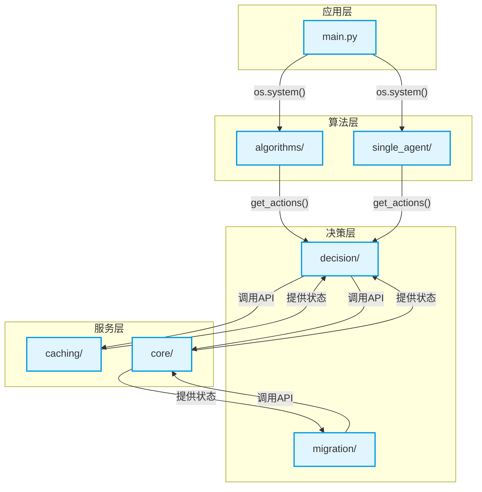

# 架构分层设计

<cite>
**本文档引用的文件**
- [main.py](file://main.py)
- [algorithms/maddpg.py](file://algorithms/maddpg.py)
- [algorithms/matd3.py](file://algorithms/matd3.py)
- [algorithms/qmix.py](file://algorithms/qmix.py)
- [algorithms/uav_action_space.py](file://algorithms/uav_action_space.py)
- [algorithms/sac_ma.py](file://algorithms/sac_ma.py)
- [algorithms/mappo.py](file://algorithms/mappo.py)
- [single_agent/ddpg.py](file://single_agent/ddpg.py)
- [single_agent/ppo.py](file://single_agent/ppo.py)
- [single_agent/td3.py](file://single_agent/td3.py)
- [decision/offloading_manager.py](file://decision/offloading_manager.py)
- [migration/migration_manager.py](file://migration/migration_manager.py)
- [caching/cache_manager.py](file://caching/cache_manager.py)
- [caching/cache_policy.py](file://caching/cache_policy.py)
- [core/queue_manager.py](file://core/queue_manager.py)
</cite>

## 目录
1. [引言](#引言)
2. [四层架构概览](#四层架构概览)
3. [应用层](#应用层)
4. [算法层](#算法层)
5. [决策层](#决策层)
6. [服务层](#服务层)
7. [分层架构图](#分层架构图)
8. [模块化设计与可维护性](#模块化设计与可维护性)
9. [技术选型与性能影响](#技术选型与性能影响)

## 引言
VEC_mig_caching系统采用清晰的四层架构设计，将复杂的车联网边缘缓存与任务迁移问题分解为独立的、职责分明的模块。这种分层设计不仅实现了关注点分离，还极大地提升了系统的可维护性、可测试性和可扩展性。本文档将详细阐述应用层、算法层、决策层和服务层的职责边界、依赖关系和交互方式，并通过代码示例和架构图说明其设计原理。

## 四层架构概览
VEC_mig_caching系统的四层架构遵循自上而下的控制流和自下而上的数据流。每一层都封装了特定领域的功能，通过明确定义的接口进行通信。

1.  **应用层 (Application Layer)**: 系统的入口点和用户交互界面，负责协调整个系统的运行流程。
2.  **算法层 (Algorithm Layer)**: 包含核心的强化学习算法，用于学习最优的决策策略。
3.  **决策层 (Decision Layer)**: 基于算法层的输出和系统状态，做出具体的任务卸载和迁移决策。
4.  **服务层 (Service Layer)**: 提供底层的、与具体业务逻辑无关的通用服务，如队列管理、缓存管理等。

这种分层结构确保了高层逻辑不依赖于底层实现细节，从而实现了高度的模块化。

## 应用层
应用层由`main.py`文件驱动，是整个系统的控制中心和用户入口。

### 职责边界
应用层的主要职责是：
- **流程控制**: 通过命令行菜单或参数，决定系统执行的模式（如多智能体训练、单智能体训练、运行完整实验等）。
- **模块协调**: 根据用户选择，调用不同模块的主程序（如`train_multi_agent.py`, `run_full_experiment.py`）。
- **用户交互**: 提供友好的命令行界面（CLI），显示系统横幅、菜单和帮助信息。

### 依赖关系与交互方式
应用层不直接依赖于算法、决策或服务层的具体实现。它通过操作系统级别的`os.system()`调用来启动其他Python脚本，实现了与系统其他部分的松耦合。这种方式使得应用层可以独立于底层算法和决策逻辑进行修改和扩展。

例如，当用户选择“多智能体训练”时，`main.py`会执行`run_multi_agent_training()`函数，该函数通过`os.system("python train_multi_agent.py")`来启动训练流程。

**Section sources**
- [main.py](file://main.py#L1-L215)

## 算法层
算法层位于`algorithms/`和`single_agent/`目录下，包含了系统用于学习决策策略的核心强化学习算法。

### 职责边界
算法层的职责是：
- **策略学习**: 实现并训练多智能体（如MATD3, MADDPG, QMIX）和单智能体（如TD3, PPO）强化学习算法。
- **环境交互**: 定义智能体与环境交互的接口，包括状态向量的构建、动作的执行和奖励的计算。
- **模型管理**: 负责模型的保存、加载和训练过程的更新。

### 依赖关系与交互方式
算法层依赖于`config`模块获取超参数，并依赖于`utils`模块进行一些通用计算。它不直接依赖于决策层或服务层，而是通过一个抽象的“环境”概念与系统状态进行交互。

算法层通过`get_state_vector()`方法从上层获取系统状态，并通过`get_actions()`方法输出决策动作。例如，在`algorithms/matd3.py`中，`MATD3Environment`类负责构建状态向量并调用`MATD3Agent`来获取动作。

**Section sources**
- [algorithms/matd3.py](file://algorithms/matd3.py#L1-L550)
- [algorithms/maddpg.py](file://algorithms/maddpg.py#L1-L646)
- [algorithms/qmix.py](file://algorithms/qmix.py#L1-L599)
- [single_agent/td3.py](file://single_agent/td3.py#L1-L547)
- [single_agent/ppo.py](file://single_agent/ppo.py#L1-L519)
- [algorithms/uav_action_space.py](file://algorithms/uav_action_space.py#L1-L207)

## 决策层
决策层由`decision/`和`migration/`目录下的模块组成，负责将算法层的抽象策略转化为具体的、可执行的决策。

### 职责边界
决策层的职责是：
- **任务分类**: 根据任务的延迟容忍度，将任务分为不同的类别（极度延迟敏感、延迟敏感等），以指导后续的决策。
- **卸载决策**: 评估所有可能的处理模式（本地计算、RSU卸载、UAV卸载等），并选择最优的处理选项。
- **迁移管理**: 监控节点状态，当RSU或UAV过载或电量不足时，触发并执行任务迁移计划。

### 依赖关系与交互方式
决策层是连接算法层和底层服务的关键桥梁。它接收来自算法层的动作指令，并结合`node_states`、`node_positions`和`cache_states`等系统状态，调用服务层的功能来做出最终决策。

例如，`decision/offloading_manager.py`中的`OffloadingDecisionMaker`类会调用`TaskClassifier`进行任务分类，然后调用`ProcessingModeEvaluator`评估所有处理模式的性能，最终选择加权成本最小的选项。

**Section sources**
- [decision/offloading_manager.py](file://decision/offloading_manager.py#L1-L626)
- [migration/migration_manager.py](file://migration/migration_manager.py#L1-L252)

## 服务层
服务层由`caching/`和`core/`目录下的模块构成，提供系统运行所必需的基础服务。

### 职责边界
服务层的职责是：
- **队列管理**: 实现多优先级生命周期队列，管理任务的到达、等待和处理，是系统性能分析的基础。
- **缓存管理**: 实现智能缓存策略，包括基于热度的缓存、协作缓存和背包优化算法，以提高缓存命中率。
- **核心数据结构**: 提供系统运行所需的核心数据结构和工具。

### 依赖关系与交互方式
服务层是系统最底层的基础设施，为决策层提供直接支持。决策层通过调用服务层的API来查询队列状态、请求缓存内容或管理任务迁移。

例如，`core/queue_manager.py`中的`PriorityQueueManager`提供了`predict_waiting_time_mm1()`方法，用于预测任务的等待时间，这个信息是决策层评估处理模式时的重要输入。`caching/cache_manager.py`中的`CollaborativeCacheManager`则提供了`request_content()`方法，用于处理内容请求和缓存更新。

**Section sources**
- [core/queue_manager.py](file://core/queue_manager.py#L1-L494)
- [caching/cache_manager.py](file://caching/cache_manager.py#L1-L528)

## 分层架构图
以下Mermaid图展示了VEC_mig_caching系统的四层架构、关键接口和数据流动方向。

**Diagram sources**
- [main.py](file://main.py#L1-L215)
- [algorithms/matd3.py](file://algorithms/matd3.py#L1-L550)
- [decision/offloading_manager.py](file://decision/offloading_manager.py#L1-L626)
- [caching/cache_manager.py](file://caching/cache_manager.py#L1-L528)
- [core/queue_manager.py](file://core/queue_manager.py#L1-L494)

## 模块化设计与可维护性
VEC_mig_caching系统的四层架构是模块化设计的典范，它通过关注点分离显著提升了系统的可维护性和可测试性。

### 关注点分离
每一层都专注于解决一个特定领域的问题：
- 应用层关注**用户交互和流程控制**。
- 算法层关注**策略学习和模型训练**。
- 决策层关注**业务逻辑和具体决策**。
- 服务层关注**基础功能和资源管理**。

这种分离使得开发者可以独立地理解、修改和测试每一层，而无需担心对其他层造成意外影响。

### 可维护性与可测试性
- **可维护性**: 当需要更换强化学习算法时，只需在`algorithms/`目录下实现新的算法类，并确保其遵循相同的接口（如`get_actions()`），而无需修改决策层或服务层的代码。同样，如果需要改进缓存策略，只需修改`caching/`目录下的代码。
- **可测试性**: 每一层都可以被独立测试。例如，`core/queue_manager.py`中的`PriorityQueueManager`可以编写单元测试来验证其队列操作和等待时间预测的正确性，而无需启动整个系统。

**Section sources**
- [main.py](file://main.py#L1-L215)
- [algorithms/matd3.py](file://algorithms/matd3.py#L1-L550)
- [decision/offloading_manager.py](file://decision/offloading_manager.py#L1-L626)
- [caching/cache_manager.py](file://caching/cache_manager.py#L1-L528)
- [core/queue_manager.py](file://core/queue_manager.py#L1-L494)

## 技术选型与性能影响
各层的技术选型直接影响了系统的性能和可扩展性。

### 应用层
- **技术选型**: 使用Python脚本和命令行界面。
- **性能影响**: 这种选型简单直接，但`os.system()`调用会产生额外的进程开销。对于高性能要求的场景，可以考虑将应用层重构为一个长驻的Web服务。

### 算法层
- **技术选型**: 采用MATD3、MADDPG等先进的多智能体强化学习算法。
- **性能影响**: MATD3因其“双延迟”和“目标策略平滑”等机制，相比MADDPG能提供更稳定的学习过程和更高的最终性能，但计算开销也更大。

### 决策层
- **技术选型**: 采用基于规则和成本函数的决策框架。
- **性能影响**: 这种决策方式计算效率高，实时性强，能够快速响应系统状态变化。但其性能上限受限于规则的设计。

### 服务层
- **技术选型**: 使用M/M/1非抢占式优先级队列模型和基于热度的缓存策略。
- **性能影响**: M/M/1模型为系统提供了理论性能上限的预测能力。基于热度的缓存策略能有效提高缓存命中率，减少网络传输开销，从而降低整体时延和能耗。

**Section sources**
- [algorithms/matd3.py](file://algorithms/matd3.py#L1-L550)
- [decision/offloading_manager.py](file://decision/offloading_manager.py#L1-L626)
- [core/queue_manager.py](file://core/queue_manager.py#L1-L494)
- [caching/cache_manager.py](file://caching/cache_manager.py#L1-L528)