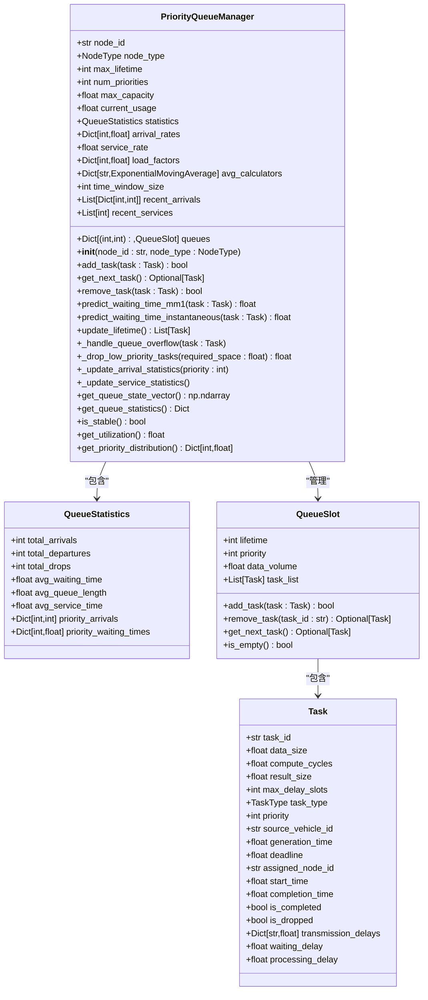
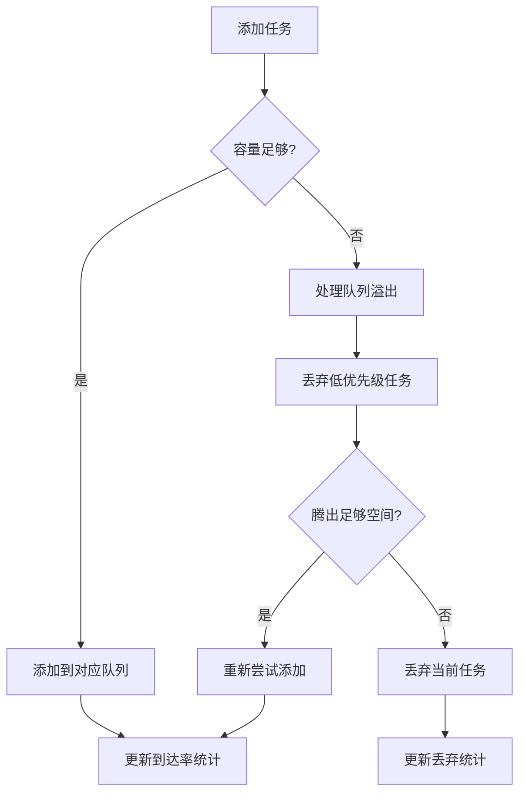
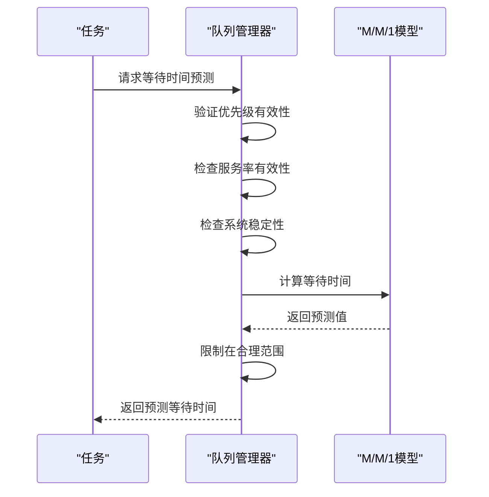
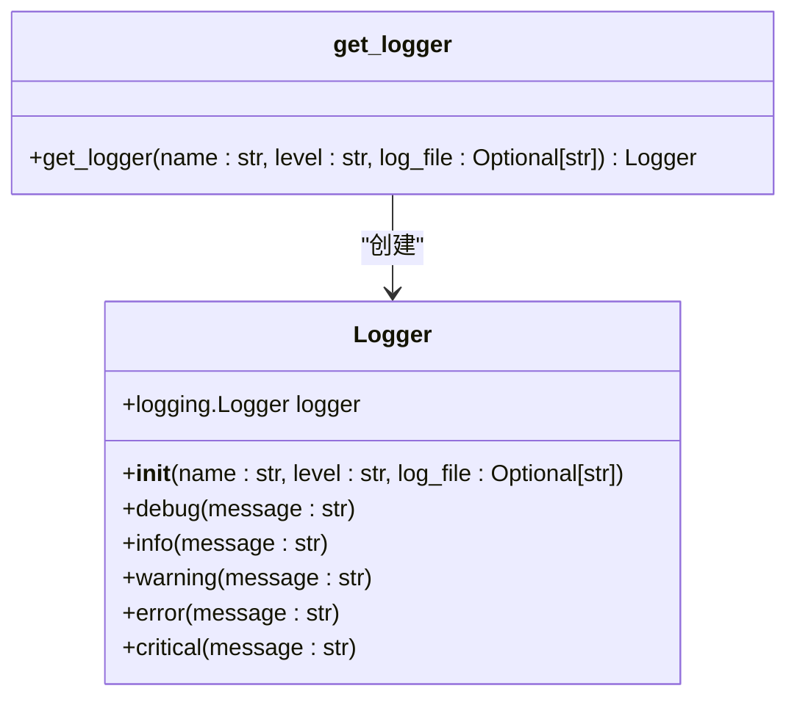
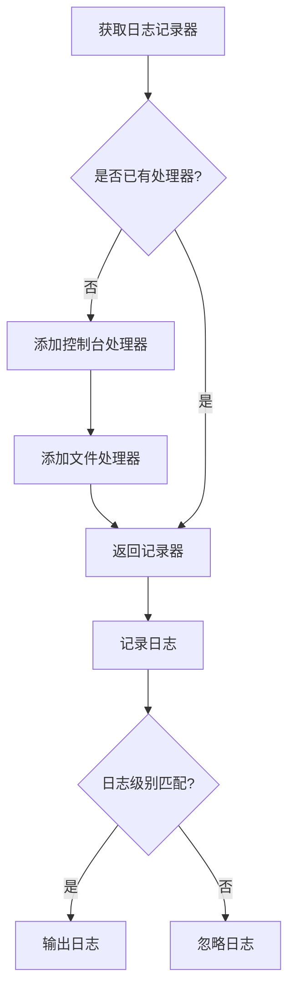
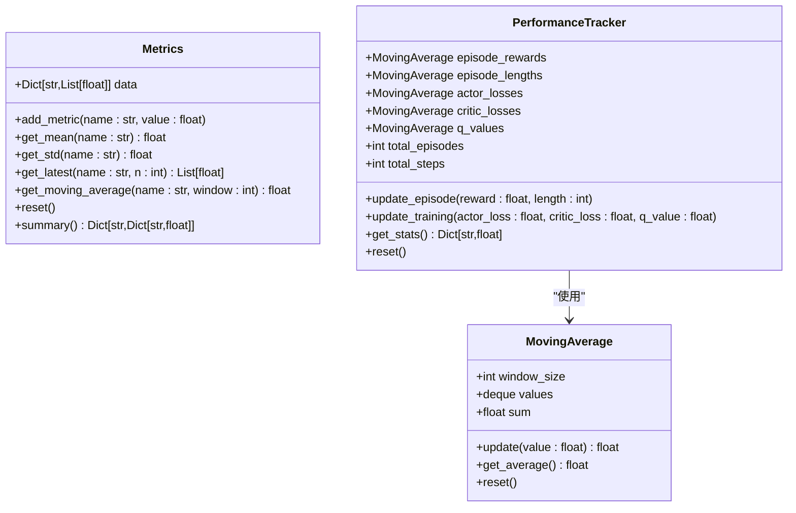
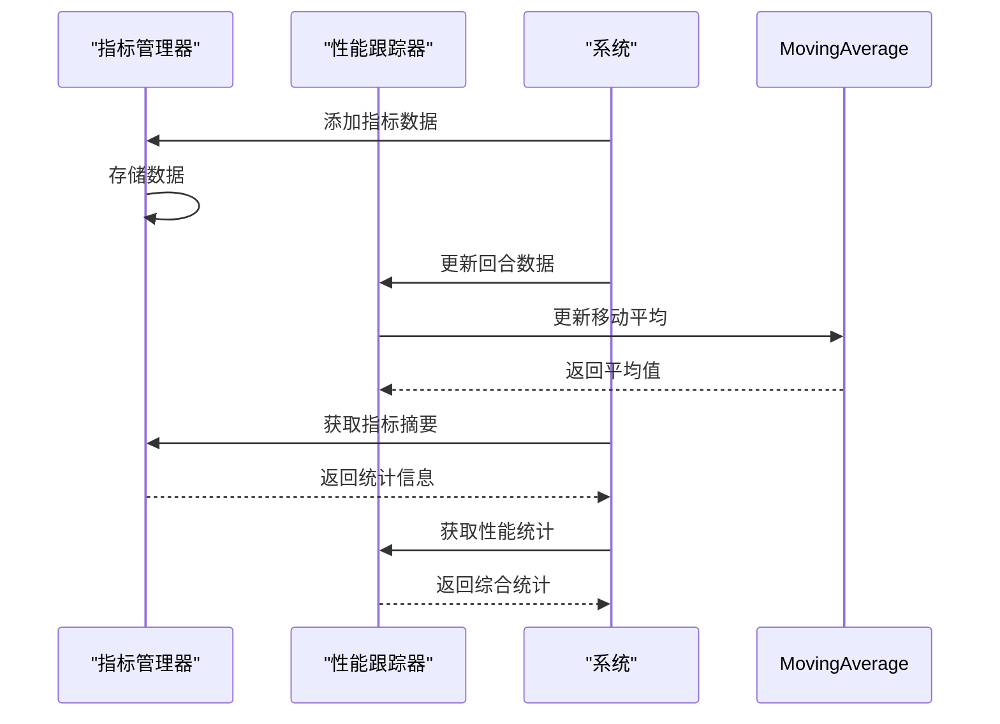
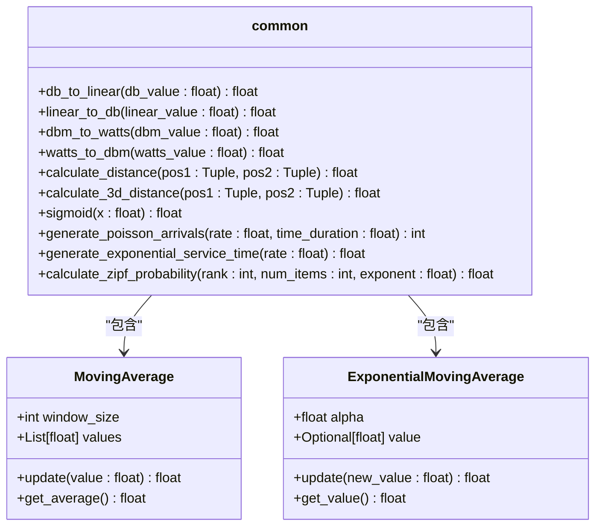
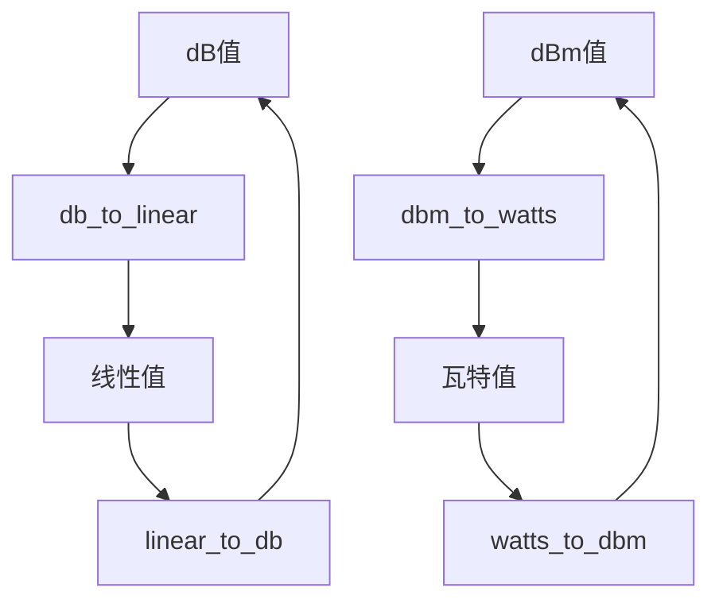
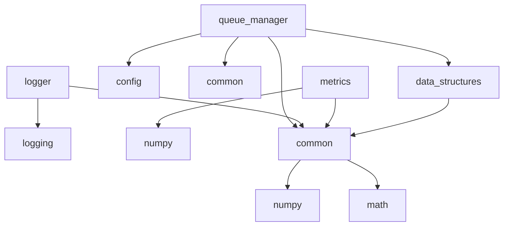

# 核心基础设施架构

<cite>
**本文档引用的文件**
- [queue_manager.py](file://core/queue_manager.py)
- [logger.py](file://utils/logger.py)
- [metrics.py](file://utils/metrics.py)
- [common.py](file://utils/common.py)
- [data_structures.py](file://models/data_structures.py)
</cite>

## 目录
1. [引言](#引言)
2. [队列管理器分析](#队列管理器分析)
3. [日志系统设计](#日志系统设计)
4. [性能指标采集机制](#性能指标采集机制)
5. [通用工具函数分析](#通用工具函数分析)
6. [核心服务依赖图](#核心服务依赖图)
7. [性能监控数据流](#性能监控数据流)
8. [异常传播路径分析](#异常传播路径分析)
9. [高并发性能优化](#高并发性能优化)
10. [结论](#结论)

## 引言
VEC_mig_caching系统的核心基础设施由多个关键组件构成，包括任务调度队列管理器、分布式日志记录系统、性能指标采集模块和通用工具函数库。这些组件共同支撑着系统的高效运行和可维护性。本文档深入剖析这些核心组件的实现机制，重点关注queue_manager.py中的高效任务调度与资源协调、logger.py中的分布式日志体系、metrics.py中的性能指标采集与上报，以及common.py中的代码复用促进机制。

## 队列管理器分析

`queue_manager.py`模块实现了多优先级生命周期队列管理器，是系统任务调度的核心组件。该管理器基于M/M/1非抢占式优先级队列模型，提供高效的任务调度与资源协调功能。

### 优先级队列管理

`PriorityQueueManager`类实现了多维队列管理，结合生命周期和优先级两个维度。每个队列槽位由(lifetime, priority)元组唯一标识，支持不同优先级任务的分层管理。系统通过`add_task`方法添加任务，首先检查容量限制，然后根据任务的剩余生命周期和优先级确定队列位置。

**图示来源**
- [queue_manager.py](file://core/queue_manager.py#L31-L493)
- [data_structures.py](file://models/data_structures.py#L28-L96)
- [data_structures.py](file://models/data_structures.py#L100-L133)

**本节来源**
- [queue_manager.py](file://core/queue_manager.py#L31-L493)

### 死锁预防机制

系统通过非抢占式优先级调度策略预防死锁。`get_next_task`方法按照优先级从高到低遍历，确保高优先级任务不会被低优先级任务阻塞。当队列容量不足时，`_handle_queue_overflow`方法会尝试通过`_drop_low_priority_tasks`丢弃低优先级任务来腾出空间，而不是阻塞高优先级任务的添加。

**图示来源**
- [queue_manager.py](file://core/queue_manager.py#L100-L137)
- [queue_manager.py](file://core/queue_manager.py#L329-L339)
- [queue_manager.py](file://core/queue_manager.py#L341-L366)

**本节来源**
- [queue_manager.py](file://core/queue_manager.py#L100-L137)

### 实时性保障策略

系统采用两种策略保障实时性：M/M/1模型预测和瞬时状态预测。`predict_waiting_time_mm1`方法使用M/M/1非抢占式优先级队列模型预测等待时间，考虑了系统稳定性条件和数值稳定性保障。`predict_waiting_time_instantaneous`方法基于瞬时队列状态进行预测，计算优先级更高的任务总处理时间。

**图示来源**
- [queue_manager.py](file://core/queue_manager.py#L182-L228)
- [queue_manager.py](file://core/queue_manager.py#L230-L264)

**本节来源**
- [queue_manager.py](file://core/queue_manager.py#L182-L228)

## 日志系统设计

`logger.py`模块提供了统一的分布式日志记录功能，支持多模块、多节点的日志聚合与级别过滤。

### 日志记录器实现

`Logger`类封装了Python标准库的logging模块，提供了一致的日志记录接口。日志记录器支持控制台和文件两种输出方式，使用统一的格式化字符串`'%(asctime)s - %(name)s - %(levelname)s - %(message)s'`。

**图示来源**
- [logger.py](file://utils/logger.py#L12-L59)

**本节来源**
- [logger.py](file://utils/logger.py#L12-L59)

### 分布式日志聚合

系统通过`get_logger`函数获取日志记录器实例，支持按模块名称区分日志来源。`default_logger`作为默认日志记录器，避免了重复创建处理器的问题。日志文件会自动创建父目录，确保日志写入的可靠性。

**图示来源**
- [logger.py](file://utils/logger.py#L15-L39)
- [logger.py](file://utils/logger.py#L64-L67)

**本节来源**
- [logger.py](file://utils/logger.py#L15-L39)

## 性能指标采集机制

`metrics.py`模块实现了系统性能指标的采集、聚合与上报机制，支持延迟、吞吐量、缓存命中率等关键指标的监控。

### 指标采集与聚合

`Metrics`类提供了基本的指标管理功能，包括添加指标数据、计算平均值、标准差、移动平均值等。`MovingAverage`类实现了固定窗口的移动平均计算，而`PerformanceTracker`类则专门用于跟踪训练过程中的各种性能指标。

**图示来源**
- [metrics.py](file://utils/metrics.py#L9-L64)
- [metrics.py](file://utils/metrics.py#L66-L95)
- [metrics.py](file://utils/metrics.py#L97-L147)

**本节来源**
- [metrics.py](file://utils/metrics.py#L9-L147)

### 指标上报机制

系统通过`summary`方法获取所有指标的摘要，包括平均值、标准差、最小值、最大值等统计信息。`PerformanceTracker`的`get_stats`方法则提供训练过程的综合统计信息，便于监控和分析。

**图示来源**
- [metrics.py](file://utils/metrics.py#L51-L64)
- [metrics.py](file://utils/metrics.py#L118-L135)

**本节来源**
- [metrics.py](file://utils/metrics.py#L51-L64)

## 通用工具函数分析

`common.py`模块提供了系统中常用的数学计算和转换函数，促进代码复用与模块解耦。

### 数学计算辅助

模块包含多种数学计算函数，如`sigmoid`激活函数、`calculate_distance`欧几里得距离计算、`calculate_3d_distance`三维距离计算等。这些函数被系统多个模块广泛使用，避免了重复实现。

**图示来源**
- [common.py](file://utils/common.py#L0-L99)

**本节来源**
- [common.py](file://utils/common.py#L0-L99)

### 单位转换函数

模块提供了完整的单位转换功能，包括dB与线性值的相互转换、dBm与瓦特的相互转换。这些函数在通信模型和能量计算中被频繁使用，确保了单位的一致性。

**图示来源**
- [common.py](file://utils/common.py#L4-L13)

**本节来源**
- [common.py](file://utils/common.py#L4-L13)

## 核心服务依赖图

系统核心组件之间的依赖关系如下图所示，展示了各模块之间的调用和依赖关系。

**图示来源**
- [queue_manager.py](file://core/queue_manager.py#L1-L493)
- [logger.py](file://utils/logger.py#L1-L67)
- [metrics.py](file://utils/metrics.py#L1-L147)
- [common.py](file://utils/common.py#L1-L99)
- [data_structures.py](file://models