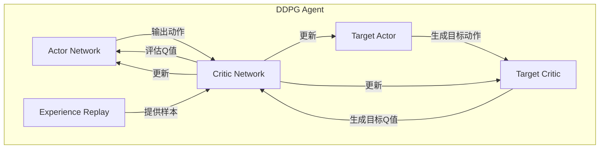
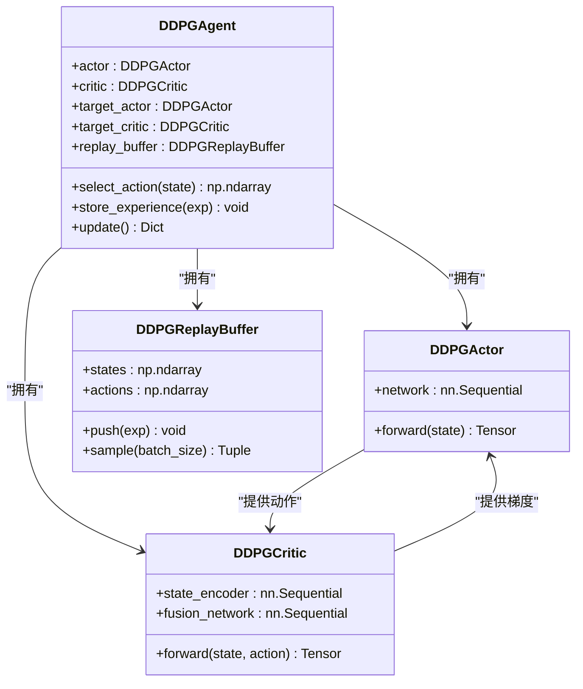
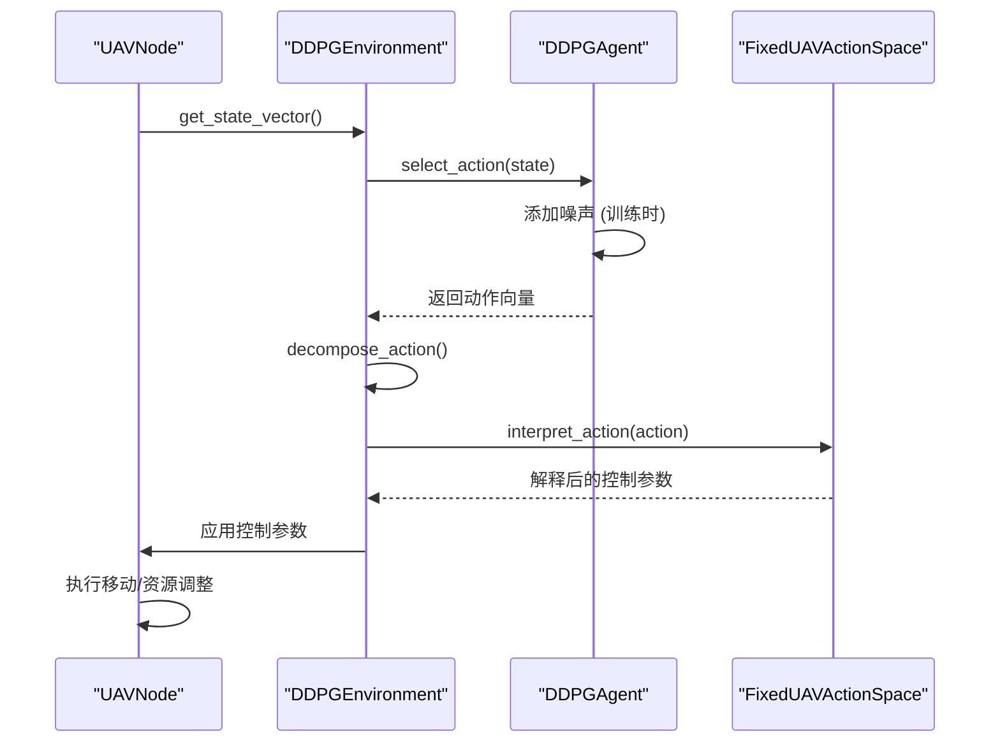
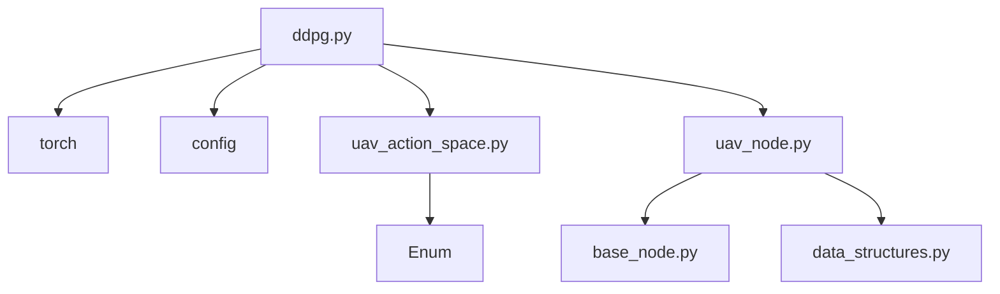

# DDPG算法实现

<cite>
**本文档引用的文件**   
- [ddpg.py](file://single_agent/ddpg.py)
- [uav_node.py](file://models/uav_node.py)
- [uav_action_space.py](file://algorithms/uav_action_space.py)
</cite>

## 目录
1. [引言](#引言)
2. [项目结构](#项目结构)
3. [核心组件](#核心组件)
4. [架构概述](#架构概述)
5. [详细组件分析](#详细组件分析)
6. [依赖分析](#依赖分析)
7. [性能考量](#性能考量)
8. [故障排查指南](#故障排查指南)
9. [结论](#结论)

## 引言
本文档系统阐述了DDPG（Deep Deterministic Policy Gradient）算法在`single_agent/ddpg.py`中的实现细节，作为与TD3算法对比的基准。DDPG是一种适用于连续动作空间的深度强化学习算法，结合了确定性策略梯度理论与Actor-Critic架构。本文将深入分析其策略更新机制、网络结构设计、目标网络软更新策略，并结合UAV节点的移动控制场景，说明其在三维空间连续动作输出中的应用。同时，文档将探讨DDPG在训练中常见的过高估计问题及其对系统稳定性的影响，提供典型训练失败案例分析和超参数调优建议。

## 项目结构
本项目采用模块化设计，代码结构清晰。DDPG算法的核心实现位于`single_agent/`目录下的`ddpg.py`文件中，该文件独立封装了算法的全部逻辑，包括Actor-Critic网络、经验回放和目标网络。UAV节点的物理行为和状态管理在`models/`目录下的`uav_node.py`中定义，而UAV的专用动作空间则在`algorithms/`目录下的`uav_action_space.py`中进行建模。这种分离设计使得算法逻辑与环境逻辑解耦，便于维护和扩展。

**Section sources**
- [ddpg.py](file://single_agent/ddpg.py#L1-L50)
- [uav_node.py](file://models/uav_node.py#L1-L50)
- [uav_action_space.py](file://algorithms/uav_action_space.py#L1-L50)

## 核心组件
DDPG算法的核心组件包括确定性Actor网络、Critic网络、经验回放缓冲区和目标网络。Actor网络负责根据当前状态输出一个确定性的连续动作，而Critic网络则评估该动作的价值（Q值）。经验回放缓冲区存储智能体与环境交互的历史经验，通过随机采样打破数据间的相关性，提高学习的稳定性。目标网络（Target Network）是主网络的延迟副本，用于生成Q值的目标，有效缓解了训练过程中的自举问题，是DDPG算法稳定训练的关键。

**Section sources**
- [ddpg.py](file://single_agent/ddpg.py#L100-L350)

## 架构概述
DDPG采用经典的Actor-Critic双网络架构。Actor网络是一个确定性策略函数，直接将状态映射到动作空间中的一个具体点。Critic网络则学习一个动作价值函数，评估在给定状态下执行特定动作的好坏。训练过程中，Critic网络通过最小化预测Q值与目标Q值之间的均方误差来更新，而Actor网络则通过策略梯度上升来更新，其目标是最大化Critic网络所评估的Q值。目标Q值的计算依赖于目标Actor和目标Critic网络，这两个目标网络通过软更新（soft update）策略从主网络缓慢复制参数，确保了学习目标的平滑变化。

**Diagram sources**
- [ddpg.py](file://single_agent/ddpg.py#L100-L350)

## 详细组件分析
### DDPG智能体分析
DDPG智能体（`DDPGAgent`）是算法的核心执行单元。它封装了Actor、Critic及其对应的目标网络实例，并管理经验回放缓冲区和探索噪声。

#### Actor-Critic网络与确定性策略
Actor网络（`DDPGActor`）是一个三层全连接神经网络，输入为状态向量，输出为[-1,1]范围内的连续动作，通过Tanh激活函数实现。Critic网络（`DDPGCritic`）采用“状态-动作”融合结构，先将状态通过一个编码器，再与动作向量拼接，最后通过一个融合网络输出Q值。这种结构允许Critic网络有效地评估任意状态-动作对的价值。

确定性策略梯度更新机制是DDPG的核心。在更新Actor时，算法计算Actor网络输出的动作在Critic网络中的Q值，并通过最大化该Q值的期望来更新Actor网络的参数。这通过计算`-Q(s, μ(s))`的梯度并进行反向传播实现，其中μ(s)是Actor网络的输出。这与随机策略不同，它直接优化确定性策略，使得在连续控制任务中学习更高效。

**Diagram sources**
- [ddpg.py](file://single_agent/ddpg.py#L100-L350)

#### 目标网络软更新策略
为了稳定训练，DDPG引入了目标网络。目标网络的参数不是直接复制主网络，而是通过软更新策略进行缓慢更新。软更新的公式为：`θ_target = τ * θ + (1 - τ) * θ_target`，其中τ是一个很小的数（如0.01）。这种渐进式的更新方式避免了学习目标的剧烈波动，显著提高了算法的收敛性和稳定性。

**Section sources**
- [ddpg.py](file://single_agent/ddpg.py#L310-L313)

### UAV三维空间移动控制实现
DDPG算法在UAV控制中的应用体现在状态感知和动作执行的闭环中。UAV的状态由`UAVNode`类的`get_state_vector()`方法构建，该方法将电池电量、负载状况、队列状态等信息组合成一个高维状态向量。DDPG智能体根据此状态向量，通过`select_action()`方法输出一个10维的连续动作向量。

该动作向量随后被`DDPGEnvironment`的`decompose_action()`方法分解，并传递给`FixedUAVActionSpace`。`FixedUAVActionSpace`的`interpret_action()`方法将[-1,1]范围内的连续值映射到具体的控制参数，例如电池功率级别、服务优先级权重、覆盖半径调整等。这些参数最终被应用于UAV的移动和资源管理决策，实现了对UAV在三维空间中行为的精细化、连续化控制。

**Diagram sources**
- [uav_node.py](file://models/uav_node.py#L345-L360)
- [ddpg.py](file://single_agent/ddpg.py#L384-L400)
- [uav_action_space.py](file://algorithms/uav_action_space.py#L42-L59)

## 依赖分析
DDPG算法的实现依赖于多个关键组件。`ddpg.py`文件依赖于PyTorch框架进行神经网络构建和训练，依赖于`config`模块获取系统配置。`uav_node.py`文件依赖于`base_node.py`和`data_structures.py`来继承基础节点功能和使用任务、位置等数据结构。`uav_action_space.py`则独立定义了UAV的专用动作空间，为DDPG的输出提供了语义解释。这些文件共同构成了一个完整的、可运行的UAV控制强化学习系统。

**Diagram sources**
- [ddpg.py](file://single_agent/ddpg.py#L1-L50)
- [uav_node.py](file://models/uav_node.py#L1-L50)
- [uav_action_space.py](file://algorithms/uav_action_space.py#L1-L50)

## 性能考量
DDPG的性能受多个超参数影响。`DDPGConfig`类中定义了关键参数，如学习率（`actor_lr`, `critic_lr`）、折扣因子（`gamma`）、软更新系数（`tau`）和探索噪声（`noise_scale`）。过高的学习率可能导致训练不稳定，而过低的学习率则收敛缓慢。`gamma`值决定了智能体对长期奖励的重视程度。`tau`值过大可能导致目标网络更新过快，失去稳定性；过小则更新过慢。探索噪声的初始值和衰减率对探索-利用的平衡至关重要。

**Section sources**
- [ddpg.py](file://single_agent/ddpg.py#L32-L52)

## 故障排查指南
DDPG训练中常见的问题包括奖励震荡和学习停滞。奖励震荡通常由Critic网络过高估计Q值引起，这会导致Actor网络被误导，采取过于激进的策略。解决方法包括：1) 降低学习率；2) 增加目标网络的软更新系数`tau`以加快目标网络更新；3) 增加探索噪声`noise_scale`以鼓励更多探索。学习停滞则可能源于探索不足或网络容量不足，可通过调整噪声衰减率`noise_decay`或增加网络隐藏层维度来解决。此外，检查经验回放缓冲区是否已填充足够的预热步数（`warmup_steps`）也是必要的。

**Section sources**
- [ddpg.py](file://single_agent/ddpg.py#L32-L52)
- [ddpg.py](file://single_agent/ddpg.py#L277-L308)

## 结论
DDPG算法通过其Actor-Critic架构和目标网络机制，为连续控制任务提供了一个强大的解决方案。在本项目中，它被成功应用于UAV的三维移动控制，通过将高维状态映射到连续的动作空间，并结合专门设计的动作解释器，实现了对UAV行为的精细化调控。尽管存在过高估计等挑战，但通过合理的超参数调优和架构设计，DDPG在快速原型验证中展现了其巨大的实用价值，为后续更复杂的算法（如TD3）的研究奠定了坚实的基础。