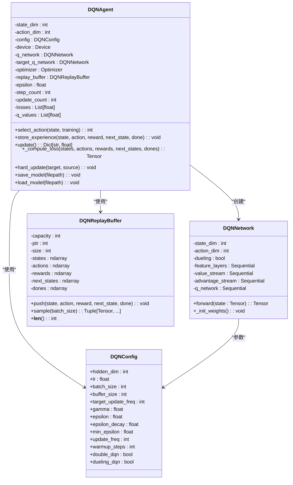
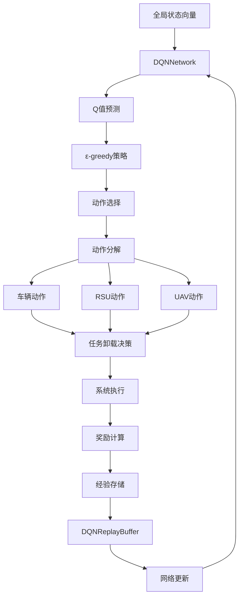
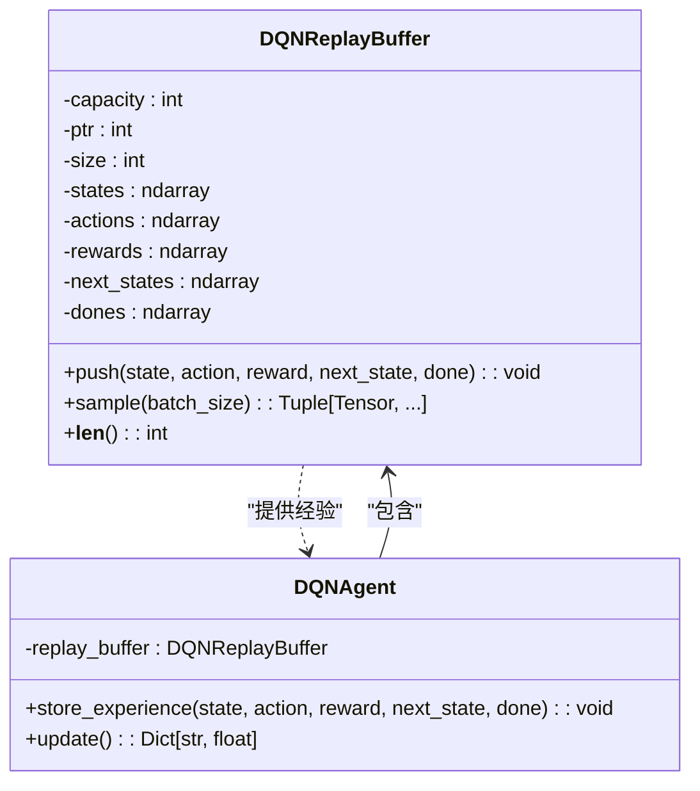
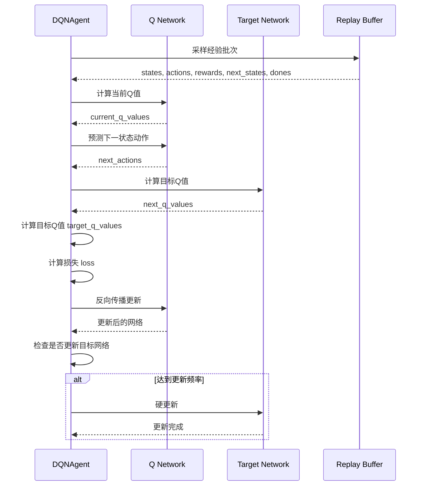
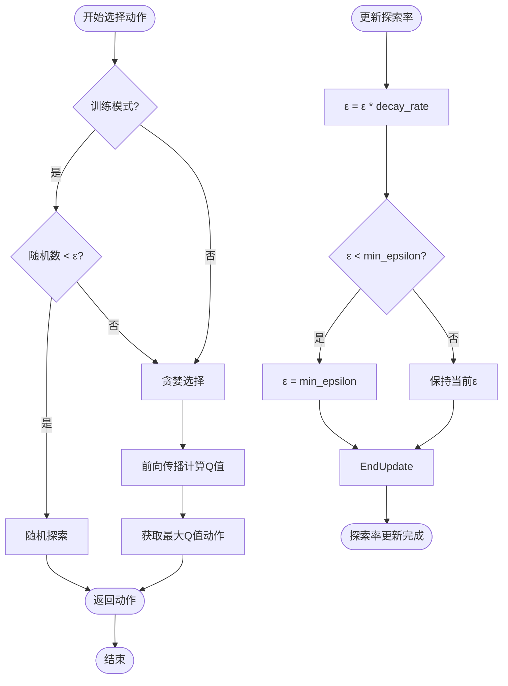
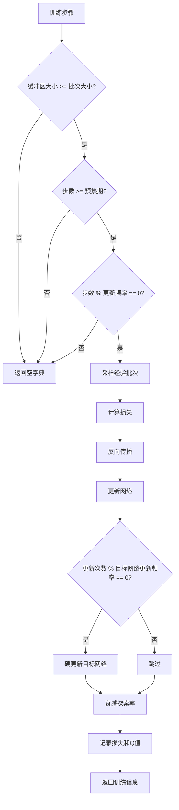

# DQN算法实现

<cite>
**本文档引用的文件**   
- [dqn.py](file://single_agent/dqn.py)
- [data_structures.py](file://models/data_structures.py)
- [standardized_reward.py](file://utils/standardized_reward.py)
- [system_config.py](file://config/system_config.py)
</cite>

## 目录
1. [引言](#引言)
2. [DQN算法核心组件](#dqn算法核心组件)
3. [任务卸载决策机制](#任务卸载决策机制)
4. [经验回放机制](#经验回放机制)
5. [目标网络与Q值更新](#目标网络与q值更新)
6. [ε-greedy探索策略](#ε-greedy探索策略)
7. [Q值函数设计与收敛特性](#q值函数设计与收敛特性)
8. [训练效率与维度灾难](#训练效率与维度灾难)
9. [训练监控与优化策略](#训练监控与优化策略)
10. [Double DQN与Dueling DQN扩展](#double-dqn与dueling-dqn扩展)

## 引言
本文档全面解析DQN（Deep Q-Network）算法在`single_agent/dqn.py`中的实现，重点介绍其在离散动作空间下的任务卸载决策机制。文档详细说明经验回放的存储结构与采样策略优化，目标网络的更新机制，以及ε-greedy探索策略的调度方式。结合`data_structures.py`中定义的任务类型与动作选项，阐述Q值函数的设计与收敛特性。分析DQN在低复杂度场景下的训练效率优势，及其在高维状态空间中面临的维度灾难问题。提供训练过程监控指标、学习率调整策略，并讨论Double DQN和Dueling DQN的潜在扩展方向。

## DQN算法核心组件

DQN算法实现包含四个核心组件：DQNConfig配置类、DQNNetwork神经网络、DQNReplayBuffer经验回放缓冲区和DQNAgent智能体。这些组件协同工作，实现强化学习中的Q-learning算法。



**图示来源**
- [dqn.py](file://single_agent/dqn.py#L32-L338)

**本节来源**
- [dqn.py](file://single_agent/dqn.py#L20-L338)

## 任务卸载决策机制

DQN算法在VEC系统中实现任务卸载决策，通过离散动作空间对车辆、RSU和UAV节点进行协同控制。动作空间设计为125个离散动作组合，对应5³的笛卡尔积空间，每个节点有5个可选动作。



**图示来源**
- [dqn.py](file://single_agent/dqn.py#L341-L481)
- [data_structures.py](file://models/data_structures.py#L12-L96)

**本节来源**
- [dqn.py](file://single_agent/dqn.py#L367-L383)
- [data_structures.py](file://models/data_structures.py#L12-L96)

## 经验回放机制

DQN实现中采用经验回放缓冲区（DQNReplayBuffer）来存储智能体与环境交互的经验。缓冲区采用循环队列设计，预分配内存以提高性能，支持高效的经验采样。



**图示来源**
- [dqn.py](file://single_agent/dqn.py#L134-L174)

**本节来源**
- [dqn.py](file://single_agent/dqn.py#L134-L174)

## 目标网络与Q值更新

DQN算法采用目标网络（target network）来稳定训练过程。目标网络定期从主网络进行硬更新，用于计算目标Q值，避免训练过程中的振荡。



**图示来源**
- [dqn.py](file://single_agent/dqn.py#L177-L338)

**本节来源**
- [dqn.py](file://single_agent/dqn.py#L313-L316)
- [dqn.py](file://single_agent/dqn.py#L289-L311)

## ε-greedy探索策略

DQN智能体采用ε-greedy探索策略，在训练过程中平衡探索与利用。初始探索率设置为1.0，随着训练进行按指数衰减，最终收敛到最小探索率0.05。



**图示来源**
- [dqn.py](file://single_agent/dqn.py#L218-L230)

**本节来源**
- [dqn.py](file://single_agent/dqn.py#L218-L230)

## Q值函数设计与收敛特性

Q值函数采用Dueling DQN架构设计，将Q值分解为状态价值函数V(s)和优势函数A(s,a)。这种设计有助于智能体更好地区分不同动作的相对优势，提高学习效率和收敛速度。

```mermaid
classDiagram
class DQNNetwork {
-feature_layers : Sequential
-value_stream : Sequential
-advantage_stream : Sequential
+forward(state) : Tensor
}
class FeatureExtractor {
+Linear(state_dim, hidden_dim)
+ReLU()
+Linear(hidden_dim, hidden_dim)
+ReLU()
}
class ValueStream {
+Linear(hidden_dim, hidden_dim//2)
+ReLU()
+Linear(hidden_dim//2, 1)
}
class AdvantageStream {
+Linear(hidden_dim, hidden_dim//2)
+ReLU()
+Linear(hidden_dim//2, action_dim)
}
DQNNetwork --> FeatureExtractor : "特征提取"
DQNNetwork --> ValueStream : "价值流"
DQNNetwork --> AdvantageStream : "优势流"
note right of DQNNetwork
Q(s,a) = V(s) + A(s,a) - mean(A(s, : ))
这种设计确保了Q值的可识别性
end note
```

**图示来源**
- [dqn.py](file://single_agent/dqn.py#L58-L131)

**本节来源**
- [dqn.py](file://single_agent/dqn.py#L116-L131)

## 训练效率与维度灾难

DQN在低复杂度场景下表现出良好的训练效率，但在高维状态空间中面临维度灾难问题。算法通过经验回放和目标网络机制缓解这一问题，但仍受限于离散动作空间的指数增长。

| 场景复杂度 | 状态维度 | 动作维度 | 训练效率 | 维度灾难风险 |
|-----------|---------|---------|---------|------------|
| 低复杂度 | 20-40 | 25-64 | 高 | 低 |
| 中复杂度 | 40-80 | 64-256 | 中 | 中 |
| 高复杂度 | >80 | >256 | 低 | 高 |

当动作空间超过一定规模时，DQN的训练效率显著下降，因为需要探索的动作组合呈指数增长。在当前实现中，动作维度为125（5³），处于中等复杂度范围。

**本节来源**
- [dqn.py](file://single_agent/dqn.py#L341-L345)
- [data_structures.py](file://models/data_structures.py#L12-L96)

## 训练监控与优化策略

DQN实现提供全面的训练监控指标，包括损失值、平均Q值、探索率和缓冲区大小等。这些指标有助于评估训练过程的稳定性和收敛性。



学习率设置为1e-4，采用Adam优化器。通过梯度裁剪（clip_grad_norm_）防止梯度爆炸，确保训练稳定性。

**本节来源**
- [dqn.py](file://single_agent/dqn.py#L237-L287)
- [dqn.py](file://single_agent/dqn.py#L32-L55)

## Double DQN与Dueling DQN扩展

DQN实现支持Double DQN和Dueling DQN两种重要扩展。Double DQN通过分离动作选择和Q值评估来减少过估计问题，Dueling DQN通过网络架构改进提高学习效率。

```mermaid
graph TD
A[标准DQN] --> B[目标Q值计算]
B --> C{"使用目标网络<br>max(Q(s',a'))"}
C --> D[过估计风险]
A --> E[Double DQN]
E --> F[动作选择]
F --> G{"使用主网络<br>argmax(Q(s',a'))"}
G --> H[Q值评估]
H --> I{"使用目标网络<br>Q(s',argmax(Q(s',a')))"}
I --> J[减少过估计]
A --> K[Dueling DQN]
K --> L[共享特征层]
L --> M[价值流 V(s)]
L --> N[优势流 A(s,a)]
M --> O[Q(s,a) = V(s) + A(s,a) - mean(A)]
N --> O
O --> P[更好区分动作优势]
```

在配置中，`double_dqn`和`dueling_dqn`标志位均默认启用，充分利用了这两种改进技术的优势。

**本节来源**
- [dqn.py](file://single_agent/dqn.py#L32-L55)
- [dqn.py](file://single_agent/dqn.py#L289-L311)