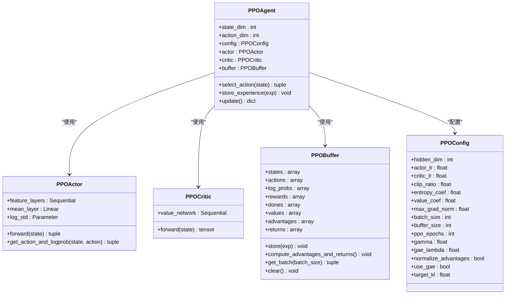
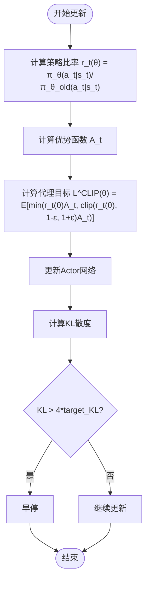
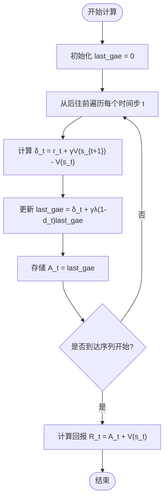
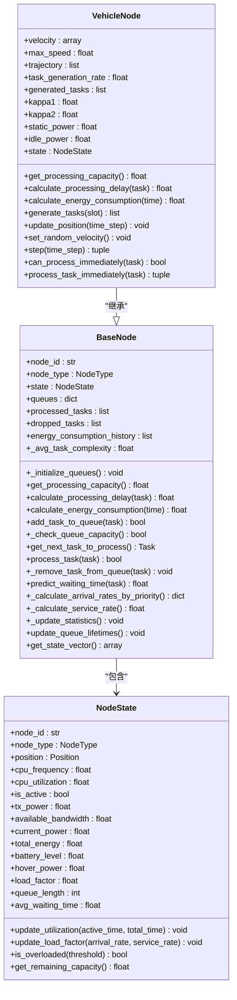

# PPO算法实现

<cite>
**本文档引用的文件**  
- [ppo.py](file://single_agent/ppo.py)
- [vehicle_node.py](file://models/vehicle_node.py)
- [system_config.py](file://config/system_config.py)
- [standardized_reward.py](file://utils/standardized_reward.py)
- [data_structures.py](file://models/data_structures.py)
- [base_node.py](file://models/base_node.py)
</cite>

## 目录
1. [引言](#引言)
2. [PPO算法核心机制](#ppo算法核心机制)
3. [裁剪机制详解](#裁剪机制详解)
4. [优势函数估计与GAE实现](#优势函数估计与gae实现)
5. [批更新策略与训练流程](#批更新策略与训练流程)
6. [状态观测空间与车辆节点集成](#状态观测空间与车辆节点集成)
7. [训练曲线分析与超参数调优](#训练曲线分析与超参数调优)
8. [高方差奖励环境下的鲁棒性优化](#高方差奖励环境下的鲁棒性优化)
9. [PPO作为基线模型的角色](#ppo作为基线模型的角色)

## 引言
PPO（Proximal Policy Optimization）算法是一种先进的策略梯度方法，广泛应用于连续动作空间的强化学习任务。在VEC（Vehicle Edge Computing）系统中，PPO被用于解决车辆移动性预测与任务卸载决策的混合控制问题。该算法通过裁剪机制有效防止策略更新过大，从而提升训练稳定性。结合车辆节点的状态观测空间和标准化奖励函数，PPO能够在动态、高方差的环境中学习到鲁棒的策略。本文档详细阐述`single_agent/ppo.py`中的实现机制，并结合`vehicle_node.py`分析其在实际场景中的适应性。

## PPO算法核心机制
PPO算法在`single_agent/ppo.py`中实现，采用Actor-Critic架构，包含策略网络（Actor）和价值网络（Critic）。其核心思想是通过限制策略更新的幅度，避免因步长过大导致性能下降。算法使用代理目标函数（surrogate objective）进行优化，并引入裁剪机制确保更新在安全范围内。PPO支持离散与连续动作空间的混合控制，适用于VEC系统中车辆、RSU和UAV的协同决策。通过GAE（Generalized Advantage Estimation）估计优势函数，算法有效平衡了偏差与方差，提升了学习效率。



**图示来源**  
- [ppo.py](file://single_agent/ppo.py#L1-L518)

**本节来源**  
- [ppo.py](file://single_agent/ppo.py#L1-L518)

## 裁剪机制详解
PPO的裁剪机制是其核心创新，旨在防止策略更新过大导致训练不稳定。在`single_agent/ppo.py`中，该机制通过计算策略比率（ratio）并限制其变化范围来实现。具体而言，算法计算新旧策略的对数概率比，然后通过`torch.clamp`函数将其限制在`[1-ε, 1+ε]`区间内，其中ε为裁剪系数（默认0.2）。代理目标函数取裁剪前后两个损失的最小值，确保策略更新不会过于激进。

该机制在连续控制任务中尤为重要，因为车辆的移动性和任务卸载决策需要平稳的策略调整。裁剪机制有效避免了因单次更新过大而导致的策略崩溃，提升了算法在动态环境中的鲁棒性。同时，算法还引入KL散度作为早停条件，当KL散度超过目标值的四倍时提前终止更新，进一步保障训练稳定性。



**图示来源**  
- [ppo.py](file://single_agent/ppo.py#L287-L387)

**本节来源**  
- [ppo.py](file://single_agent/ppo.py#L287-L387)

## 优势函数估计与GAE实现
PPO算法使用GAE（Generalized Advantage Estimation）来估计优势函数，有效平衡了蒙特卡洛方法的高方差和时序差分方法的高偏差。在`single_agent/ppo.py`中，`PPOBuffer.compute_advantages_and_returns`方法实现了GAE计算。算法通过引入参数λ（默认0.95）来调节偏差与方差的权衡，当λ=1时退化为蒙特卡洛估计，λ=0时退化为一步时序差分。

GAE的计算过程从后往前递推，利用δ_t = r_t + γV(s_{t+1}) - V(s_t)作为基础，然后通过λ进行指数加权。这种方法能够充分利用多步回报信息，同时通过价值函数进行方差缩减。在VEC系统中，GAE帮助智能体更准确地评估任务卸载和车辆移动决策的长期影响，从而学习到更优的策略。



**图示来源**  
- [ppo.py](file://single_agent/ppo.py#L180-L214)

**本节来源**  
- [ppo.py](file://single_agent/ppo.py#L180-L214)

## 批更新策略与训练流程
PPO采用批更新（mini-batch update）策略，通过多次遍历经验缓冲区来提高样本利用率。在`single_agent/ppo.py`中，`PPOAgent.update`方法实现了该策略。算法首先将经验缓冲区中的数据打乱，然后按批次进行多次更新（默认10轮）。每轮更新中，随机抽取一个批次的数据进行前向传播和反向传播。

批更新策略有效提升了数据利用效率，减少了样本浪费。同时，算法对优势函数进行标准化处理，使其均值为0，方差为1，从而加速收敛。在VEC系统中，批更新策略帮助智能体从有限的交互数据中学习到更稳健的策略，特别是在任务生成和车辆移动的随机性较强的情况下。

```mermaid
sequenceDiagram
participant Agent as PPO智能体
participant Buffer as 经验缓冲区
participant Actor as Actor网络
participant Critic as Critic网络
Agent->>Buffer : 存储经验 (state, action, reward, done, value)
loop 每个训练轮次
Agent->>Buffer : 获取随机批次数据
Buffer-->>Agent : 返回批次 (states, actions, log_probs, advantages, returns)
Agent->>Actor : 计算新策略 log_prob 和熵
Actor-->>Agent : 返回 new_log_probs, entropy
Agent->>Critic : 计算新价值估计
Critic-->>Agent : 返回 new_values
Agent->>Agent : 计算比率 ratio = exp(new_log_probs - old_log_probs)
Agent->>Agent : 计算裁剪代理损失
Agent->>Actor : 更新Actor网络
Agent->>Critic : 更新Critic网络
end
Agent->>Buffer : 清空缓冲区
```

**图示来源**  
- [ppo.py](file://single_agent/ppo.py#L287-L387)

**本节来源**  
- [ppo.py](file://single_agent/ppo.py#L287-L387)

## 状态观测空间与车辆节点集成
PPO算法的状态观测空间在`vehicle_node.py`中定义，通过`BaseNode.get_state_vector`方法实现。状态向量包含CPU利用率、负载因子、队列长度、平均等待时间等关键指标，并按优先级对队列状态进行编码。这种设计使智能体能够全面感知车辆节点的运行状态，从而做出合理的任务卸载决策。

在`vehicle_node.py`中，`step`方法实现了车辆节点的单步更新，包括位置更新、任务生成和本地处理。PPO智能体通过观察这些状态变化来学习车辆移动性预测和任务调度策略。状态空间的设计充分考虑了VEC系统的动态特性，如车辆移动、任务到达和资源竞争，使PPO能够适应复杂的现实场景。



**图示来源**  
- [vehicle_node.py](file://models/vehicle_node.py#L196-L242)
- [base_node.py](file://models/base_node.py#L59-L68)

**本节来源**  
- [vehicle_node.py](file://models/vehicle_node.py#L196-L242)
- [base_node.py](file://models/base_node.py#L59-L68)

## 训练曲线分析与超参数调优
PPO的训练曲线包括Actor损失、Critic损失、熵损失和KL散度等指标，这些指标在`PPOAgent`类中记录。通过分析这些曲线，可以评估训练的稳定性和收敛性。例如，Actor损失应逐渐下降，而熵损失应保持在合理水平，表明策略既不过于确定也不过于随机。

超参数调优对PPO性能至关重要。关键超参数包括：
- **裁剪范围（clip range）**：默认0.2，过小会导致更新缓慢，过大会导致训练不稳定。
- **学习率（learning rate）**：Actor和Critic网络的学习率需平衡，通常Actor学习率小于Critic学习率。
- **GAE参数（gae_lambda）**：控制偏差与方差的权衡，通常设置为0.9-0.99。
- **批量大小（batch_size）**：影响样本效率和训练稳定性，通常设置为64或128。

在VEC系统中，建议通过网格搜索或贝叶斯优化对这些超参数进行调优，以获得最佳性能。

**本节来源**  
- [ppo.py](file://single_agent/ppo.py#L287-L387)
- [system_config.py](file://config/system_config.py)

## 高方差奖励环境下的鲁棒性优化
在VEC系统中，奖励信号具有高方差特性，主要源于任务到达的随机性和车辆移动的不确定性。为提升PPO在高方差环境下的鲁棒性，系统采用了以下优化方法：
1. **标准化奖励函数**：在`utils/standardized_reward.py`中实现，将延迟、能耗和数据丢失等指标归一化后加权求和，确保奖励尺度一致。
2. **优势函数标准化**：在更新前对优势函数进行标准化处理，使其均值为0，方差为1，减少方差对策略更新的影响。
3. **自适应KL散度约束**：通过监控KL散度实现早停，防止策略更新过大导致性能崩溃。
4. **批量归一化**：在神经网络中使用批量归一化层，提升训练稳定性。

这些优化方法有效提升了PPO在动态环境中的鲁棒性，使其能够在高方差奖励信号下稳定学习。

**本节来源**  
- [standardized_reward.py](file://utils/standardized_reward.py)
- [ppo.py](file://single_agent/ppo.py#L287-L387)

## PPO作为基线模型的角色
在综合实验评估中，PPO作为基线模型发挥着重要作用。其优势在于：
1. **稳定性高**：裁剪机制和KL散度约束确保训练过程稳定，适合作为性能基准。
2. **实现简单**：相比TRPO等复杂算法，PPO实现简单，易于调试和复现。
3. **性能优越**：在连续控制任务中表现优异，能够提供可靠的性能下限。

通过与MADDPG、MATD3等多智能体算法的对比，可以评估多智能体协同的优势。同时，PPO的训练曲线和超参数配置为其他算法的调优提供了参考。在VEC系统中，PPO基线模型帮助研究人员验证新算法的有效性，推动系统性能的持续改进。

**本节来源**  
- [ppo.py](file://single_agent/ppo.py)
- [standardized_reward.py](file://utils/standardized_reward.py)
- [system_config.py](file://config/system_config.py)