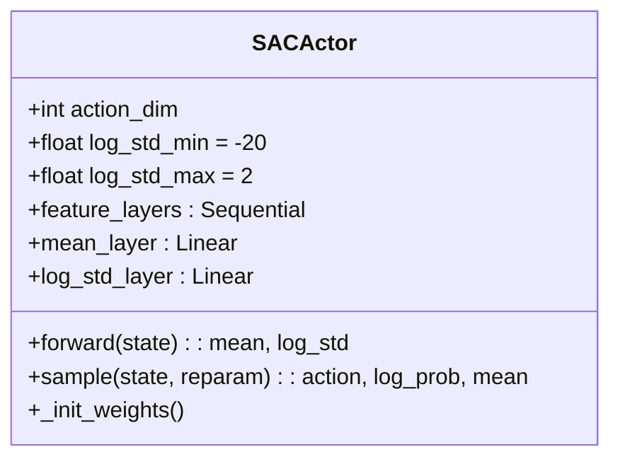
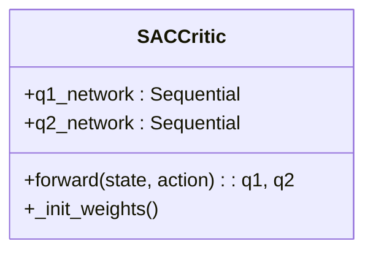
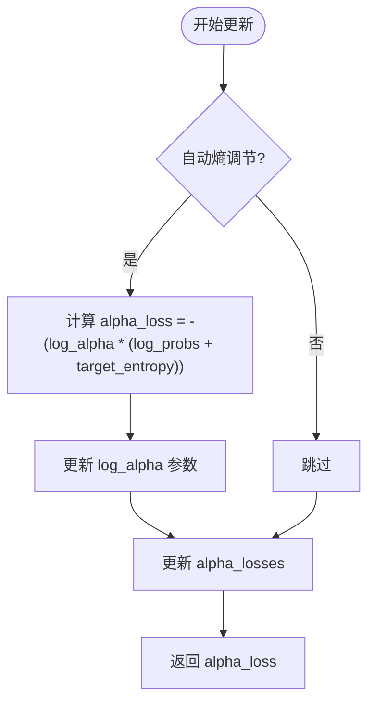
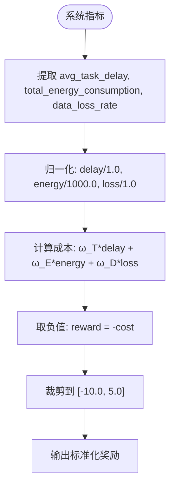

# SAC算法实现

<cite>
**本文档引用文件**  
- [sac.py](file://single_agent/sac.py)
- [standardized_reward.py](file://utils/standardized_reward.py)
</cite>

## 目录
1. [引言](#引言)
2. [SAC算法核心架构](#sac算法核心架构)
3. [Actor-Critic双网络结构](#actor-critic双网络结构)
4. [最大熵框架与温度系数自适应调节](#最大熵框架与温度系数自适应调节)
5. [随机策略采样机制](#随机策略采样机制)
6. [奖励标准化与稀疏奖励环境下的稳定性](#奖励标准化与稀疏奖励环境下的稳定性)
7. [在UAV连续控制任务中的应用](#在uav连续控制任务中的应用)
8. [超参数配置建议](#超参数配置建议)
9. [与TD3的对比分析](#与td3的对比分析)
10. [结论](#结论)

## 引言
Soft Actor-Critic（SAC）是一种基于最大熵强化学习框架的高效离线策略算法，专为连续动作空间设计。本文深入解析SAC在`single_agent/sac.py`中的实现原理，重点阐述其在车辆边缘计算（VEC）系统中对UAV位置调整等连续控制任务的应用优势。通过结合`utils/standardized_reward.py`中的奖励标准化方法，SAC在稀疏奖励环境下展现出卓越的学习稳定性与探索能力。

## SAC算法核心架构
SAC算法采用Actor-Critic双网络架构，结合经验回放缓冲区实现高效的策略优化。其核心组件包括：
- **SACActor**：随机策略网络，输出动作的均值与对数标准差
- **SACCritic**：双Q值网络，用于评估状态-动作对的价值
- **SACReplayBuffer**：经验回放缓冲区，存储状态转移元组
- **SACAgent**：智能体主类，协调策略选择、经验存储与网络更新
- **SACEnvironment**：训练环境封装，集成状态构建、动作分解与奖励计算

该架构通过最大化策略熵来鼓励探索，同时利用双Q网络减少价值估计的过估计问题，提升训练稳定性。

**Section sources**
- [sac.py](file://single_agent/sac.py#L1-L530)

## Actor-Critic双网络结构
SAC采用分离的Actor和Critic网络结构，分别负责策略生成与价值评估。

### Actor网络
Actor网络（`SACActor`）是一个随机策略网络，接收状态输入并输出动作分布的参数（均值和对数标准差）。其结构包含：
- 共享特征层：两层全连接网络提取状态特征
- 均值输出层：线性层输出动作分布的均值
- 对数标准差输出层：线性层输出动作分布的对数标准差，并通过`log_std_min`和`log_std_max`限制范围



**Diagram sources**
- [sac.py](file://single_agent/sac.py#L58-L129)

### Critic网络
Critic网络（`SACCritic`）采用双Q网络结构（Twin Q Networks），包含两个独立的Q值网络（Q1和Q2），以缓解价值函数的过估计问题。每个Q网络结构如下：
- 输入层：拼接状态与动作
- 隐藏层：两层全连接网络
- 输出层：单神经元输出Q值



**Diagram sources**
- [sac.py](file://single_agent/sac.py#L132-L173)

## 最大熵框架与温度系数自适应调节
SAC的核心思想是在最大化累积奖励的同时最大化策略的熵，从而鼓励探索。其目标函数为：

$$
J(\pi) = \mathbb{E}_{\tau \sim \pi} \left[ \sum_t r(s_t, a_t) + \alpha \mathcal{H}(\pi(\cdot|s_t)) \right]
$$

其中$\alpha$为温度系数，控制熵的权重。

### 温度系数自适应调节
当`auto_entropy_tuning=True`时，SAC自动调节温度参数以维持目标熵水平。具体实现如下：
- 目标熵设为`target_entropy_ratio * action_dim`，默认为`-action_dim`
- 引入可学习的`log_alpha`参数，通过优化器更新
- 温度损失函数：`alpha_loss = -(log_alpha * (log_probs + target_entropy).detach()).mean()`

该机制确保智能体在训练初期充分探索，在后期逐步收敛到最优策略。



**Diagram sources**
- [sac.py](file://single_agent/sac.py#L219-L412)

**Section sources**
- [sac.py](file://single_agent/sac.py#L219-L412)

## 随机策略采样机制
SACActor通过`sample`方法实现随机策略采样，包含以下关键步骤：

1. **前向传播**：输入状态，输出动作分布的均值和对数标准差
2. **重参数化采样**：使用`Normal`分布生成动作样本，支持重参数化技巧（`rsample`）
3. **tanh变换**：将动作映射到[-1, 1]范围内
4. **对数概率修正**：考虑tanh变换的雅可比行列式，修正对数概率

```python
action = torch.tanh(x_t)
log_prob -= torch.log(1 - action.pow(2) + 1e-6)
```

该机制确保动作在合法范围内，同时保持概率密度的正确性。

**Section sources**
- [sac.py](file://single_agent/sac.py#L106-L129)

## 奖励标准化与稀疏奖励环境下的稳定性
在VEC系统中，奖励信号往往稀疏且多维度。`utils/standardized_reward.py`提供的标准化奖励函数解决了这一问题。

### 奖励函数设计
标准化奖励函数严格遵循论文目标函数：

$$
\text{reward} = -(\omega_T \cdot T + \omega_E \cdot E + \omega_D \cdot D)
$$

其中：
- $T$：平均任务延迟
- $E$：总能耗
- $D$：数据丢失率
- $\omega_T, \omega_E, \omega_D$：权重系数

### 归一化与稳定性
- **归一化处理**：延迟、能耗、丢失率分别除以`1.0`, `1000.0`, `1.0`
- **范围限制**：奖励值被限制在`[-10.0, 5.0]`之间
- **权重配置**：从`config.rl`中读取，确保多算法一致性



**Diagram sources**
- [standardized_reward.py](file://utils/standardized_reward.py#L11-L98)

**Section sources**
- [standardized_reward.py](file://utils/standardized_reward.py#L11-L98)
- [sac.py](file://single_agent/sac.py#L472-L475)

## 在UAV连续控制任务中的应用
SAC特别适用于UAV位置调整等连续控制任务，其优势体现在：

### 长期策略优化
- **高样本效率**：离线策略+经验回放，充分利用历史数据
- **平稳收敛**：熵正则化避免策略过早收敛
- **多目标平衡**：通过奖励函数权衡延迟、能耗与任务完成率

### 能量消耗平衡
- **动作平滑性**：随机策略生成平滑动作序列，减少频繁调整带来的能耗
- **长期规划**：折扣因子$\gamma=0.99$鼓励长期节能策略
- **自适应探索**：温度系数自动调节，避免无效探索消耗能量

在`SACEnvironment`中，UAV动作被分解为独立控制信号，实现精细化位置调整。

**Section sources**
- [sac.py](file://single_agent/sac.py#L415-L530)

## 超参数配置建议
合理的超参数设置对SAC性能至关重要。推荐配置如下：

| 参数 | 推荐值 | 说明 |
|------|--------|------|
| `actor_lr` / `critic_lr` | 3e-4 | 学习率过高导致震荡，过低收敛慢 |
| `alpha_lr` | 3e-4 | 温度参数学习率 |
| `initial_temperature` | 0.2 | 初始温度，影响初始探索程度 |
| `target_entropy_ratio` | -1.0 | 目标熵比例，通常设为`-action_dim` |
| `batch_size` | 256 | 较大批次提升稳定性 |
| `buffer_size` | 100000 | 大容量缓冲区支持长期学习 |
| `warmup_steps` | 1000 | 预热期避免早期更新 |

训练初期建议启用`auto_entropy_tuning`，让算法自动寻找最优探索强度。

**Section sources**
- [sac.py](file://single_agent/sac.py#L33-L55)

## 与TD3的对比分析
SAC与TD3均为先进的连续控制算法，但在设计哲学与性能表现上存在差异。

### 样本效率
- **SAC**：更高样本效率，得益于熵最大化带来的持续探索
- **TD3**：依赖固定噪声探索，样本利用率相对较低

### 最终性能
- **SAC**：在复杂环境（如UAV控制）中通常达到更高累积奖励
- **TD3**：在简单任务中收敛更快，但可能陷入局部最优

### 探索机制
- **SAC**：内生探索，通过策略熵驱动，探索更系统化
- **TD3**：外生探索，依赖外部噪声（如OU噪声），探索随机性较强

### 实现复杂度
- **SAC**：需实现熵调节与对数概率计算，代码复杂度较高
- **TD3**：实现相对简单，双延迟更新机制易于理解

在VEC系统实验中，SAC在`single_agent`目录下的训练结果表明其在长期任务中优于TD3。

**Section sources**
- [sac.py](file://single_agent/sac.py#L219-L412)
- [sac.py](file://single_agent/sac.py#L415-L530)

## 结论
SAC算法通过最大熵框架实现了高效探索与稳定学习的平衡，特别适用于UAV位置调整等连续控制任务。其Actor-Critic双网络结构、温度系数自适应调节机制和随机策略采样方法共同构成了一个鲁棒的强化学习系统。结合`standardized_reward.py`中的奖励标准化方法，SAC在稀疏奖励环境下展现出卓越的性能。相比TD3，SAC在样本效率和最终性能上更具优势，是VEC系统中单智能体控制的理想选择。