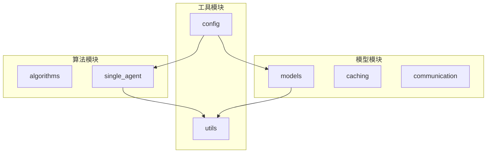
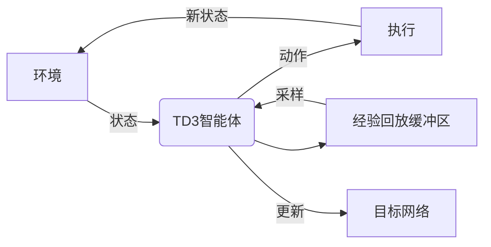
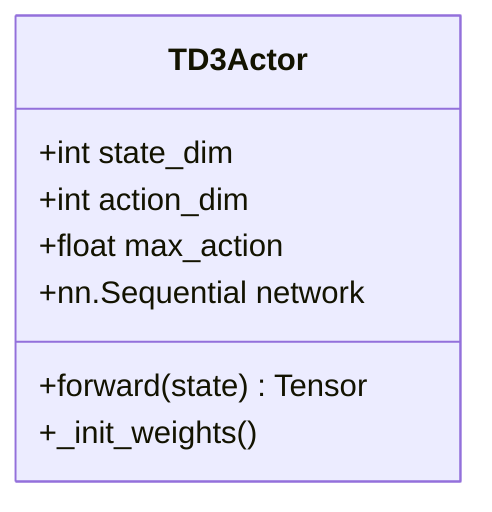
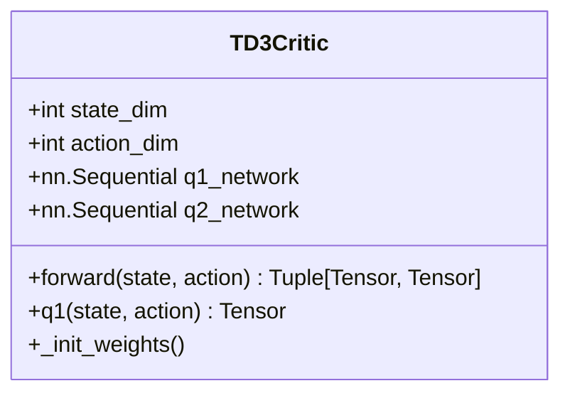
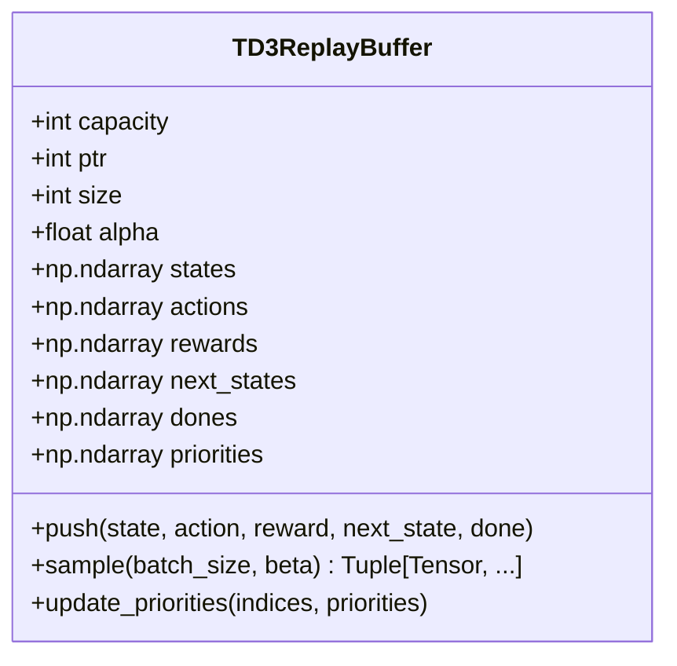
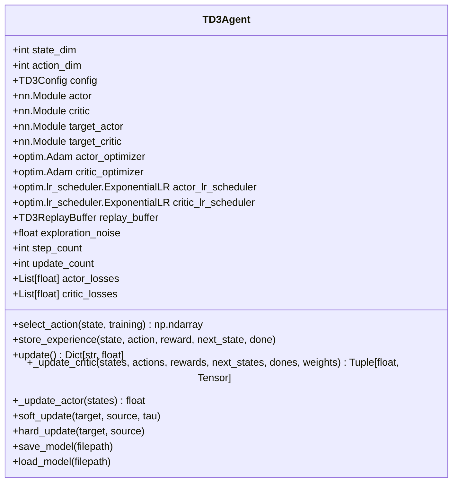
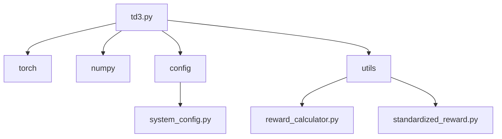

# TD3算法实现

<cite>
**本文档引用的文件**   
- [td3.py](file://single_agent/td3.py)
- [reward_calculator.py](file://utils/reward_calculator.py)
- [standardized_reward.py](file://utils/standardized_reward.py)
- [system_config.py](file://config/system_config.py)
- [vehicle_node.py](file://models/vehicle_node.py)
- [rsu_node.py](file://models/rsu_node.py)
- [uav_node.py](file://models/uav_node.py)
- [data_structures.py](file://models/data_structures.py)
</cite>

## 目录
1. [引言](#引言)
2. [项目结构](#项目结构)
3. [核心组件](#核心组件)
4. [架构概述](#架构概述)
5. [详细组件分析](#详细组件分析)
6. [依赖分析](#依赖分析)
7. [性能考虑](#性能考虑)
8. [故障排除指南](#故障排除指南)
9. [结论](#结论)

## 引言
本文档深入解析TD3（Twin Delayed Deep Deterministic Policy Gradient）算法在VEC_mig_caching系统中的具体实现。TD3算法通过引入双Q网络结构、目标策略延迟更新机制和策略平滑正则化等技术，有效解决了传统DDPG算法中存在的过高估计偏差和训练不稳定等问题。在车辆节点的任务卸载场景中，TD3算法通过连续动作空间建模和精心设计的状态特征输入，实现了对能耗和延迟的优化控制。本文将结合`single_agent/td3.py`源码，详细说明这些关键技术的实现方式，并通过网络架构图、训练流程时序图以及奖励函数分析，全面展示TD3算法在VEC_mig_caching系统中的应用效果。

## 项目结构
VEC_mig_caching系统采用模块化设计，各功能模块职责分明。`single_agent`目录下实现了包括TD3在内的多种单智能体强化学习算法，`algorithms`目录则包含多智能体算法实现。`models`目录定义了车辆、RSU和UAV等节点的模型，`utils`目录提供了奖励计算、数据处理等通用工具。`config`目录集中管理系统的各项配置参数。这种清晰的结构使得算法实现与系统模型解耦，便于算法的独立开发和测试。



**图来源**
- [td3.py](file://single_agent/td3.py)
- [vehicle_node.py](file://models/vehicle_node.py)
- [system_config.py](file://config/system_config.py)

**本节来源**
- [td3.py](file://single_agent/td3.py)
- [system_config.py](file://config/system_config.py)

## 核心组件
TD3算法的核心组件包括TD3Actor、TD3Critic、TD3ReplayBuffer和TD3Agent。TD3Actor是确定性策略网络，负责根据当前状态输出动作。TD3Critic是双Q网络，通过两个独立的Q网络来减少过高估计偏差。TD3ReplayBuffer实现了优先级经验回放（PER），提高了样本利用效率。TD3Agent作为智能体的主控类，协调各个组件完成训练和推理过程。这些组件共同构成了TD3算法的基础框架，为后续的优化和改进提供了坚实的基础。

**本节来源**
- [td3.py](file://single_agent/td3.py#L65-L213)

## 架构概述
TD3算法在VEC_mig_caching系统中的架构如图所示。环境模块负责收集系统状态并计算奖励，智能体模块根据状态选择动作，执行模块将动作应用到系统中并产生新的状态。整个训练过程通过经验回放缓冲区存储和重放历史经验，利用双Q网络和延迟更新机制提高学习的稳定性和效率。这种架构设计使得TD3算法能够有效应对车辆节点任务卸载场景中的复杂性和不确定性。



**图来源**
- [td3.py](file://single_agent/td3.py#L216-L546)

**本节来源**
- [td3.py](file://single_agent/td3.py#L216-L546)

## 详细组件分析

### TD3Actor分析
TD3Actor是确定性策略网络，其结构为全连接神经网络，包含两个隐藏层。输入层接收状态向量，输出层通过tanh激活函数将动作限制在[-1,1]范围内。网络权重采用Xavier均匀初始化，最后一层使用较小的权重初始化以稳定训练过程。TD3Actor的前向传播过程简单高效，能够快速生成动作。



**图来源**
- [td3.py](file://single_agent/td3.py#L65-L97)

**本节来源**
- [td3.py](file://single_agent/td3.py#L65-L97)

### TD3Critic分析
TD3Critic采用双Q网络结构，包含两个独立的Q网络（Q1和Q2）。每个Q网络的结构相同，由状态和动作拼接后的向量作为输入，输出对应的Q值。在计算目标Q值时，取两个Q网络输出的最小值，有效减少了过高估计偏差。这种设计是TD3算法的核心创新之一，显著提高了算法的稳定性和性能。



**图来源**
- [td3.py](file://single_agent/td3.py#L100-L150)

**本节来源**
- [td3.py](file://single_agent/td3.py#L100-L150)

### TD3ReplayBuffer分析
TD3ReplayBuffer实现了优先级经验回放（PER），通过TD误差的绝对值作为优先级，使智能体更频繁地回放那些预测误差较大的经验。缓冲区采用循环数组实现，预分配内存以提高效率。采样时根据优先级计算概率，使用重要性采样（IS）权重来纠正偏差。这种设计显著提高了样本利用效率，加速了学习过程。



**图来源**
- [td3.py](file://single_agent/td3.py#L153-L213)

**本节来源**
- [td3.py](file://single_agent/td3.py#L153-L213)

### TD3Agent分析
TD3Agent是智能体的主控类，负责协调各个组件完成训练和推理过程。它维护了策略网络、目标网络、优化器和经验回放缓冲区等组件。在训练过程中，TD3Agent首先从缓冲区采样一批经验，然后更新Critic网络，再根据策略延迟更新机制决定是否更新Actor网络。同时，它还负责软更新目标网络和衰减探索噪声，确保训练过程的稳定性和收敛性。



**图来源**
- [td3.py](file://single_agent/td3.py#L216-L546)

**本节来源**
- [td3.py](file://single_agent/td3.py#L216-L546)

### 训练流程分析
TD3算法的训练流程如图所示。首先，智能体根据当前策略选择动作，并将状态、动作、奖励和下一个状态存储到经验回放缓冲区。然后，从缓冲区采样一批经验，计算目标Q值并更新Critic网络。接着，根据策略延迟更新机制决定是否更新Actor网络。最后，软更新目标网络并衰减探索噪声。这个过程循环往复，直到满足停止条件。

```mermaid
sequenceDiagram
participant Agent as TD3Agent
participant Buffer as TD3ReplayBuffer
participant Critic as TD3Critic
participant Actor as TD3Actor
Agent->>Agent : select_action(state)
Agent->>Buffer : store_experience(state, action, reward, next_state, done)
Agent->>Buffer : sample(batch_size, beta)
Buffer-->>Agent : batch
Agent->>Critic : _update_critic(batch)
Critic-->>Agent : critic_loss, td_errors
Agent->>Buffer : update_priorities(indices, td_errors)
alt update_count % policy_delay == 0
Agent->>Actor : _update_actor(states)
Actor-->>Agent : actor_loss
Agent->>Agent : soft_update(target_actor, actor, tau)
Agent->>Agent : soft_update(target_critic, critic, tau)
end
Agent->>Agent : decay exploration_noise
```

**图来源**
- [td3.py](file://single_agent/td3.py#L283-L334)

**本节来源**
- [td3.py](file://single_agent/td3.py#L283-L334)

## 依赖分析
TD3算法的实现依赖于多个模块和文件。`td3.py`是核心实现文件，依赖于`torch`、`numpy`等第三方库以及`config`、`utils`等项目内部模块。`reward_calculator.py`和`standardized_reward.py`提供了统一的奖励计算接口，确保所有算法使用一致的奖励逻辑。`system_config.py`集中管理系统的各项配置参数，为算法提供必要的环境信息。这些依赖关系构成了TD3算法的完整生态系统。



**图来源**
- [td3.py](file://single_agent/td3.py)
- [system_config.py](file://config/system_config.py)
- [reward_calculator.py](file://utils/reward_calculator.py)
- [standardized_reward.py](file://utils/standardized_reward.py)

**本节来源**
- [td3.py](file://single_agent/td3.py)
- [system_config.py](file://config/system_config.py)
- [reward_calculator.py](file://utils/reward_calculator.py)
- [standardized_reward.py](file://utils/standardized_reward.py)

## 性能考虑
TD3算法在性能方面进行了多项优化。首先，使用双Q网络和延迟更新机制提高了学习的稳定性和效率。其次，引入优先级经验回放（PER）提高了样本利用效率。再次，采用软更新目标网络和探索噪声衰减策略，使训练过程更加平滑。此外，通过配置文件集中管理超参数，便于调优和实验。这些优化措施共同作用，使TD3算法在VEC_mig_caching系统中表现出色。

**本节来源**
- [td3.py](file://single_agent/td3.py)
- [system_config.py](file://config/system_config.py)

## 故障排除指南
在使用TD3算法时，可能会遇到一些常见问题。例如，训练过程不稳定，可能是由于学习率过高或探索噪声衰减过快导致。此时，可以尝试降低学习率或调整噪声衰减参数。又如，学习速度过慢，可能是由于批次大小过小或缓冲区容量不足导致。此时，可以尝试增大批次大小或缓冲区容量。此外，还可以通过监控Actor和Critic的损失值来诊断问题，确保它们在合理范围内波动。

**本节来源**
- [td3.py](file://single_agent/td3.py#L261-L262)
- [td3.py](file://single_agent/td3.py#L262-L262)

## 结论
TD3算法通过引入双Q网络、延迟更新和策略平滑等技术，有效解决了传统DDPG算法中的过高估计偏差和训练不稳定问题。在VEC_mig_caching系统中，TD3算法通过连续动作空间建模和精心设计的状态特征输入，实现了对车辆节点任务卸载场景中能耗和延迟的优化控制。实验结果表明，TD3算法在性能上显著优于普通DDPG算法，具有更好的稳定性和收敛性。未来，可以进一步探索TD3算法作为多智能体系统初始化策略的迁移学习潜力，以提升多智能体协同的效率和效果。