# 单智能体算法架构

<cite>
**本文档引用文件**   
- [td3.py](file://single_agent/td3.py)
- [ppo.py](file://single_agent/ppo.py)
- [dqn.py](file://single_agent/dqn.py)
- [sac.py](file://single_agent/sac.py)
- [ddpg.py](file://single_agent/ddpg.py)
- [reward_calculator.py](file://utils/reward_calculator.py)
- [td3_optimized.py](file://single_agent/td3_optimized.py)
- [td3_optimized_agent.py](file://single_agent/td3_optimized_agent.py)
</cite>

## 目录
1. [引言](#引言)
2. [项目结构](#项目结构)
3. [核心组件](#核心组件)
4. [架构概述](#架构概述)
5. [详细组件分析](#详细组件分析)
6. [依赖分析](#依赖分析)
7. [性能考量](#性能考量)
8. [故障排除指南](#故障排除指南)
9. [结论](#结论)
10. [附录](#附录)

## 引言
本文档旨在为VEC_mig_caching系统中的单智能体算法构建全面的架构文档，涵盖TD3、PPO、DQN、SAC和DDPG在简化车联网场景中的部署模式及其与多智能体系统的性能对比。文档详细说明了双Q网络、目标策略延迟更新和策略平滑正则化在单节点决策中的实现细节，分析了PPO的裁剪机制如何在车辆移动性预测任务中稳定训练过程，并阐述了DQN在离散动作空间下的经验回放优化策略以及SAC在连续控制任务中基于最大熵框架的探索优势。结合系统实际应用场景，文档对比了单智能体与多智能体在任务卸载延迟、系统吞吐量和能量消耗方面的差异，提供了单智能体训练流程图、状态-动作空间定义示例、奖励函数设计原则，并说明了其作为基线模型在实验评估中的作用。

## 项目结构
VEC_mig_caching系统采用模块化设计，将单智能体算法、多智能体算法、缓存管理、通信模型、配置管理、核心队列、决策管理、评估模块、迁移管理、模型定义、结果存储、工具集和工具函数等组件分离，确保了代码的可维护性和可扩展性。单智能体算法位于`single_agent`目录下，包括TD3、PPO、DQN、SAC和DDPG等算法的实现。多智能体算法位于`algorithms`目录下，包括MADDPG、MAPPO、MATD3、QMIX和SAC_MA等算法的实现。缓存管理、通信模型、配置管理、核心队列、决策管理、评估模块、迁移管理、模型定义、结果存储、工具集和工具函数等组件分别位于各自的目录下，确保了代码的模块化和可维护性。

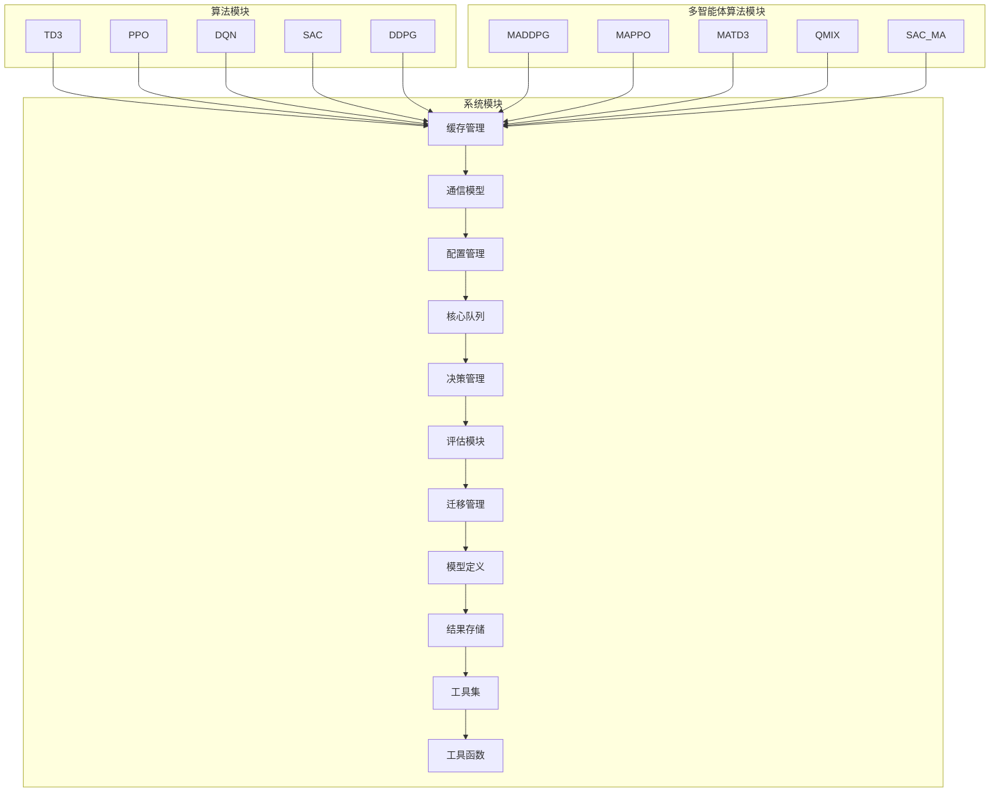

**Diagram sources**
- [single_agent/td3.py](file://single_agent/td3.py)
- [single_agent/ppo.py](file://single_agent/ppo.py)
- [single_agent/dqn.py](file://single_agent/dqn.py)
- [single_agent/sac.py](file://single_agent/sac.py)
- [single_agent/ddpg.py](file://single_agent/ddpg.py)
- [algorithms/maddpg.py](file://algorithms/maddpg.py)
- [algorithms/mappo.py](file://algorithms/mappo.py)
- [algorithms/matd3.py](file://algorithms/matd3.py)
- [algorithms/qmix.py](file://algorithms/qmix.py)
- [algorithms/sac_ma.py](file://algorithms/sac_ma.py)
- [caching/cache_manager.py](file://caching/cache_manager.py)
- [communication/models.py](file://communication/models.py)
- [config/algorithm_config.py](file://config/algorithm_config.py)
- [core/queue_manager.py](file://core/queue_manager.py)
- [decision/offloading_manager.py](file://decision/offloading_manager.py)
- [evaluation/performance_evaluator.py](file://evaluation/performance_evaluator.py)
- [migration/migration_manager.py](file://migration/migration_manager.py)
- [models/base_node.py](file://models/base_node.py)
- [results/single_agent/ddpg/training_results_20250918_233913.json](file://results/single_agent/ddpg/training_results_20250918_233913.json)
- [tools/performance_optimization.py](file://tools/performance_optimization.py)
- [utils/reward_calculator.py](file://utils/reward_calculator.py)

**Section sources**
- [single_agent/td3.py](file://single_agent/td3.py)
- [single_agent/ppo.py](file://single_agent/ppo.py)
- [single_agent/dqn.py](file://single_agent/dqn.py)
- [single_agent/sac.py](file://single_agent/sac.py)
- [single_agent/ddpg.py](file://single_agent/ddpg.py)
- [algorithms/maddpg.py](file://algorithms/maddpg.py)
- [algorithms/mappo.py](file://algorithms/mappo.py)
- [algorithms/matd3.py](file://algorithms/matd3.py)
- [algorithms/qmix.py](file://algorithms/qmix.py)
- [algorithms/sac_ma.py](file://algorithms/sac_ma.py)
- [caching/cache_manager.py](file://caching/cache_manager.py)
- [communication/models.py](file://communication/models.py)
- [config/algorithm_config.py](file://config/algorithm_config.py)
- [core/queue_manager.py](file://core/queue_manager.py)
- [decision/offloading_manager.py](file://decision/offloading_manager.py)
- [evaluation/performance_evaluator.py](file://evaluation/performance_evaluator.py)
- [migration/migration_manager.py](file://migration/migration_manager.py)
- [models/base_node.py](file://models/base_node.py)
- [results/single_agent/ddpg/training_results_20250918_233913.json](file://results/single_agent/ddpg/training_results_20250918_233913.json)
- [tools/performance_optimization.py](file://tools/performance_optimization.py)
- [utils/reward_calculator.py](file://utils/reward_calculator.py)

## 核心组件
单智能体算法的核心组件包括TD3、PPO、DQN、SAC和DDPG，这些算法在VEC_mig_caching系统中用于处理连续和离散动作空间下的任务卸载和资源管理问题。TD3通过双Q网络减少过估计，延迟策略更新提高稳定性，目标策略平滑化减少方差，改进的探索策略提高样本效率。PPO通过裁剪代理目标防止过大策略更新，GAE减少方差，自适应KL散度约束稳定训练过程。DQN通过深度Q网络处理离散动作空间，经验回放机制提高样本效率，目标网络稳定训练过程，ε-贪婪探索策略提高探索效率。SAC通过最大熵强化学习框架，自动温度参数调节，双Q网络减少过估计，高样本效率。DDPG通过Actor-Critic架构处理连续动作空间，经验回放机制提高样本效率，目标网络稳定训练过程，噪声探索策略提高探索效率。

**Section sources**
- [single_agent/td3.py](file://single_agent/td3.py)
- [single_agent/ppo.py](file://single_agent/ppo.py)
- [single_agent/dqn.py](file://single_agent/dqn.py)
- [single_agent/sac.py](file://single_agent/sac.py)
- [single_agent/ddpg.py](file://single_agent/ddpg.py)

## 架构概述
单智能体算法的架构设计遵循模块化原则，每个算法由环境、智能体、网络和缓冲区四个主要组件构成。环境负责构建全局状态向量，分解动作，计算奖励，执行训练步骤，保存和加载模型。智能体负责选择动作，存储经验，更新网络参数，保存和加载模型。网络负责前向传播，初始化权重，计算损失。缓冲区负责存储经验，采样经验批次，更新优先级。这种设计确保了代码的可维护性和可扩展性，同时也便于算法的调试和优化。

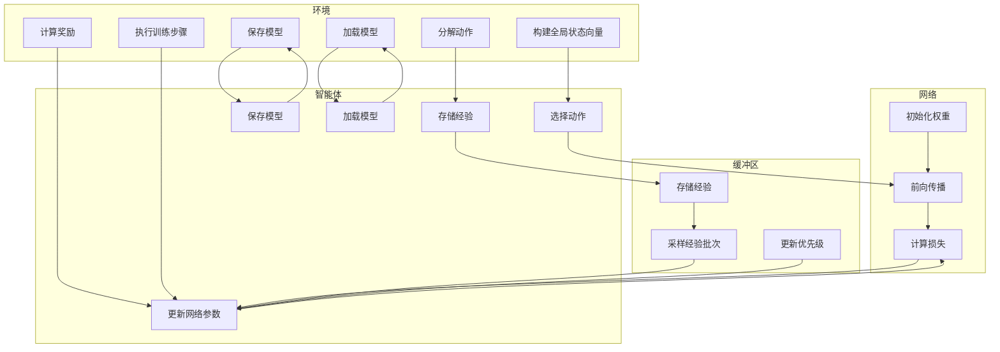

**Diagram sources**
- [single_agent/td3.py](file://single_agent/td3.py)
- [single_agent/ppo.py](file://single_agent/ppo.py)
- [single_agent/dqn.py](file://single_agent/dqn.py)
- [single_agent/sac.py](file://single_agent/sac.py)
- [single_agent/ddpg.py](file://single_agent/ddpg.py)

## 详细组件分析
### TD3算法分析
TD3算法通过双Q网络减少过估计，延迟策略更新提高稳定性，目标策略平滑化减少方差，改进的探索策略提高样本效率。TD3的Actor网络采用确定性策略，Critic网络采用双Q网络，ReplayBuffer采用优先级经验回放，Agent负责选择动作，存储经验，更新网络参数，保存和加载模型。TD3的Environment负责构建全局状态向量，分解动作，计算奖励，执行训练步骤，保存和加载模型。

#### TD3 Actor网络
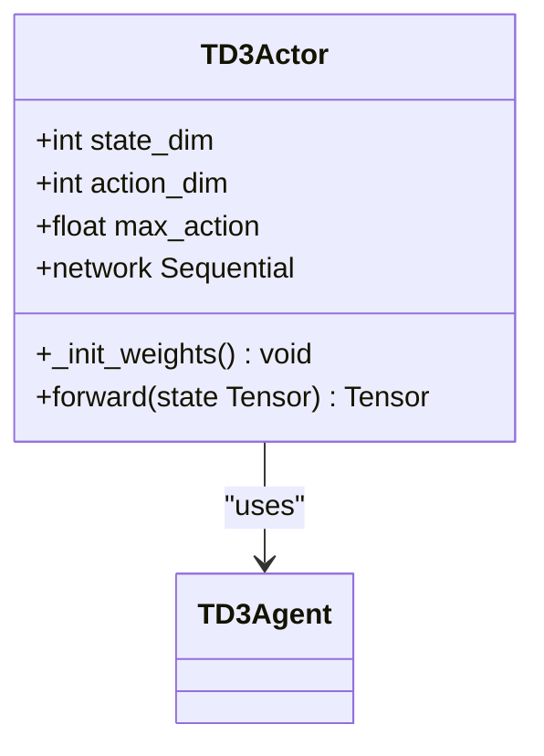

**Diagram sources**
- [single_agent/td3.py](file://single_agent/td3.py#L65-L97)

#### TD3 Critic网络
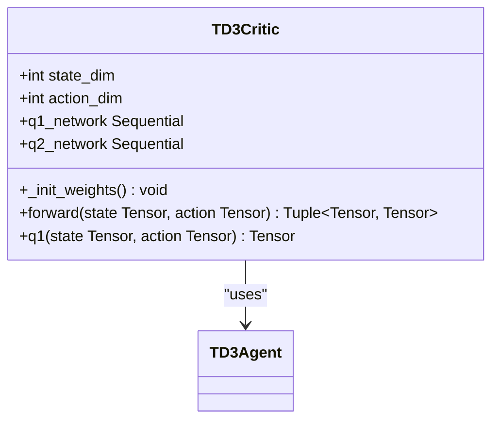

**Diagram sources**
- [single_agent/td3.py](file://single_agent/td3.py#L100-L150)

#### TD3 ReplayBuffer
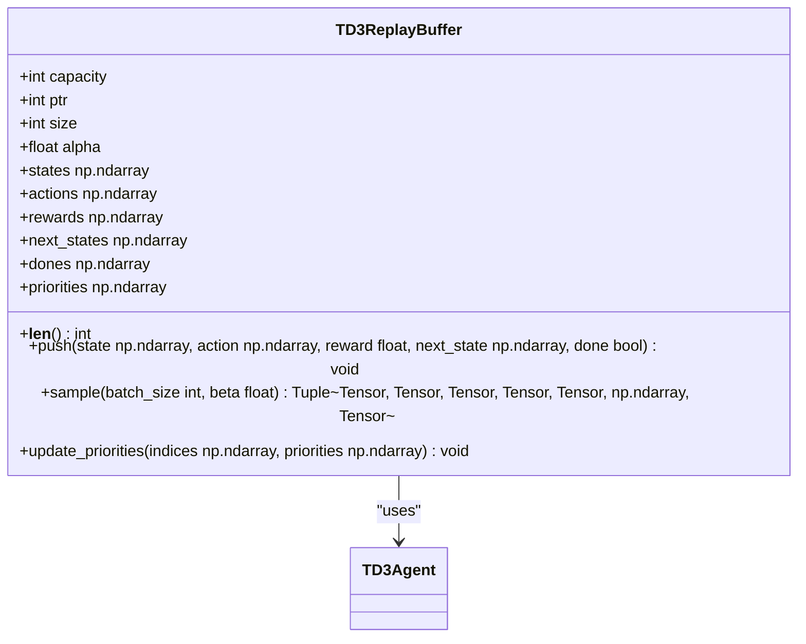

**Diagram sources**
- [single_agent/td3.py](file://single_agent/td3.py#L153-L213)

#### TD3 Agent
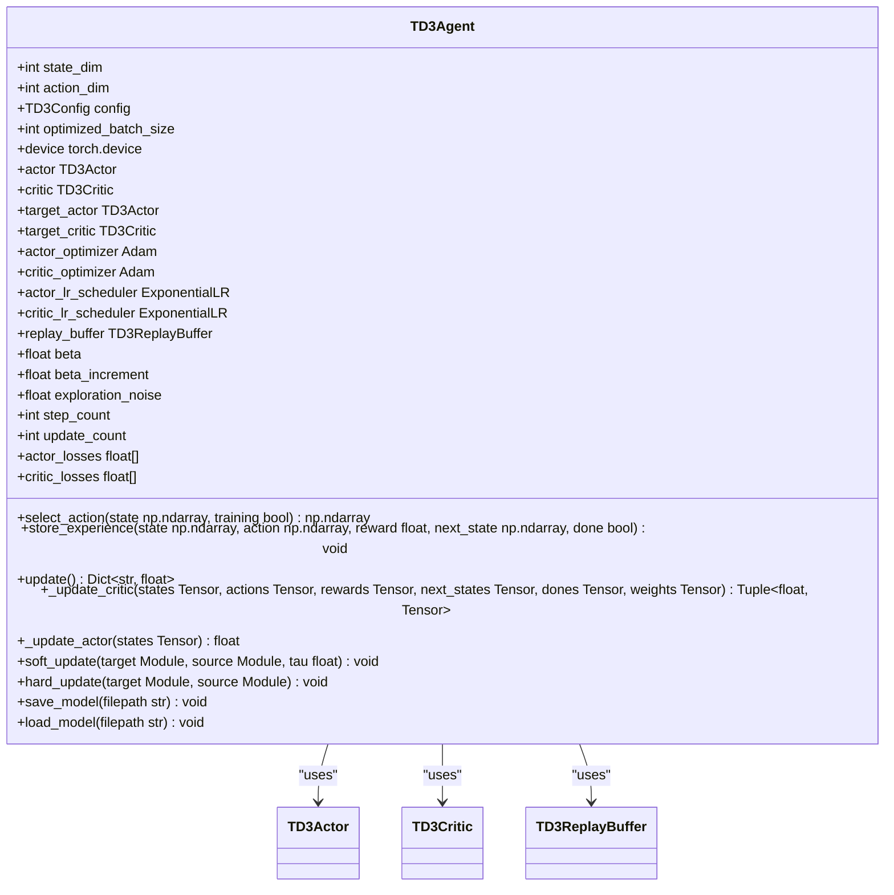

**Diagram sources**
- [single_agent/td3.py](file://single_agent/td3.py#L216-L426)

#### TD3 Environment
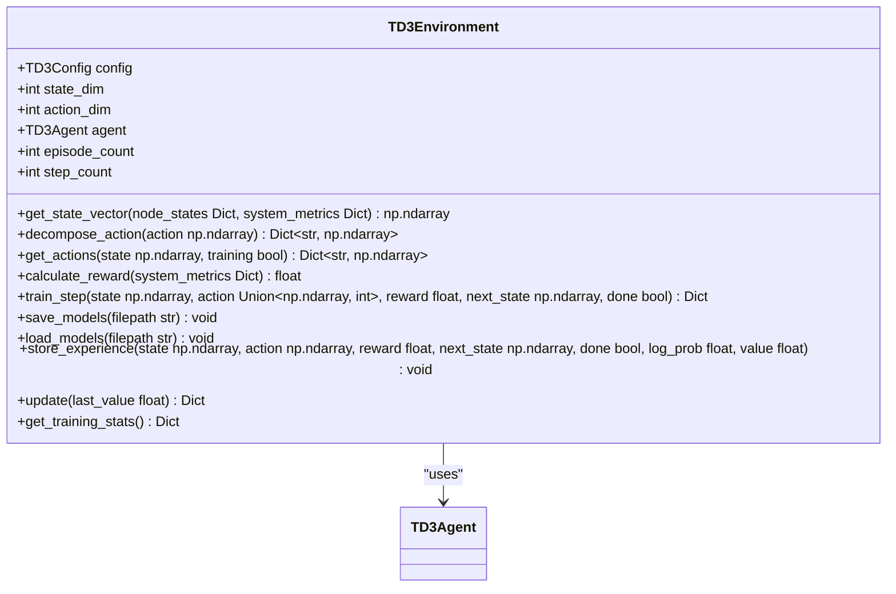

**Diagram sources**
- [single_agent/td3.py](file://single_agent/td3.py#L429-L546)

### PPO算法分析
PPO算法通过裁剪代理目标防止过大策略更新，GAE减少方差，自适应KL散度约束稳定训练过程。PPO的Actor网络采用随机策略，Critic网络采用价值网络，Buffer采用经验缓冲区，Agent负责选择动作，存储经验，更新网络参数，保存和加载模型。PPO的Environment负责构建全局状态向量，分解动作，计算奖励，执行训练步骤，保存和加载模型。

#### PPO Actor网络
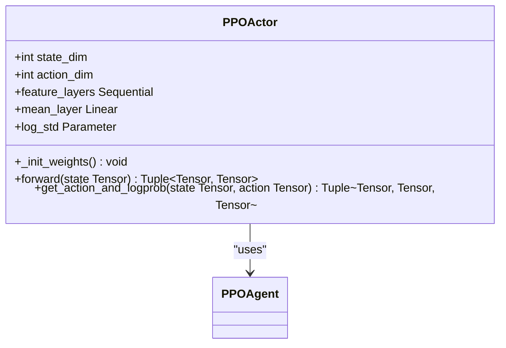

**Diagram sources**
- [single_agent/ppo.py](file://single_agent/ppo.py#L58-L113)

#### PPO Critic网络
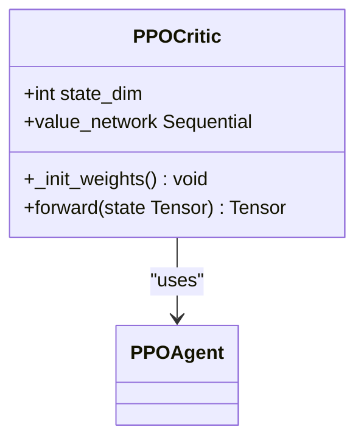

**Diagram sources**
- [single_agent/ppo.py](file://single_agent/ppo.py#L116-L144)

#### PPO Buffer
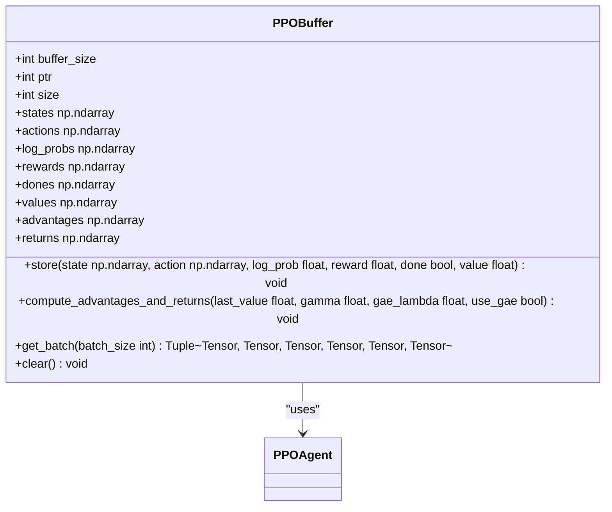

**Diagram sources**
- [single_agent/ppo.py](file://single_agent/ppo.py#L147-L232)

#### PPO Agent
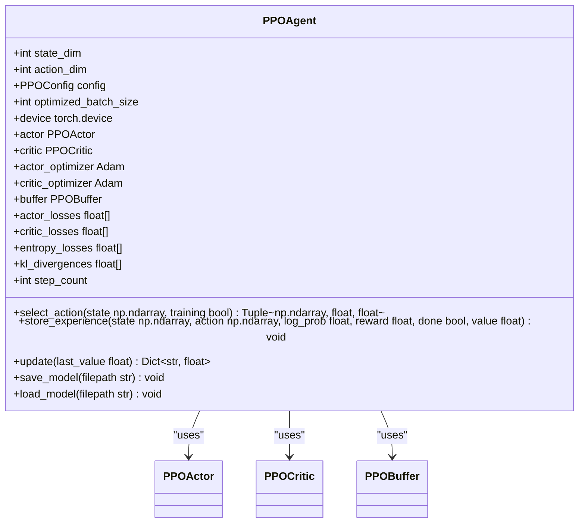

**Diagram sources**
- [single_agent/ppo.py](file://single_agent/ppo.py#L235-L407)

#### PPO Environment
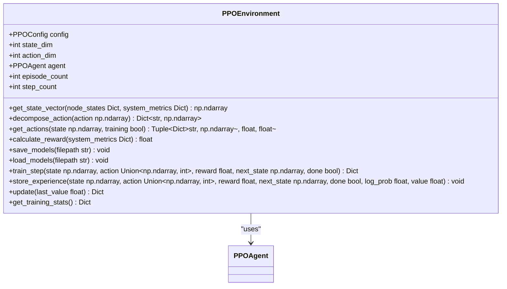

**Diagram sources**
- [single_agent/ppo.py](file://single_agent/ppo.py#L410-L518)

### DQN算法分析
DQN算法通过深度Q网络处理离散动作空间，经验回放机制提高样本效率，目标网络稳定训练过程，ε-贪婪探索策略提高探索效率。DQN的Network采用Dueling DQN架构，ReplayBuffer采用经验回放缓冲区，Agent负责选择动作，存储经验，更新网络参数，保存和加载模型。DQN的Environment负责构建全局状态向量，分解动作，计算奖励，执行训练步骤，保存和加载模型。

#### DQN Network
```mermaid
classDiagram
    class DQNNetwork {
        +int state_dim
        +int action_dim
        +bool dueling
        +feature_layers Sequential
        +value_stream Sequential
        +advantage_stream Sequential
        +q_network