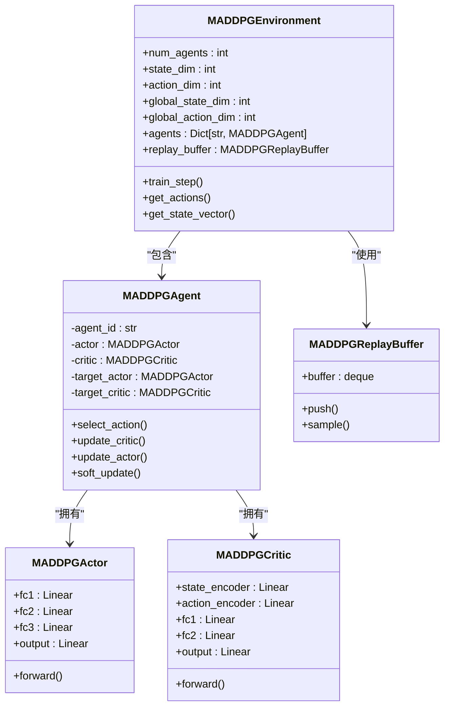

# MADDPG算法架构

<cite>
**本文档引用文件**   
- [maddpg.py](file://algorithms/maddpg.py)
- [algorithm_config.py](file://config/algorithm_config.py)
- [system_config.py](file://config/system_config.py)
- [train_multi_agent.py](file://train_multi_agent.py)
</cite>

## 目录
1. [引言](#引言)
2. [核心架构设计](#核心架构设计)
3. [集中式Critic与分布式Actor](#集中式critic与分布式actor)
4. [梯度传播与策略指导](#梯度传播与策略指导)
5. [在车联网任务卸载中的应用](#在车联网任务卸载中的应用)
6. [多智能体间策略干扰缓解](#多智能体间策略干扰缓解)
7. [RSU资源调度与响应时间优化](#rsu资源调度与响应时间优化)
8. [系统配置与调参](#系统配置与调参)
9. [结论](#结论)

## 引言

MADDPG（Multi-Agent Deep Deterministic Policy Gradient）是一种专为混合合作-竞争环境设计的多智能体强化学习算法。在VEC_mig_caching系统中，MADDPG被用于优化车联网环境下的任务迁移与缓存决策。该算法采用“集中式训练，分布式执行”（Centralized Training, Decentralized Execution）范式，每个智能体拥有独立的Actor-Critic网络。Critic网络能够访问全局状态和联合动作以进行集中式Q值评估，而Actor仅依赖局部观测执行策略决策。这种设计有效解决了多智能体环境中的部分可观测性问题，并通过Critic对Actor的策略指导实现协同优化。

**Section sources**
- [maddpg.py](file://algorithms/maddpg.py#L1-L50)

## 核心架构设计

MADDPG的核心架构由多个独立的智能体组成，每个智能体包含一个Actor网络和一个Critic网络。系统通过`MADDPGEnvironment`类进行管理，该类负责初始化所有智能体、维护经验回放缓冲区以及协调训练过程。在VEC_mig_caching系统中，存在三种类型的智能体：`vehicle_agent`、`rsu_agent`和`uav_agent`，分别对应车辆、路侧单元和无人机。每个智能体的局部状态维度为20，动作维度为10，而Critic网络处理的全局状态维度为60（20×3），全局动作维度为30（10×3）。系统采用软更新（soft update）策略来稳定目标网络，软更新系数τ默认为0.01。



**Diagram sources **
- [maddpg.py](file://algorithms/maddpg.py#L465-L510)
- [maddpg.py](file://algorithms/maddpg.py#L200-L233)

**Section sources**
- [maddpg.py](file://algorithms/maddpg.py#L465-L510)
- [maddpg.py](file://algorithms/maddpg.py#L200-L233)

## 集中式Critic与分布式Actor

MADDPG的核心创新在于其集中式Critic与分布式Actor的设计模式。Actor网络仅接收智能体自身的局部观测状态作为输入，输出确定性动作，实现了分布式执行。而Critic网络则接收所有智能体的联合状态和联合动作作为输入，从而能够评估全局Q值。这种设计使得Critic在训练过程中可以利用全局信息来指导每个Actor的策略更新，解决了多智能体环境中由于部分可观测性导致的信用分配问题。

在`MADDPGAgent`类中，`select_action`方法实现了Actor的前向传播，仅使用局部状态`state`通过`MADDPGActor`网络生成动作。而`update_critic`和`update_actor`方法则利用`_get_global_states`和`_get_global_actions`等辅助方法将分散的局部信息拼接成全局状态和全局动作张量，供Critic网络使用。`MADDPGCritic`网络通过状态编码器和动作编码器分别处理全局状态和全局动作，然后将它们的特征向量拼接并送入融合网络进行Q值预测。

```mermaid
sequenceDiagram
participant Agent as "智能体"
participant Actor as "Actor网络"
participant Critic as "Critic网络"
participant Buffer as "经验回放缓冲区"
Agent->>Actor : 输入局部状态
Actor->>Agent : 输出局部动作
Agent->>Buffer : 存储(局部状态, 局部动作, 奖励, ...)
Buffer->>Agent : 采样批次经验
Agent->>Critic : 提供全局状态和全局动作
Critic->>Agent : 输出Q值
Agent->>Actor : 通过Q值梯度更新Actor
Agent->>Critic : 通过TD误差更新Critic
```

**Diagram sources **
- [maddpg.py](file://algorithms/maddpg.py#L235-L256)
- [maddpg.py](file://algorithms/maddpg.py#L258-L288)
- [maddpg.py](file://algorithms/maddpg.py#L290-L313)

**Section sources**
- [maddpg.py](file://algorithms/maddpg.py#L235-L256)
- [maddpg.py](file://algorithms/maddpg.py#L258-L288)
- [maddpg.py](file://algorithms/maddpg.py#L290-L313)

## 梯度传播与策略指导

在MADDPG的训练过程中，梯度传播是实现Critic对Actor策略指导的关键机制。训练流程在`train_step`方法中定义：首先将经验存入共享的`MADDPGReplayBuffer`，然后当缓冲区达到指定批次大小时，开始采样并更新网络。

`update_critic`方法首先计算目标Q值。它使用目标网络（target networks）和`_get_target_actions`方法获取下一状态下的目标动作，结合即时奖励和折扣因子γ，计算出目标Q值。然后，它计算当前Critic网络对当前状态-动作对的Q值预测，并通过均方误差（MSE）损失函数进行优化。

`update_actor`方法则实现了策略梯度更新。它固定其他智能体的动作，仅使用当前智能体的Actor网络生成新动作，然后通过`_get_global_actions_with_new_action`方法构建包含新动作的全局动作向量。Actor的损失函数定义为负的Q值期望（-Q(s,a)），这意味着最大化Q值等价于最小化Actor的损失。通过反向传播这个损失，Critic网络的Q值评估直接指导了Actor网络的参数更新，使其学习到能够获得更高Q值的策略。

**Section sources**
- [maddpg.py](file://algorithms/maddpg.py#L258-L288)
- [maddpg.py](file://algorithms/maddpg.py#L290-L313)
- [maddpg.py](file://algorithms/maddpg.py#L548-L588)

## 在车联网任务卸载中的应用

MADDPG在VEC_mig_caching系统中被应用于车联网任务卸载决策，有效解决了部分可观测性问题。每个智能体（车辆、RSU、UAV）基于其局部观测（如自身位置、速度、能耗、缓存状态等）做出决策，而Critic网络则能访问所有智能体的状态和动作，从而理解整个系统的全局动态。

`get_state_vector`方法构建了智能体的状态向量，它包含所有智能体共享的基础系统状态（如平均任务时延、总能耗、数据丢失率、缓存命中率、迁移成功率）以及智能体特定的局部状态。这种设计使得Actor能够关注与自身相关的局部信息，而Critic能够全面评估联合策略对全局性能的影响。实验结果表明，MADDPG能够学习到有效的协作策略，例如车辆在计算资源紧张时将任务卸载给RSU或UAV，从而优化整体系统性能。

**Section sources**
- [maddpg.py](file://algorithms/maddpg.py#L524-L546)
- [train_multi_agent.py](file://train_multi_agent.py#L187-L220)

## 多智能体间策略干扰缓解

多智能体环境中的一个主要挑战是策略干扰（non-stationarity），即一个智能体的策略变化会改变环境对其他智能体的动态。MADDPG通过使用独立的经验回放缓冲区（independent replay buffers）来缓解这一问题。在`MADDPGEnvironment`中，所有智能体共享一个`MADDPGReplayBuffer`实例，该缓冲区存储的是包含所有智能体状态、动作、奖励和终止标志的联合经验元组。

虽然所有智能体从同一个缓冲区采样，但由于每个智能体的Critic网络在更新时只关注自己的奖励信号，并且Actor的更新依赖于Critic的评估，这在一定程度上隔离了其他智能体策略变化带来的直接干扰。与共享回放池相比，这种设计在样本效率和策略稳定性之间取得了平衡。共享回放池可以促进知识共享，但可能因策略更新不同步而导致学习不稳定；而完全独立的回放池则可能降低样本利用率。MADDPG的共享缓冲区设计更倾向于前者，通过集中式Critic的全局视角来协调学习过程。

**Section sources**
- [maddpg.py](file://algorithms/maddpg.py#L497-L500)
- [maddpg.py](file://algorithms/maddpg.py#L141-L194)

## RSU资源调度与响应时间优化

MADDPG在RSU资源调度和车辆任务响应时间优化方面表现出显著优势。`rsu_agent`负责管理RSU的计算队列、缓存资源和通信带宽。通过MADDPG，`rsu_agent`能够学习到最优的资源分配策略，例如根据任务的紧迫性和计算需求动态调整服务优先级，或在缓存命中率低时主动预取内容。

`vehicle_agent`则学习何时以及向何处（RSU或UAV）卸载任务，以最小化自身的响应时间和能耗。`uav_agent`学习最优的飞行路径和悬停位置，以最大化服务覆盖范围。这三个智能体的策略在Critic网络的协调下共同优化，最终目标是降低系统的平均任务时延。训练结果显示，MADDPG能够有效收敛，随着训练轮次的增加，平均任务时延和总能耗持续下降，任务完成率和缓存命中率稳步提升。

**Section sources**
- [maddpg.py](file://algorithms/maddpg.py#L524-L546)
- [train_multi_agent.py](file://train_multi_agent.py#L270-L300)

## 系统配置与调参

MADDPG算法的配置主要在`maddpg.py`文件中的`MADDPGConfig`类和`config/algorithm_config.py`文件中的`AlgorithmConfig`类中定义。用户可以通过修改这些配置来启用MADDPG算法并调整其超参数。

在`algorithm_config.py`中，`maddpg_config`字典定义了MADDPG的默认超参数，如`actor_lr`（Actor学习率）、`critic_lr`（Critic学习率）、`gamma`（折扣因子）、`tau`（软更新系数）、`noise_std`（探索噪声标准差）、`hidden_dim`（网络隐藏层维度）、`batch_size`（批次大小）和`memory_size`（经验回放缓冲区大小）。用户可以通过`get_algorithm_config`方法获取这些配置，并通过`update_algorithm_config`方法进行修改。

在`train_multi_agent.py`脚本中，通过命令行参数`--algorithm MADDPG`来启用MADDPG算法进行训练。用户可以调整训练轮次（`--episodes`）等参数。系统还支持通过`vec_system_config.json`文件进行更高级的配置。

**Section sources**
- [maddpg.py](file://algorithms/maddpg.py#L32-L52)
- [algorithm_config.py](file://config/algorithm_config.py#L1-L73)
- [train_multi_agent.py](file://train_multi_agent.py#L1-L799)

## 结论

MADDPG算法通过其创新的集中式Critic与分布式Actor架构，为VEC_mig_caching系统中的多智能体任务卸载问题提供了一个高效的解决方案。该架构成功地将全局信息的利用与分布式执行的可扩展性相结合，有效缓解了部分可观测性和策略干扰等挑战。在RSU资源调度和车辆任务响应时间优化的应用中，MADDPG展现了良好的收敛性和性能优势。通过合理的系统配置和超参数调优，MADDPG能够学习到高效的协作策略，显著提升车联网系统的整体性能。未来的工作可以探索与MATD3等更先进算法的性能对比，以及在动态网络拓扑下的适应性。