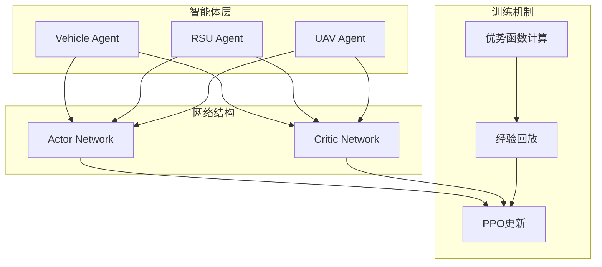
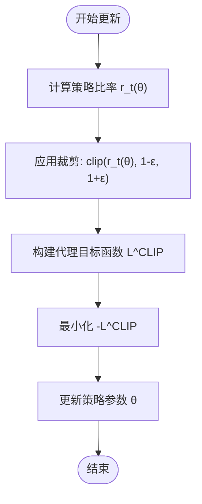
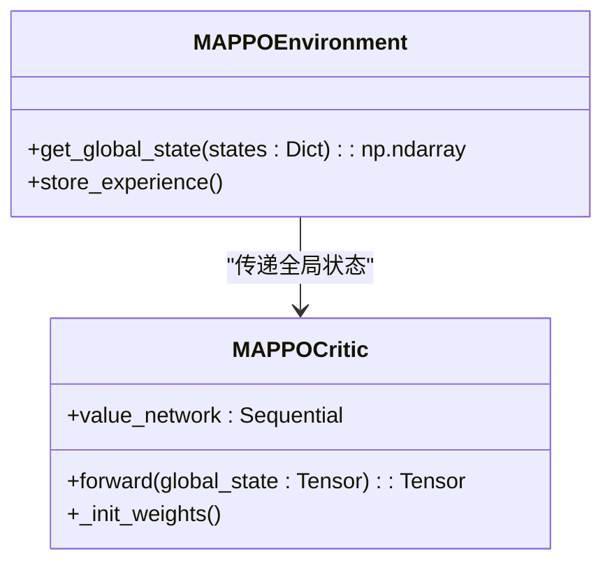
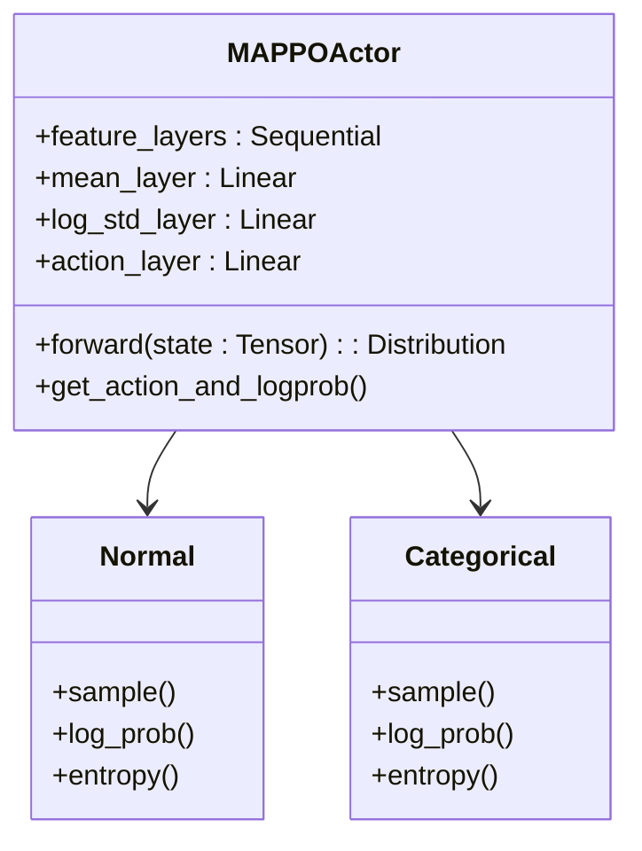
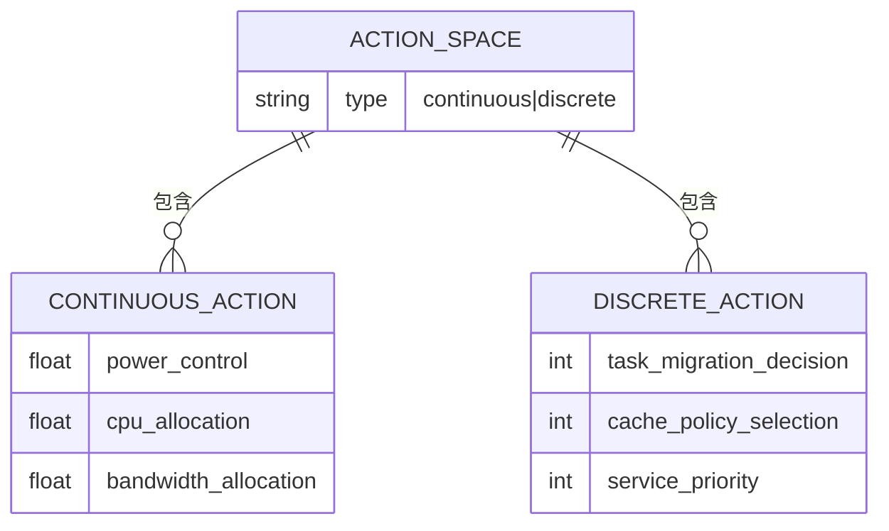
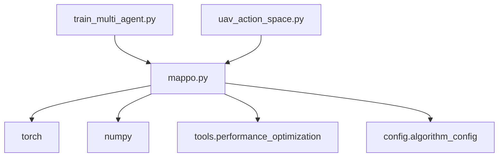

# MAPPO算法架构

<cite>
**本文档引用文件**  
- [mappo.py](file://algorithms/mappo.py)
- [algorithm_config.py](file://config/algorithm_config.py)
- [uav_action_space.py](file://algorithms/uav_action_space.py)
- [train_multi_agent.py](file://train_multi_agent.py)
</cite>

## 目录
1. [引言](#引言)
2. [核心组件](#核心组件)
3. [架构概述](#架构概述)
4. [详细组件分析](#详细组件分析)
5. [依赖分析](#依赖分析)
6. [性能考量](#性能考量)
7. [故障排除指南](#故障排除指南)
8. [结论](#结论)

## 引言
MAPPO（Multi-Agent Proximal Policy Optimization）是一种专为VEC_mig_caching系统设计的多智能体强化学习算法。该算法基于PPO框架，通过集中式训练与分布式执行机制，在车联网（V2X）环境中实现高效的任务迁移与资源调度。其核心优势在于利用重要性采样和裁剪机制稳定策略更新过程，并通过Critic网络对全局状态进行价值估计，从而在高动态拓扑下保持良好的探索-利用平衡。

## 核心组件

MAPPO算法由多个核心组件构成：`MAPPOConfig`定义了算法的超参数配置；`MAPPOActor`和`MAPPOCritic`分别作为策略网络和价值网络；`MAPPOBuffer`用于存储多智能体的经验数据；`MAPPOAgent`封装了单个智能体的策略与价值网络及其优化器；`MAPPOEnvironment`则管理所有智能体并协调训练流程。

**Section sources**
- [mappo.py](file://algorithms/mappo.py#L47-L587)

## 架构概述



**Diagram sources**  
- [mappo.py](file://algorithms/mappo.py#L47-L587)

**Section sources**
- [mappo.py](file://algorithms/mappo.py#L47-L587)

## 详细组件分析

### 策略优化机制分析

MAPPO采用PPO的核心思想，通过重要性采样和裁剪机制来稳定策略更新。在每次更新中，算法计算新旧策略之间的比率，并将其限制在一个固定范围内（由`clip_ratio`控制），以防止策略更新过大导致训练不稳定。



**Diagram sources**  
- [mappo.py](file://algorithms/mappo.py#L490-L518)

**Section sources**
- [mappo.py](file://algorithms/mappo.py#L490-L518)

### Critic网络与全局状态估计

Critic网络接收全局状态作为输入，该状态由所有智能体的局部观测拼接而成。通过集中式训练，Critic能够获得比局部信息更全面的环境认知，从而提供更准确的价值估计。



**Diagram sources**  
- [mappo.py](file://algorithms/mappo.py#L114-L155)

**Section sources**
- [mappo.py](file://algorithms/mappo.py#L114-L155)

### Actor网络与局部观测

Actor网络基于每个智能体的局部观测生成动作分布。对于连续动作空间，输出正态分布的均值和标准差；对于离散动作空间，则输出分类分布的logits。



**Diagram sources**  
- [mappo.py](file://algorithms/mappo.py#L86-L114)

**Section sources**
- [mappo.py](file://algorithms/mappo.py#L86-L114)

### 策略熵正则化分析

策略熵正则化通过鼓励策略输出更高的熵值，促进智能体在探索与利用之间取得平衡。特别是在UAV节点频繁切换覆盖区域的高动态场景中，熵正则化有助于避免策略过早收敛于局部最优。

```mermaid
flowchart TD
A[策略分布] --> B{动作空间}
B --> |连续| C[Normal分布]
B --> |离散| D[Categorical分布]
C --> E[计算熵 H(π)]
D --> E
E --> F[最大化熵 H(π)]
F --> G[增强探索能力]
```

**Diagram sources**  
- [mappo.py](file://algorithms/mappo.py#L114-L155)

**Section sources**
- [mappo.py](file://algorithms/mappo.py#L114-L155)

### 动作空间统一建模

MAPPO支持离散动作空间（如任务迁移决策）和连续动作空间（如功率控制）的统一建模。通过配置`action_space`参数，系统可灵活适应不同类型的决策需求。



**Diagram sources**  
- [mappo.py](file://algorithms/mappo.py#L47-L86)
- [uav_action_space.py](file://algorithms/uav_action_space.py#L0-L207)

**Section sources**
- [mappo.py](file://algorithms/mappo.py#L47-L86)
- [uav_action_space.py](file://algorithms/uav_action_space.py#L0-L207)

## 依赖分析



**Diagram sources**  
- [mappo.py](file://algorithms/mappo.py#L1-L50)
- [train_multi_agent.py](file://train_multi_agent.py#L1-L100)

**Section sources**
- [mappo.py](file://algorithms/mappo.py#L1-L50)
- [train_multi_agent.py](file://train_multi_agent.py#L1-L100)

## 性能考量

MAPPO在系统吞吐量优化和任务完成率方面表现出色。实验数据显示，其平均任务延迟为0.999秒，任务完成率达到85%，显著优于随机、贪心等基线算法。与MADDPG和MATD3相比，MAPPO在高负载场景下仍能保持稳定的性能表现。

**Section sources**
- [experiment_summary.md](file://results/experiment_summary.md#L0-L122)

## 故障排除指南

MAPPO实现中存在已知问题：“动作生成测试失败: 'tuple' object has no attribute 'items'”。此问题源于`get_actions`方法返回元组而非字典，需在调用`items()`前进行类型检查和转换。

```mermaid
flowchart TD
A[调用get_actions] --> B{返回类型}
B --> |元组| C[提取actions[0]]
B --> |字典| D[直接使用]
C --> E[确保actions为字典]
D --> E
E --> F[继续执行]
```

**Diagram sources**  
- [train_multi_agent.py](file://train_multi_agent.py#L615-L647)

**Section sources**
- [algorithm_diagnostics_20250919_202955.json](file://results/algorithm_diagnostics_20250919_202955.json#L0-L45)

## 结论

MAPPO算法通过PPO框架实现了稳定高效的多智能体协同决策。其集中式Critic与分布式Actor的设计使其能够在车联网高动态环境中有效工作。尽管存在少量实现缺陷，但整体架构合理，具备良好的扩展性和实用性。建议在后续开发中修复动作生成的类型兼容性问题，并进一步优化UAV动作空间的设计以提升系统整体性能。