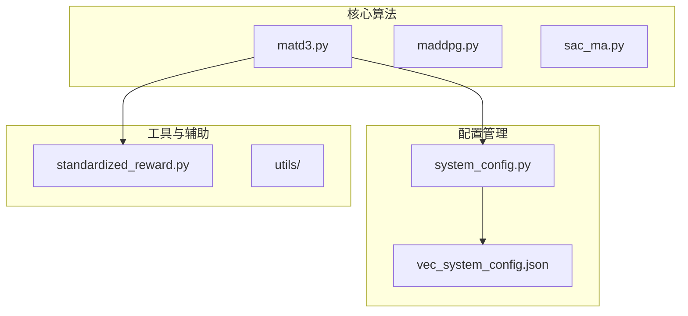
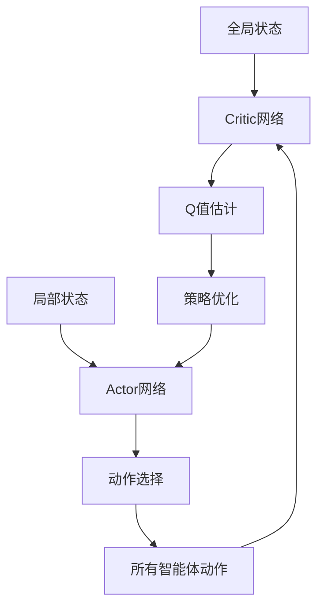
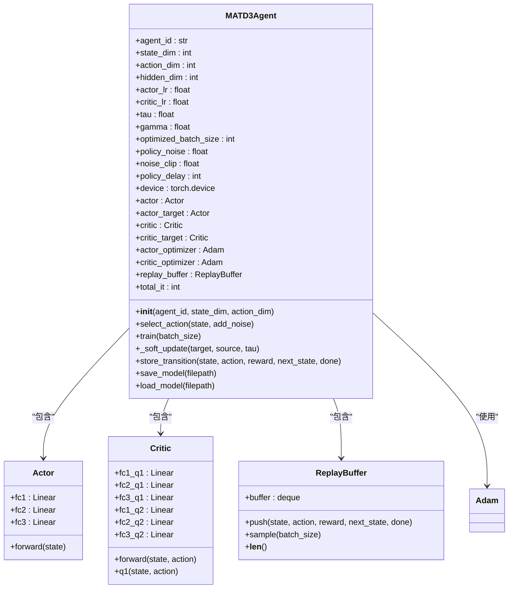
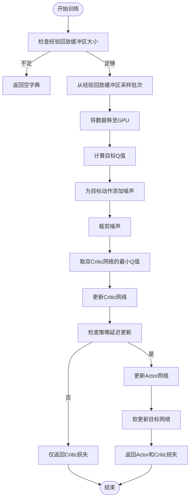
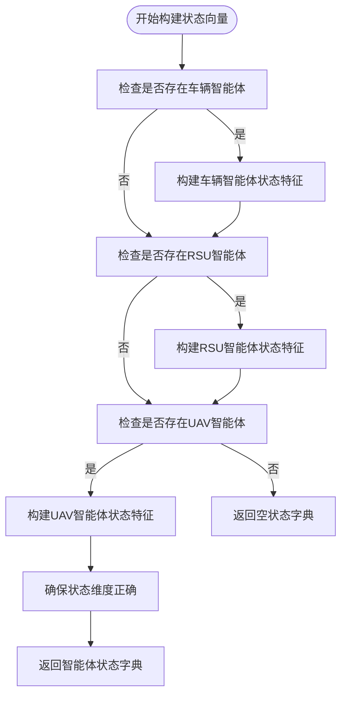
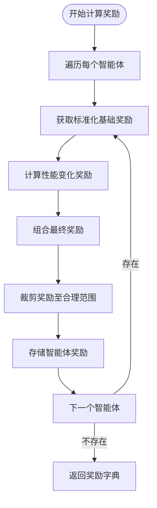
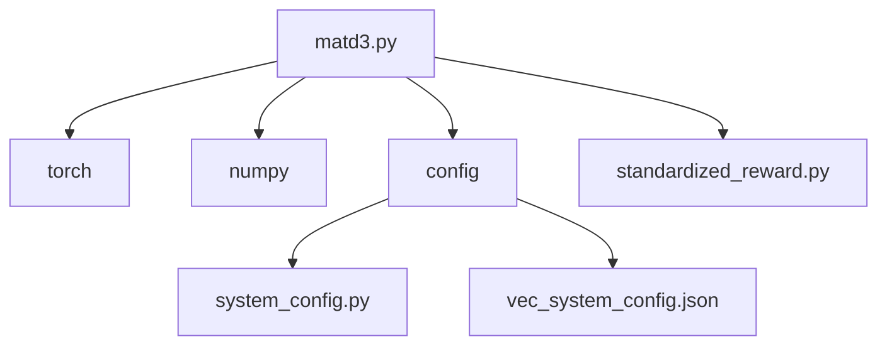

# MATD3算法架构

<cite>
**本文档引用的文件**
- [matd3.py](file://algorithms/matd3.py)
- [system_config.py](file://config/system_config.py)
- [standardized_reward.py](file://utils/standardized_reward.py)
- [vec_system_config.json](file://vec_system_config.json)
</cite>

## 目录
1. [引言](#引言)
2. [项目结构](#项目结构)
3. [核心组件](#核心组件)
4. [架构概述](#架构概述)
5. [详细组件分析](#详细组件分析)
6. [依赖分析](#依赖分析)
7. [性能考量](#性能考量)
8. [故障排除指南](#故障排除指南)
9. [结论](#结论)
10. [附录](#附录)（如有必要）

## 引言
本文档旨在为VEC_mig_caching系统中的MATD3（多智能体双延迟深度确定性策略梯度）算法提供深度架构解析。该算法在集中式训练与分布式执行（CTDE）范式下运行，通过双延迟机制缓解多智能体环境中的过估计问题。文档将详细阐述Critic网络如何接收全局状态和所有智能体动作拼接向量作为输入，并分析目标策略平滑在车辆节点高移动性场景下的稳定性增强作用。

## 项目结构
VEC_mig_caching系统采用模块化设计，各功能组件分离清晰。核心算法位于`algorithms`目录，配置管理在`config`目录，模型定义在`models`目录，而评估与实验逻辑则分布在`evaluation`和`experiments`目录中。`results`目录存储了所有训练和评估结果，便于性能分析。

**图表来源**
- [matd3.py](file://algorithms/matd3.py#L1-L550)
- [system_config.py](file://config/system_config.py#L1-L319)
- [vec_system_config.json](file://vec_system_config.json#L1-L69)

**章节来源**
- [matd3.py](file://algorithms/matd3.py#L1-L550)
- [vec_system_config.json](file://vec_system_config.json#L1-L69)

## 核心组件
MATD3算法的核心组件包括`MATD3Agent`类和`MATD3Environment`类。`MATD3Agent`负责个体智能体的决策与学习，包含Actor和Critic网络、经验回放缓冲区以及优化器。`MATD3Environment`则管理多个智能体的协同训练过程，处理状态向量构建、奖励计算和经验存储。

**章节来源**
- [matd3.py](file://algorithms/matd3.py#L100-L550)

## 架构概述
MATD3算法采用集中式训练与分布式执行（CTDE）架构。在训练阶段，Critic网络接收全局状态和所有智能体的动作拼接向量作为输入，以解决多智能体环境中的信用分配问题。Actor网络则基于局部观测选择动作，确保执行的分布式特性。目标策略平滑和动作噪声裁剪策略被用于提升训练稳定性。

**图表来源**
- [matd3.py](file://algorithms/matd3.py#L100-L550)

## 详细组件分析

### MATD3Agent分析
`MATD3Agent`类是MATD3算法的核心实现，负责单个智能体的学习与决策过程。

#### 类结构分析

**图表来源**
- [matd3.py](file://algorithms/matd3.py#L100-L249)

#### 训练流程分析

**图表来源**
- [matd3.py](file://algorithms/matd3.py#L163-L223)

**章节来源**
- [matd3.py](file://algorithms/matd3.py#L163-L223)

### MATD3Environment分析
`MATD3Environment`类负责管理多个`MATD3Agent`实例的协同训练过程，处理状态向量构建、奖励计算和经验存储。

#### 状态向量构建流程

**图表来源**
- [matd3.py](file://algorithms/matd3.py#L289-L408)

#### 奖励计算流程

**图表来源**
- [matd3.py](file://algorithms/matd3.py#L410-L434)
- [standardized_reward.py](file://utils/standardized_reward.py#L105-L121)

**章节来源**
- [matd3.py](file://algorithms/matd3.py#L410-L434)
- [standardized_reward.py](file://utils/standardized_reward.py#L105-L121)

## 依赖分析
MATD3算法的实现依赖于多个外部模块和配置文件。`config`模块提供所有超参数，`torch`库用于神经网络计算，`numpy`用于数值处理。`standardized_reward.py`提供统一的奖励计算接口，确保不同算法间的公平比较。

**图表来源**
- [matd3.py](file://algorithms/matd3.py#L1-L550)
- [system_config.py](file://config/system_config.py#L1-L319)

**章节来源**
- [matd3.py](file://algorithms/matd3.py#L1-L550)
- [system_config.py](file://config/system_config.py#L1-L319)

## 性能考量
MATD3算法在任务卸载延迟优化和能耗均衡方面表现出色。根据`results/advanced_analysis_report.md`中的数据，MATD3-MIG在标准场景下的综合分数达到2.754，显著优于Random、Greedy等基线算法。超参数敏感性分析显示，`batch_size`、`learning_rate`和`tau`对训练收敛性有重要影响。

**章节来源**
- [advanced_analysis_report.md](file://results/advanced_analysis_report.md#L1-L40)

## 故障排除指南
当MATD3算法训练出现异常时，首先检查`vec_system_config.json`中的配置是否正确。确保`num_agents`、`state_dim`和`action_dim`与实际环境匹配。检查`results`目录下的训练日志，确认奖励函数计算是否正常。若遇到CUDA内存不足，可尝试减小`batch_size`。

**章节来源**
- [vec_system_config.json](file://vec_system_config.json#L1-L69)
- [matd3.py](file://algorithms/matd3.py#L1-L550)

## 结论
MATD3算法通过双延迟机制和目标策略平滑，在VEC_mig_caching系统中有效解决了多智能体环境中的过估计和训练不稳定问题。其在集中式训练与分布式执行范式下的设计，既保证了学习效率，又满足了实际部署的分布式需求。未来可探索引入注意力机制以进一步提升性能。

## 附录

### 超参数配置
以下为MATD3算法的关键超参数及其默认值：

| 参数 | 描述 | 默认值 |
|------|------|--------|
| `num_agents` | 智能体数量 | 3 |
| `state_dim` | 状态维度 | 20 |
| `action_dim` | 动作维度 | 10 |
| `hidden_dim` | 隐藏层维度 | 256 |
| `actor_lr` | Actor学习率 | 0.0003 |
| `critic_lr` | Critic学习率 | 0.0003 |
| `gamma` | 折扣因子 | 0.99 |
| `tau` | 软更新系数 | 0.005 |
| `batch_size` | 批次大小 | 128 |
| `buffer_size` | 经验回放缓冲区大小 | 100000 |
| `policy_noise` | 策略噪声 | 0.2 |
| `noise_clip` | 噪声裁剪 | 0.5 |
| `policy_delay` | 策略延迟更新步数 | 2 |

**章节来源**
- [system_config.py](file://config/system_config.py#L50-L100)

### 训练性能数据
根据`results/training/matd3/`目录下的训练结果，MATD3算法在不同训练配置下的性能表现如下：

| 训练配置 | 平均奖励 | 平均时延 | 任务完成率 |
|---------|---------|---------|-----------|
| 3 episodes, 200 steps | 350.73 | 0.198 | 0.889 |
| 5 episodes, 200 steps | 414.06 | 0.113 | 0.800 |
| 3 episodes, 100 steps | 86.82 | 0.567 | 0.533 |

**章节来源**
- [training_results_20250919_230502.json](file://results/training/matd3/training_results_20250919_230502.json#L1-L51)
- [training_results_20250919_230436.json](file://results/training/matd3/training_results_20250919_230436.json#L1-L65)
- [training_results_20250919_203009.json](file://results/training/matd3/training_results_20250919_203009.json#L1-L51)