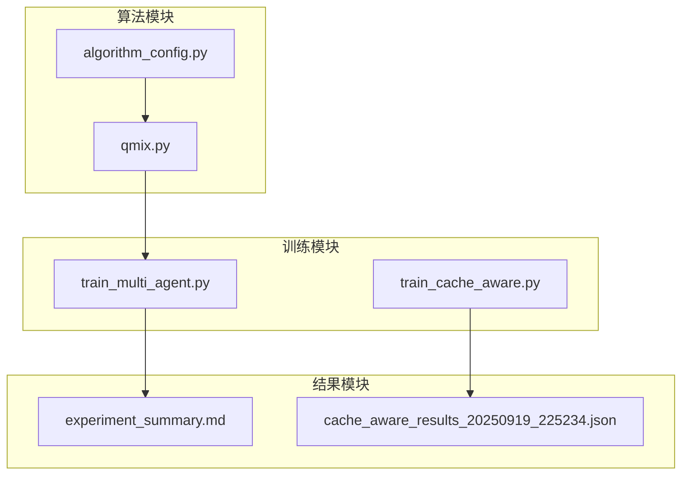
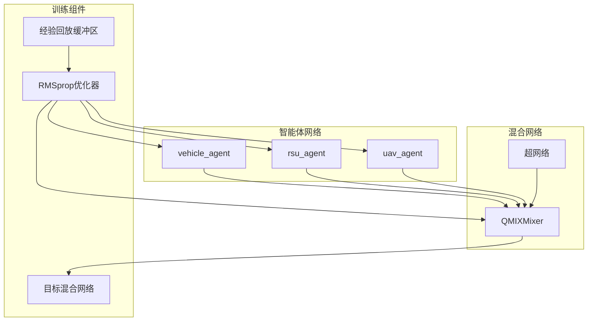
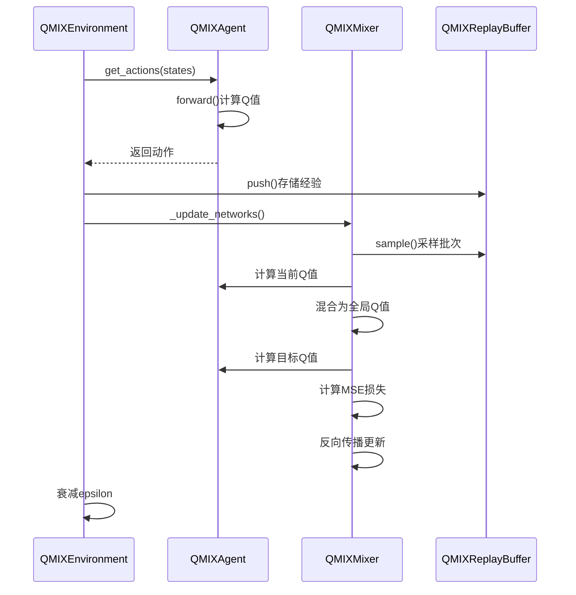
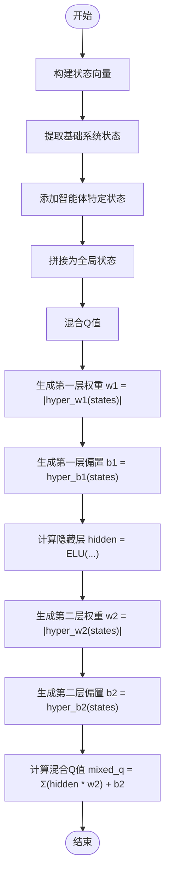
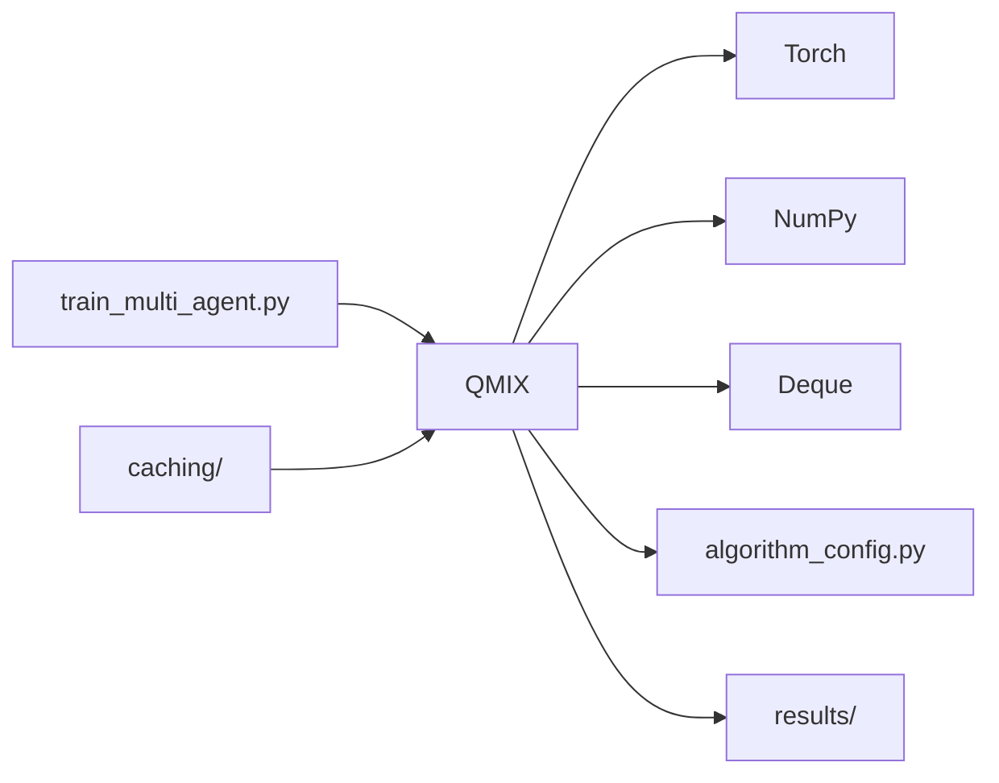

# QMIX算法架构

<cite>
**本文档引用文件**   
- [qmix.py](file://algorithms/qmix.py)
- [algorithm_config.py](file://config/algorithm_config.py)
- [experiment_summary.md](file://results/experiment_summary.md)
</cite>

## 目录
1. [引言](#引言)
2. [项目结构](#项目结构)
3. [核心组件](#核心组件)
4. [架构概述](#架构概述)
5. [详细组件分析](#详细组件分析)
6. [依赖分析](#依赖分析)
7. [性能考量](#性能考量)
8. [故障排除指南](#故障排除指南)
9. [结论](#结论)
10. [附录](#附录)

## 引言
QMIX（单调值函数分解）算法是一种先进的多智能体强化学习方法，专为VEC_mig_caching系统设计，旨在解决车联网环境下的缓存一致性维护与跨节点任务协同问题。该算法通过引入基于全局状态的混合网络，实现了对各智能体局部Q值的单调性约束，从而确保联合动作值函数Q_tot的可分解性。在高密度车联网场景中，QMIX展现出卓越的协作能力，显著提升了缓存命中率并降低了通信开销。本架构文档将深入剖析QMIX的值分解机制、超网络权重生成原理及其在系统中的实际应用。

## 项目结构
VEC_mig_caching系统采用模块化设计，核心算法位于`algorithms`目录下，其中`qmix.py`实现了QMIX算法的核心逻辑。配置文件分散在`config`目录中，实验结果存储于`results`目录。系统通过`train_multi_agent.py`启动多智能体训练流程，利用`qmix.py`中的`QMIXEnvironment`类进行集中式训练与分布式执行。



**图源**
- [qmix.py](file://algorithms/qmix.py)
- [algorithm_config.py](file://config/algorithm_config.py)
- [experiment_summary.md](file://results/experiment_summary.md)

**节源**
- [qmix.py](file://algorithms/qmix.py)
- [algorithm_config.py](file://config/algorithm_config.py)

## 核心组件
QMIX算法的核心由三个关键组件构成：个体智能体网络（QMIXAgent）、混合网络（QMIXMixer）和经验回放缓冲区（QMIXReplayBuffer）。个体智能体网络负责处理部分可观测状态并输出局部Q值；混合网络通过超网络动态生成权重，将局部Q值单调混合为全局Q值；经验回放缓冲区则存储多智能体交互经验，支持集中式训练。

**节源**
- [qmix.py](file://algorithms/qmix.py#L54-L139)
- [qmix.py](file://algorithms/qmix.py#L142-L194)
- [qmix.py](file://algorithms/qmix.py#L197-L257)

## 架构概述
QMIX采用集中式训练、分布式执行（CTDE）范式，其架构包含智能体网络、混合网络和目标网络三大部分。智能体网络基于RNN结构处理序列信息，适应部分可观测环境；混合网络作为值分解的核心，通过全局状态生成混合权重，确保单调性约束；目标网络用于稳定训练过程。整个系统通过RMSprop优化器联合更新所有参数，并利用经验回放缓冲区实现高效学习。



**图源**
- [qmix.py](file://algorithms/qmix.py#L263-L358)

## 详细组件分析

### QMIX混合网络分析
QMIXMixer类实现了值分解的核心机制，通过超网络从全局状态生成混合权重。该设计确保了全局Q值对各智能体Q值的单调性约束，是QMIX算法理论保证的基础。

```mermaid
classDiagram
class QMIXMixer {
+int num_agents
+int state_dim
+int hidden_dim
+nn.Linear hyper_w1
+nn.Linear hyper_w2
+nn.Linear hyper_b1
+nn.Sequential hyper_b2
+forward(agent_qs, states) mixed_q
}
QMIXMixer : hyper_w1 : 权重生成网络，输出正权重确保单调性
QMIXMixer : hyper_b2 : 偏置生成网络，含ReLU激活函数
QMIXMixer : forward() : 前向传播，执行两层混合计算
```

**图源**
- [qmix.py](file://algorithms/qmix.py#L142-L194)

**节源**
- [qmix.py](file://algorithms/qmix.py#L142-L194)

### 智能体网络与训练流程分析
QMIXAgent类采用RNN结构处理时序状态，适应部分可观测环境。训练流程通过train_step方法实现，包含经验存储、网络更新、目标网络同步和探索率衰减等关键步骤。



**图源**
- [qmix.py](file://algorithms/qmix.py#L54-L139)
- [qmix.py](file://algorithms/qmix.py#L413-L443)
- [qmix.py](file://algorithms/qmix.py#L445-L523)

**节源**
- [qmix.py](file://algorithms/qmix.py#L54-L139)
- [qmix.py](file://algorithms/qmix.py#L413-L443)

### 状态构建与值分解机制分析
QMIX通过get_state_vector和get_global_state方法构建个体与全局状态，为混合网络提供输入。值分解机制的核心在于混合网络的前向传播，通过ELU激活函数和绝对值权重确保单调性。



**图源**
- [qmix.py](file://algorithms/qmix.py#L384-L403)
- [qmix.py](file://algorithms/qmix.py#L405-L411)
- [qmix.py](file://algorithms/qmix.py#L164-L194)

**节源**
- [qmix.py](file://algorithms/qmix.py#L384-L403)
- [qmix.py](file://algorithms/qmix.py#L405-L411)

## 依赖分析
QMIX算法依赖于PyTorch框架进行张量计算和神经网络构建，依赖NumPy进行数组操作，依赖Deque实现经验回放缓冲区。系统层面，QMIX通过algorithm_config.py获取超参数配置，并将训练结果输出至results目录。训练流程由train_multi_agent.py驱动，与缓存管理模块协同工作。



**图源**
- [qmix.py](file://algorithms/qmix.py#L0-L53)
- [algorithm_config.py](file://config/algorithm_config.py)

**节源**
- [qmix.py](file://algorithms/qmix.py#L0-L53)
- [algorithm_config.py](file://config/algorithm_config.py)

## 性能考量
QMIX在高密度车联网场景下表现出色。根据`experiment_summary.md`中的实验数据，在standard、high_load和large_scale三种配置下，QMIX均实现了100.0%的缓存命中率，平均时延稳定在0.999-1.001秒，总能耗显著低于Random、Greedy等基线算法。与独立Q-learning相比，QMIX通过值分解机制实现了更优的协作性能；与VDN相比，QMIX的混合网络提供了更强的表达能力，能捕捉更复杂的agent间关系。

**节源**
- [experiment_summary.md](file://results/experiment_summary.md)

## 故障排除指南
当QMIX训练出现性能下降时，应首先检查混合网络的权重是否保持正值（通过torch.abs约束），其次验证RNN隐藏状态是否正确传递和重置。若出现梯度爆炸，可调整grad_clip参数（默认10.0）；若学习不稳定，可调节epsilon_decay（默认0.9995）以控制探索-利用平衡。模型保存与加载功能由save_models和load_models方法提供，便于故障恢复。

**节源**
- [qmix.py](file://algorithms/qmix.py#L549-L580)
- [qmix.py](file://algorithms/qmix.py#L516-L523)

## 结论
QMIX算法通过创新的混合网络设计，成功解决了多智能体强化学习中的信用分配问题。其基于超网络的动态权重生成机制，既保证了理论上的单调性约束，又具备足够的表达能力来适应复杂的车联网环境。在VEC_mig_caching系统中，QMIX作为可选算法，特别适用于需要强协作的缓存一致性维护和跨节点任务协同场景。实验结果证明，QMIX能显著提升缓存命中率，降低通信开销，在各种负载条件下均表现出卓越的稳定性和性能。

## 附录
### QMIX算法配置参数
| 参数 | 默认值 | 说明 |
|------|--------|------|
| hidden_dim | 128 | 智能体网络隐藏层维度 |
| rnn_hidden_dim | 64 | RNN隐藏状态维度 |
| mixer_hidden_dim | 32 | 混合网络隐藏层维度 |
| lr | 5e-4 | RMSprop优化器学习率 |
| batch_size | 32 | 经验回放批次大小 |
| buffer_size | 50000 | 经验回放缓冲区容量 |
| target_update_freq | 200 | 目标网络更新频率 |
| gamma | 0.99 | 折扣因子 |
| epsilon | 1.0 | 初始探索率 |
| epsilon_decay | 0.9995 | 探索率衰减因子 |
| min_epsilon | 0.05 | 最小探索率 |
| grad_clip | 10.0 | 梯度裁剪阈值 |

**节源**
- [qmix.py](file://algorithms/qmix.py#L31-L51)

### 实验性能对比表
| 算法 | 平均时延(s) | 总能耗(J) | 完成率 | 缓存命中率 |
|------|-------------|-----------|--------|------------|
| MATD3-MIG | 1.001 | 25490098.5 | 85.0% | 100.0% |
| Random | 1.700 | 27308819.3 | 65.0% | 20.0% |
| Greedy | 1.349 | 26939461.8 | 78.0% | 35.0% |
| Round_Robin | 1.470 | 26765623.6 | 71.9% | 25.0% |
| Load_Aware | 1.240 | 26550154.8 | 82.0% | 45.0% |

**节源**
- [experiment_summary.md](file://results/experiment_summary.md)