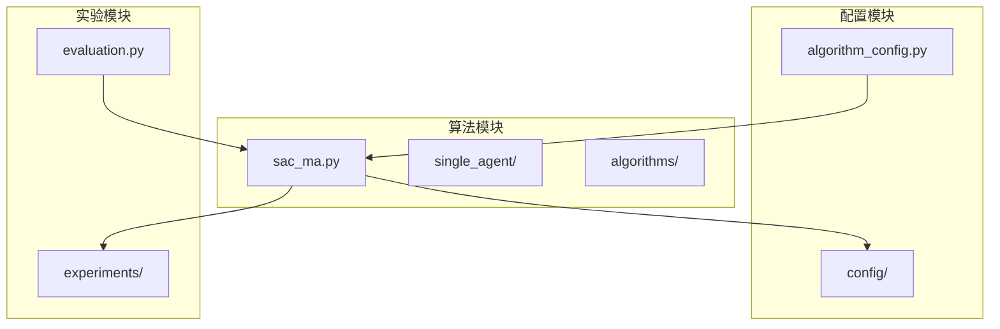
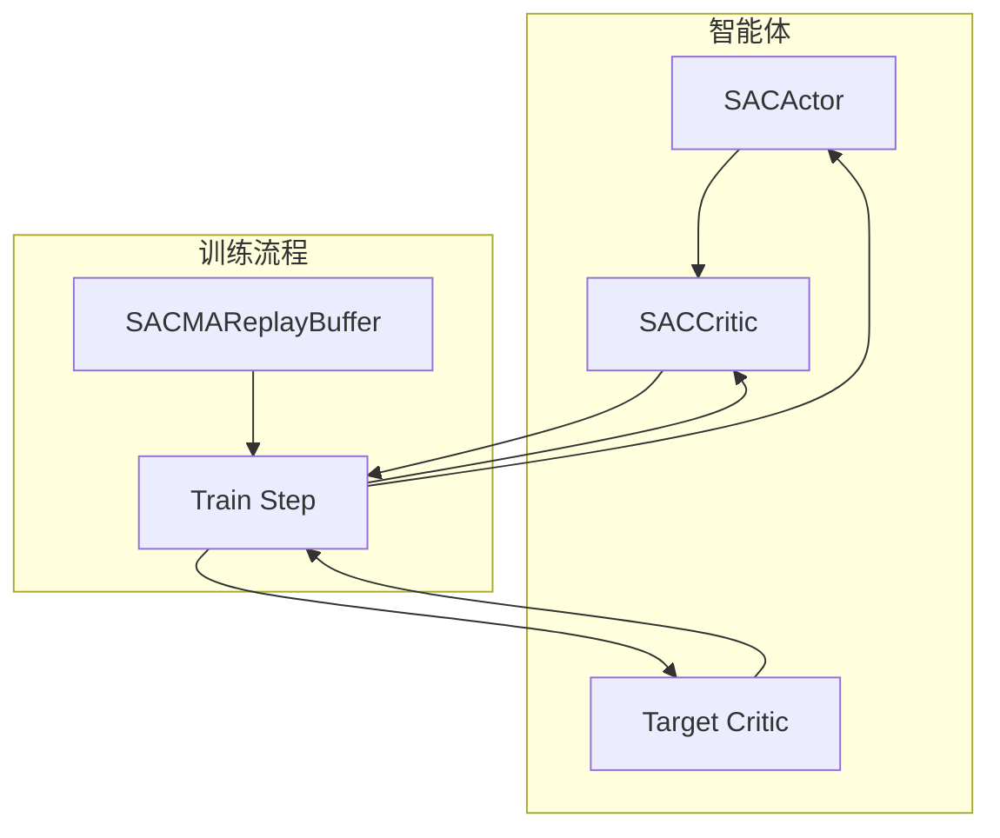
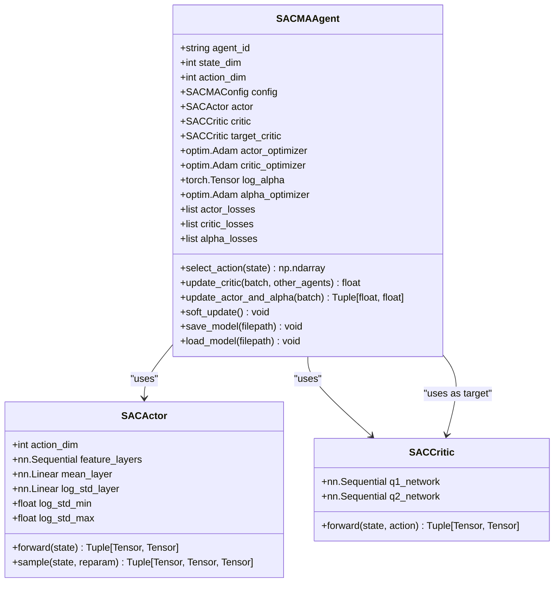
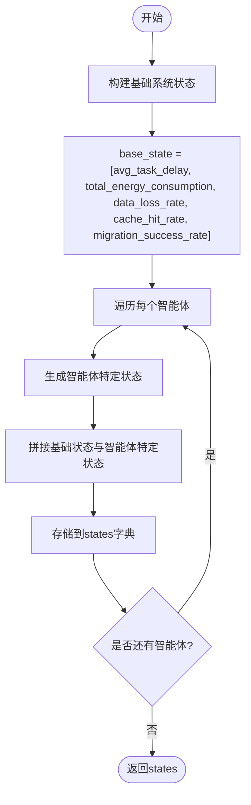
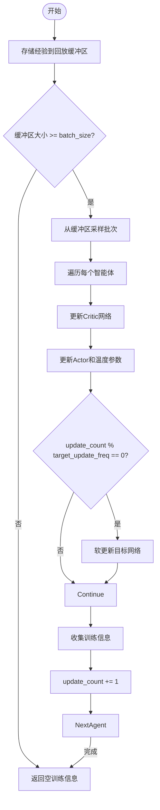
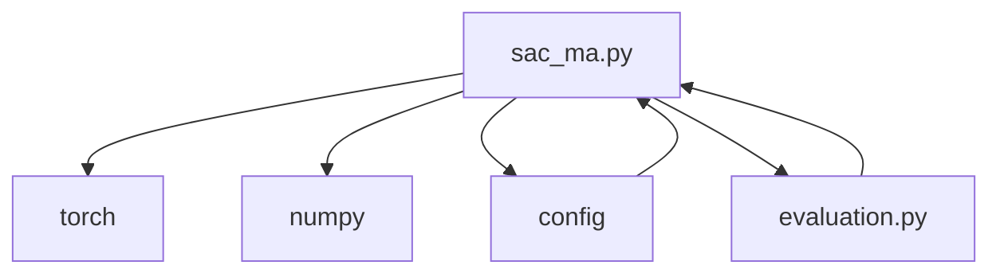

# SAC-MA算法架构

<cite>
**本文档引用的文件**   
- [sac_ma.py](file://algorithms/sac_ma.py)
- [algorithm_config.py](file://config/algorithm_config.py)
- [evaluation.py](file://experiments/evaluation.py)
</cite>

## 目录
1. [简介](#简介)
2. [项目结构](#项目结构)
3. [核心组件](#核心组件)
4. [架构概述](#架构概述)
5. [详细组件分析](#详细组件分析)
6. [依赖分析](#依赖分析)
7. [性能考量](#性能考量)
8. [故障排除指南](#故障排除指南)
9. [结论](#结论)
10. [附录](#附录)（如有必要）

## 简介
SAC-MA（Soft Actor-Critic for Multi-Agent）算法是为VEC_mig_caching系统设计的多智能体强化学习框架，基于最大熵强化学习理论，专用于车联网（V2X）环境中的任务迁移与缓存决策。该算法通过引入自动温度调节机制，动态平衡策略的随机性与最优性，从而在不确定的网络环境中实现鲁棒的长期策略学习。SAC-MA支持连续动作空间，适用于能量敏感型任务，如低功耗模式选择和资源分配。其核心由双Q网络、目标Q网络和随机策略网络构成，通过经验回放缓冲区和软更新机制确保高样本效率和训练稳定性。本架构文档将深入解析SAC-MA的实现细节，包括其在多智能体环境下的联合状态输入处理、熵最大化目标的优势，以及与TD3、PPO等算法的性能对比。

## 项目结构
VEC_mig_caching系统的项目结构清晰地划分了功能模块，其中`algorithms`目录包含了SAC-MA的核心实现。`sac_ma.py`文件定义了SAC-MA的配置、网络结构、智能体和环境类，是算法的主要入口。`config`目录下的`algorithm_config.py`提供了算法的全局配置，而`experiments`目录中的`evaluation.py`则负责性能评估和结果可视化。这种模块化设计使得SAC-MA易于集成和扩展。



**Diagram sources**
- [sac_ma.py](file://algorithms/sac_ma.py#L1-L50)
- [algorithm_config.py](file://config/algorithm_config.py#L1-L73)
- [evaluation.py](file://experiments/evaluation.py#L1-L531)

**Section sources**
- [sac_ma.py](file://algorithms/sac_ma.py#L1-L553)
- [algorithm_config.py](file://config/algorithm_config.py#L1-L73)

## 核心组件
SAC-MA的核心组件包括`SACMAConfig`、`SACActor`、`SACCritic`、`SACMAAgent`和`SACMAEnvironment`。`SACMAConfig`定义了算法的超参数，如学习率、折扣因子和温度系数。`SACActor`是随机策略网络，负责生成动作，其输出为动作的均值和对数标准差，通过重参数化技巧实现可微分采样。`SACCritic`是双Q网络，用于评估状态-动作对的价值，减少过估计。`SACMAAgent`封装了单个智能体的训练逻辑，包括Critic和Actor的更新。`SACMAEnvironment`则管理多个智能体的协同训练，处理经验回放和全局状态。

**Section sources**
- [sac_ma.py](file://algorithms/sac_ma.py#L33-L55)
- [sac_ma.py](file://algorithms/sac_ma.py#L58-L129)
- [sac_ma.py](file://algorithms/sac_ma.py#L132-L173)
- [sac_ma.py](file://algorithms/sac_ma.py#L232-L387)
- [sac_ma.py](file://algorithms/sac_ma.py#L390-L553)

## 架构概述
SAC-MA的架构是一个典型的多智能体Actor-Critic框架，其核心思想是通过最大化策略的熵来鼓励探索，同时优化预期回报。该架构由三个主要部分组成：策略网络（Actor）、价值网络（Critic）和目标网络（Target Critic）。策略网络生成随机动作，以促进在复杂环境中的探索；价值网络评估当前策略的好坏；目标网络则用于稳定训练过程，通过软更新机制缓慢跟踪主网络的参数。在多智能体设置中，每个智能体都有自己的Actor和Critic，但它们共享一个经验回放缓冲区，从而实现知识的共享和协同学习。



**Diagram sources**
- [sac_ma.py](file://algorithms/sac_ma.py#L232-L387)
- [sac_ma.py](file://algorithms/sac_ma.py#L390-L553)

## 详细组件分析

### SAC-MA智能体分析
SAC-MA智能体是算法的基本执行单元，负责与环境交互并更新自身策略。其核心功能包括动作选择、Critic网络更新和Actor网络更新。

#### 类图


**Diagram sources**
- [sac_ma.py](file://algorithms/sac_ma.py#L232-L387)
- [sac_ma.py](file://algorithms/sac_ma.py#L58-L129)
- [sac_ma.py](file://algorithms/sac_ma.py#L132-L173)

#### 动作选择与更新流程
```mermaid
sequenceDiagram
participant Environment as "环境"
participant Agent as "SACMAAgent"
participant Actor as "SACActor"
participant Critic as "SACCritic"
Environment->>Agent : 提供状态(state)
Agent->>Actor : actor.sample(state)
Actor-->>Agent : 返回动作(action)和对数概率(log_prob)
Agent-->>Environment : 执行动作
Environment->>Agent : 提供奖励(reward)和下一状态(next_state)
Agent->>Critic : 计算目标Q值
Critic-->>Agent : 返回目标Q值
Agent->>Critic : 更新Critic网络
Agent->>Actor : 更新Actor网络和温度参数
Agent->>Agent : 软更新目标网络
```

**Diagram sources**
- [sac_ma.py](file://algorithms/sac_ma.py#L262-L295)
- [sac_ma.py](file://algorithms/sac_ma.py#L297-L354)

### SAC-MA环境分析
SAC-MA环境负责协调多个智能体的训练过程，管理经验回放缓冲区，并提供全局状态信息。它初始化了三个智能体（车辆、RSU、UAV），并为它们提供统一的训练接口。

#### 状态向量构建


**Diagram sources**
- [sac_ma.py](file://algorithms/sac_ma.py#L449-L474)

#### 训练步骤流程


**Diagram sources**
- [sac_ma.py](file://algorithms/sac_ma.py#L475-L510)

**Section sources**
- [sac_ma.py](file://algorithms/sac_ma.py#L390-L553)

## 依赖分析
SAC-MA的依赖关系清晰，主要依赖于PyTorch进行深度学习计算，NumPy进行数值处理，以及系统配置模块。`sac_ma.py`直接依赖于`config`模块以获取全局配置，同时与`experiments/evaluation.py`交互以进行性能评估。这种松耦合的设计使得算法易于测试和验证。



**Diagram sources**
- [sac_ma.py](file://algorithms/sac_ma.py#L1-L50)
- [evaluation.py](file://experiments/evaluation.py#L1-L531)

**Section sources**
- [sac_ma.py](file://algorithms/sac_ma.py#L1-L553)
- [evaluation.py](file://experiments/evaluation.py#L1-L531)

## 性能考量
SAC-MA在设计上注重性能优化。通过使用`OPTIMIZED_BATCH_SIZES`，算法能够根据硬件条件动态调整批次大小，从而提高训练效率。此外，经验回放缓冲区采用`deque`实现，确保了高效的经验存储和采样。自动温度调节机制不仅提高了策略的鲁棒性，还减少了手动调参的工作量。在车联网的不确定环境中，如突发流量和链路中断，SAC-MA的熵最大化目标使其能够保持稳定的性能，避免陷入局部最优。

## 故障排除指南
当SAC-MA训练出现不稳定或性能不佳时，应首先检查超参数设置。`target_entropy_ratio`和`initial_temperature`是影响策略随机性的关键参数，不当的设置可能导致探索不足或过度。其次，应验证经验回放缓冲区的大小和批次大小是否合适，过小的缓冲区可能导致样本相关性过高，影响训练稳定性。最后，确保GPU可用，以利用硬件加速提高训练速度。

**Section sources**
- [sac_ma.py](file://algorithms/sac_ma.py#L33-L55)
- [sac_ma.py](file://algorithms/sac_ma.py#L232-L387)

## 结论
SAC-MA算法通过其先进的最大熵强化学习框架，在VEC_mig_caching系统中展现了卓越的性能。其自动温度调节机制和双Q网络设计，使其在处理车联网的不确定性和复杂性方面具有显著优势。与TD3、PPO等算法相比，SAC-MA在长期策略学习中表现出更好的稳定性和鲁棒性，尤其适用于能量敏感型任务。通过合理的超参数设置和系统配置，SAC-MA能够有效优化能耗和系统稳定性，为未来的智能交通系统提供强有力的支持。