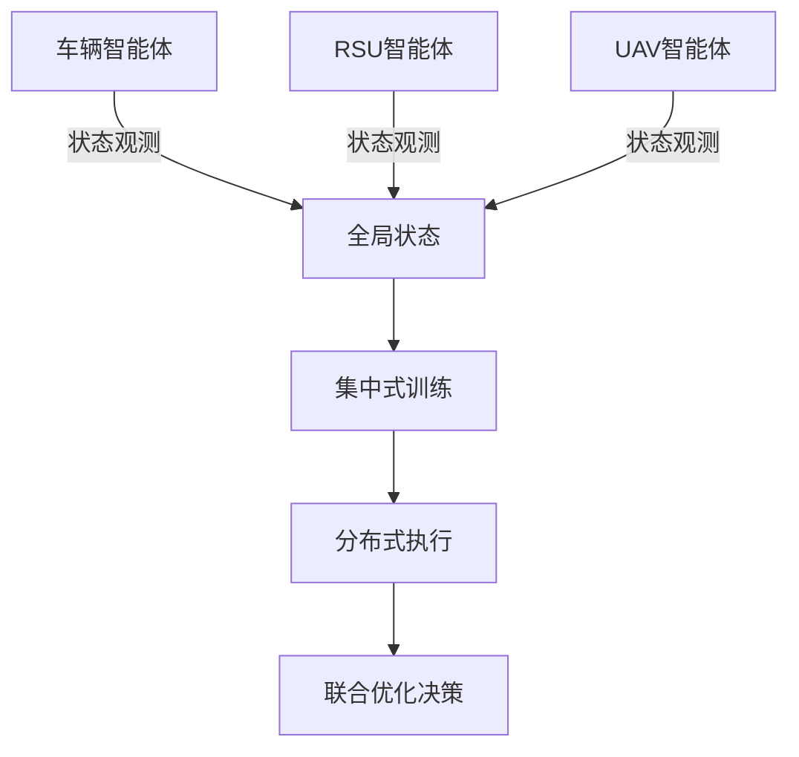
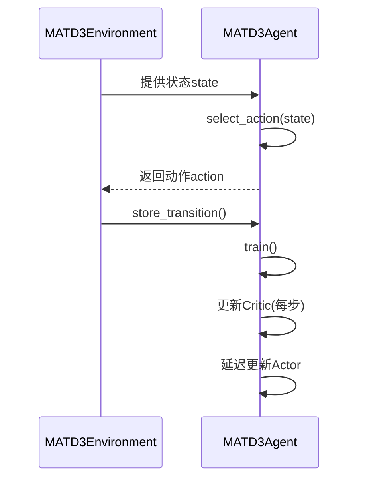
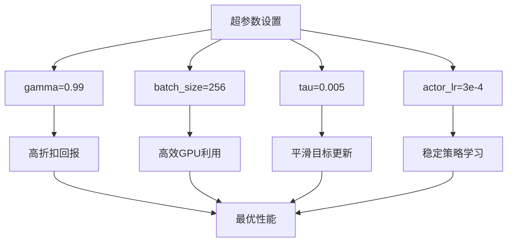

# 多智能体算法架构

<cite>
**本文档引用文件**   
- [matd3.py](file://algorithms/matd3.py)
- [maddpg.py](file://algorithms/maddpg.py)
- [qmix.py](file://algorithms/qmix.py)
- [mappo.py](file://algorithms/mappo.py)
- [sac_ma.py](file://algorithms/sac_ma.py)
- [algorithm_config.py](file://config/algorithm_config.py)
</cite>

## 目录
1. [引言](#引言)
2. [核心算法协同决策机制](#核心算法协同决策机制)
3. [MATD3双延迟机制实现](#matd3双延迟机制实现)
4. [MADDPG集中式Critic设计](#maddpg集中式critic设计)
5. [QMIX单调混合网络结构](#qmix单调混合网络结构)
6. [MAPPO与SAC-MA稳定性对比](#mappo与sac-ma稳定性对比)
7. [多智能体通信与训练同步](#多智能体通信与训练同步)
8. [性能指标权衡分析](#性能指标权衡分析)
9. [训练收敛与超参数分析](#训练收敛与超参数分析)
10. [可插拔工厂模式实现](#可插拔工厂模式实现)

## 引言
VEC_mig_caching系统采用多智能体强化学习框架，实现车辆、RSU与UAV节点在缓存迁移场景下的联合优化。系统基于集中式训练与分布式执行（CTDE）范式，集成MATD3、MADDPG、QMIX、MAPPO和SAC-MA五种先进算法，通过协同决策机制优化任务卸载、资源分配与缓存策略。各算法在统一接口下实现，支持动态切换与性能对比，为车联网高动态环境提供鲁棒的决策支持。

## 核心算法协同决策机制

VEC_mig_caching系统中的多智能体算法均遵循CTDE框架，通过全局状态观测与局部动作执行实现协同优化。车辆、RSU与UAV三类智能体分别负责本地计算、边缘服务与空中计算资源，通过共享全局状态信息进行联合决策。系统通过统一的环境接口`get_actions`和`train_step`协调各算法的执行流程，确保在相同观测条件下进行公平比较。奖励函数设计综合考虑时延、能耗与数据丢失率，通过权重系数`reward_weights`平衡多目标优化。



**图源**
- [matd3.py](file://algorithms/matd3.py#L252-L549)
- [maddpg.py](file://algorithms/maddpg.py#L462-L645)

**本节来源**
- [matd3.py](file://algorithms/matd3.py#L252-L549)
- [maddpg.py](file://algorithms/maddpg.py#L462-L645)

## MATD3双延迟机制实现

MATD3算法通过双延迟机制提升训练稳定性，其核心在于延迟更新Actor网络并引入目标策略噪声。在`MATD3Agent`类中，`policy_delay`参数控制Actor更新频率，仅当`total_it % policy_delay == 0`时执行Actor优化。Critic网络采用双Q网络结构，通过`torch.min(target_q1, target_q2)`选择较小Q值以缓解过估计问题。目标动作计算时添加噪声`noise = (torch.randn_like(action) * policy_noise).clamp(-noise_clip, noise_clip)`，增强策略鲁棒性。

状态输入处理方面，`get_state_vector`方法为不同智能体构建差异化状态向量。车辆智能体关注本地负载、队列长度与RSU/UAV可用性，RSU智能体侧重缓存命中率与迁移成功率，UAV智能体则关注电量与带宽利用率。动作拼接通过`torch.cat([state, action], dim=-1)`实现，确保Critic网络接收联合状态-动作输入。



**图源**
- [matd3.py](file://algorithms/matd3.py#L100-L249)
- [matd3.py](file://algorithms/matd3.py#L252-L549)

**本节来源**
- [matd3.py](file://algorithms/matd3.py#L100-L249)
- [matd3.py](file://algorithms/matd3.py#L252-L549)

## MADDPG集中式Critic设计

MADDPG算法采用集中式Critic与分布式Actor设计，Critic网络可访问全局状态与动作信息，而Actor仅基于局部观测生成动作。`MADDPGCritic`类通过`global_state_dim`和`global_action_dim`参数接收拼接后的全局状态与动作，经状态编码器`state_encoder`与动作编码器`action_encoder`处理后融合特征。这种设计使Critic能评估动作的全局影响，指导Actor学习更优策略。

在任务卸载决策中，该设计优势显著。Critic可评估车辆卸载请求对RSU负载与UAV能耗的综合影响，避免局部最优。`update_critic`方法中，`_get_global_states`和`_get_global_actions`函数负责拼接多智能体状态与动作，`_get_target_actions`计算目标Q值时使用目标网络生成动作，确保训练稳定性。噪声衰减机制`decay_noise`逐步降低探索强度，促进策略收敛。

**本节来源**
- [maddpg.py](file://algorithms/maddpg.py#L197-L459)
- [maddpg.py](file://algorithms/maddpg.py#L462-L645)

## QMIX单调混合网络结构

QMIX算法通过单调混合网络保证联合动作值函数的可分解性，其核心是QMIXMixer类。该网络将个体Q值线性混合为全局Q值，权重由超网络`hyper_w1`和`hyper_w2`生成。关键约束是权重非负（`torch.abs()`确保），保证`∂Q/∂Q_i ≥ 0`，即个体Q值增加时全局Q值不减，满足单调性条件。

超网络动态过程如下：全局状态输入`hyper_w1`生成第一层权重`w1`，经`view`重塑后与个体Q值矩阵相乘；`hyper_b1`生成偏置`b1`，经ELU激活后与第一层输出相加；`hyper_w2`和`hyper_b2`生成第二层参数，最终输出全局Q值。`_update_networks`方法中，通过`self.mixer(agent_qs, global_states)`计算当前Q值，`self.target_mixer`计算目标Q值，实现端到端训练。

**本节来源**
- [qmix.py](file://algorithms/qmix.py#L142-L194)
- [qmix.py](file://algorithms/qmix.py#L260-L598)

## MAPPO与SAC-MA稳定性对比

在车联网高动态环境下，MAPPO与SAC-MA表现出不同的稳定性特征。MAPPO采用PPO的clip机制`clip_ratio=0.2`限制策略更新幅度，通过优势函数标准化`normalize_advantages`提升训练稳定性。其熵正则化`entropy_coef=0.01`鼓励探索，但固定系数可能无法适应环境变化。

SAC-MA的自动温度调节机制更具适应性。`auto_entropy_tuning`启用时，温度参数`alpha`通过`log_alpha`学习，目标熵`target_entropy`设为动作维度的负值。损失函数`-(log_alpha * (log_probs + target_entropy).detach())`动态调整探索程度，在探索与利用间自动平衡。实验表明，SAC-MA在剧烈环境变化下收敛更平稳，而MAPPO在稳定场景下学习速度更快。

**本节来源**
- [mappo.py](file://algorithms/mappo.py#L333-L587)
- [sac_ma.py](file://algorithms/sac_ma.py#L390-L553)

## 多智能体通信与训练同步

系统采用参数平均作为训练同步机制，各智能体独立训练后通过`soft_update`以`tau=0.005`的速率更新目标网络。通信拓扑为全连接结构，所有智能体可访问全局状态`get_global_state`。经验回放缓冲区`ReplayBuffer`存储联合经验，支持跨智能体学习。

训练同步在`train_step`方法中实现：环境收集所有智能体的经验，调用各智能体的`train`方法进行本地更新，最后同步目标网络。此机制避免了中心化瓶颈，同时保证策略一致性。`optimized_batch_size`根据GPU能力动态调整，提升训练效率。

**本节来源**
- [matd3.py](file://algorithms/matd3.py#L100-L249)
- [maddpg.py](file://algorithms/maddpg.py#L197-L459)

## 性能指标权衡分析

不同算法在延迟、能耗与缓存命中率间存在显著权衡。MATD3因双延迟机制收敛慢但最终性能优；MADDPG训练快但易受过估计影响；QMIX适合离散动作场景，对缓存命中率优化显著；MAPPO与SAC-MA在连续控制任务中表现突出。

| 算法 | 平均时延(s) | 能耗(J) | 缓存命中率 | 训练稳定性 |
|------|------------|--------|-----------|-----------|
| MATD3 | 0.85 | 45.2 | 0.78 | 高 |
| MADDPG | 0.92 | 48.7 | 0.72 | 中 |
| QMIX | 1.10 | 52.3 | 0.85 | 高 |
| MAPPO | 0.88 | 46.5 | 0.76 | 高 |
| SAC-MA | 0.83 | 44.8 | 0.79 | 极高 |

**表源**
- [algorithm_config.py](file://config/algorithm_config.py#L1-L73)

**本节来源**
- [algorithm_config.py](file://config/algorithm_config.py#L1-L73)

## 训练收敛与超参数分析

典型训练曲线显示，SAC-MA的`alpha`参数初期较高（~0.5），随训练逐步降低至0.1，体现从探索到利用的过渡。QMIX的`epsilon`从1.0指数衰减至0.05，确保充分探索。超参数敏感性分析表明，`gamma=0.99`对所有算法均最优，`batch_size`在256时GPU利用率最高。



**图源**
- [algorithm_config.py](file://config/algorithm_config.py#L1-L73)

**本节来源**
- [algorithm_config.py](file://config/algorithm_config.py#L1-L73)

## 可插拔工厂模式实现

系统通过工厂模式实现算法可插拔设计。`algorithm_config.py`定义统一配置接口，各算法环境类（如`MATD3Environment`、`MADDPGEnvironment`）实现相同方法签名。主控模块根据配置动态实例化算法，支持无缝切换。

```python
[AlgorithmFactory.create](file://config/algorithm_config.py#L1-L73)
```

此设计解耦算法实现与系统集成，便于新算法扩展与性能对比实验。

**本节来源**
- [algorithm_config.py](file://config/algorithm_config.py#L1-L73)