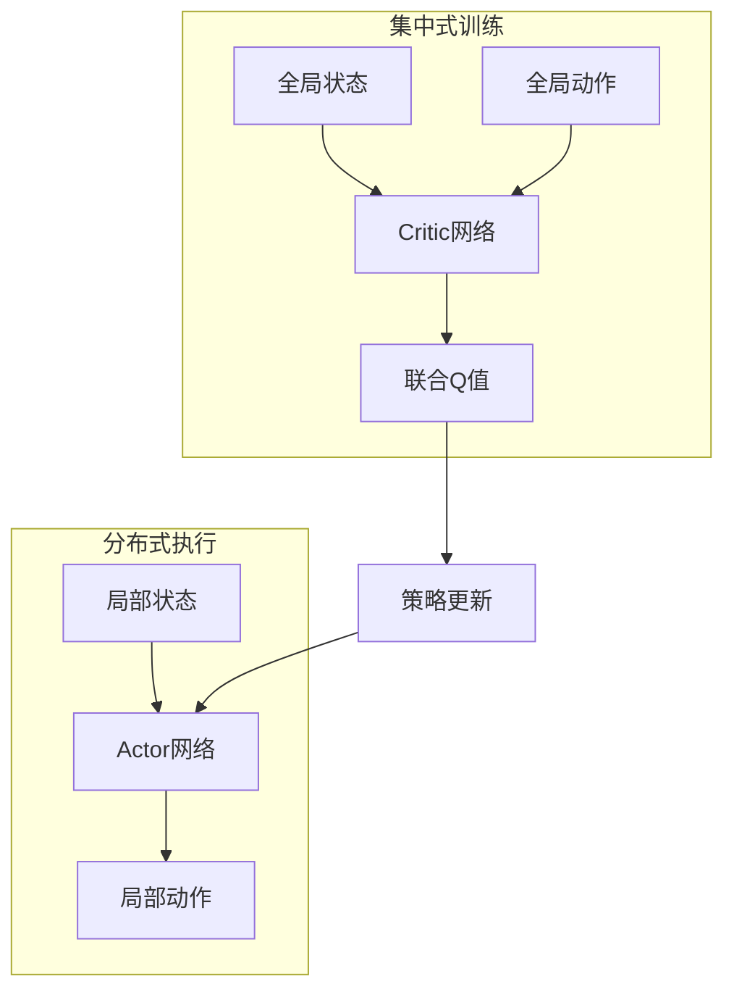
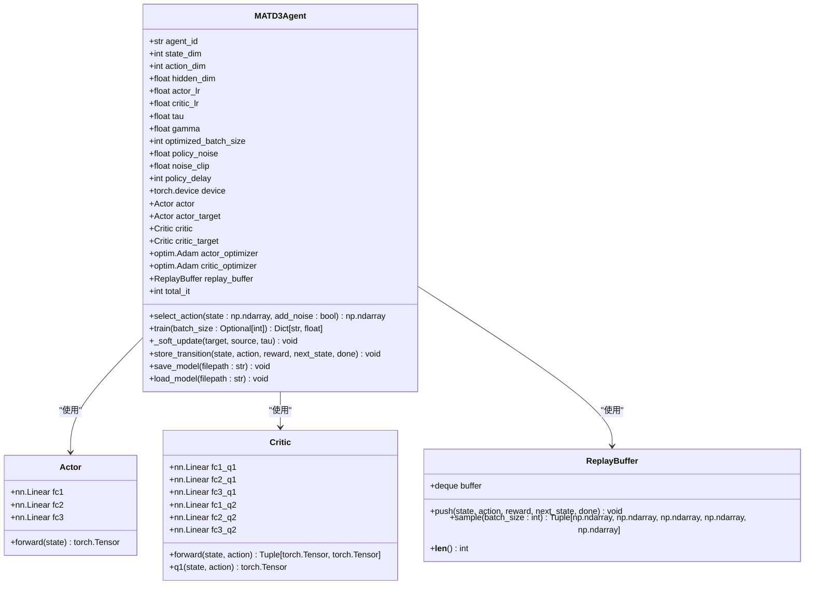
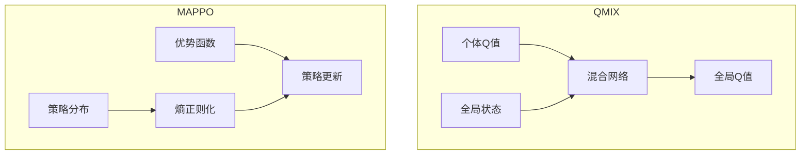
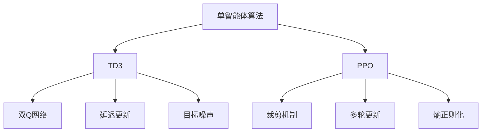
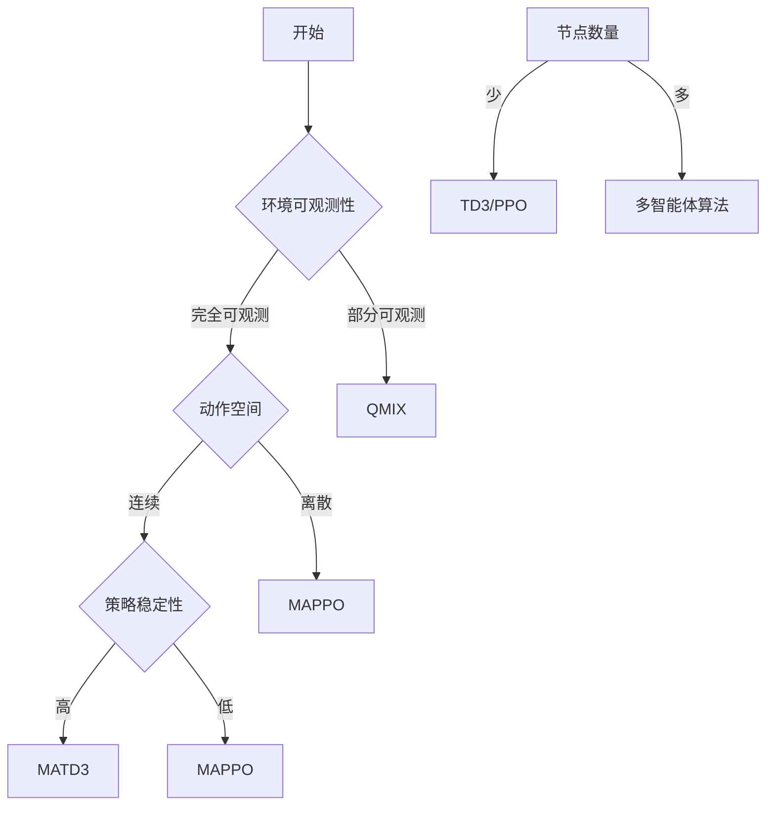
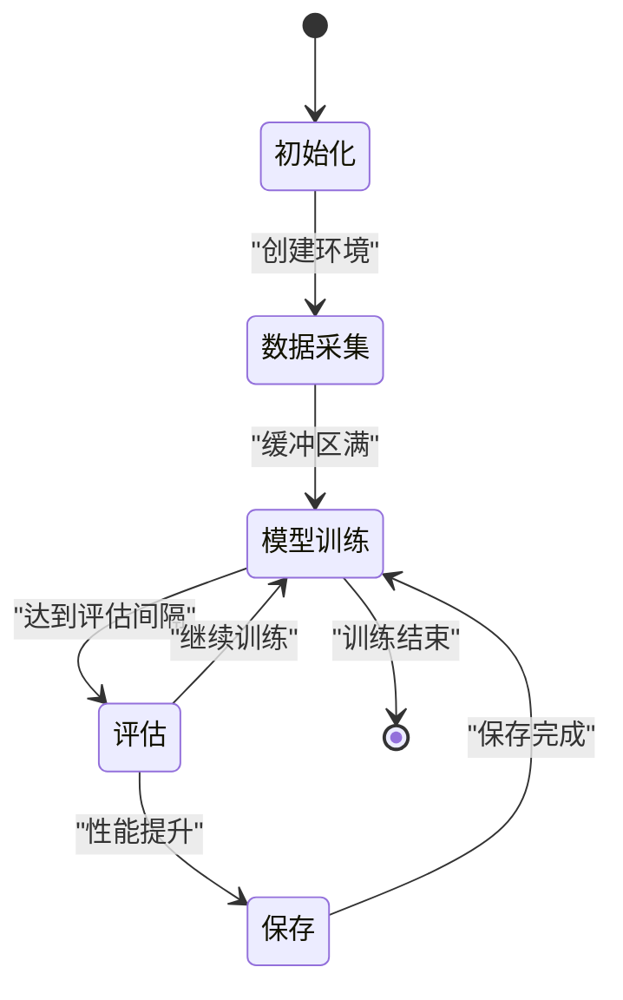

# 算法架构

<cite>
**本文档引用的文件**   
- [matd3.py](file://algorithms/matd3.py)
- [maddpg.py](file://algorithms/maddpg.py)
- [qmix.py](file://algorithms/qmix.py)
- [mappo.py](file://algorithms/mappo.py)
- [sac_ma.py](file://algorithms/sac_ma.py)
- [td3.py](file://single_agent/td3.py)
- [ppo.py](file://single_agent/ppo.py)
- [algorithm_config.py](file://config/algorithm_config.py)
- [system_config.py](file://config/system_config.py)
- [uav_action_space.py](file://algorithms/uav_action_space.py)
</cite>

## 目录
1. [引言](#引言)
2. [多智能体算法协同决策机制](#多智能体算法协同决策机制)
3. [集中式训练与分布式执行框架](#集中式训练与分布式执行框架)
4. [MATD3算法扩展实现](#matd3算法扩展实现)
5. [QMIX与MAPPO算法对比分析](#qmix与mappo算法对比分析)
6. [单智能体算法部署模式](#单智能体算法部署模式)
7. [算法选择决策树](#算法选择决策树)
8. [训练流程状态机图](#训练流程状态机图)
9. [通信拓扑结构图](#通信拓扑结构图)
10. [算法可插拔设计](#算法可插拔设计)
11. [训练收敛曲线分析](#训练收敛曲线分析)
12. [超参数敏感性分析](#超参数敏感性分析)
13. [分布式训练同步策略](#分布式训练同步策略)

## 引言
VEC_mig_caching系统采用多智能体强化学习框架，通过车辆、RSU和UAV节点的协同优化实现高效的边缘缓存与任务迁移。本系统实现了MATD3、MADDPG、QMIX、MAPPO和SAC-MA等多种多智能体算法，以及TD3、PPO等单智能体算法，为车联网动态环境下的资源管理提供了全面的解决方案。这些算法通过集中式训练与分布式执行（CTDE）框架，实现了全局优化与局部决策的平衡。

## 多智能体算法协同决策机制
VEC_mig_caching系统中的多智能体算法通过协同决策机制实现车辆、RSU和UAV节点的联合优化。系统中的智能体包括车辆智能体、RSU智能体和UAV智能体，它们分别负责本地计算、缓存管理和空中计算任务。这些智能体通过共享全局状态信息，在训练阶段实现集中式学习，而在执行阶段则进行分布式决策。

MATD3、MADDPG、QMIX、MAPPO和SAC-MA等算法在协同决策机制上各有特点。MATD3通过双延迟深度确定性策略梯度实现稳定的策略更新；MADDPG利用全局状态和动作信息优化Critic网络；QMIX通过混合网络结构实现值函数分解；MAPPO采用策略熵正则化机制提高探索效率；SAC-MA则通过自动调节熵参数实现自适应探索。

**Section sources**
- [matd3.py](file://algorithms/matd3.py#L100-L249)
- [maddpg.py](file://algorithms/maddpg.py#L197-L459)
- [qmix.py](file://algorithms/qmix.py#L54-L139)
- [mappo.py](file://algorithms/mappo.py#L286-L330)
- [sac_ma.py](file://algorithms/sac_ma.py#L232-L387)

## 集中式训练与分布式执行框架
VEC_mig_caching系统采用集中式训练与分布式执行（CTDE）框架，该框架在训练阶段允许智能体访问全局状态和动作信息，而在执行阶段每个智能体仅基于局部观测进行决策。这种设计既保证了训练过程中的全局优化，又满足了实际部署中的分布式需求。

在集中式训练阶段，Critic网络可以访问所有智能体的状态和动作，从而学习到全局价值函数。例如，MADDPG的Critic网络接收全局状态和全局动作作为输入，通过状态编码器和动作编码器提取特征，然后融合这些特征来评估联合动作的价值。这种设计使得Critic能够学习到智能体之间的协作关系。

在分布式执行阶段，每个智能体仅根据自身的观测状态选择动作。Actor网络只接收局部状态作为输入，输出相应的动作。这种设计确保了系统在实际部署时的可扩展性和鲁棒性，即使部分节点失效，其他节点仍能正常工作。

**Diagram sources **
- [maddpg.py](file://algorithms/maddpg.py#L91-L138)
- [maddpg.py](file://algorithms/maddpg.py#L197-L459)

**Section sources**
- [maddpg.py](file://algorithms/maddpg.py#L91-L138)
- [maddpg.py](file://algorithms/maddpg.py#L197-L459)

## MATD3算法扩展实现
MATD3算法在多智能体环境中的扩展实现主要体现在双延迟深度确定性策略梯度的改进和策略一致性约束的设计上。该算法通过引入双延迟机制和目标策略平滑化，有效解决了传统DDPG算法在多智能体环境中的过估计问题。

在MATD3中，Critic网络采用双Q网络结构，通过取两个Q值的最小值来减少过估计。Actor网络的更新被延迟，只有在Critic网络充分训练后才进行更新，这有助于保持策略的稳定性。此外，目标策略平滑化通过在目标动作上添加噪声，使得Q值评估更加鲁棒。

策略一致性约束通过软更新目标网络实现，使用τ参数控制更新速度。这种设计确保了目标网络的平滑变化，避免了训练过程中的剧烈波动。MATD3还采用了经验回放缓冲区，存储智能体的经验用于离线训练，提高了样本利用率。

**Diagram sources **
- [matd3.py](file://algorithms/matd3.py#L100-L249)
- [matd3.py](file://algorithms/matd3.py#L22-L40)
- [matd3.py](file://algorithms/matd3.py#L43-L79)
- [matd3.py](file://algorithms/matd3.py#L82-L97)

**Section sources**
- [matd3.py](file://algorithms/matd3.py#L100-L249)
- [matd3.py](file://algorithms/matd3.py#L22-L40)
- [matd3.py](file://algorithms/matd3.py#L43-L79)
- [matd3.py](file://algorithms/matd3.py#L82-L97)

## QMIX与MAPPO算法对比分析
QMIX和MAPPO算法在车联网动态环境下的适应性表现出显著差异。QMIX通过混合网络结构实现值函数分解，确保了单调性约束，适用于部分可观测环境。MAPPO则采用策略熵正则化机制，通过最大化策略熵来鼓励探索，适用于连续动作空间。

QMIX的混合网络由超网络构成，通过生成权重和偏置来混合个体Q值。这种设计确保了全局Q值与个体Q值之间的单调关系，使得联合策略的优化更加稳定。然而，QMIX在处理连续动作空间时存在局限性，需要离散化处理。

MAPPO的策略熵正则化机制通过在损失函数中添加熵项，鼓励智能体探索未访问的状态。这种设计提高了算法在复杂环境中的适应性，但可能导致收敛速度变慢。MAPPO的Critic网络采用集中式结构，能够访问全局状态，从而学习到更准确的价值函数。

**Diagram sources **
- [qmix.py](file://algorithms/qmix.py#L54-L139)
- [mappo.py](file://algorithms/mappo.py#L286-L330)

**Section sources**
- [qmix.py](file://algorithms/qmix.py#L54-L139)
- [mappo.py](file://algorithms/mappo.py#L286-L330)

## 单智能体算法部署模式
在简化场景中，VEC_mig_caching系统采用TD3和PPO等单智能体算法进行部署。这些算法适用于节点数量较少或环境相对静态的场景，能够快速收敛并提供稳定的性能。

TD3算法通过双延迟机制和目标策略平滑化，有效解决了DDPG算法的过估计问题。它采用双Q网络结构，通过取最小值来减少过估计，并延迟Actor网络的更新以保持策略稳定性。PPO算法则采用裁剪机制，限制策略更新的幅度，避免了大规模策略变化导致的性能下降。

单智能体算法与多智能体系统的性能对比显示，在简单场景下两者性能相近，但在复杂动态环境中，多智能体算法通过协同决策能够实现更好的全局优化。单智能体算法的优势在于实现简单、计算开销小，适合资源受限的边缘设备。

**Diagram sources **
- [td3.py](file://single_agent/td3.py#L216-L426)
- [ppo.py](file://single_agent/ppo.py#L235-L407)

**Section sources**
- [td3.py](file://single_agent/td3.py#L216-L426)
- [ppo.py](file://single_agent/ppo.py#L235-L407)

## 算法选择决策树
根据应用场景的复杂度和动态性，VEC_mig_caching系统提供了算法选择决策树。该决策树基于环境的可观测性、动作空间的连续性、节点数量和计算资源等因素，指导用户选择最适合的算法。

对于完全可观测环境且动作空间连续的场景，推荐使用MATD3或MAPPO算法。MATD3适合需要稳定策略更新的场景，而MAPPO适合需要高探索效率的场景。对于部分可观测环境，QMIX是首选算法，其混合网络结构能够有效处理信息不对称问题。

当节点数量较少且环境相对静态时，单智能体算法如TD3或PPO是合适的选择。这些算法实现简单、计算开销小，适合资源受限的边缘设备。在计算资源充足且需要全局优化的复杂场景中，多智能体算法能够提供更好的性能。

**Diagram sources **
- [matd3.py](file://algorithms/matd3.py#L100-L249)
- [mappo.py](file://algorithms/mappo.py#L286-L330)
- [qmix.py](file://algorithms/qmix.py#L54-L139)
- [td3.py](file://single_agent/td3.py#L216-L426)
- [ppo.py](file://single_agent/ppo.py#L235-L407)

**Section sources**
- [matd3.py](file://algorithms/matd3.py#L100-L249)
- [mappo.py](file://algorithms/mappo.py#L286-L330)
- [qmix.py](file://algorithms/qmix.py#L54-L139)
- [td3.py](file://single_agent/td3.py#L216-L426)
- [ppo.py](file://single_agent/ppo.py#L235-L407)

## 训练流程状态机图
VEC_mig_caching系统的训练流程采用状态机模型，包括初始化、数据采集、模型训练、评估和保存等状态。该状态机确保了训练过程的有序进行，提高了系统的可靠性和可维护性。

在初始化状态，系统加载配置参数，创建智能体和环境实例。数据采集状态负责收集环境交互数据，存储到经验回放缓冲区。模型训练状态从缓冲区采样数据，更新智能体网络参数。评估状态定期测试模型性能，保存状态则将最佳模型保存到磁盘。

状态机的转换由训练轮次和评估间隔控制。每完成一定数量的训练轮次，系统进入评估状态；当评估性能超过历史最佳时，进入保存状态。这种设计确保了模型的持续优化和最佳性能的保存。

**Diagram sources **
- [train_multi_agent.py](file://train_multi_agent.py#L0-L799)

**Section sources**
- [train_multi_agent.py](file://train_multi_agent.py#L0-L799)

## 通信拓扑结构图
VEC_mig_caching系统的通信拓扑采用分层结构，包括车辆层、RSU层和UAV层。车辆节点通过无线通信与RSU和UAV连接，RSU节点作为地面