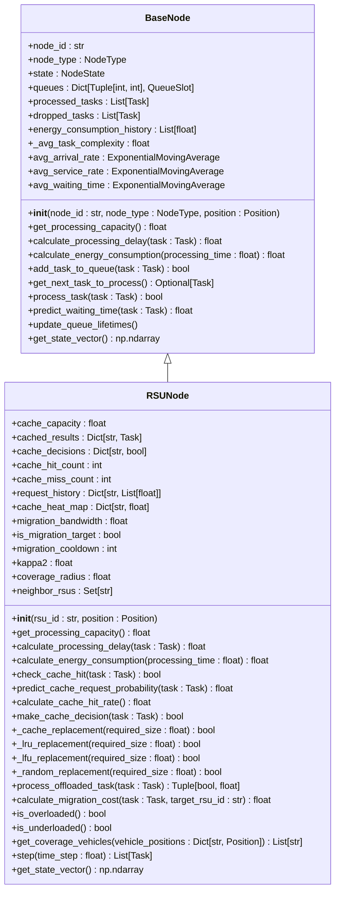
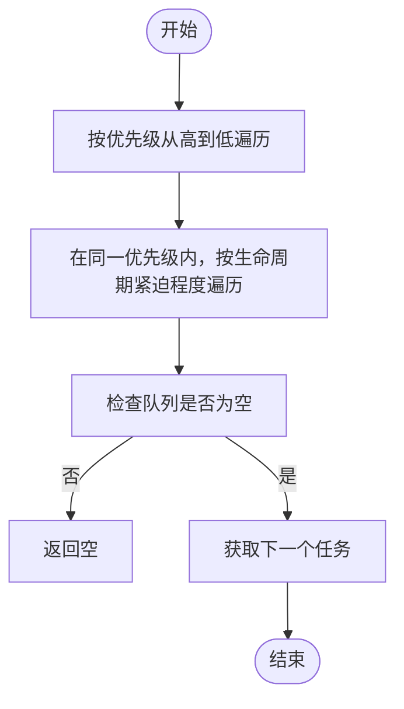
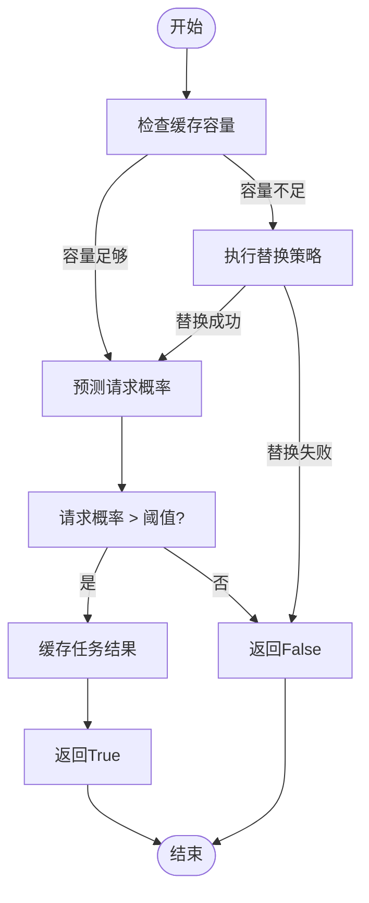
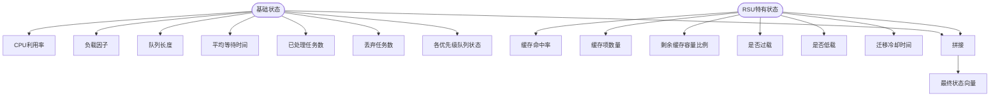

# RSU节点模型

<cite>
**本文档引用的文件**  
- [rsu_node.py](file://models/rsu_node.py)
- [base_node.py](file://models/base_node.py)
- [data_structures.py](file://models/data_structures.py)
</cite>

## 目录
1. [引言](#引言)
2. [RSU节点架构与继承关系](#rsu节点架构与继承关系)
3. [资源管理特性分析](#资源管理特性分析)
4. [任务处理与调度机制](#任务处理与调度机制)
5. [缓存系统设计与实现](#缓存系统设计与实现)
6. [能耗计算模型](#能耗计算模型)
7. [覆盖范围与切换机制](#覆盖范围与切换机制)
8. [状态向量与强化学习接口](#状态向量与强化学习接口)
9. [性能瓶颈与扩展建议](#性能瓶颈与扩展建议)

## 引言
RSU（Road Side Unit）节点作为车联网边缘计算系统中的固定基础设施，承担着为移动车辆提供低延迟、高可靠计算服务的关键角色。本文档深入解析`RSUNode`类的设计与实现，重点阐述其在资源评估、任务处理、能耗管理等方面的特性，以及如何通过缓存机制和任务调度优化整体系统性能。

## RSU节点架构与继承关系
`RSUNode`类继承自`BaseNode`抽象基类，实现了针对固定边缘计算节点的特定功能。通过继承机制，`RSUNode`复用了`BaseNode`中定义的通用接口和属性，同时重写了资源评估、任务处理和能耗计算等核心方法，以适应RSU节点的高计算能力、稳定供电和固定地理位置的特点。

**图示来源**
- [rsu_node.py](file://models/rsu_node.py#L16-L423)
- [base_node.py](file://models/base_node.py#L18-L312)

**本节来源**
- [rsu_node.py](file://models/rsu_node.py#L16-L423)
- [base_node.py](file://models/base_node.py#L18-L312)

## 资源管理特性分析
RSU节点的资源管理特性主要体现在其高计算能力、稳定供电和固定地理位置三个方面。这些属性通过`RSUNode`类的初始化方法和相关配置参数进行建模。

### 高计算能力建模
在`__init__`方法中，RSU节点的CPU频率通过`config.compute.rsu_cpu_freq`配置项进行设置，体现了其高计算能力。该频率用于计算处理能力和处理时延，直接影响任务的执行效率。

### 稳定供电建模
RSU节点的能耗模型参数`kappa2`通过`config.compute.rsu_kappa2`配置项进行设置，反映了其稳定供电的特点。能耗计算公式`P^comp_k = κ₂(f_k)³`表明，RSU的处理功率与其CPU频率的立方成正比，这与实际硬件的能耗特性相符。

### 固定地理位置建模
RSU节点的固定地理位置通过`position`参数进行建模，并用于计算与其他节点的距离。覆盖半径`coverage_radius`设置为500.0米，定义了RSU的通信范围，影响其与车辆和UAV的交互。

**本节来源**
- [rsu_node.py](file://models/rsu_node.py#L27-L58)

## 任务处理与调度机制
RSU节点的任务处理与调度机制基于多优先级生命周期队列模型，实现了高效的资源利用和任务管理。

### 处理能力评估
`get_processing_capacity`方法根据公式`D^proc_k = (f_k * Δt) / c`计算RSU的处理能力，其中`f_k`为CPU频率，`Δt`为时隙持续时间，`c`为任务计算密度。该方法返回单位时隙内可处理的数据量，用于任务调度决策。

### 处理时延计算
`calculate_processing_delay`方法根据公式`T_comp,j,k = C_j / f_k`计算任务的处理时延，其中`C_j`为任务的计算周期数，`f_k`为CPU频率。该时延是任务总延迟的重要组成部分。

### 调度策略
`get_next_task_to_process`方法实现了非抢占式优先级调度策略：高优先级任务优先处理，同优先级任务按先进先出（FIFO）顺序处理。该策略确保了关键任务的及时响应。

**图示来源**
- [base_node.py](file://models/base_node.py#L112-L125)

**本节来源**
- [rsu_node.py](file://models/rsu_node.py#L60-L75)
- [base_node.py](file://models/base_node.py#L112-L125)

## 缓存系统设计与实现
RSU节点的缓存系统是其核心特性之一，旨在通过缓存常用任务结果来减少重复计算，提高响应速度。

### 缓存命中检查
`check_cache_hit`方法通过构建任务类型键`task_type_key`来检查缓存命中。如果任务结果已缓存，则增加命中计数并返回`True`；否则增加未命中计数并返回`False`。

### 缓存决策制定
`make_cache_decision`方法基于预测请求概率和容量约束制定缓存决策。首先检查缓存容量，若不足则执行替换策略；然后预测请求概率，若超过阈值则将任务结果加入缓存。

### 缓存替换策略
`_cache_replacement`方法支持LRU（最近最少使用）、LFU（最不经常使用）和随机替换三种策略。`_lru_replacement`按最后访问时间排序，`_lfu_replacement`按访问频率排序，`_random_replacement`随机选择缓存项进行替换。

**图示来源**
- [rsu_node.py](file://models/rsu_node.py#L155-L183)
- [rsu_node.py](file://models/rsu_node.py#L185-L194)
- [rsu_node.py](file://models/rsu_node.py#L196-L218)
- [rsu_node.py](file://models/rsu_node.py#L220-L242)
- [rsu_node.py](file://models/rsu_node.py#L244-L264)

**本节来源**
- [rsu_node.py](file://models/rsu_node.py#L145-L183)
- [rsu_node.py](file://models/rsu_node.py#L185-L194)
- [rsu_node.py](file://models/rsu_node.py#L196-L218)
- [rsu_node.py](file://models/rsu_node.py#L220-L242)
- [rsu_node.py](file://models/rsu_node.py#L244-L264)

## 能耗计算模型
RSU节点的能耗计算模型基于其稳定供电的特点，采用简化的功率模型。

### 处理能耗计算
`calculate_energy_consumption`方法根据公式`P^comp_k = κ₂(f_k)³`计算处理功率，然后乘以实际活动时间得到能耗。该方法还更新了节点的功耗状态，反映了动态能耗变化。

**本节来源**
- [rsu_node.py](file://models/rsu_node.py#L77-L92)

## 覆盖范围与切换机制
RSU节点的覆盖范围和切换机制是其与移动节点交互的关键。

### 覆盖范围建模
`get_coverage_vehicles`方法通过计算RSU与车辆之间的距离，判断车辆是否在其覆盖半径内。该方法返回覆盖范围内的车辆列表，用于任务卸载和通信管理。

### 信号衰减处理
虽然代码中未显式实现信号衰减模型，但`coverage_radius`参数隐含了信号强度随距离衰减的概念。超出该半径的车辆无法与RSU通信。

### 切换机制
`calculate_migration_cost`方法计算任务迁移成本，包括传输时延、计算成本和距离相关成本。该成本用于决策是否将任务迁移到其他RSU，实现了负载均衡和资源优化。

**本节来源**
- [rsu_node.py](file://models/rsu_node.py#L358-L367)
- [rsu_node.py](file://models/rsu_node.py#L324-L346)

## 状态向量与强化学习接口
`get_state_vector`方法为强化学习提供了丰富的状态信息。

### 状态向量构成
RSU的状态向量在`BaseNode`的基础上增加了缓存命中率、缓存项数量、剩余缓存容量比例、过载/低载状态和迁移冷却时间等特有状态。这些状态信息有助于智能体做出更优的决策。

**图示来源**
- [rsu_node.py](file://models/rsu_node.py#L409-L423)
- [base_node.py](file://models/base_node.py#L294-L312)

**本节来源**
- [rsu_node.py](file://models/rsu_node.py#L409-L423)
- [base_node.py](file://models/base_node.py#L294-L312)

## 性能瓶颈与扩展建议
### 性能瓶颈分析
1. **缓存容量限制**：当缓存容量不足时，频繁的替换操作可能导致性能下降。
2. **计算资源竞争**：高负载情况下，任务等待时间增加，影响服务质量。
3. **通信带宽瓶颈**：大量任务同时卸载可能导致通信拥塞。

### 扩展建议
1. **多RSU协同处理**：通过`neighbor_rsus`列表实现RSU间的协作缓存和任务迁移，提高资源利用率。
2. **动态缓存策略**：根据网络状况和任务特征动态调整缓存替换策略。
3. **智能切换机制**：结合UAV节点，实现移动边缘计算与固定边缘计算的协同，提升系统灵活性。

**本节来源**
- [rsu_node.py](file://models/rsu_node.py#L58-L58)
- [rsu_node.py](file://models/rsu_node.py#L348-L351)
- [rsu_node.py](file://models/rsu_node.py#L353-L356)