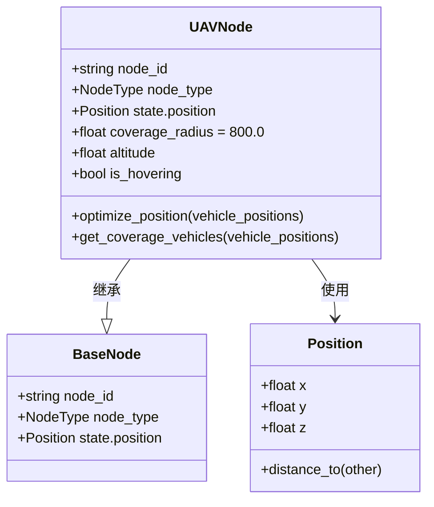
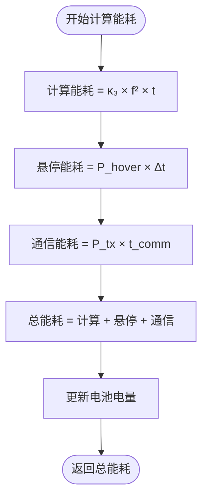
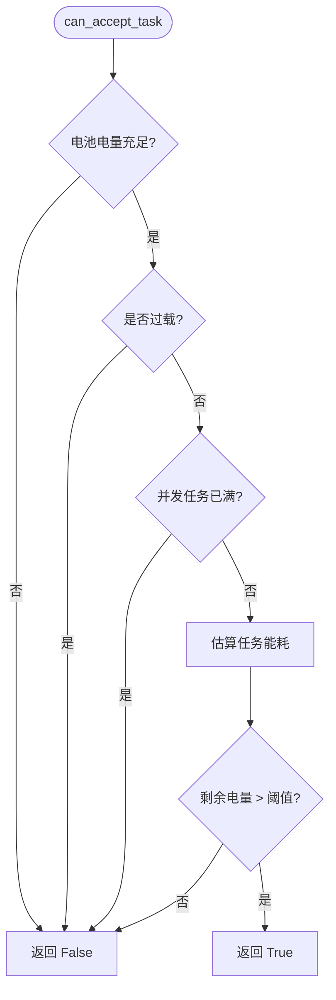

# UAV节点模型

<cite>
**本文档引用的文件**  
- [uav_node.py](file://models/uav_node.py)
- [base_node.py](file://models/base_node.py)
- [uav_action_space.py](file://algorithms/uav_action_space.py)
- [data_structures.py](file://models/data_structures.py)
</cite>

## 目录
1. [引言](#引言)
2. [UAV节点三维空间机动性建模](#uav节点三维空间机动性建模)
3. [能源约束机制与电池管理](#能源约束机制与电池管理)
4. [任务接纳决策与负载控制](#任务接纳决策与负载控制)
5. [UAV动作空间与飞行策略优化](#uav动作空间与飞行策略优化)
6. [动态部署场景与协同接口](#动态部署场景与协同接口)
7. [性能影响与优化分析](#性能影响与优化分析)
8. [结论](#结论)

## 引言
本文档全面解析UAV节点在VEC（车辆边缘计算）系统中的三维空间机动性建模与能源约束机制。UAV节点作为空中边缘计算平台，通过继承`BaseNode`类并扩展其功能，实现了独特的移动控制、三维路径规划和能源管理能力。文档将详细阐述UAV节点如何结合`algorithms/uav_action_space.py`中定义的动作空间，实现悬停、巡航、爬升等飞行策略与任务处理之间的权衡优化。同时，深入分析电池容量、能耗速率和充电机制的数学建模，以及这些因素如何影响任务接纳决策。最后，探讨UAV在热点区域覆盖增强和应急通信支持等场景下的动态部署，并讨论多UAV协同部署的扩展接口设计。

## UAV节点三维空间机动性建模
UAV节点通过继承`BaseNode`类，实现了对三维空间的完整支持，其机动性建模主要体现在位置管理、覆盖优化和移动控制三个方面。

### 三维位置与覆盖模型
UAV节点在初始化时，通过`Position`类管理其三维坐标(x, y, z)。与地面车辆和RSU不同，UAV的z坐标（高度）是其核心参数，直接影响通信覆盖范围和能耗。在`__init__`方法中，UAV的高度被初始化为配置文件中定义的`config.network.uav_height`或传入位置的z值。

UAV的通信覆盖半径被设置为800.0米，远大于地面节点，这得益于其高空位置带来的视距（LoS）优势。覆盖范围的计算通过`get_coverage_vehicles`方法实现，该方法遍历所有车辆位置，计算其与UAV的3D欧氏距离，若距离小于等于`coverage_radius`，则判定该车辆在覆盖范围内。



**图源**  
- [uav_node.py](file://models/uav_node.py#L25-L56)
- [data_structures.py](file://models/data_structures.py#L100-L115)

### 三维路径规划与避障逻辑
UAV的移动控制主要通过`optimize_position`方法实现。该方法采用一种简化的优化策略：计算当前覆盖范围内所有车辆的重心位置，并将UAV移动到该重心的正上方（保持高度不变）。这种策略旨在最大化对热点区域的覆盖效果。

```python
def optimize_position(self, vehicle_positions: Dict):
    covered_vehicles = self.get_coverage_vehicles(vehicle_positions)
    if covered_vehicles:
        center_x = float(np.mean([vehicle_positions[vid].x for vid in covered_vehicles]))
        center_y = float(np.mean([vehicle_positions[vid].y for vid in covered_vehicles]))
        self.state.position.x = center_x
        self.state.position.y = center_y
```

虽然当前实现简化了避障逻辑（假设空域无冲突），但其框架为未来实现更复杂的3D路径规划（如A*、RRT*算法）和动态避障（考虑其他UAV和障碍物）提供了基础。`is_hovering`标志位和`hover_efficiency`参数为悬停和移动模式的切换提供了支持。

**本节来源**  
- [uav_node.py](file://models/uav_node.py#L265-L287)

## 能源约束机制与电池管理
UAV的能源约束是其运行的核心限制因素。系统通过一个综合的能耗模型和精细的电池管理机制来确保UAV的可持续运行。

### 能耗数学建模
UAV的总能耗由三部分构成：计算能耗、通信能耗和悬停能耗。其数学模型严格遵循论文中的公式。

1.  **计算能耗**：根据论文式(28)，计算能耗与CPU频率的平方和处理时间成正比。
    `compute_energy = self.kappa3 * (self.state.cpu_frequency ** 2) * processing_time`

2.  **悬停能耗**：这是UAV特有的能耗项，根据论文式(29)-(30)，悬停能耗与悬停功率和时间成正比。
    `hover_energy = self.state.hover_power * config.network.time_slot_duration`

3.  **通信能耗**：包括发射和接收能耗，发射能耗与发射功率和通信时间成正比。
    `tx_energy = self.state.tx_power * communication_time`

总能耗为三者之和，并通过`calculate_energy_consumption`方法计算。



**图源**  
- [uav_node.py](file://models/uav_node.py#L82-L103)

### 电池容量与充电机制
UAV的电池容量被设定为50000.0 Wh（瓦时），初始电量为满电状态（`battery_level = 1.0`）。系统通过`_update_battery_level`方法管理电量，该方法将焦耳（J）为单位的能耗转换为瓦时（Wh），并按比例减少电池电量。

当电池电量低于预设阈值`min_battery_threshold`时，`is_battery_low()`方法返回`True`，触发低电量警报。充电机制通过`recharge_battery`方法模拟，该方法以固定的`recharge_rate`增加电池电量，代表UAV在基站或充电点进行充电。

**本节来源**  
- [uav_node.py](file://models/uav_node.py#L37-L56)
- [uav_node.py](file://models/uav_node.py#L113-L136)

## 任务接纳决策与负载控制
UAV在决定是否接受新任务时，会进行严格的综合评估，确保不会因过载或低电量而导致服务质量下降或任务失败。

### 任务接纳条件
`can_accept_task`方法是任务接纳决策的核心，它检查以下四个条件：
1.  **电池电量**：UAV必须不处于低电量状态。
2.  **过载状态**：UAV的负载因子不能超过`uav_overload_threshold`。
3.  **并发任务数**：当前处理的并发任务数不能超过`max_concurrent_tasks`（默认为10）。
4.  **能耗可承受性**：通过`_estimate_task_energy`估算任务的总能耗，并确保执行该任务后，剩余电量仍高于最低阈值。



**图源**  
- [uav_node.py](file://models/uav_node.py#L137-L160)

### 负载与迁移紧急度
UAV的负载状态通过`is_overloaded`方法判断。此外，系统还引入了`calculate_migration_urgency`方法，综合评估电池电量、负载状况和队列长度，计算一个0到1之间的“迁移紧急度”。该值在多UAV协同和任务迁移决策中起关键作用。

**本节来源**  
- [uav_node.py](file://models/uav_node.py#L162-L195)

## UAV动作空间与飞行策略优化
UAV的智能决策依赖于一个专门设计的动作空间，该空间将复杂的飞行和资源管理策略抽象为可由强化学习算法优化的连续向量。

### 动作空间定义
`algorithms/uav_action_space.py`文件定义了`FixedUAVActionSpace`类，它提供了一个8维的连续动作空间。每一维对应一种特定的控制策略：
-   **0**: 电池功率管理
-   **1**: 服务优先级权重
-   **2**: 覆盖区域调整
-   **3**: 应急响应敏感度
-   **4**: 协调积极性
-   **5**: 悬停效率优化
-   **6**: 带宽分配策略
-   **7**: 缓存策略

```mermaid
erDiagram
UAV_ACTION_SPACE ||--o{ ACTION_DIMENSION : 包含
ACTION_DIMENSION ||--o{ ACTION_TYPE : 映射到
class UAV_ACTION_SPACE {
+int action_dim = 8
+tuple action_bounds = (-1.0, 1.0)
}
class ACTION_DIMENSION {
+int index
+string description
}
class ACTION_TYPE {
+string POWER_MANAGEMENT
+string SERVICE_PRIORITY
+string COVERAGE_OPTIMIZATION
+string EMERGENCY_RESPONSE
+string HOVER_EFFICIENCY
+string BANDWIDTH_ALLOCATION
+string CACHE_STRATEGY
}
note right of ACTION_DIMENSION
动作向量的每一维对应一个控制策略
end note
```

**图源**  
- [uav_action_space.py](file://algorithms/uav_action_space.py#L22-L49)

### 飞行策略与任务处理的权衡
`UAVActionDecomposer`类负责将8维动作向量分解为具体的执行参数。例如，一个高“电池功率管理”值会启用高性能模式，提升CPU频率以加快任务处理，但会显著增加能耗；而一个高“覆盖区域调整”值会扩大覆盖半径，可能吸引更多任务，但也可能导致单个任务的通信质量下降。

系统预设了三种典型模式：
-   **应急模式**：高优先级、大覆盖、高协调，以服务质量为首要目标。
-   **节能模式**：低功率、小覆盖、保守带宽，以延长续航为目标。
-   **默认模式**：各项参数取中性值，平衡性能与能耗。

这种设计使得UAV能够根据环境状态（如任务负载、电池电量）动态调整其飞行和资源策略，实现任务处理与能源消耗之间的最优权衡。

**本节来源**  
- [uav_action_space.py](file://algorithms/uav_action_space.py#L111-L176)

## 动态部署场景与协同接口
UAV的灵活性使其在多种动态场景下具有独特优势，其设计也考虑了未来多UAV协同的可能性。

### 热点区域覆盖增强
在车辆密集区域（如交通拥堵点、大型活动场所），UAV可以通过`optimize_position`方法动态调整位置，将服务重心移动到车辆密度最高的区域，从而有效增强局部网络的覆盖和容量。

### 应急通信支持
在发生自然灾害或重大事故导致地面通信中断时，UAV可以快速部署到灾区上空，作为临时的空中通信基站，为救援车辆和人员提供关键的通信链路。`get_emergency_action`方法为此类场景提供了预设的高优先级、高覆盖的应急响应模式。

### 多UAV协同部署扩展
虽然当前代码主要针对单UAV，但其设计为多UAV协同预留了接口。`calculate_migration_urgency`输出的紧急度可以作为UAV间任务迁移的触发信号。`coordination_mode`动作维度和`coordination_weight`执行参数明确支持UAV之间的信息交换和协同决策。未来可通过扩展`vehicle_positions`输入为包含其他UAV位置的完整网络拓扑，来实现更复杂的编队飞行和协同覆盖。

**本节来源**  
- [uav_node.py](file://models/uav_node.py#L265-L287)
- [uav_action_space.py](file://algorithms/uav_action_space.py#L111-L176)

## 性能影响与优化分析
UAV的机动性和能源管理策略对网络的整体性能有着深远的影响。

### 飞行轨迹优化对网络延迟和能耗的影响
优化的飞行轨迹（如移动到热点区域中心）可以显著缩短UAV与车辆之间的通信距离。根据通信模型，距离的缩短会直接提升信噪比（SINR），从而提高数据传输速率，减少通信时延和通信能耗。然而，频繁的移动本身会消耗额外的飞行能耗。因此，最优的轨迹是在“减少通信开销”和“增加飞行开销”之间找到平衡点。当前的重心优化算法是一种低复杂度的启发式方法，能在大多数场景下取得良好效果。

### 能源状态对系统性能的制约
UAV的续航能力是其服务时间的硬性约束。当电池电量低时，UAV可能被迫进入节能模式，降低CPU频率和通信功率，这会直接导致任务处理时延增加和通信质量下降。更严重时，UAV可能需要中断服务前往充电，造成服务中断。因此，高效的能源管理策略（如动态调整计算和通信资源）对于维持长期稳定的网络性能至关重要。

**本节来源**  
- [uav_node.py](file://models/uav_node.py#L68-L103)
- [uav_node.py](file://models/uav_node.py#L137-L160)

## 结论
本文档全面解析了`UAVNode`类的实现机制。UAV节点通过继承`BaseNode`并扩展三维位置管理、悬停能耗模型和覆盖优化算法，成功构建了一个功能完整的空中边缘计算单元。其能源约束机制通过精确的数学建模和`can_accept_task`决策逻辑，确保了在有限电池容量下的稳定运行。与`algorithms/uav_action_space.py`定义的8维动作空间相结合，UAV能够实现飞行策略（如悬停、覆盖调整）与任务处理之间的动态权衡优化。该设计不仅支持热点覆盖增强和应急通信等动态部署场景，还通过`migration_urgency`和`coordination`等参数为未来的多UAV协同部署提供了清晰的扩展接口。整体而言，该UAV模型为构建高效、灵活的空中边缘计算网络奠定了坚实的基础。