# 系统实体模型架构

<cite>
**本文档引用文件**  
- [base_node.py](file://models/base_node.py)
- [data_structures.py](file://models/data_structures.py)
- [enhanced_vehicle_mobility.py](file://models/enhanced_vehicle_mobility.py)
- [rsu_node.py](file://models/rsu_node.py)
- [uav_node.py](file://models/uav_node.py)
- [vehicle_node.py](file://models/vehicle_node.py)
</cite>

## 目录
1. [系统实体模型架构](#系统实体模型架构)
2. [核心抽象基类设计](#核心抽象基类设计)
3. [继承体系与多态性实现](#继承体系与多态性实现)
4. [统一数据结构与交换格式](#统一数据结构与交换格式)
5. [增强车辆移动性建模](#增强车辆移动性建模)
6. [类图与对象图](#类图与对象图)
7. [模型扩展性分析](#模型扩展性分析)

## 核心抽象基类设计

`BaseNode` 类作为车辆、RSU 和 UAV 节点的共同父类，定义了所有计算节点的通用接口和属性。该类采用抽象基类（ABC）设计，确保子类必须实现关键的计算和能耗方法，从而保证系统的一致性和可扩展性。其核心设计原则包括：

- **状态统一管理**：通过 `NodeState` 数据类封装节点的通用状态，包括位置、CPU 频率、负载因子、队列长度等，为强化学习提供标准化的状态向量。
- **多优先级生命周期队列**：实现论文第2.3节的队列模型，根据任务的剩余生命周期和优先级进行调度，支持非抢占式优先级调度策略。
- **动态资源初始化**：`_initialize_queues` 方法根据节点类型（车辆、RSU、UAV）动态初始化队列维度，车辆维护完整的 L×P 队列矩阵，而 RSU 和 UAV 维护 (L-1)×P 队列矩阵。
- **性能统计与预测**：内置移动平均计算器（`ExponentialMovingAverage`）用于跟踪到达率、服务率和平均等待时间，并基于 M/M/1 非抢占式优先级队列模型预测任务等待时间。

**Section sources**
- [base_node.py](file://models/base_node.py#L18-L312)

## 继承体系与多态性实现

系统通过继承 `BaseNode` 基类实现了车辆、RSU 和 UAV 节点的多态性，各子类在继承通用功能的同时，实现了针对自身特性的具体逻辑。

### 车辆节点（VehicleNode）

`VehicleNode` 类继承 `BaseNode`，并添加了车辆特有的移动性建模和任务生成功能。其多态性体现在：

- **移动性建模**：通过 `velocity` 和 `trajectory` 属性模拟车辆的匀速直线运动，并在边界处转向，为任务卸载决策提供动态的拓扑信息。
- **本地处理能力**：`get_processing_capacity` 和 `calculate_processing_delay` 方法实现了车辆本地处理能力的计算，考虑了并行效率（`η_parallel`）。
- **能耗模型**：`calculate_energy_consumption` 方法实现了论文式(7)-(9)的动态功率模型，综合了 CPU 频率的立方项、平方项和静态功耗，更真实地反映了车辆的能耗特性。
- **任务生成**：`generate_tasks` 方法按泊松过程生成新任务，符合论文第2.1节的任务模型。

**Section sources**
- [vehicle_node.py](file://models/vehicle_node.py#L15-L300)

### RSU节点（RSUNode）

`RSUNode` 类代表路边基础设施单元，其多态性体现在固定位置的高计算能力和智能缓存管理。

- **高计算能力**：`get_processing_capacity` 和 `calculate_processing_delay` 方法基于固定的 CPU 频率（`rsu_cpu_freq`）计算处理能力，不考虑移动性影响。
- **智能缓存管理**：实现了论文第2.2节的缓存系统，包括 `cached_results` 字典存储缓存结果、`check_cache_hit` 方法检查缓存命中，以及 `make_cache_decision` 方法基于预测概率制定缓存决策。
- **缓存替换策略**：支持 LRU、LFU 和随机替换策略，通过 `_cache_replacement` 方法实现，确保缓存系统的高效运行。
- **任务迁移支持**：`calculate_migration_cost` 方法计算任务迁移成本，为迁移决策提供依据。

**Section sources**
- [rsu_node.py](file://models/rsu_node.py#L16-L423)

### UAV节点（UAVNode）

`UAVNode` 类代表无人机节点，其多态性体现在三维空间机动性和有限能源约束的建模。

- **三维空间机动性**：通过 `altitude` 和 `coverage_radius` 属性管理 UAV 的三维位置和覆盖范围，`optimize_position` 方法可优化 UAV 位置以最大化覆盖效果。
- **有限能源约束**：引入 `battery_level`、`battery_capacity` 和 `hover_power` 等属性，`calculate_energy_consumption` 方法计算总能耗，包括计算能耗、通信能耗和悬停能耗。
- **电池管理**：`_update_battery_level` 方法根据能耗更新电池电量，`is_battery_low` 方法检查电池是否低电量，`recharge_battery` 方法模拟电池充电过程。
- **迁移紧急度**：`calculate_migration_urgency` 方法综合考虑电池电量、负载状况和队列长度，计算迁移紧急度，指导 UAV 的迁移决策。

**Section sources**
- [uav_node.py](file://models/uav_node.py#L14-L360)

## 统一数据结构与交换格式

`data_structures.py` 文件定义了系统的核心数据结构，确保了各组件间数据交换的统一性和一致性。

### 任务（Task）

`Task` 类是系统的核心数据单元，封装了任务的所有属性，包括输入数据大小（`data_size`）、计算量（`compute_cycles`）、结果大小（`result_size`）、最大延迟容忍度（`max_delay_slots`）、任务类型（`task_type`）和优先级（`priority`）。其 `__post_init__` 方法自动设置生成时间和截止时间，`is_deadline_violated` 方法用于检查任务是否超时。

### 队列槽位（QueueSlot）

`QueueSlot` 类对应论文第2.3节的多优先级生命周期队列模型，每个槽位由生命周期（`lifetime`）和优先级（`priority`）唯一确定，管理一个任务列表（`task_list`）和数据总量（`data_volume`），支持 FIFO 调度。

### 节点状态（NodeState）

`NodeState` 类封装了节点的通用状态，包括位置、CPU 频率、利用率、负载因子、队列长度和平均等待时间。其 `update_load_factor` 方法根据到达率和服务率更新负载因子，为系统性能评估提供基础。

### 通信链路（CommunicationLink）

`CommunicationLink` 类建模了节点间的无线通信，包含距离、信道增益、SINR、数据速率和各种时延（传播、传输、处理），为通信性能分析提供支持。

**Section sources**
- [data_structures.py](file://models/data_structures.py#L12-L321)

## 增强车辆移动性建模

`enhanced_vehicle_mobility.py` 文件实现了针对固定 UAV 和 RSU 环境的增强车辆移动性模型，直接影响任务卸载决策。

### 移动策略

`VehicleMobilityModel` 类支持多种移动策略，包括随机游走（`RANDOM_WALK`）、覆盖优化（`COVERAGE_OPTIMIZATION`）、连接性寻求（`CONNECTIVITY_SEEKING`）和能效优化（`ENERGY_EFFICIENT`）。这些策略通过 `update_mobility_strategy` 方法根据智能体动作动态调整。

### 轨迹预测

`predict_trajectory` 方法基于当前速度、加速度和移动策略预测未来轨迹。`_calculate_strategy_acceleration` 方法根据当前策略计算目标加速度，例如在连接性寻求策略下，车辆会向连接性更好的区域移动。

### 连接性评分

`calculate_connectivity_score` 方法计算给定位置的连接性评分，综合考虑与 RSU 和 UAV 的连接质量。距离越近，连接质量越好，评分越高。该评分直接影响车辆的移动决策，使其倾向于停留在信号良好的区域，从而提高任务卸载的成功率和效率。

**Section sources**
- [enhanced_vehicle_mobility.py](file://models/enhanced_vehicle_mobility.py#L33-L398)

## 类图与对象图

```mermaid
classDiagram
class BaseNode {
<<abstract>>
+node_id : str
+node_type : NodeType
+state : NodeState
+queues : Dict[Tuple[int, int], QueueSlot]
+processed_tasks : List[Task]
+dropped_tasks : List[Task]
+energy_consumption_history : List[float]
+_avg_task_complexity : float
+avg_arrival_rate : ExponentialMovingAverage
+avg_service_rate : ExponentialMovingAverage
+avg_waiting_time : ExponentialMovingAverage
+__init__(node_id : str, node_type : NodeType, position : Position)
+_initialize_queues()
+get_processing_capacity()~float~
+calculate_processing_delay(task : Task)~float~
+calculate_energy_consumption(processing_time : float)~float~
+add_task_to_queue(task : Task)~bool~
+_check_queue_capacity()~bool~
+get_next_task_to_process()~Optional[Task]~
+process_task(task : Task)~bool~
+_remove_task_from_queue(task : Task)
+predict_waiting_time(task : Task)~float~
+_calculate_arrival_rates_by_priority()~Dict[int, float]~
+_calculate_service_rate()~float~
+_update_statistics()
+update_queue_lifetimes()
+get_state_vector()~np.ndarray~
}
class VehicleNode {
+velocity : np.ndarray
+max_speed : float
+trajectory : List[Position]
+task_generation_rate : float
+generated_tasks : List[Task]
+kappa1 : float
+kappa2 : float
+static_power : float
+idle_power : float
+__init__(vehicle_id : str, initial_position : Position)
+_setup_compute_resources()
+get_processing_capacity()~float~
+calculate_processing_delay(task : Task)~float~
+calculate_energy_consumption(processing_time : float)~float~
+generate_tasks(current_time_slot : int)~List[Task]~
+_create_random_task()~Task~
+update_position(time_step : float)
+set_random_velocity()
+step(time_step : float)~Tuple[List[Task], List[Task]]~
+can_process_immediately(task : Task)~bool~
+process_task_immediately(task : Task)~Tuple[bool, float]~
}
class RSUNode {
+cache_capacity : float
+cached_results : Dict[str, Task]
+cache_decisions : Dict[str, bool]
+cache_hit_count : int
+cache_miss_count : int
+request_history : Dict[str, List[float]]
+cache_heat_map : Dict[str, float]
+migration_bandwidth : float
+is_migration_target : bool
+migration_cooldown : int
+kappa2 : float
+coverage_radius : float
+neighbor_rsus : Set[str]
+__init__(rsu_id : str, position : Position)
+get_processing_capacity()~float~
+calculate_processing_delay(task : Task)~float~
+calculate_energy_consumption(processing_time : float)~float~
+check_cache_hit(task : Task)~bool~
+predict_cache_request_probability(task : Task)~float~
+calculate_cache_hit_rate()~float~
+make_cache_decision(task : Task)~bool~
+_cache_replacement(required_size : float)~bool~
+_lru_replacement(required_size : float)~bool~
+_lfu_replacement(required_size : float)~bool~
+_random_replacement(required_size : float)~bool~
+process_offloaded_task(task : Task)~Tuple[bool, float]~
+calculate_migration_cost(task : Task, target_rsu_id : str)~float~
+is_overloaded()~bool~
+is_underloaded()~bool~
+get_coverage_vehicles(vehicle_positions : Dict[str, Position])~List[str]~
+step(time_step : float)~List[Task]~
+get_state_vector()~np.ndarray~
}
class UAVNode {
+kappa3 : float
+battery_capacity : float
+min_battery_threshold : float
+is_hovering : bool
+hover_efficiency : float
+coverage_radius : float
+altitude : float
+max_concurrent_tasks : int
+service_area_center : Position
+migration_cooldown : int
+is_migration_source : bool
+__init__(uav_id : str, position : Position)
+get_processing_capacity()~float~
+calculate_processing_delay(task : Task)~float~
+calculate_energy_consumption(processing_time : float)~float~
+calculate_communication_energy(data_size : float, communication_time : float)~float~
+_update_battery_level(energy_consumed : float)
+is_battery_low()~bool~
+can_accept_task(task : Task)~bool~
+_estimate_task_energy(task : Task)~float~
+process_offloaded_task(task : Task)~Tuple[bool, float]~
+is_overloaded()~bool~
+calculate_migration_urgency()~float~
+get_coverage_vehicles(vehicle_positions : Dict)~List[str]~
+optimize_position(vehicle_positions : Dict)
+recharge_battery(recharge_rate : float)
+step(time_step : float, vehicle_positions : Optional[Dict])~List[Task]~
+get_state_vector()~np.ndarray~
}
BaseNode <|-- VehicleNode
BaseNode <|-- RSUNode
BaseNode <|-- UAVNode
class Task {
+task_id : str
+data_size : float
+compute_cycles : float
+result_size : float
+max_delay_slots : int
+task_type : TaskType
+priority : int
+source_vehicle_id : str
+generation_time : float
+deadline : float
+assigned_node_id : Optional[str]
+start_time : Optional[float]
+completion_time : Optional[float]
+is_completed : bool
+is_dropped : bool
+transmission_delays : Dict[str, float]
+waiting_delay : float
+processing_delay : float
+compute_density()~float~
+total_delay()~float~
+remaining_lifetime_slots()~int~
+is_deadline_violated()~bool~
+__post_init__()
}
class QueueSlot {
+lifetime : int
+priority : int
+data_volume : float
+task_list : List[Task]
+add_task(task : Task)~bool~
+remove_task(task_id : str)~Optional[Task]~
+get_next_task()~Optional[Task]~
+is_empty()~bool~
}
class NodeState {
+node_id : str
+node_type : NodeType
+position : Position
+cpu_frequency : float
+cpu_utilization : float
+is_active : bool
+tx_power : float
+available_bandwidth : float
+current_power : float
+total_energy : float
+battery_level : float
+hover_power : float
+load_factor : float
+queue_length : int
+avg_waiting_time : float
+update_utilization(active_time : float, total_time : float)
+update_load_factor(arrival_rate : float, service_rate : float)
+is_overloaded(threshold : float)~bool~
+get_remaining_capacity()~float~
}
class Position {
+x : float
+y : float
+z : float
+distance_to(other : Position)~float~
+distance_2d_to(other : Position)~float~
}
class CommunicationLink {
+source_id : str
+destination_id : str
+distance : float
+channel_gain : float
+path_loss_db : float
+los_probability : float
+sinr_db : float
+data_rate : float
+allocated_bandwidth : float
+propagation_delay : float
+transmission_delay : float
+processing_delay : float
+update_channel_state(new_distance : float, interference_power : float, noise_power : float)
+total_delay()~float~
+sinr_linear()~float~
}
class SystemMetrics {
+avg_task_delay : float
+max_task_delay : float
+delay_violation_rate : float
+total_energy_consumption : float
+avg_energy_per_task : float
+total_data_loss : float
+data_loss_rate : float
+task_completion_rate : float
+cache_hit_rate : float
+migration_success_rate : float
+avg_queue_utilization : float
+avg_cpu_utilization : float
+avg_bandwidth_utilization : float
+update_delay_metrics(completed_tasks : List[Task])
+update_energy_metrics(total_energy : float, num_tasks : int)
+update_data_loss_metrics(dropped_tasks : List[Task], total_tasks : int)
+get_weighted_cost(weight_delay : float, weight_energy : float, weight_loss : float)~float~
}
BaseNode "1" *-- "1" NodeState : 包含
BaseNode "1" *-- "*" QueueSlot : 管理
BaseNode "1" *-- "*" Task : 处理
VehicleNode "1" *-- "*" Position : 记录轨迹
RSUNode "1" *-- "*" Task : 缓存结果
UAVNode "1" *-- "1" Position : 服务区域中心
QueueSlot "1" *-- "*" Task : 包含
CommunicationLink "1" *-- "1" Position : 源位置
CommunicationLink "1" *-- "1" Position : 目标位置
```

**Diagram sources**
- [base_node.py](file://models/base_node.py#L18-L312)
- [vehicle_node.py](file://models/vehicle_node.py#L15-L300)
- [rsu_node.py](file://models/rsu_node.py#L16-L423)
- [uav_node.py](file://models/uav_node.py#L14-L360)
- [data_structures.py](file://models/data_structures.py#L12-L321)

## 模型扩展性分析

该系统实体模型具有良好的扩展性，主要体现在以下几个方面：

1.  **新增节点类型**：要新增一种节点类型（如基站 BS），只需创建一个继承 `BaseNode` 的新类（如 `BSNode`），并实现 `get_processing_capacity`、`calculate_processing_delay` 和 `calculate_energy_consumption` 三个抽象方法。新类可以复用基类的所有通用功能，如队列管理、状态统计和强化学习接口。
2.  **扩展数据结构**：`data_structures.py` 中的数据类（如 `Task`、`NodeState`）使用 `dataclass` 定义，易于扩展。例如，可以为 `Task` 添加新的属性（如安全等级），或为 `NodeState` 添加新的状态指标（如温度）。
3.  **增强移动性模型**：`VehicleMobilityModel` 的策略模式设计允许轻松添加新的移动策略。只需在 `MobilityStrategy` 枚举中添加新值，并在 `_calculate_strategy_acceleration` 方法中实现对应的加速度计算逻辑。
4.  **改进缓存策略**：`RSUNode` 的缓存替换策略通过条件分支实现，可以方便地集成更复杂的策略（如基于内容流行度的预测）。

这种模块化和面向对象的设计使得系统能够灵活适应未来的需求变化和技术演进。

**Section sources**
- [base_node.py](file://models/base_node.py#L18-L312)
- [vehicle_node.py](file://models/vehicle_node.py#L15-L300)
- [rsu_node.py](file://models/rsu_node.py#L16-L423)
- [uav_node.py](file://models/uav_node.py#L14-L360)