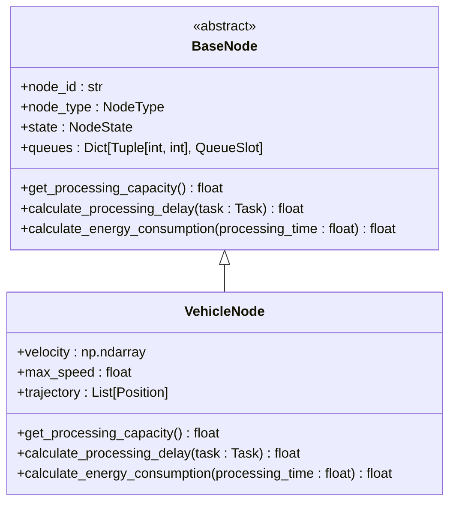
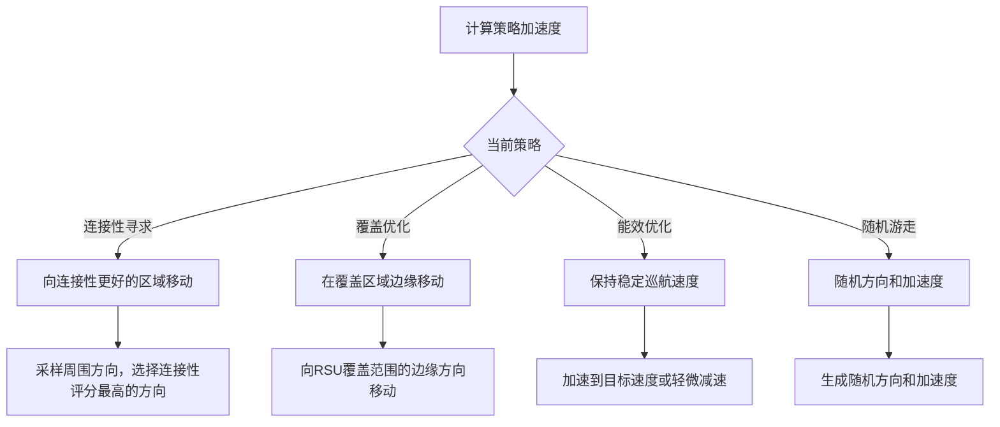
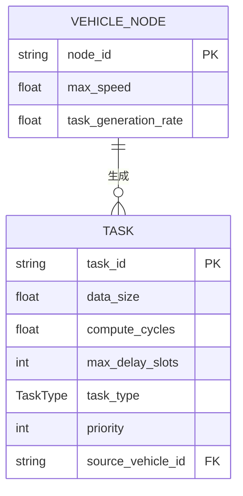
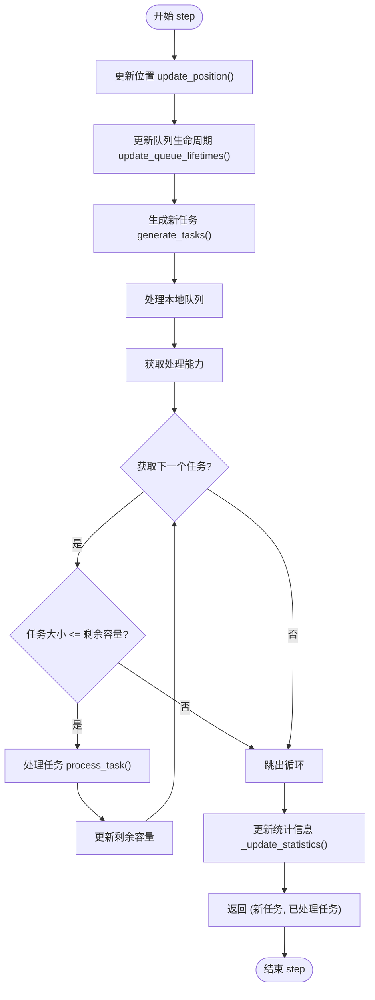

# 车辆节点模型

<cite>
**本文档引用的文件**   
- [vehicle_node.py](file://models/vehicle_node.py)
- [base_node.py](file://models/base_node.py)
- [data_structures.py](file://models/data_structures.py)
- [enhanced_vehicle_mobility.py](file://models/enhanced_vehicle_mobility.py)
</cite>

## 目录
1. [车辆节点实现机制](#车辆节点实现机制)
2. [继承自BaseNode的接口契约与扩展方法](#继承自basenode的接口契约与扩展方法)
3. [集成改进智能驾驶员模型实现动态轨迹预测与速度控制](#集成改进智能驾驶员模型实现动态轨迹预测与速度控制)
4. [车辆作为任务生成者与潜在计算节点的双重角色](#车辆作为任务生成者与潜在计算节点的双重角色)
5. [车辆节点状态更新周期、任务发布流程及通信模式](#车辆节点状态更新周期任务发布流程及通信模式)
6. [移动性模型参数对系统性能的影响及配置建议](#移动性模型参数对系统性能的影响及配置建议)
7. [异常处理机制与决策回退策略](#异常处理机制与决策回退策略)

## 车辆节点实现机制

车辆节点（VehicleNode）是智能交通系统中的核心移动实体，其设计遵循面向对象的继承原则，通过继承`BaseNode`抽象基类来实现标准化的节点行为。`VehicleNode`类在`models/vehicle_node.py`中定义，封装了车辆特有的移动性、任务生成、本地计算和能耗管理功能。

车辆节点的初始化过程首先调用父类`BaseNode`的构造函数，设置节点ID、类型（NodeType.VEHICLE）和初始位置。随后，`VehicleNode`扩展了车辆特有的属性，包括速度向量、最大速度限制、轨迹记录列表以及用于任务生成和能耗计算的参数。计算资源（如CPU频率）从配置文件中随机初始化，以模拟真实车辆硬件的多样性。

车辆节点的核心行为由`step`方法驱动，该方法在每个仿真时隙被调用，执行一个完整的状态更新周期。该周期包括：更新车辆位置、更新队列中任务的生命周期、生成新任务、处理本地队列中的任务以及更新节点统计信息。

**Section sources**
- [vehicle_node.py](file://models/vehicle_node.py#L15-L300)
- [base_node.py](file://models/base_node.py#L18-L312)

## 继承自BaseNode的接口契约与扩展方法

`VehicleNode`类通过继承`BaseNode`类，严格遵守了系统定义的通用接口契约，并实现了其抽象方法。`BaseNode`（位于`models/base_node.py`）是一个抽象基类，为所有计算节点（车辆、RSU、UAV）定义了统一的接口和基础功能。

### 接口契约

`BaseNode`定义了三个必须由子类实现的抽象方法，构成了所有节点必须遵守的接口契约：

**Diagram sources **
- [base_node.py](file://models/base_node.py#L63-L65)
- [base_node.py](file://models/base_node.py#L68-L70)
- [base_node.py](file://models/base_node.py#L73-L75)
- [vehicle_node.py](file://models/vehicle_node.py#L59-L68)
- [vehicle_node.py](file://models/vehicle_node.py#L70-L76)
- [vehicle_node.py](file://models/vehicle_node.py#L78-L100)

### 扩展方法

`VehicleNode`在继承的基础上，扩展了大量车辆特有的方法和属性：

1.  **移动性相关**：
    *   `update_position(time_step)`: 根据当前速度和时间步长更新车辆的二维位置，并处理边界碰撞（到达区域边界时反向速度）。
    *   `set_random_velocity()`: 为车辆设置一个随机的速度向量，用于初始化或随机移动。
    *   `trajectory`: 一个`Position`对象的列表，用于记录车辆的历史轨迹。

2.  **任务生成相关**：
    *   `generate_tasks(current_time_slot)`: 根据泊松过程生成新任务，任务数量由`task_generation_rate`和时隙长度决定。
    *   `_create_random_task()`: 创建一个具有随机属性（数据大小、延迟容忍度等）的新`Task`对象。
    *   `generated_tasks`: 一个`Task`对象的列表，用于存储该车辆生成的所有任务。

3.  **本地处理决策相关**：
    *   `can_process_immediately(task)`: 检查车辆是否能立即处理一个任务，检查条件包括当前负载因子和任务大小是否在处理能力范围内。
    *   `process_task_immediately(task)`: 尝试立即处理一个任务，如果成功则返回成功标志和处理延迟。

**Section sources**
- [vehicle_node.py](file://models/vehicle_node.py#L154-L184)
- [vehicle_node.py](file://models/vehicle_node.py#L186-L194)
- [vehicle_node.py](file://models/vehicle_node.py#L102-L119)
- [vehicle_node.py](file://models/vehicle_node.py#L244-L268)
- [vehicle_node.py](file://models/vehicle_node.py#L270-L300)

## 集成改进智能驾驶员模型实现动态轨迹预测与速度控制

`VehicleNode`通过集成`enhanced_vehicle_mobility.py`中的`VehicleMobilityModel`，实现了复杂的动态轨迹预测与速度控制功能。虽然`VehicleNode`本身使用一个简单的匀速直线运动模型，但`VehicleMobilityModel`提供了一个更高级的、策略驱动的移动性框架。

### 加速度计算

`VehicleMobilityModel`的核心是根据不同的移动策略计算加速度。加速度的计算由`_calculate_strategy_acceleration`方法驱动，该方法根据当前策略选择不同的子策略：

**Diagram sources **
- [enhanced_vehicle_mobility.py](file://models/enhanced_vehicle_mobility.py#L146-L157)
- [enhanced_vehicle_mobility.py](file://models/enhanced_vehicle_mobility.py#L159-L178)
- [enhanced_vehicle_mobility.py](file://models/enhanced_vehicle_mobility.py#L180-L204)
- [enhanced_vehicle_mobility.py](file://models/enhanced_vehicle_mobility.py#L206-L223)
- [enhanced_vehicle_mobility.py](file://models/enhanced_vehicle_mobility.py#L225-L231)

### 安全距离判定

`VehicleMobilityModel`通过`calculate_connectivity_score`方法间接实现了安全距离判定。该方法计算车辆在给定位置与固定节点（RSU和UAV）的连接性评分。评分越高，表示车辆越接近通信覆盖范围的中心，这可以被解释为一种“安全”或“稳定”的区域。车辆的移动策略（如连接性寻求）会引导车辆向高连接性评分的区域移动，从而避免进入信号弱的“危险”区域。

### 换道逻辑

在当前实现中，`VehicleMobilityModel`没有显式的“换道”逻辑。其换道行为是通过**覆盖优化策略**（`_coverage_optimization_acceleration`）和**连接性寻求策略**（`_connectivity_seeking_acceleration`）来隐式实现的。这些策略通过计算一个目标加速度向量来改变车辆的运动方向，从而实现路径的调整，这在宏观上等效于换道。例如，覆盖优化策略会引导车辆沿着RSU的覆盖范围边缘移动，这自然包含了横向移动（换道）的行为。

**Section sources**
- [enhanced_vehicle_mobility.py](file://models/enhanced_vehicle_mobility.py#L33-L398)

## 车辆作为任务生成者与潜在计算节点的双重角色

`VehicleNode`完美地体现了其在系统中的双重角色：既是任务的生成者，也是潜在的计算服务提供者。

### 任务生成者

作为任务生成者，`VehicleNode`通过`generate_tasks`方法模拟了车载应用（如自动驾驶感知、AR导航）的计算需求。该方法使用泊松过程来模拟任务的随机到达，这符合许多现实世界中事件的发生模式。新生成的任务被封装为`Task`对象，并通过`_create_random_task`方法赋予其关键属性。

**Diagram sources **
- [data_structures.py](file://models/data_structures.py#L28-L96)
- [vehicle_node.py](file://models/vehicle_node.py#L102-L119)

### 潜在计算节点

作为潜在的计算节点，`VehicleNode`拥有处理自身或卸载任务的能力。其计算能力由`get_processing_capacity`方法定义，该能力取决于CPU频率、时隙长度和计算密度。`process_task`方法（继承自`BaseNode`）负责执行任务处理，包括计算处理延迟、能耗，并更新任务状态。

车辆节点的`queues`属性（继承自`BaseNode`）是一个多优先级生命周期队列，用于管理待处理的任务。任务根据其剩余生命周期和优先级被分配到不同的队列槽位中。调度策略为非抢占式优先级调度：高优先级任务优先处理，同优先级任务按FIFO顺序处理。

**Section sources**
- [data_structures.py](file://models/data_structures.py#L28-L96)
- [data_structures.py](file://models/data_structures.py#L98-L154)
- [data_structures.py](file://models/data_structures.py#L156-L201)
- [base_node.py](file://models/base_node.py#L45-L60)
- [base_node.py](file://models/base_node.py#L112-L125)

## 车辆节点状态更新周期、任务发布流程及通信模式

### 状态更新周期

车辆节点的状态更新由`step`方法驱动，该方法定义了每个仿真时隙的完整执行流程：

**Diagram sources **
- [vehicle_node.py](file://models/vehicle_node.py#L196-L242)

### 任务发布流程

1.  **生成**：在`step`方法中，`generate_tasks`被调用，根据泊松过程生成一批新任务。
2.  **发布**：这些新任务被返回给调用者（通常是`CompleteSystemSimulator`）。**注意**：新生成的任务不会在`step`方法中被立即处理。
3.  **决策**：系统调度器（卸载决策器）接收这些新任务，并根据任务属性、车辆状态和网络状况，决定是将任务留在本地处理，还是卸载到RSU或UAV。
4.  **入队**：如果决定在本地处理，任务将通过`add_task_to_queue`方法加入车辆的本地队列，等待在后续时隙被处理。

### 通信模式

车辆节点的通信模式主要体现在与系统其他组件的交互上：
*   **与调度器通信**：通过`step`方法的返回值，车辆向调度器报告其新生成的任务和已处理完成的任务。
*   **与队列系统通信**：通过`add_task_to_queue`和`get_next_task_to_process`等方法，车辆与自身的多优先级队列进行交互。
*   **与能耗模型通信**：在处理任务时，`calculate_energy_consumption`方法被调用，计算能耗并更新`NodeState`中的`total_energy`和`current_power`。

**Section sources**
- [vehicle_node.py](file://models/vehicle_node.py#L196-L242)
- [base_node.py](file://models/base_node.py#L77-L99)
- [base_node.py](file://models/base_node.py#L112-L125)

## 移动性模型参数对系统性能的影响及配置建议

`VehicleMobilityModel`中的关键参数对系统性能有显著影响：

| 参数 | 影响 | 典型城市交通场景配置建议 |
| :--- | :--- | :--- |
| `max_speed` (最大速度) | 直接影响车辆的移动范围和任务卸载的时机。速度过高可能导致频繁进出RSU覆盖区，增加通信开销；速度过低则可能无法及时到达服务区域。 | 30 m/s (约108 km/h)，模拟城市快速路或主干道的车速。 |
| `max_acceleration` (最大加速度) | 影响车辆改变速度和方向的能力。较高的加速度允许车辆更快地响应策略变化，但可能导致能耗增加。 | 3.0 m/s²，符合一般车辆的加速性能。 |
| `min_speed` (最小速度) | 防止车辆完全停止，确保持续的连接性。 | 2.0 m/s，模拟车辆在拥堵时的缓慢移动。 |
| `strategy_weights` (策略权重) | 决定了车辆在连接性、覆盖范围、能效和任务负载之间的权衡。权重设置不当可能导致车辆行为偏离预期。 | 在固定RSU/UAV覆盖的场景下，建议`connectivity=0.5`, `coverage=0.3`, `energy=0.2`，优先保证通信质量。 |

**Section sources**
- [enhanced_vehicle_mobility.py](file://models/enhanced_vehicle_mobility.py#L33-L398)

## 异常处理机制与决策回退策略

系统通过多种机制处理异常情况，确保鲁棒性。

### 信号丢失

当车辆移动到RSU或UAV的覆盖范围之外时，即发生信号丢失。`VehicleMobilityModel`通过`calculate_connectivity_score`方法检测此情况（评分为0）。决策回退策略体现在移动策略上：
*   **连接性寻求策略**：会主动引导车辆向连接性更好的区域移动，从而自动恢复信号。
*   **覆盖优化策略**：会引导车辆在覆盖区边缘移动，尽量避免完全脱离覆盖。

### 突发制动

在`VehicleMobilityModel`中，**能效优化策略**（`_energy_efficient_acceleration`）模拟了类似“突发制动”的行为。当车辆当前速度超过目标巡航速度时，该策略会施加一个负加速度（减速），以保持稳定的速度，这可以看作是一种平滑的制动行为，旨在降低能耗。

### 通用异常处理

*   **任务处理失败**：在`BaseNode.process_task`方法中，如果任务在处理前已违反截止时间，则任务被标记为丢弃（`is_dropped=True`）并加入`dropped_tasks`列表。
*   **队列溢出**：在`BaseNode.add_task_to_queue`方法中，如果队列容量已满，新任务将被直接丢弃。
*   **生命周期耗尽**：在`BaseNode.update_queue_lifetimes`方法中，当任务的生命周期减至0时，任务被丢弃。

这些机制共同构成了一个健壮的异常处理框架，确保了系统在各种边界条件下的稳定性。

**Section sources**
- [enhanced_vehicle_mobility.py](file://models/enhanced_vehicle_mobility.py#L33-L398)
- [base_node.py](file://models/base_node.py#L127-L170)
- [base_node.py](file://models/base_node.py#L77-L99)
- [base_node.py](file://models/base_node.py#L263-L292)