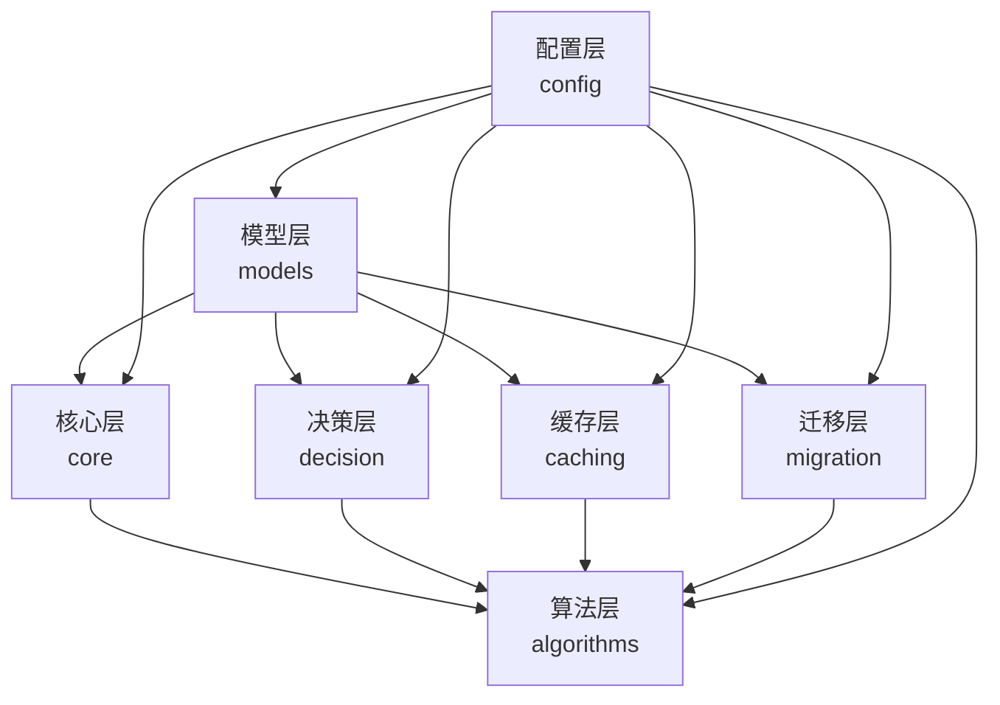
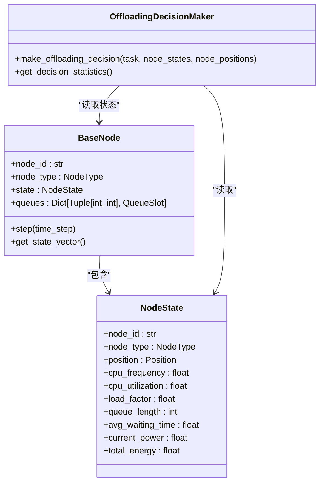
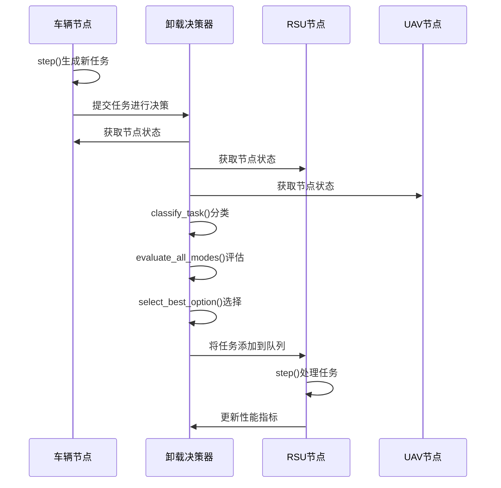

# 系统架构设计

<cite>
**本文档引用的文件**
- [base_node.py](file://models/base_node.py)
- [vehicle_node.py](file://models/vehicle_node.py)
- [rsu_node.py](file://models/rsu_node.py)
- [uav_node.py](file://models/uav_node.py)
- [queue_manager.py](file://core/queue_manager.py)
- [offloading_manager.py](file://decision/offloading_manager.py)
- [cache_manager.py](file://caching/cache_manager.py)
- [migration_manager.py](file://migration/migration_manager.py)
- [matd3.py](file://algorithms/matd3.py)
- [system_config.py](file://config/system_config.py)
</cite>

## 目录
1. [引言](#引言)
2. [分层模块化设计](#分层模块化设计)
3. [MVC-like架构模式](#mvc-like架构模式)
4. [设计模式应用](#设计模式应用)
5. [核心组件与数据流](#核心组件与数据流)
6. [多智能体协同机制](#多智能体协同机制)
7. [关键组件分析](#关键组件分析)
8. [系统上下文图](#系统上下文图)
9. [可扩展性与异常处理](#可扩展性与异常处理)
10. [结论](#结论)

## 引言

VEC_mig_caching系统是一个基于多智能体深度强化学习的车联网边缘缓存系统，旨在优化车辆、路边单元（RSU）和无人机（UAV）节点之间的任务卸载、缓存管理和迁移决策。本架构文档详细阐述了系统的分层模块化设计，重点描述了其MVC-like架构模式，以及工厂模式、策略模式和观察者模式在节点管理、缓存策略和决策流程中的应用。文档将深入分析从任务生成到决策执行再到性能反馈的完整闭环数据流与控制流，并解释多智能体协同机制如何通过MATD3等算法实现联合优化。

## 分层模块化设计

VEC_mig_caching系统采用清晰的分层模块化设计，将复杂的功能分解为独立且可管理的组件。这种设计遵循关注点分离原则，提高了代码的可维护性、可测试性和可扩展性。系统主要分为以下几个层次：

1.  **模型层 (models)**: 定义了系统中所有实体的抽象和具体实现，包括`VehicleNode`、`RSUNode`和`UAVNode`。这些类继承自`BaseNode`，实现了节点的通用行为和特定于节点类型的逻辑。
2.  **核心层 (core)**: 提供系统运行所必需的基础服务，如`queue_manager.py`中实现的多优先级生命周期队列管理。
3.  **决策层 (decision)**: 负责核心的业务逻辑决策，如`offloading_manager.py`中的任务分类与卸载决策框架。
4.  **缓存层 (caching)**: 专注于边缘缓存管理，如`cache_manager.py`中实现的智能缓存策略和协作缓存。
5.  **迁移层 (migration)**: 处理任务迁移逻辑，如`migration_manager.py`中实现的Keep-Before-Break迁移机制。
6.  **算法层 (algorithms)**: 包含用于训练智能体的强化学习算法，如`matd3.py`中的MATD3算法实现。
7.  **配置层 (config)**: 集中管理系统的所有配置参数，确保系统行为的可配置性和灵活性。

这种分层结构使得各模块职责分明，降低了模块间的耦合度，便于独立开发和迭代。



**图源**
- [models](file://models)
- [core](file://core)
- [decision](file://decision)
- [caching](file://caching)
- [migration](file://migration)
- [algorithms](file://algorithms)
- [config](file://config)

## MVC-like架构模式

系统采用了类似MVC（Model-View-Controller）的设计模式，但根据其仿真和决策系统的特性进行了调整，形成了一个以**模型（Model）**、**决策（Controller）** 和**状态（State）**为核心的架构。

*   **模型 (Model)**: 由`models`目录下的`VehicleNode`、`RSUNode`和`UAVNode`等类构成。它们不仅代表了系统中的实体，还封装了实体的状态（通过`NodeState`对象）和行为（如`step`方法）。模型是系统数据和业务规则的持有者。
*   **决策 (Controller)**: 由`decision`目录下的`OffloadingDecisionMaker`等类构成。它接收来自模型的状态信息，根据业务规则（任务分类、处理模式评估）做出决策，并将决策结果反馈给模型。决策层是系统的“大脑”，负责协调和控制。
*   **状态 (State)**: `NodeState`类是MVC模式中“视图”概念的变体。它不用于UI展示，而是作为模型内部状态的集中表示，供决策层读取。`get_state_vector()`方法将状态转换为强化学习算法所需的向量形式，实现了状态的“展示”或“输出”。

这种模式将数据（模型）、控制逻辑（决策）和状态表示（状态）分离，使得系统逻辑清晰，易于理解和维护。



**图源**
- [offloading_manager.py](file://decision/offloading_manager.py#L12-L625)
- [base_node.py](file://models/base_node.py#L1-L312)
- [data_structures.py](file://models/data_structures.py)

## 设计模式应用

系统巧妙地应用了多种设计模式，以提高代码的灵活性、可扩展性和可维护性。

### 工厂模式在节点管理中的应用

工厂模式被隐式地应用于节点的创建和管理。虽然没有一个显式的`NodeFactory`类，但`run_full_experiment.py`中的`create_test_environment`方法扮演了工厂的角色。它根据配置参数（如车辆、RSU、UAV的数量）动态地创建不同类型的节点实例。

```python
def create_test_environment(self, exp_config: ExperimentConfig):
    # 创建车辆节点
    vehicles = []
    for i in range(exp_config.num_vehicles):
        # ... 位置计算 ...
        vehicle = VehicleNode(f"vehicle_{i}", position)
        vehicles.append(vehicle)
    
    # 创建RSU节点
    rsus = []
    for i in range(exp_config.num_rsus):
        # ... 位置计算 ...
        rsu = RSUNode(f"rsu_{i}", position)
        rsus.append(rsu)
    
    # 创建UAV节点
    uavs = []
    for i in range(exp_config.num_uavs):
        # ... 位置计算 ...
        uav = UAVNode(f"uav_{i}", position)
        uavs.append(uav)
    
    return vehicles, rsus, uavs
```

这种方法将节点的创建逻辑集中在一个地方，客户端代码无需关心具体的创建细节，只需调用`create_test_environment`即可获得一个完整的测试环境，体现了工厂模式的精髓。

### 策略模式在缓存策略中的应用

策略模式被明确地应用于缓存替换策略的实现。`CachePolicy`是一个抽象基类，定义了缓存策略的通用接口（`get`, `put`, `evict`）。具体的策略如LRU、LFU等则通过继承`CachePolicy`来实现各自的算法。

```python
class CachePolicy(ABC):
    """缓存策略抽象基类"""
    
    def __init__(self, capacity: int):
        self.capacity = capacity
        self.cache = {}
    
    @abstractmethod
    def get(self, key: str) -> Optional[Any]:
        pass
    
    @abstractmethod
    def put(self, key: str, value: Any) -> None:
        pass
    
    @abstractmethod
    def evict(self) -> Optional[str]:
        pass

class LRUCachePolicy(CachePolicy):
    def evict(self) -> Optional[str]:
        # LRU替换逻辑
        pass

class LFUCachePolicy(CachePolicy):
    def evict(self) -> Optional[str]:
        # LFU替换逻辑
        pass
```

在`RSUNode`和`CollaborativeCacheManager`中，可以通过配置选择不同的策略，而无需修改使用策略的代码，这极大地增强了系统的灵活性。

### 观察者模式在决策流程中的应用

观察者模式体现在系统状态的更新与决策的触发机制中。`BaseNode`及其子类是“被观察者”，它们的状态（如队列长度、负载因子）会随着`step`方法的调用而不断变化。`OffloadingDecisionMaker`作为“观察者”，在每个决策周期开始时，会主动“拉取”所有节点的最新状态（`node_states`），然后基于这些状态做出决策。

```python
def make_offloading_decision(self, task: Task, node_states: Dict, node_positions: Dict[str, Position]):
    # 决策制定者（观察者）获取所有节点的当前状态
    task_type = self.classifier.classify_task(task)
    candidate_nodes = self.classifier.get_candidate_nodes(task, node_positions)
    processing_options = self.evaluator.evaluate_all_modes(task, candidate_nodes, node_states, node_positions)
    # ... 其他决策逻辑 ...
```

虽然这不是一个典型的事件驱动的观察者模式，但其核心思想一致：当被观察对象（节点）的状态发生变化时，依赖该状态的观察者（决策器）能够获取到最新的状态并作出响应。

## 核心组件与数据流

系统的核心数据流与控制流构成了一个从任务生成到性能反馈的完整闭环。

### 数据流与控制流闭环

1.  **任务生成**: `VehicleNode`在`step`方法中，根据泊松过程生成新任务。
2.  **决策请求**: 新生成的任务被提交给`OffloadingDecisionMaker`进行决策。
3.  **状态采集**: 决策器从所有`BaseNode`实例中收集当前的`node_states`和`node_positions`。
4.  **决策执行**: 决策器根据任务类型、候选节点和状态信息，评估所有可能的处理模式，并选择最优方案。
5.  **任务处理**: 决策结果被应用，任务被添加到目标节点（车辆、RSU或UAV）的队列中。
6.  **节点更新**: 在每个时间步，所有节点调用`step`方法，处理队列中的任务，更新自身状态。
7.  **性能反馈**: 节点的处理结果（完成的任务、能耗等）被记录，这些数据可用于评估算法性能，并可能用于调整强化学习模型的策略。

这个闭环确保了系统能够根据实时状态动态调整决策，实现持续优化。



**图源**
- [vehicle_node.py](file://models/vehicle_node.py#L15-L300)
- [offloading_manager.py](file://decision/offloading_manager.py#L12-L625)
- [rsu_node.py](file://models/rsu_node.py#L16-L423)
- [uav_node.py](file://models/uav_node.py#L14-L360)

## 多智能体协同机制

系统采用多智能体深度强化学习（MARL）框架，特别是MATD3算法，来实现车辆、RSU和UAV节点的联合优化。

### MATD3算法实现

`MATD3Agent`类实现了多智能体TD3算法。每个智能体（对应一个节点）都有自己的Actor和Critic网络。系统通过`ReplayBuffer`进行经验回放，并使用目标网络和延迟更新策略来稳定训练过程。

```python
class MATD3Agent:
    def __init__(self, agent_id: str, state_dim: int, action_dim: int):
        # 初始化Actor和Critic网络
        self.actor = Actor(state_dim, action_dim, self.hidden_dim)
        self.critic = Critic(state_dim, action_dim, self.hidden_dim)
        # ... 其他初始化 ...
    
    def train(self, batch_size: Optional[int] = None):
        # 采样经验
        state, action, reward, next_state, done = self.replay_buffer.sample(batch_size_val)
        # 计算目标Q值
        # 更新Critic网络
        # 延迟更新Actor网络
        # 软更新目标网络
```

### 联合优化

在训练过程中，所有智能体共享一个全局的经验回放缓冲区。虽然每个智能体独立更新自己的Actor网络，但Critic网络的训练会考虑所有智能体的动作，从而学习到一个能够评估联合动作价值的函数。这使得智能体在执行时虽然是分布式的（每个节点根据自己的状态和策略选择动作），但在训练时却是集中的，能够学习到全局最优的协同策略。

## 关键组件分析

### base_node.py: 抽象基类与多态行为

`BaseNode`类是所有实体节点的抽象基类，它通过继承和多态性支持不同节点类型的统一接口和差异化行为。

```python
class BaseNode(ABC):
    def __init__(self, node_id: str, node_type: NodeType, position: Position):
        self.node_id = node_id
        self.node_type = node_type
        self.state = NodeState(...)
        self.queues = {} # 多优先级生命周期队列
        
    @abstractmethod
    def get_processing_capacity(self) -> float:
        """获取处理能力"""
        pass
    
    @abstractmethod
    def calculate_processing_delay(self, task: Task) -> float:
        """计算处理时延"""
        pass
    
    @abstractmethod  
    def calculate_energy_consumption(self, processing_time: float) -> float:
        """计算能耗"""
        pass
    
    def add_task_to_queue(self, task: Task) -> bool:
        # 通用的队列添加逻辑
        pass
    
    def process_task(self, task: Task) -> bool:
        # 通用的任务处理流程
        processing_delay = self.calculate_processing_delay(task)
        energy_cost = self.calculate_energy_consumption(processing_delay)
        # ... 更新状态和统计信息 ...
```

`VehicleNode`、`RSUNode`和`UAVNode`都继承自`BaseNode`，并重写`get_processing_capacity`、`calculate_processing_delay`和`calculate_energy_consumption`等抽象方法，以实现各自独特的计算和能耗模型。例如，`UAVNode`的能耗计算包含了悬停能耗，而`VehicleNode`则考虑了CPU利用率对动态功率的影响。这种设计使得系统可以统一处理所有节点，同时又能精确模拟不同类型节点的物理特性。

**节源**
- [base_node.py](file://models/base_node.py#L1-L312)
- [vehicle_node.py](file://models/vehicle_node.py#L15-L300)
- [rsu_node.py](file://models/rsu_node.py#L16-L423)
- [uav_node.py](file://models/uav_node.py#L14-L3