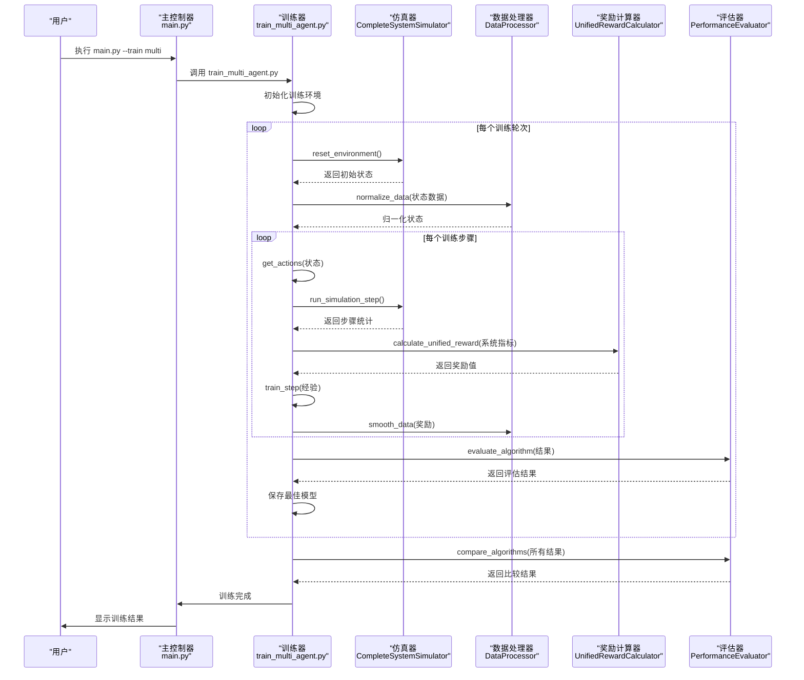

# 组件交互与数据流

<cite>
**本文档引用的文件**  
- [main.py](file://main.py)
- [train_multi_agent.py](file://train_multi_agent.py)
- [run_full_experiment.py](file://run_full_experiment.py)
- [data_processor.py](file://utils/data_processor.py)
- [reward_calculator.py](file://utils/reward_calculator.py)
- [performance_evaluator.py](file://evaluation/performance_evaluator.py)
- [visualize_results.py](file://visualize_results.py)
</cite>

## 目录
1. [系统启动与主控制器](#系统启动与主控制器)  
2. [训练流程与数据处理](#训练流程与数据处理)  
3. [奖励信号生成机制](#奖励信号生成机制)  
4. [性能评估与结果输出](#性能评估与结果输出)  
5. [多智能体训练序列图](#多智能体训练序列图)  
6. [异步处理与错误传播](#异步处理与错误传播)

## 系统启动与主控制器

用户通过执行 `main.py` 启动系统，该文件作为主控制器负责解析命令行参数并调度相应模块。根据用户输入的参数，主控制器将调用不同的执行路径：

- 当使用 `--train multi` 参数时，调用 `train_multi_agent.py` 启动多智能体训练流程。
- 当使用 `--experiment` 参数时，调用 `run_full_experiment.py` 执行完整实验流程。

主控制器通过 `os.system()` 调用机制实现模块间的解耦，确保各功能模块独立运行。这种设计支持异步执行，允许用户在不同终端同时运行多个实验任务。

**Section sources**  
- [main.py](file://main.py#L44-L63)

## 训练流程与数据处理

多智能体训练流程由 `train_multi_agent.py` 文件实现。该模块创建 `MultiAgentTrainingEnvironment` 类，集成 `CompleteSystemSimulator` 仿真器，通过 `run_episode()` 方法执行训练轮次。

在训练过程中，系统状态数据通过 `data_processor.py` 模块进行处理。`DataProcessor` 类提供多种数据处理功能：

- `normalize_data()`: 对状态数据进行归一化处理，支持 minmax 和 zscore 方法
- `smooth_data()`: 对奖励和指标数据进行平滑处理
- `convert_to_tensor()`: 将处理后的数据转换为 PyTorch 张量格式
- `save_processed_data()`: 将处理结果保存为 JSON 格式

状态数据处理流程确保了输入到强化学习算法的数据具有良好的数值特性，提高了训练的稳定性和收敛速度。

**Section sources**  
- [train_multi_agent.py](file://train_multi_agent.py#L715-L815)
- [data_processor.py](file://utils/data_processor.py#L11-L154)

## 奖励信号生成机制

奖励信号由 `reward_calculator.py` 模块生成，通过 `UnifiedRewardCalculator` 类实现统一的奖励计算逻辑。该机制基于论文中的目标函数，计算综合成本并转换为奖励值。

奖励计算包含三个主要组成部分：

1. **基础奖励**: 基于系统性能指标计算，对应论文式(24)目标函数
   ```math
   cost = \omega_T \cdot normalized\_delay + \omega_E \cdot normalized\_energy + \omega_D \cdot normalized\_loss
   ```
   基础奖励为成本的负值：`base_reward = -cost`

2. **性能奖励**: 鼓励高性能表现，包括任务完成率、缓存命中率和迁移成功率奖励

3. **智能体特定奖励**: 根据智能体类型提供差异化奖励
   - 车辆智能体：关注本地处理效率
   - RSU智能体：关注缓存和负载均衡
   - UAV智能体：关注能效和电池管理

最终奖励通过 `calculate_unified_reward()` 方法组合生成，并应用范围限制确保数值稳定性。

**Section sources**  
- [reward_calculator.py](file://utils/reward_calculator.py#L13-L226)

## 性能评估与结果输出

性能评估由 `performance_evaluator.py` 模块完成，通过 `PerformanceEvaluator` 类实现。该模块收集训练过程中的各项指标并生成评估结果。

评估流程包括：

1. **指标收集**: 从训练结果中提取基本性能指标
   - 任务完成率
   - 平均时延
   - 总能耗
   - 缓存命中率

2. **综合评分**: 计算综合性能分数
   ```python
   composite_score = sum(weights[metric] * normalized_scores[metric])
   ```

3. **算法比较**: 对比不同算法的性能，计算改进幅度

4. **结果输出**: 生成可视化图表和文本报告
   - `plot_performance_comparison()`: 绘制性能对比图
   - `generate_performance_report()`: 生成Markdown格式报告
   - `save_results()`: 保存评估结果为JSON格式

可视化结果由 `visualize_results.py` 生成，包括性能对比图和改进效果图表，所有结果保存在 `results/` 目录中。

**Section sources**  
- [performance_evaluator.py](file://evaluation/performance_evaluator.py#L12-L253)
- [visualize_results.py](file://visualize_results.py)

## 多智能体训练序列图



**Diagram sources**  
- [main.py](file://main.py#L44-L47)
- [train_multi_agent.py](file://train_multi_agent.py#L715-L815)
- [utils/data_processor.py](file://utils/data_processor.py#L11-L154)
- [utils/reward_calculator.py](file://utils/reward_calculator.py#L13-L226)
- [evaluation/performance_evaluator.py](file://evaluation/performance_evaluator.py#L12-L253)

## 异步处理与错误传播

系统采用异步处理机制提高执行效率。主控制器通过 `os.system()` 调用子进程，允许并行执行多个实验任务。这种设计支持：

- **并行实验**: 用户可以在不同终端同时运行多个实验
- **资源隔离**: 每个实验在独立进程中运行，避免资源竞争
- **容错性**: 单个实验失败不会影响其他实验的执行

错误传播机制通过异常处理和日志记录实现：

1. **异常捕获**: 在 `main.py` 的主循环中捕获 `KeyboardInterrupt` 和通用异常
2. **错误报告**: 发生错误时输出详细错误信息
3. **优雅退出**: 确保资源正确释放

状态同步通过共享文件系统实现，所有模块将结果保存到 `results/` 目录，确保数据的一致性和可追溯性。

**Section sources**  
- [main.py](file://main.py#L200-L214)
- [train_multi_agent.py](file://train_multi_agent.py#L715-L815)
- [run_full_experiment.py](file://run_full_experiment.py#L546-L583)