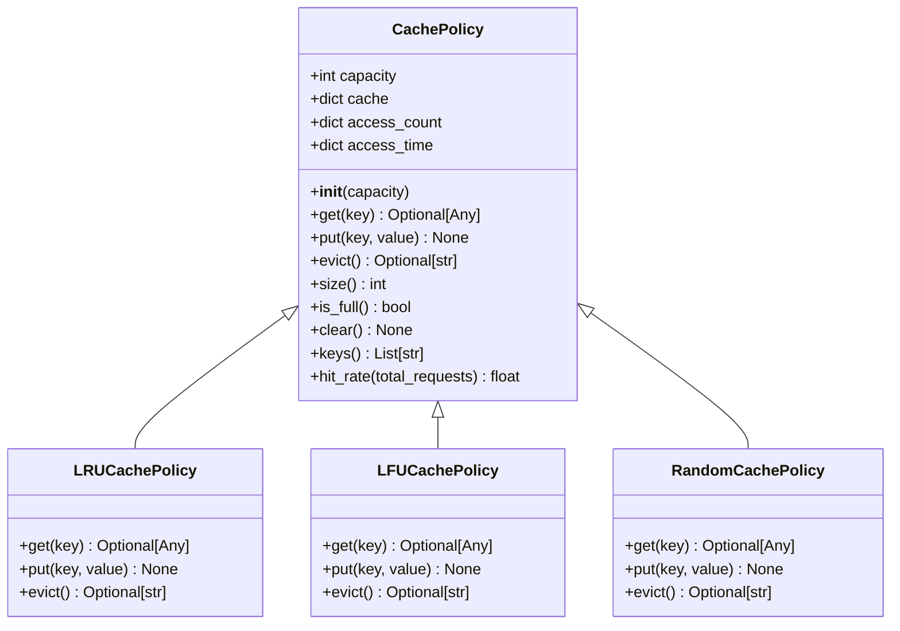
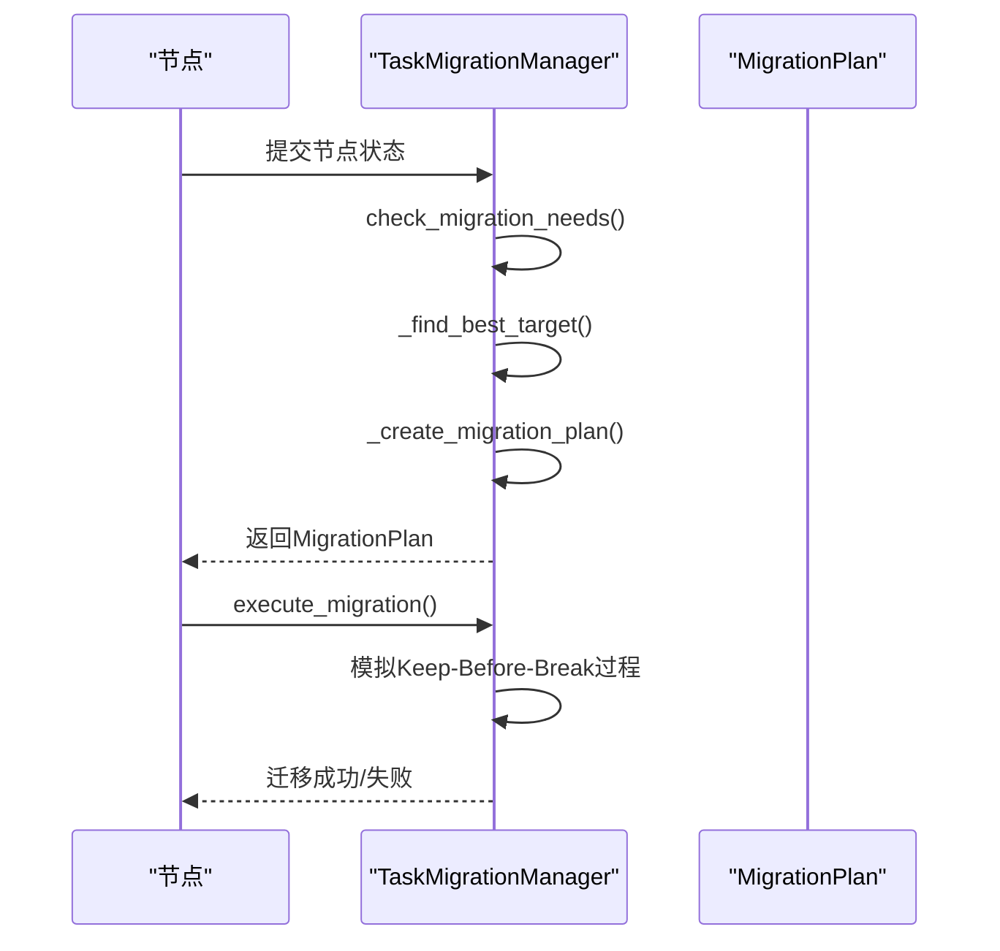
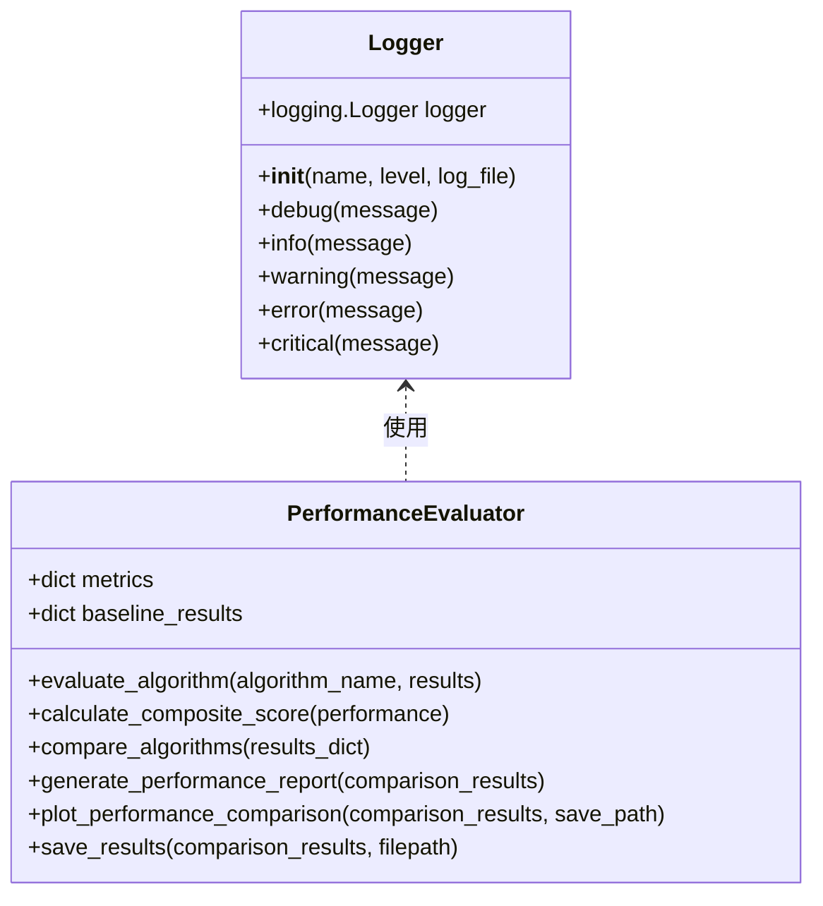
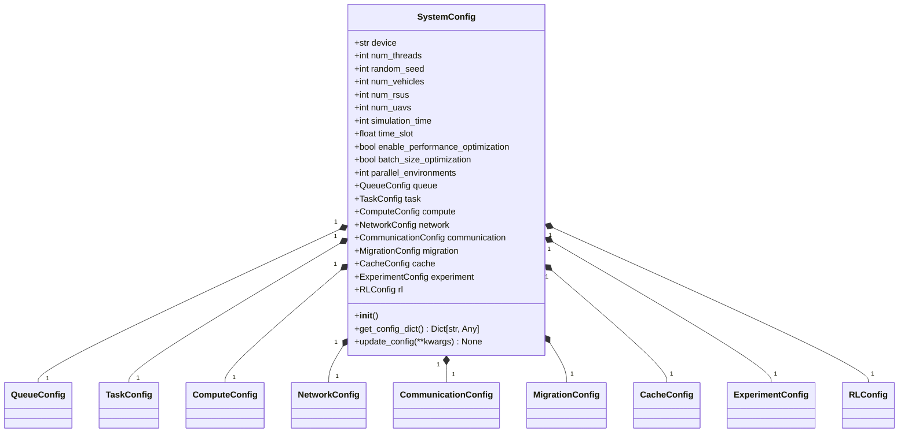

# 设计模式应用

<cite>
**本文档中引用的文件**   
- [__init__.py](file://algorithms/__init__.py)
- [cache_policy.py](file://caching/cache_policy.py)
- [migration_manager.py](file://migration/migration_manager.py)
- [logger.py](file://utils/logger.py)
- [system_config.py](file://config/system_config.py)
- [performance_evaluator.py](file://evaluation/performance_evaluator.py)
</cite>

## 目录
1. [引言](#引言)
2. [工厂模式](#工厂模式)
3. [策略模式](#策略模式)
4. [观察者模式](#观察者模式)
5. [单例模式](#单例模式)
6. [架构权衡分析](#架构权衡分析)
7. [结论](#结论)

## 引言
本项目在多智能体系统中应用了四种核心设计模式：工厂模式、策略模式、观察者模式和单例模式。这些模式分别用于算法实例化、策略切换、日志监控和配置管理，共同构建了一个灵活、可扩展且高效的系统架构。本文将深入分析每种模式的具体实现机制、调用流程和设计优势，并探讨模式选择背后的架构权衡。

## 工厂模式
工厂模式在 `algorithms/__init__.py` 文件中实现，用于动态创建多智能体算法实例。该模式通过统一的导入机制，将多种深度强化学习算法（如MATD3、MADDPG、QMIX、MAPPO和SAC-MA）封装在同一个模块中，实现了算法实例的集中管理和动态创建。

该实现采用模块级工厂模式，通过 `__all__` 变量显式声明所有可导出的类，为上层应用提供了清晰的接口。当需要创建特定算法实例时，客户端代码可以直接从 `algorithms` 模块导入所需类，而无需关心具体的实现文件路径。这种设计不仅简化了算法的使用方式，还提高了代码的可维护性，新增算法只需在 `__init__.py` 中添加相应的导入语句即可。

**Section sources**
- [__init__.py](file://algorithms/__init__.py#L1-L35)

## 策略模式
策略模式在 `caching/cache_policy.py` 和 `migration/migration_manager.py` 文件中实现，用于实现缓存与迁移策略的灵活切换。在 `cache_policy.py` 中，定义了 `CachePolicy` 抽象基类，声明了 `get`、`put` 和 `evict` 三个抽象方法，为不同的缓存替换策略（如LRU、LFU、RANDOM）提供了统一的接口规范。

**Diagram sources **
- [cache_policy.py](file://caching/cache_policy.py#L8-L55)

在 `migration_manager.py` 中，策略模式用于实现任务迁移的决策逻辑。`TaskMigrationManager` 类根据节点状态和位置信息，动态选择最佳的迁移目标和迁移类型。通过将迁移策略封装在独立的方法中（如 `_find_best_target` 和 `_create_migration_plan`），系统可以灵活地调整迁移决策算法，而不会影响到其他模块。

**Diagram sources **
- [migration_manager.py](file://migration/migration_manager.py#L38-L251)

**Section sources**
- [cache_policy.py](file://caching/cache_policy.py#L8-L55)
- [migration_manager.py](file://migration/migration_manager.py#L38-L251)

## 观察者模式
观察者模式通过 `utils/logger.py` 与 `evaluation` 模块实现指标监控与日志记录。在 `logger.py` 中，`Logger` 类作为观察者，订阅系统中的各种事件，并将日志信息输出到控制台和文件。该类提供了 `debug`、`info`、`warning`、`error` 和 `critical` 等不同级别的日志记录方法，满足了系统在不同场景下的日志需求。

**Diagram sources **
- [logger.py](file://utils/logger.py#L12-L59)
- [performance_evaluator.py](file://evaluation/performance_evaluator.py#L12-L253)

`evaluation` 模块中的 `PerformanceEvaluator` 类作为另一个观察者，收集和分析系统性能指标。它通过 `evaluate_algorithm` 方法评估单个算法的性能，通过 `compare_algorithms` 方法比较多个算法的表现，并生成详细的性能报告。这种设计使得系统能够实时监控和评估算法性能，为优化决策提供数据支持。

**Section sources**
- [logger.py](file://utils/logger.py#L12-L59)
- [performance_evaluator.py](file://evaluation/performance_evaluator.py#L12-L253)

## 单例模式
单例模式确保 `config/system_config.py` 中的配置全局唯一。在该文件中，通过创建全局的 `config` 实例，实现了系统配置的单例模式。`SystemConfig` 类包含了实验配置、强化学习配置、队列配置、任务配置、计算配置、网络配置、通信配置、迁移配置、缓存配置等多个子配置模块，为整个系统提供了统一的配置管理。

**Diagram sources **
- [system_config.py](file://config/system_config.py#L318-L318)

这种设计确保了系统中所有组件都使用同一份配置，避免了配置不一致的问题。同时，通过提供 `update_config` 方法，系统可以在运行时动态调整配置，提高了系统的灵活性和可配置性。

**Section sources**
- [system_config.py](file://config/system_config.py#L318-L318)

## 架构权衡分析
四种设计模式的选择体现了项目在灵活性、可维护性和性能之间的精心权衡。工厂模式通过集中管理算法实例的创建，提高了系统的可扩展性，但增加了模块间的耦合度。策略模式通过将算法逻辑封装在独立的策略类中，实现了算法的灵活切换，但可能增加系统的复杂性。

观察者模式通过解耦事件的发布者和订阅者，提高了系统的响应性和可维护性，但可能引入性能开销。单例模式通过确保配置的全局唯一性，简化了配置管理，但可能限制了系统的可测试性和可扩展性。

这些模式的综合应用，使得系统能够在保持高性能的同时，具备良好的可扩展性和可维护性。工厂模式和策略模式共同支持了多算法的灵活切换，观察者模式实现了系统的实时监控，单例模式确保了配置的一致性，共同构建了一个高效、灵活且易于维护的多智能体系统。

**Section sources**
- [__init__.py](file://algorithms/__init__.py#L1-L35)
- [cache_policy.py](file://caching/cache_policy.py#L8-L55)
- [migration_manager.py](file://migration/migration_manager.py#L38-L251)
- [logger.py](file://utils/logger.py#L12-L59)
- [system_config.py](file://config/system_config.py#L318-L318)

## 结论
本项目通过工厂模式、策略模式、观察者模式和单例模式的综合应用，构建了一个高效、灵活且易于维护的多智能体系统。工厂模式实现了算法实例的动态创建，策略模式支持了缓存与迁移策略的灵活切换，观察者模式实现了系统的实时监控与日志记录，单例模式确保了配置的全局唯一性。这些设计模式的选择和应用，体现了项目在灵活性、可维护性和性能之间的精心权衡，为系统的成功实施提供了坚实的基础。