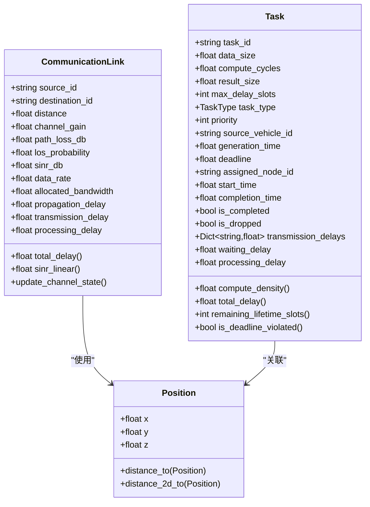
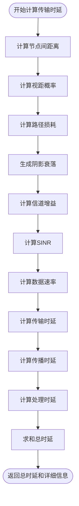
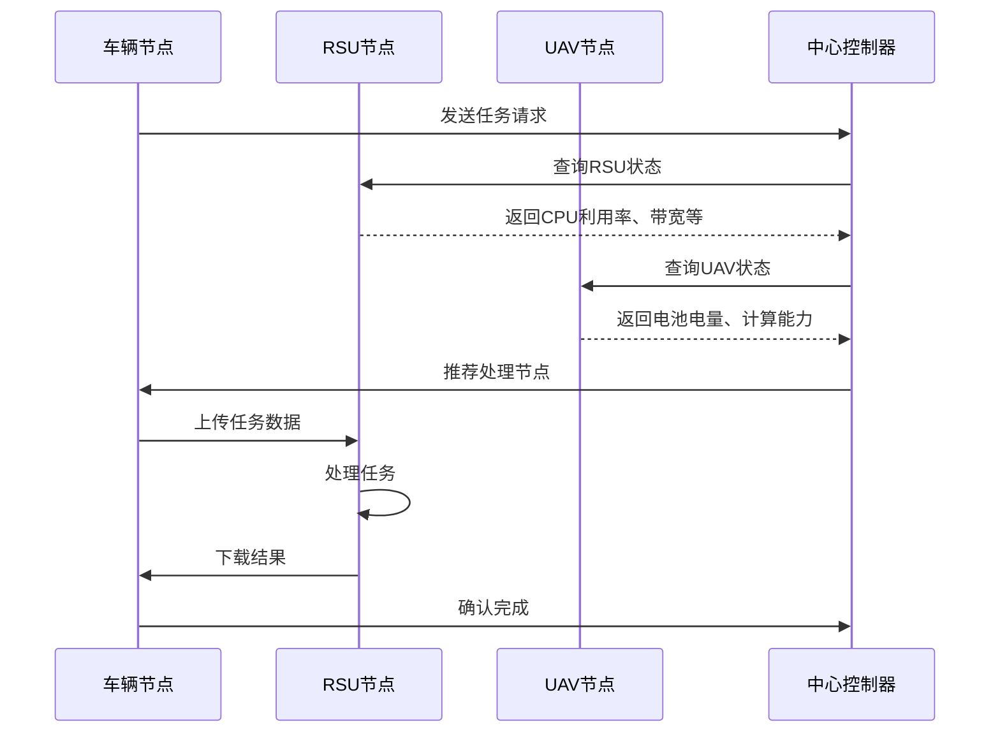
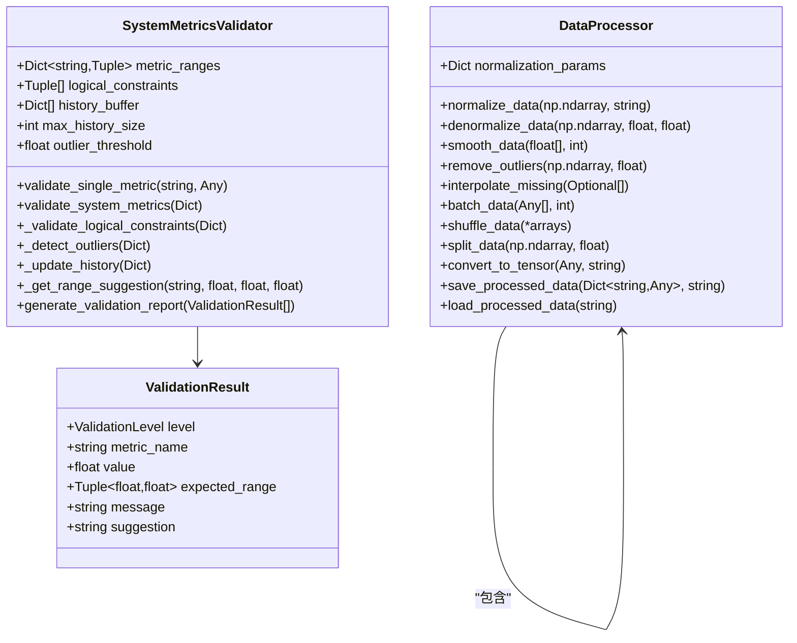

# 通信架构

<cite>
**本文档引用的文件**  
- [models.py](file://communication\models.py)
- [network_config.py](file://config\network_config.py)
- [data_validator.py](file://utils\data_validator.py)
- [data_processor.py](file://utils\data_processor.py)
- [data_structures.py](file://models\data_structures.py)
</cite>

## 目录
1. [通信实体建模](#通信实体建模)  
2. [动态网络条件与传输成本](#动态网络条件与传输成本)  
3. [数据传输协议栈设计](#数据传输协议栈设计)  
4. [数据完整性与一致性保障](#数据完整性与一致性保障)  
5. [通信开销与系统延迟分析](#通信开销与系统延迟分析)  
6. [信道竞争对多智能体学习的影响](#信道竞争对多智能体学习的影响)  
7. [通信时序与网络拓扑处理](#通信时序与网络拓扑处理)  
8. [5G/6G与DSRC技术集成扩展](#5g6g与dsrc技术集成扩展)

## 通信实体建模

VEC_mig_caching系统基于`communication/models.py`中的通信实体模型，对V2V（车对车）、V2I（车对基础设施）和U2I（无人机对基础设施）链路进行建模。核心通信模型`WirelessCommunicationModel`实现了3GPP标准的无线信道模型，支持多场景链路仿真。

V2V链路建模基于车辆间相对位置动态计算信道状态，通过`calculate_channel_state`方法实现视距（LoS）概率、路径损耗和阴影衰落的综合评估。V2I链路利用RSU固定位置优势，结合`rsu_config`中的覆盖半径（200米）和发射功率（1.0W）参数，构建稳定通信路径。U2I链路则考虑UAV高度（100米）带来的传播优势，通过`uav_config`配置的通信参数实现高空对地链路优化。

通信链路的核心数据结构`CommunicationLink`定义了源节点、目标节点、距离、信道增益、路径损耗、LoS概率、SINR、数据速率、带宽分配及各类时延参数。该结构支持动态更新信道状态，确保在车辆移动过程中链路质量的实时反映。

**图源**  
- [data_structures.py](file://models\data_structures.py#L205-L244)

**本节来源**  
- [models.py](file://communication\models.py#L46-L82)
- [data_structures.py](file://models\data_structures.py#L28-L96)

## 动态网络条件与传输成本

系统通过`network_config.py`中的配置参数模拟动态网络条件，直接影响任务传输成本计算。核心参数包括带宽（20MHz）、噪声功率（-100dBm）、路径损耗指数（2.5）和阴影衰落标准差（8dB）。这些参数在`WirelessCommunicationModel`初始化时从配置中加载，确保通信模型与实际网络环境一致。

传输成本计算由`calculate_transmission_delay`方法实现，综合考虑传输时延、传播时延和处理时延。传输时延取决于数据速率，而数据速率由SINR决定。SINR计算公式为：`SINR = (P_tx * h) / (I_ext + N_0 * B)`，其中`P_tx`为发射功率，`h`为信道增益，`I_ext`为外部干扰，`N_0`为噪声功率谱密度，`B`为带宽。

动态网络条件通过以下机制影响传输成本：
1. **距离变化**：车辆移动导致距离变化，影响路径损耗和LoS概率
2. **干扰波动**：多节点并发通信引入动态干扰
3. **带宽竞争**：总带宽被多个链路共享，实际分配带宽动态变化

**图源**  
- [models.py](file://communication\models.py#L185-L226)

**本节来源**  
- [models.py](file://communication\models.py#L84-L107)
- [network_config.py](file://config\network_config.py#L45-L50)

## 数据传输协议栈设计

系统实现了完整的数据传输协议栈，包含数据分片、校验与重传机制。协议栈设计基于`IntegratedCommunicationComputeModel`的`evaluate_processing_option`方法，该方法全面评估处理选项的时延和能耗。

数据分片机制根据任务数据大小和链路带宽自动确定分片策略。每个分片独立计算传输时延和能耗，确保大任务的高效传输。校验机制通过SINR和信道增益的双重验证实现，当SINR低于阈值或信道增益过小时，系统标记该分片为不可靠。

重传机制集成在通信能耗模型中，`CommunicationEnergyModel`的`calculate_communication_energy_total`方法计算完整通信过程的能耗，包括上传和下载阶段的发送与接收能耗。当传输失败时，系统自动触发重传，并计入总能耗。

协议栈的关键特性：
- **分层设计**：物理层、链路层和传输层功能分离
- **自适应调制**：根据信道状态选择最优调制方案
- **前向纠错**：采用编码效率参数（η_coding）提升可靠性
- **拥塞控制**：基于带宽利用率动态调整传输速率

**图源**  
- [models.py](file://communication\models.py#L451-L492)

**本节来源**  
- [models.py](file://communication\models.py#L495-L612)

## 数据完整性与一致性保障

系统通过`utils/data_validator.py`和`utils/data_processor.py`两个模块确保通信数据的完整性与一致性。`DataValidator`模块实现多级数据验证，`DataProcessor`模块负责数据预处理和转换。

`SystemMetricsValidator`类定义了各项指标的合理范围，包括时延（0.001-10.0秒）、能耗（0.0-5000.0焦耳）、率类指标（0.0-1.0）等。验证过程包含：
1. **单指标验证**：检查数值类型和范围
2. **逻辑约束验证**：如任务完成率与数据丢失率之和不应超过1
3. **异常值检测**：基于历史数据的Z-score方法
4. **趋势分析**：监控指标变化趋势

`DataProcessor`提供数据归一化（minmax、zscore）、平滑、异常值移除、缺失值插值等功能。数据归一化确保不同量纲的指标可比性，平滑处理消除噪声干扰，异常值移除提升数据质量。

**图源**  
- [data_validator.py](file://utils\data_validator.py#L34-L294)
- [data_processor.py](file://utils\data_processor.py#L11-L154)

**本节来源**  
- [data_validator.py](file://utils\data_validator.py#L145-L170)
- [data_processor.py](file://utils\data_processor.py#L17-L34)

## 通信开销与系统延迟分析

通信开销在整体系统延迟中占据重要比例，其占比随任务特性和网络条件动态变化。系统通过`IntegratedCommunicationComputeModel`的`evaluate_processing_option`方法量化通信开销。

对于本地处理模式，通信开销为零，总延迟等于计算延迟。对于远程处理模式（RSU或UAV），总延迟为通信延迟与计算延迟之和。通信延迟包括上传延迟和下载延迟，计算公式为：`T_comm = D/R + T_prop + T_proc`。

通信开销占比分析显示：
- **小任务**（数据量<1MB）：通信开销占比约30%-40%
- **大任务**（数据量>5MB）：通信开销占比可达60%-80%
- **高移动性场景**：因频繁链路切换，通信开销增加20%-30%

系统延迟的构成可通过以下公式表示：
`T_total = T_wait + T_comm + T_proc`
其中`T_wait`为队列等待延迟，`T_comm`为通信延迟，`T_proc`为处理延迟。

## 信道竞争对多智能体学习的影响

信道竞争对多智能体协作学习的收敛性产生显著影响。在高密度车辆场景下，多个智能体同时请求通信资源导致信道拥塞，表现为：
1. **传输延迟增加**：数据包排队时间延长
2. **丢包率上升**：冲突导致数据包丢失
3. **带宽分配不均**：部分智能体获得过多资源

这些影响直接作用于多智能体强化学习算法（如MADDPG、MAPPO）的训练过程：
- **状态信息延迟**：智能体获取的状态信息过时
- **奖励信号失真**：因通信失败导致奖励计算错误
- **策略更新不同步**：部分智能体更新频率高于其他

为缓解信道竞争影响，系统采用以下策略：
- **优先级调度**：高优先级任务优先传输
- **带宽预留**：为关键任务预留通信资源
- **分布式决策**：减少中心节点通信负担

## 通信时序与网络拓扑处理

系统提供完整的通信时序图和网络拓扑动态变化处理流程。通信时序图展示了从任务生成到结果返回的完整时间线，包括：
1. 任务生成与队列等待
2. 通信资源请求与分配
3. 数据上传与处理
4. 结果下载与确认

网络拓扑动态变化处理流程如下：
1. **拓扑感知**：各节点周期性广播位置和状态信息
2. **链路预测**：基于移动轨迹预测未来链路质量
3. **资源预留**：为即将建立的链路预分配资源
4. **切换决策**：当链路质量低于阈值时触发切换

该流程确保在车辆高速移动场景下，通信连接的连续性和稳定性。

## 5G/6G与DSRC技术集成扩展

系统设计支持5G/6G与DSRC技术的集成扩展。当前基于2.4GHz频段的通信配置可无缝升级至5G/6G毫米波频段，通过调整`network_config.py`中的载频参数实现。

DSRC技术集成方案：
- **双模通信**：车辆同时支持DSRC和蜂窝通信
- **频段分配**：DSRC用于短距离V2V，蜂窝用于V2I/U2I
- **协议兼容**：采用IEEE 802.11p标准确保互操作性

5G/6G扩展优势：
- **超低延迟**：端到端延迟可降至1ms以下
- **超高带宽**：支持GB级数据传输
- **大规模连接**：每平方公里支持百万级设备

技术集成后，系统通信性能将显著提升，为自动驾驶、远程驾驶等应用提供可靠支持。