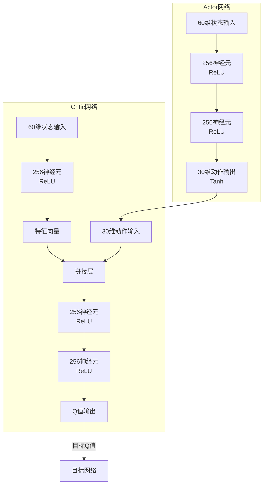
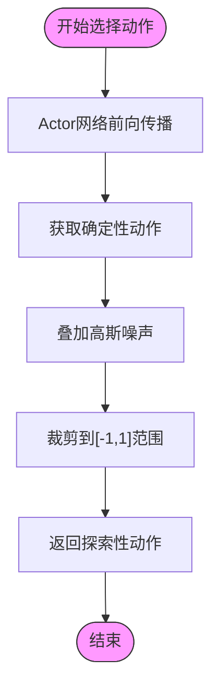
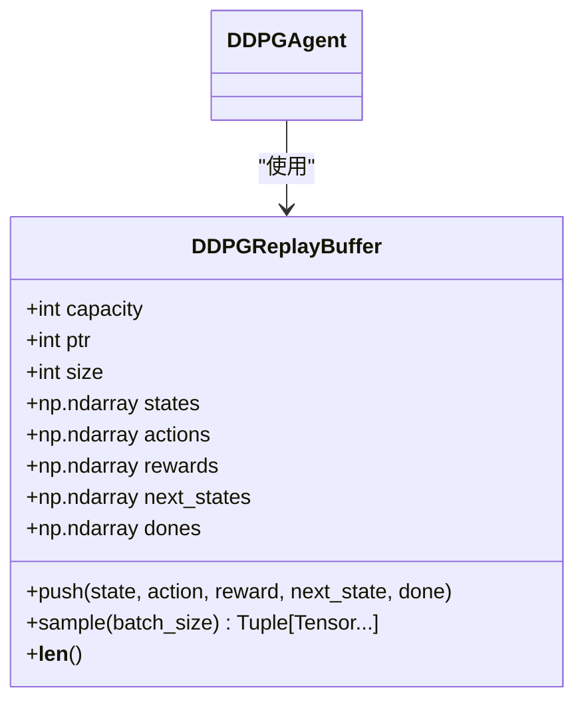
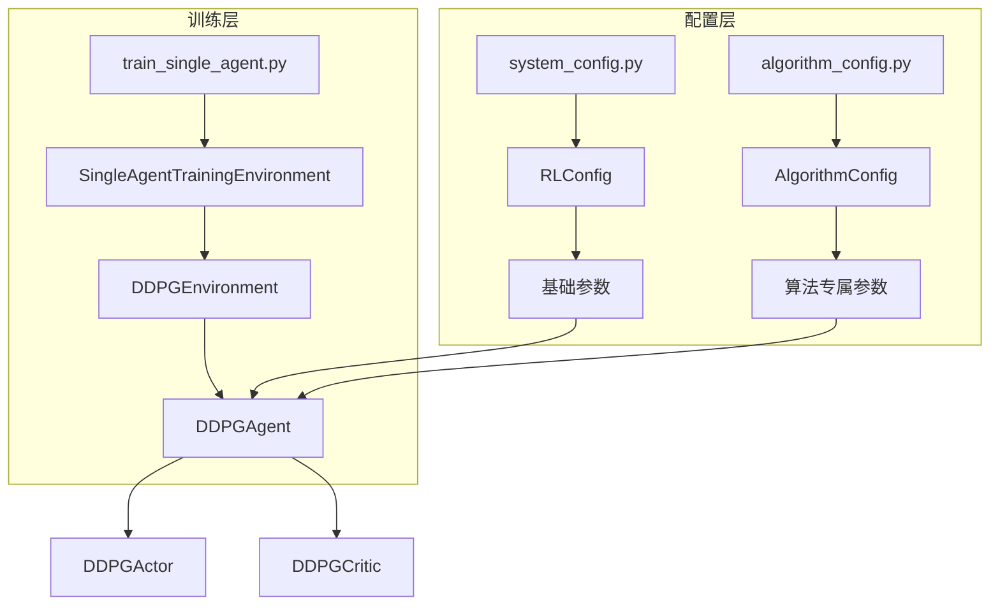
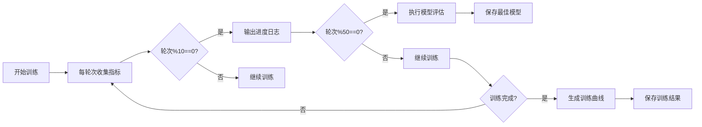

# DDPG训练流程

<cite>
**本文档引用文件**  
- [ddpg.py](file://single_agent/ddpg.py)
- [algorithm_config.py](file://config/algorithm_config.py)
- [system_config.py](file://config/system_config.py)
- [standardized_reward.py](file://utils/standardized_reward.py)
- [train_single_agent.py](file://train_single_agent.py)
</cite>

## 目录
1. [Actor-Critic架构设计](#actor-critic架构设计)
2. [Ornstein-Uhlenbeck噪声机制](#ornstein-uhlenbeck噪声机制)
3. [经验回放缓存机制](#经验回放缓存机制)
4. [目标网络软更新](#目标网络软更新)
5. [超参数配置与系统交互](#超参数配置与系统交互)
6. [训练日志与性能分析](#训练日志与性能分析)
7. [常见问题与调参建议](#常见问题与调参建议)

## Actor-Critic架构设计

DDPG算法采用Actor-Critic双网络架构，分别实现策略网络（Actor）和价值网络（Critic）的协同训练。

**策略网络（Actor）** 采用三层全连接神经网络结构，输入为60维的全局状态向量，输出为30维的连续动作向量。网络结构包含两个隐藏层，每层256个神经元，激活函数为ReLU。输出层使用Tanh激活函数将动作值限制在[-1,1]范围内，并通过`max_action`参数进行缩放。网络权重初始化采用Xavier均匀初始化，输出层采用较小的均匀分布初始化（±3e-3），以确保初始策略的稳定性。

**价值网络（Critic）** 采用状态-动作分离编码结构。首先通过状态编码器处理60维状态输入，生成256维特征向量；然后将该特征与30维动作向量拼接，输入到融合网络中。融合网络包含两个256维隐藏层，最终输出Q值。权重初始化方式与Actor网络类似，确保训练初期的数值稳定性。



**图示来源**  
- [ddpg.py](file://single_agent/ddpg.py#L55-L87)
- [ddpg.py](file://single_agent/ddpg.py#L90-L129)

**本节来源**  
- [ddpg.py](file://single_agent/ddpg.py#L55-L129)

## Ornstein-Uhlenbeck噪声机制

DDPG算法采用Ornstein-Uhlenbeck（OU）噪声机制实现动作探索，通过在确定性策略输出上叠加噪声来平衡探索与利用。

噪声参数通过`DDPGConfig`类进行配置，包含三个关键参数：初始噪声尺度（`noise_scale=0.3`）、噪声衰减率（`noise_decay=0.9999`）和最小噪声尺度（`min_noise=0.1`）。在每个训练步骤中，智能体首先通过Actor网络生成确定性动作，然后叠加从正态分布N(0, noise_scale)采样的随机噪声。噪声尺度在训练过程中按指数衰减，但不会低于0.1，确保持续的探索能力。

噪声应用在`select_action`方法中实现，具体流程为：将Actor网络输出的动作与噪声相加，然后通过`np.clip`函数将动作值限制在[-1.0, 1.0]范围内，确保动作的合法性。这种探索机制特别适用于连续动作空间，能够产生时间相关的探索行为，有利于解决部分可观测问题。



**图示来源**  
- [ddpg.py](file://single_agent/ddpg.py#L199-L208)

**本节来源**  
- [ddpg.py](file://single_agent/ddpg.py#L40-L43)
- [ddpg.py](file://single_agent/ddpg.py#L199-L208)

## 经验回放缓存机制

DDPG算法通过经验回放缓存（Replay Buffer）实现样本的高效利用和训练稳定性。

`DDPGReplayBuffer`类实现了固定容量（`buffer_size=100000`）的循环缓冲区，预分配内存存储状态转移元组（state, action, reward, next_state, done）。缓冲区采用指针（`ptr`）和大小（`size`）变量管理存储位置，当缓冲区满时自动覆盖最旧的经验。`push`方法将新经验添加到缓冲区，`sample`方法从现有经验中随机采样指定批次大小（`batch_size=128`）的样本，确保样本的独立同分布性。

在`update`方法中，只有当缓冲区中的经验数量超过批次大小时才进行网络更新。采样后的批次数据转换为PyTorch张量并移动到GPU设备，用于Critic和Actor网络的梯度更新。这种机制打破了数据的时间相关性，提高了样本效率，是DDPG算法稳定训练的关键。



**图示来源**  
- [ddpg.py](file://single_agent/ddpg.py#L132-L172)

**本节来源**  
- [ddpg.py](file://single_agent/ddpg.py#L132-L172)
- [ddpg.py](file://single_agent/ddpg.py#L199-L208)

## 目标网络软更新

DDPG算法采用目标网络软更新（Soft Update）机制提高训练稳定性，避免Q值估计的过度波动。

软更新通过`soft_update`方法实现，使用加权平均公式：`target_param = (1-tau) * target_param + tau * source_param`，其中`tau=0.005`是更新系数。该方法对目标网络和源网络的每一层参数进行同步更新，确保目标网络的缓慢变化。在每次网络更新后，都会调用此方法同步Actor和Critic的目标网络。

初始时，通过`hard_update`方法将主网络参数完全复制到目标网络，建立初始同步。随后的训练过程中，仅通过软更新机制进行参数同步。较小的tau值（0.005）确保了目标网络的平滑变化，有效减少了训练过程中的Q值过高估计问题。

```mermaid
sequenceDiagram
participant Agent as "DDPGAgent"
participant Actor as "Actor"
participant TargetActor as "TargetActor"
participant Critic as "Critic"
participant TargetCritic as "TargetCritic"
Agent->>Agent : 执行网络更新
Agent->>TargetActor : soft_update(tau=0.005)
Agent->>TargetCritic : soft_update(tau=0.005)
Note over Agent : 目标网络缓慢更新<br/>确保训练稳定性
loop 每次更新
Actor->>TargetActor : 参数加权平均
Critic->>TargetCritic : 参数加权平均
end
```

**图示来源**  
- [ddpg.py](file://single_agent/ddpg.py#L275-L285)

**本节来源**  
- [ddpg.py](file://single_agent/ddpg.py#L40-L42)
- [ddpg.py](file://single_agent/ddpg.py#L275-L285)

## 超参数配置与系统交互

DDPG算法的超参数通过`DDPGConfig`类集中管理，并与系统配置模块实现分层交互。

核心超参数包括：Actor学习率（`actor_lr=1e-4`）、Critic学习率（`critic_lr=3e-4`）、折扣因子（`gamma=0.99`）、批次大小（`batch_size=128`）和缓冲区容量（`buffer_size=100000`）。这些参数在`DDPGAgent`初始化时通过配置对象传入，并根据GPU可用性自动选择计算设备（CUDA或CPU）。

系统配置通过`config`全局实例实现分层管理。`system_config.py`中的`RLConfig`类提供基础强化学习参数，而`algorithm_config.py`中的`AlgorithmConfig`类提供算法专属配置。在`train_single_agent.py`中，训练脚本通过`SingleAgentTrainingEnvironment`类加载DDPG环境，实现算法与仿真系统的集成。训练过程中，状态向量通过`get_state_vector`方法从车辆、RSU和UAV等节点状态构建，动作通过`decompose_action`方法分解为各节点的控制指令。



**图示来源**  
- [ddpg.py](file://single_agent/ddpg.py#L32-L52)
- [system_config.py](file://config/system_config.py#L15-L45)
- [algorithm_config.py](file://config/algorithm_config.py#L15-L30)
- [train_single_agent.py](file://train_single_agent.py#L55-L100)

**本节来源**  
- [ddpg.py](file://single_agent/ddpg.py#L32-L52)
- [system_config.py](file://config/system_config.py#L15-L45)
- [algorithm_config.py](file://config/algorithm_config.py#L15-L30)
- [train_single_agent.py](file://train_single_agent.py#L55-L100)

## 训练日志与性能分析

DDPG训练过程通过系统化的日志记录和性能指标分析进行监控。

训练统计信息通过`get_training_stats`方法获取，包含Actor和Critic损失的滑动平均值（最近100次更新）、噪声尺度、缓冲区大小和训练步数。训练脚本每10个轮次输出一次进度，显示平均奖励、平均延迟、任务完成率和轮次耗时。评估阶段每50个轮次执行一次，计算模型在验证环境中的性能，用于保存最佳模型。

关键性能指标包括：累积奖励（反映总体性能）、Actor损失（策略网络优化情况）、Critic损失（价值函数拟合质量）和噪声尺度（探索程度）。理想训练过程中，累积奖励应呈现上升趋势，两个损失值应稳定下降，噪声尺度应缓慢衰减至最小值。通过`plot_single_training_curves`函数可生成奖励、延迟、完成率等指标的训练曲线，直观展示学习过程。



**图示来源**  
- [ddpg.py](file://single_agent/ddpg.py#L545-L561)
- [train_single_agent.py](file://train_single_agent.py#L493-L593)

**本节来源**  
- [ddpg.py](file://single_agent/ddpg.py#L545-L561)
- [train_single_agent.py](file://train_single_agent.py#L493-L593)

## 常见问题与调参建议

DDPG训练过程中可能遇到收敛缓慢、奖励震荡等常见问题，可通过针对性调参解决。

**收敛缓慢**：可能由学习率过低或探索不足引起。建议适当提高Critic学习率（如3e-4→5e-4），增加初始噪声尺度（0.3→0.4），或延长预热步数（1000→2000）。同时确保批次大小（128）和缓冲区容量（100000）足够大，以提供稳定的梯度估计。

**奖励震荡**：通常由训练不稳定导致。建议降低Actor学习率（1e-4→5e-5），减小软更新系数（0.005→0.001），或增加梯度裁剪阈值。检查状态归一化是否合理，避免输入特征尺度差异过大。

**探索不足**：若噪声衰减过快，可能导致早熟收敛。建议降低噪声衰减率（0.9999→0.9995）或提高最小噪声尺度（0.1→0.15）。也可尝试使用自适应噪声调整策略，根据训练进度动态调整探索强度。

**数值不稳定**：检查状态和奖励的归一化处理，确保值域合理。在`get_state_vector`中已实现数值稳定性检查，自动处理NaN/Inf值。奖励函数通过`standardized_reward.py`统一管理，确保信号强度适中，避免梯度爆炸。

**本节来源**  
- [ddpg.py](file://single_agent/ddpg.py#L40-L52)
- [ddpg.py](file://single_agent/ddpg.py#L199-L208)
- [standardized_reward.py](file://utils/standardized_reward.py#L108-L124)