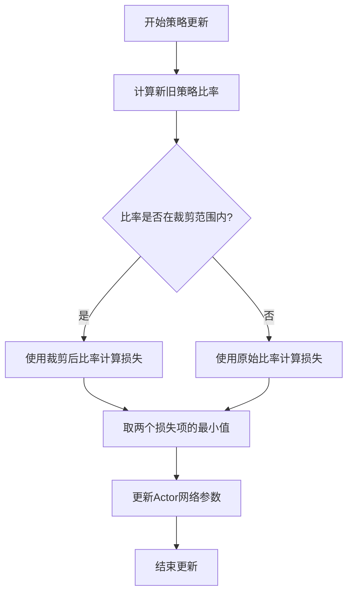
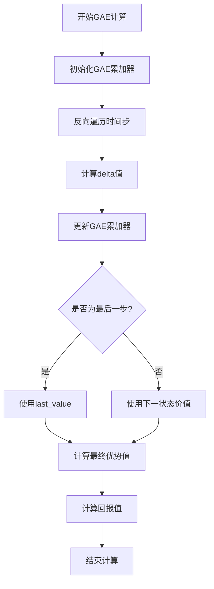

# PPO训练流程

<cite>
**本文档引用文件**  
- [ppo.py](file://single_agent/ppo.py)
- [train_single_agent.py](file://train_single_agent.py)
- [algorithm_config.py](file://config/algorithm_config.py)
- [system_config.py](file://config/system_config.py)
- [standardized_reward.py](file://utils/standardized_reward.py)
</cite>

## 目录
1. [PPO算法核心机制](#ppo算法核心机制)
2. [策略梯度更新与裁剪机制](#策略梯度更新与裁剪机制)
3. [重要性采样比率与损失函数](#重要性采样比率与损失函数)
4. [GAE优势估计实现逻辑](#gae优势估计实现逻辑)
5. [训练过程配置策略](#训练过程配置策略)
6. [超参数设置原则](#超参数设置原则)
7. [训练监控指标解读](#训练监控指标解读)
8. [任务卸载场景调参建议](#任务卸载场景调参建议)

## PPO算法核心机制

PPO（Proximal Policy Optimization）算法在本系统中通过单智能体架构实现，主要应用于VEC（Vehicle Edge Computing）环境下的任务卸载决策。该算法采用策略梯度方法处理连续动作空间，通过裁剪代理目标函数防止策略更新过大导致训练不稳定。系统实现了完整的PPO训练流程，包括经验收集、优势估计、策略更新和模型保存等核心功能。

PPO智能体由Actor网络和Critic网络组成，分别负责策略生成和价值评估。训练过程中，智能体在每个episode结束后进行批量更新，利用存储的经验数据进行多次epoch迭代优化。这种训练方式显著提升了样本利用率，降低了训练方差，使模型能够更稳定地收敛。

**本节来源**
- [ppo.py](file://single_agent/ppo.py#L1-L518)
- [train_single_agent.py](file://train_single_agent.py#L1-L967)

## 策略梯度更新与裁剪机制

PPO算法通过裁剪机制（clipping）防止策略更新过大导致训练不稳定。在策略更新过程中，算法计算新旧策略的重要性采样比率，并对损失函数进行裁剪处理。具体实现中，系统计算两个替代损失项：原始比率乘以优势函数的损失项，以及裁剪后比率乘以优势函数的损失项，最终取两者中的较小值作为策略损失。

裁剪范围由`clip_ratio`参数控制，默认值为0.2。当策略更新导致新旧策略比率超出[1-clip_ratio, 1+clip_ratio]范围时，梯度将被截断，从而限制策略更新的幅度。这种机制有效避免了传统策略梯度方法中可能出现的更新步长过大问题，提高了训练的稳定性。

**图示来源**
- [ppo.py](file://single_agent/ppo.py#L287-L387)

## 重要性采样比率与损失函数

重要性采样比率的计算是PPO算法的核心组成部分。系统通过计算新策略与旧策略的概率密度比来获得重要性采样比率，公式为：ratio = exp(new_log_probs - old_log_probs)。该比率反映了新旧策略在采取相同动作时的概率差异。

在损失函数设计中，系统采用裁剪后的代理目标函数：L^CLIP(θ) = E[min(r(θ)A, clip(r(θ), 1-ε, 1+ε)A)]，其中r(θ)为重要性采样比率，A为优势函数，ε为裁剪参数。这种设计确保了策略更新不会过于偏离当前策略，从而保持训练的稳定性。

此外，总损失函数还包含价值损失和熵损失。价值损失采用均方误差（MSE）计算预测值与目标回报之间的差异，熵损失则鼓励策略保持一定的随机性，防止过早收敛到次优策略。

**本节来源**
- [ppo.py](file://single_agent/ppo.py#L287-L387)
- [ppo.py](file://single_agent/ppo.py#L102-L113)

## GAE优势估计实现逻辑

系统采用GAE（Generalized Advantage Estimation）方法计算优势函数，有效平衡了偏差和方差。GAE通过引入λ参数来调节多步回报的权重，实现从蒙特卡洛方法到时序差分方法的平滑过渡。当λ=1时，GAE退化为蒙特卡洛估计；当λ=0时，GAE等价于TD(0)估计。

GAE的实现逻辑包括以下步骤：首先计算每个时间步的delta值，即即时奖励加上折扣后的下一状态价值，再减去当前状态价值；然后通过反向遍历时间步，累积计算GAE值，其中每个delta值都乘以γλ的相应幂次；最后将GAE值与状态价值相加得到回报估计。

**图示来源**
- [ppo.py](file://single_agent/ppo.py#L180-L214)

## 训练过程配置策略

PPO训练过程采用episode级别的更新策略，在每个episode结束后进行批量更新。系统配置了多个关键参数来控制训练过程：`ppo_epochs`参数定义了每个episode的更新轮数，默认为10轮；`batch_size`参数设置每次更新的样本批量大小，默认为64；`buffer_size`参数确定经验缓冲区的容量，默认为2048。

训练过程中，系统首先收集一个episode的所有经验数据，然后计算优势函数和回报值，接着对数据进行标准化处理，最后进行多轮epoch迭代更新。每轮更新中，系统从缓冲区随机采样mini-batch数据进行训练，这种做法打破了数据间的相关性，提高了样本利用率。

熵奖励系数由`entropy_coef`参数控制，默认值为0.01。该系数在总损失函数中调节熵损失的权重，鼓励策略保持一定的探索性。随着训练的进行，策略的熵值会逐渐降低，表明策略从随机探索向确定性决策转变。

**本节来源**
- [ppo.py](file://single_agent/ppo.py#L32-L55)
- [train_single_agent.py](file://train_single_agent.py#L350-L416)

## 超参数设置原则

系统中的关键超参数设置遵循以下原则：`clip_range`（即`clip_ratio`）设置为0.2，这是PPO算法的经典值，能够在更新稳定性和学习效率之间取得良好平衡；`n_steps`对应`buffer_size`，设置为2048，确保有足够的经验数据进行有效更新；`vf_coef`（即`value_coef`）设置为0.5，平衡价值函数损失在总损失中的权重。

这些超参数的设置考虑了任务卸载场景的特点：较大的缓冲区容量适应了VEC环境中较长的决策周期；适中的裁剪范围保证了策略更新的稳定性；合理的熵系数维持了足够的探索能力。所有超参数均可通过配置文件进行调整，以适应不同的应用场景和性能需求。

**本节来源**
- [ppo.py](file://single_agent/ppo.py#L32-L55)
- [algorithm_config.py](file://config/algorithm_config.py#L1-L73)
- [system_config.py](file://config/system_config.py#L1-L318)

## 训练监控指标解读

训练过程中需要重点关注以下监控指标的变化规律：策略损失（actor_loss）应呈现下降趋势，表明策略在不断优化；价值损失（critic_loss）应稳定下降，反映价值函数对状态价值的估计越来越准确；熵值（entropy）应缓慢下降，表示策略从探索向利用平稳过渡。

正常训练过程中，这些指标应表现出稳定的收敛趋势。如果策略损失出现剧烈波动，可能表明裁剪范围设置过小或学习率过高；如果价值损失不下降，可能需要检查回报计算是否正确或网络结构是否合适；如果熵值下降过快，可能需要增大熵奖励系数以保持足够的探索能力。

系统提供了完整的训练统计信息，包括平均策略损失、平均价值损失、平均熵损失和KL散度等，这些指标可用于评估训练状态和调整超参数。

**本节来源**
- [ppo.py](file://single_agent/ppo.py#L287-L387)
- [ppo.py](file://single_agent/ppo.py#L410-L518)

## 任务卸载场景调参建议

在任务卸载场景下，建议根据具体需求调整PPO超参数：对于高动态环境，可适当增大`clip_ratio`至0.3，以加快策略更新速度；对于需要精细控制的场景，可减小`clip_ratio`至0.1，提高训练稳定性；当任务负载变化剧烈时，可增大`entropy_coef`至0.05，增强策略的探索能力。

此外，建议根据计算资源调整`batch_size`和`buffer_size`：在资源充足的情况下，可增大批量大小以提高训练效率；在资源受限时，可适当减小批量大小以降低内存占用。对于长周期决策任务，建议增加`ppo_epochs`至15-20轮，以充分利用收集的经验数据。

监控训练过程时，应特别关注任务完成率、平均延迟和能耗等业务指标的变化，这些指标更能反映策略的实际性能。建议定期保存模型检查点，以便在训练异常时能够快速恢复。

**本节来源**
- [ppo.py](file://single_agent/ppo.py#L32-L55)
- [train_single_agent.py](file://train_single_agent.py#L350-L416)
- [standardized_reward.py](file://utils/standardized_reward.py#L1-L151)